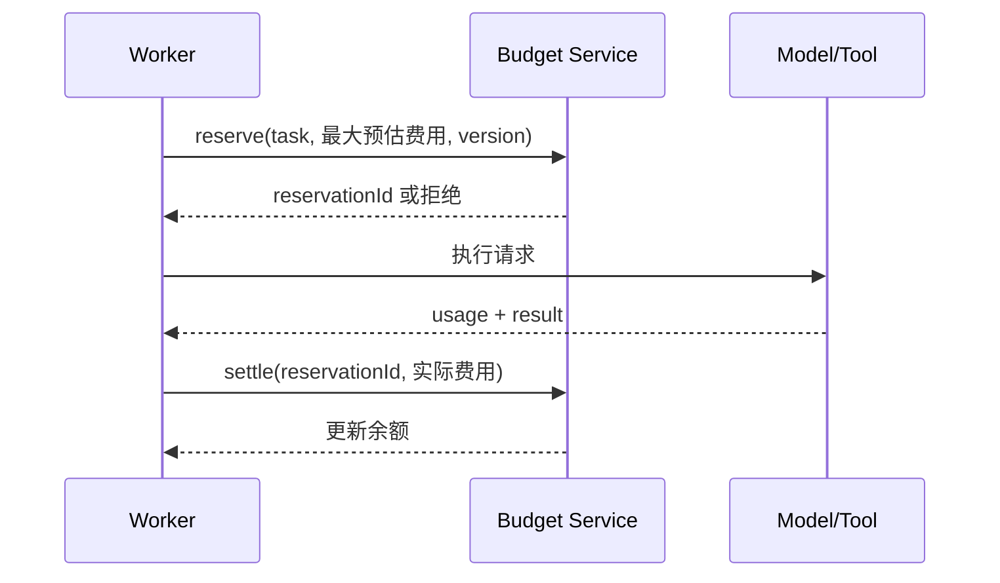

# Agent 的步骤、Token、成本与总超时预算

Agent 会根据中间结果动态选择下一步，因此一次任务的模型调用次数、工具调用次数、Token、费用和耗时都不是固定值。预算控制把这些开放循环变成有界执行：任务启动前分配资源，每一步执行前预留，每一步结束后结算，耗尽时以明确状态停止。

预算必须由运行时强制执行。Prompt 中的“尽量少调用”“十步以内”只能影响模型选择，不能阻止超额请求。

## 需要同时限制的资源

| 预算 | 控制对象 | 主要风险 |
| --- | --- | --- |
| 最大步骤 | Planner 决策与动作循环 | 反复尝试、无进展循环 |
| 模型调用次数 | 模型 API 请求 | 路由错误、评估器递归 |
| 工具调用次数 | 外部能力执行 | 速率耗尽、副作用放大 |
| 输入 Token | Prompt、历史、检索和工具结果 | 上下文膨胀 |
| 输出 Token | 模型生成 | 长输出、费用和延迟 |
| 费用 | 模型、检索、工具与基础设施 | 单任务成本失控 |
| 总超时 | 用户等待或任务 SLA | 任务永久运行 |
| 单步超时 | 单次模型或工具调用 | 慢依赖占满 Worker |
| 并发 | 同时运行的子任务 | 瞬时负载和费用尖峰 |
| 结果大小 | 工具响应和制品 | 内存、存储与上下文污染 |

只设置最大步骤仍可能在一步内执行昂贵查询；只设置 Token 仍可能调用大量低 Token 的外部工具；只设置总超时仍可能在截止前制造高额费用。

## 预算状态模型

预算需要保存分配值、已预留值和已结算值：

```ts
type BudgetLedger = {
  taskId: string;
  version: number;
  limits: {
    steps: number;
    modelCalls: number;
    toolCalls: number;
    inputTokens: number;
    outputTokens: number;
    costMicros: number;
    resultBytes: number;
  };
  reserved: {
    inputTokens: number;
    outputTokens: number;
    costMicros: number;
  };
  consumed: {
    steps: number;
    modelCalls: number;
    toolCalls: number;
    inputTokens: number;
    outputTokens: number;
    costMicros: number;
    resultBytes: number;
  };
  startedAt: string;
  deadlineAt: string;
};
```

`consumed` 不能只由模型或客户端上报。模型 Token 使用量来自供应商响应或网关计量；工具费用和结果大小由执行层记录；时间由服务器单调时钟和持久化时间共同判断。

## 最大步骤

一步应对应一次可观察的状态转换，而不是任意一条内部日志。常见定义是：

```text
Planner 产生一个动作
→ Executor 接受或拒绝
→ 得到 Observation
→ State 更新
= 一个步骤
```

被策略层在执行前拒绝的动作也应计入尝试次数，否则模型可以无限产生越界动作而不消耗步骤预算。系统可以同时记录：

- `attempted_steps`
- `executed_steps`
- `productive_steps`

### 动态步骤预算

不同任务可以有不同上限，但上限必须在受控策略中计算：

```ts
function stepLimit(task: {
  kind: "lookup" | "analysis" | "code_change";
  risk: "low" | "medium" | "high";
}): number {
  if (task.risk === "high") return 8;
  if (task.kind === "lookup") return 6;
  if (task.kind === "analysis") return 16;
  return 24;
}
```

模型不能自行把 `maxSteps` 从 8 提升到 80。需要扩展时，由策略、人工或新的父任务重新授权。

## Token 预算

Token 预算分为输入和输出。输入由多部分组成：

```text
系统和开发者指令
+ 工具定义
+ 当前状态摘要
+ 对话或任务历史
+ 检索证据
+ 最近工具结果
+ 预留输出
```

### 调用前估算

运行时在请求前估算 Token，并为输出预留上限：

```ts
type TokenEstimate = {
  prompt: number;
  requestedOutput: number;
  safetyMargin: number;
};

function fitsTokenBudget(
  remainingInput: number,
  remainingOutput: number,
  estimate: TokenEstimate
): boolean {
  return (
    estimate.prompt + estimate.safetyMargin <= remainingInput &&
    estimate.requestedOutput <= remainingOutput
  );
}
```

估算器可能与模型实际 tokenizer 有差异，因此保留安全余量，并在响应后使用实际 usage 结算。

### 上下文降级顺序

预算不足时不能随机截断。推荐顺序：

1. 移除重复的工具结果。
2. 将完整结果转为带来源定位符的结构化摘要。
3. 只保留当前步骤所需的工具定义。
4. 对历史运行做可验证摘要，同时保留关键 Goal、约束和未解决项。
5. 减少候选数量或输出上限。
6. 无法保持必要上下文时停止，返回 `context_budget_exhausted`。

永远不能为了放入上下文而移除权限约束、禁止事项、审批条件或成功标准。

## 成本预算

成本预算需要覆盖所有可计量资源：

```text
模型输入费用
+ 模型输出费用
+ 缓存读写费用
+ Embedding / Rerank
+ 搜索、浏览器或付费 API
+ 沙箱计算
+ 存储和长任务 Worker
```

不同供应商和模型的计价单位不同。网关把它们转换为统一最小单位，例如 `costMicros`，同时保留原始计量字段和价格表版本。

```json
{
  "usageId": "usage_982",
  "taskId": "task_41",
  "step": 7,
  "resource": "model",
  "provider": "provider-a",
  "model": "model-x-2026-06",
  "inputTokens": 8214,
  "outputTokens": 742,
  "priceVersion": "2026-07-01",
  "estimatedCostMicros": 142000,
  "finalCostMicros": 139800
}
```

### 预留与结算

并发请求必须先预留预算。若三个 Worker 同时读取“还剩 1 元”并各花 0.8 元，事后结算会超额。



请求失败或超时后释放未消耗预留。无法确认外部服务是否已经计费时，先按预留记账，后续对账再校正。

## Deadline 与总超时

总超时应保存绝对截止时间，而不是每次恢复后重新获得完整时长。

```ts
function remainingMs(deadlineAt: string, nowMs: number): number {
  return Math.max(0, Date.parse(deadlineAt) - nowMs);
}

function childDeadline(
  parentDeadlineAt: string,
  requestedMs: number,
  nowMs: number
): string {
  const parentRemaining = remainingMs(parentDeadlineAt, nowMs);
  return new Date(nowMs + Math.min(parentRemaining, requestedMs)).toISOString();
}
```

暂停是否冻结截止时间取决于产品合同：

- 交互式任务通常有用户等待 SLA，暂停不应无限延长资源占用。
- 等待人工审批的长任务可以停止计算预算，但审批本身有过期时间。
- 法规或业务截止时间是绝对时间，不能因系统暂停而后移。

需要分别记录：

- `createdAt`
- `startedAt`
- `computeDuration`
- `waitingDuration`
- `deadlineAt`
- `completedAt`

## 单步超时与 Deadline 传播

每个子调用的 timeout 必须小于任务剩余时间，并给状态持久化预留时间：

```ts
function callTimeoutMs(
  remainingTaskMs: number,
  configuredMaxMs: number,
  persistenceReserveMs = 2_000
): number {
  return Math.max(
    0,
    Math.min(configuredMaxMs, remainingTaskMs - persistenceReserveMs)
  );
}
```

当剩余时间不足以安全完成调用和记录结果时，不应启动调用。

### 超时不等于取消成功

客户端停止等待不表示服务端操作停止。外部工具可能：

- 在超时前已经完成写入。
- 收到取消但无法中断。
- 在网络断开后继续运行。
- 返回丢失，导致调用方不知道结果。

写操作必须使用幂等键，并在超时后查询权威状态。不能立即用新幂等键重试同一副作用。

## 预算树

Orchestrator 创建 Worker 时，从父预算划分子预算：

```json
{
  "taskId": "parent",
  "remainingCostMicros": 900000,
  "children": [
    {
      "taskId": "metrics-analysis",
      "maxCostMicros": 250000,
      "maxSteps": 6
    },
    {
      "taskId": "log-analysis",
      "maxCostMicros": 350000,
      "maxSteps": 8
    }
  ],
  "unallocatedCostMicros": 300000
}
```

基本不变量：

```text
子任务已消耗
+ 子任务仍预留
+ 父任务自身已消耗
+ 父任务仍预留
≤ 父任务总预算
```

子任务完成后可以返还未使用预算，但不能自行从兄弟任务或全局账户借用。

## 预算策略与任务风险

预算不是越大越好。高风险动作往往需要更少的自主步骤和更紧的权限：

| 任务 | 步骤 | 工具 | 审批 |
| --- | ---: | --- | --- |
| 公开资料摘要 | 中等 | 只读搜索 | 通常不需要 |
| 内部日志调查 | 中等 | 限定服务只读 | 读取敏感范围按政策 |
| 代码修改 | 较高 | 隔离工作树、测试 | 合并/推送另行批准 |
| 生产配置变更 | 很低 | 参数受限写工具 | 每个变更批准 |
| 外部消息发送 | 很低 | 草稿与发送分离 | 发送前批准 |

更高预算会增加探索能力，也增加错误动作、成本和审计长度。任务应从最小可行预算开始，通过评估集判断是否需要增加。

## 预算耗尽的产品状态

预算耗尽不是普通“系统错误”，也不应伪装为完成。

```json
{
  "status": "stopped",
  "stopReason": "cost_budget_exhausted",
  "progress": {
    "completedCriteria": [
      "已定位主要错误码",
      "已关联部署时间线"
    ],
    "remainingCriteria": [
      "尚未验证下游超时的直接原因"
    ]
  },
  "artifacts": [
    {"artifactId": "report_draft_3", "status": "partial"}
  ],
  "nextOptions": [
    "人工基于当前证据继续",
    "授权额外预算并从步骤 9 恢复",
    "结束任务并保留部分报告"
  ]
}
```

界面应展示：

- 停止原因。
- 已完成和未完成的条件。
- 当前产物是否可安全使用。
- 已消耗的步骤、时间和费用。
- 增加预算将继续哪些动作。
- 继续是否需要新审批。

“继续”不能重置全部计数。它应创建新的预算分配记录并保留累计消耗。

## 速率限制与预算的区别

速率限制控制一段时间内的吞吐量，预算控制单任务或账户的总消耗。

```text
每分钟 60 次调用：速率限制
本任务最多 20 次调用：任务预算
本账户每天最多 100 元：账户配额
一个 Worker 同时最多 4 次：并发限制
```

遇到 `429` 时，如果服务返回 `Retry-After`，重试等待也消耗总时间预算。若等待将超过 Deadline，应停止或选择受控替代方案。

## 重试如何消耗预算

重试不是免费步骤。建议分别记录：

- 逻辑步骤：用户任务推进了多少步。
- 传输尝试：同一工具调用因暂时故障尝试几次。
- 模型重规划：失败后是否重新选择策略。

暂时网络错误可以在 Executor 内用同一幂等键进行有限重试；参数错误、权限拒绝和业务冲突不能按相同方式重试。

```ts
type ErrorClass =
  | "transient"
  | "rate_limited"
  | "invalid_request"
  | "permission_denied"
  | "conflict"
  | "unknown_outcome";

function mayRetry(error: ErrorClass, attempts: number): boolean {
  return error === "transient" && attempts < 2;
}
```

重试的模型、工具、Token、费用和等待都进入账本。通过“内部重试不算预算”隐藏消耗会使上限失效。

## 降级策略

预算接近阈值时可以降级，但降级不能改变安全和正确性语义：

- 使用更小模型处理经过评估的低风险子任务。
- 减少非必要候选数量。
- 缩小查询时间范围或分页大小。
- 优先满足必需成功条件，停止可选增强。
- 从实时探索转为输出当前证据和阻塞项。
- 请求人工决定是否增加预算。

不安全的降级包括：

- 跳过权限检查。
- 跳过最终权威回读。
- 删除关键约束以节省 Token。
- 把未验证草稿标记为完成。
- 在未评估的模型之间静默切换。

## 实例：代码修复任务

预算配置：

```json
{
  "maxSteps": 18,
  "maxModelCalls": 12,
  "maxToolCalls": 40,
  "maxInputTokens": 160000,
  "maxOutputTokens": 24000,
  "maxCostMicros": 2500000,
  "deadlineAt": "2026-07-18T16:30:00+08:00"
}
```

执行过程：

1. 读取错误和相关文件，消耗 2 个工具调用。
2. 生成修复方案，消耗一次模型调用。
3. 编写回归测试并运行，测试失败。
4. 读取失败输出，发现测试假设错误。
5. 修改测试和实现，相关测试通过。
6. 运行全量检查预计需要 25 分钟，但只剩 8 分钟。
7. 系统不启动必然超过 Deadline 的全量检查。
8. 任务返回部分完成：相关测试通过、全量检查未运行，禁止自动合并。

“代码已经改好”不等于完成。成功条件要求全量检查时，预算不足只能停止或申请扩展。

## 实例：多来源研究任务

父任务预算为 100 个单位：

- 搜索与来源筛选 25。
- 三个来源分析 Worker 各 15，共 45。
- 综合写作 20。
- 最终验证 10。

如果搜索只用了 15，返还的 10 可以在策略允许下补充给验证。但某个来源 Worker 不能因为“内容很多”自行占用综合写作预算。

并发 Worker 同时预留预算后，Orchestrator 只看到尚未分配余额。这样可以避免所有 Worker 在同一时刻认为预算充足。

## 可观测性

每一步记录：

```json
{
  "taskId": "task_41",
  "stepId": "step_09",
  "attempt": 1,
  "operation": "query_logs",
  "budgetBefore": {
    "stepsRemaining": 10,
    "costMicrosRemaining": 880000,
    "timeMsRemaining": 420000
  },
  "reservation": {
    "costMicros": 90000,
    "timeoutMs": 10000
  },
  "usage": {
    "toolCalls": 1,
    "resultBytes": 18420,
    "costMicros": 41000,
    "durationMs": 821
  },
  "budgetAfter": {
    "stepsRemaining": 9,
    "costMicrosRemaining": 839000,
    "timeMsRemaining": 419179
  }
}
```

日志中的价格、模型和 tokenizer 必须有版本。否则历史费用无法复算，新价格也会污染旧实验。

## 监控指标

- 每种任务的成本分布和 P50/P95。
- 步骤、模型调用和工具调用分布。
- 预算耗尽率及耗尽位置。
- Deadline 超时率和超时依赖。
- 预留与最终结算差额。
- 重试费用占比。
- 单位成功任务成本。
- 增加预算后的边际成功率。
- 降级模型的质量差异。
- 部分完成产物的人工接受率。

平均成本会掩盖少量失控任务。必须观察高分位、最大值和异常任务轨迹。

## 测试

### 计数与并发

- 两个 Worker 同时预留最后一份预算，只有一个成功。
- 请求失败后正确释放未消耗预留。
- Worker 崩溃后预留能超时回收，但不重复外部副作用。
- 重复结算同一 `reservationId` 不重复扣费。
- 价格表升级不改变历史账单。

### 时间

- 任务恢复后仍使用原始 Deadline。
- 系统时钟跳变时运行时计时不出现负数。
- 子调用 timeout 不超过父任务剩余时间。
- 等待审批超过有效期后不执行动作。
- 工具超时但实际完成时，通过幂等键和回读确认结果。

### Token 与上下文

- 估算误差仍不超过供应商上下文限制。
- 压缩历史后 Goal、约束和未解决项不丢失。
- 巨大工具响应被截断并带 `truncated` 标记。
- 只加载当前步骤需要的工具定义。
- Token 预算耗尽时返回部分状态，不生成虚假结论。

### 费用

- 模型 fallback 使用实际模型价格结算。
- 缓存命中和未命中分别计量。
- 付费工具失败仍按真实账单记录。
- 账户配额、任务预算和并发限制同时生效。
- 追加预算产生独立授权记录，不覆盖旧账本。

## 常见错误

### 只有全局账户限额

一个任务可以耗尽所有用户的共享配额。任务、用户、项目和组织层都需要配额。

### 先执行、后检查余额

并发调用会超支。必须先原子预留，再执行和结算。

### 恢复任务时重置预算

反复暂停和恢复可绕过限制。恢复保留累计消耗和原 Deadline。

### 把超时当作未执行

外部写操作可能已经成功。应回读结果并复用幂等键。

### 用低价模型静默降级

模型能力和输出合同可能改变。只有在固定评估集上验证过的路由才可启用，并记录实际模型。

### 为节省 Token 删除安全上下文

权限、禁止事项和审批条件是不可压缩的控制信息。

### 只优化平均成本

P95 失控任务、重复副作用和失败后重试更值得调查。

## 验收清单

- [ ] 每个任务有步骤、调用、Token、成本、时间和结果大小限制。
- [ ] 限制保存在服务端权威状态。
- [ ] 并发调用使用原子预算预留。
- [ ] 供应商实际 usage 与估算分别记录。
- [ ] 子任务预算总和不超过父任务。
- [ ] Deadline 向下传播，恢复不会重置。
- [ ] 单步 timeout 为持久化和清理保留时间。
- [ ] 超时写操作使用幂等键并回读。
- [ ] 重试计入步骤、费用和总时间。
- [ ] 预算不足时按确定顺序压缩或降级。
- [ ] 安全约束和成功门槛不会被降级移除。
- [ ] 耗尽状态区分已完成、未完成和可用产物。
- [ ] 增加预算有新的授权和审计记录。
- [ ] 指标同时覆盖质量、成功率、成本、延迟和风险。

## 来源

- [IETF RFC 9110 — HTTP Semantics：超时、重试与幂等方法语义](https://www.rfc-editor.org/rfc/rfc9110)（访问日期：2026-07-18）
- [IETF RFC 6585 — Additional HTTP Status Codes：429 与 Retry-After](https://www.rfc-editor.org/rfc/rfc6585)（访问日期：2026-07-18）
- [OpenTelemetry — Semantic Conventions for Generative AI Systems](https://opentelemetry.io/docs/specs/semconv/gen-ai/)（访问日期：2026-07-18）
- [Anthropic — Building Effective AI Agents](https://www.anthropic.com/engineering/building-effective-agents)（访问日期：2026-07-18）
- [Anthropic — Demystifying Evals for AI Agents](https://www.anthropic.com/engineering/demystifying-evals-for-ai-agents)（访问日期：2026-07-18）
