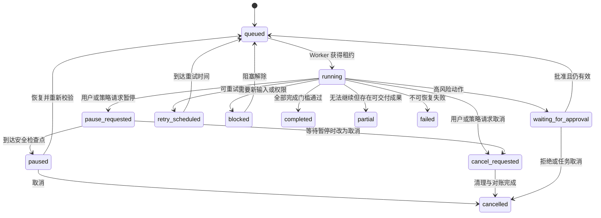
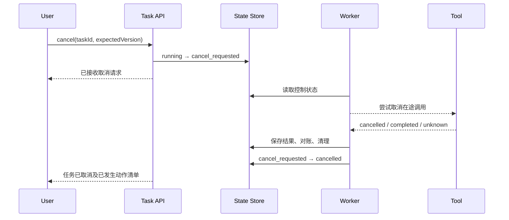

# Agent 的暂停、取消、恢复、失败步骤与部分完成

长时间 Agent 任务会遇到用户暂停、取消、进程崩溃、网络中断、工具暂时故障、审批等待和部分子任务失败。可靠系统不能把运行状态只保存在 Worker 内存中，也不能把“连接断开”误判为任务已经停止。

恢复能力来自持久化状态机、步骤边界、幂等执行、租约与结果对账，不是把整段 Prompt 再发一次。

## 五个不同概念

| 概念 | 含义 | 是否可继续 |
| --- | --- | --- |
| 暂停 Pause | 保留任务和安全检查点，暂时不调度新步骤 | 可以 |
| 取消 Cancel | 用户或策略要求终止任务，不再推进 Goal | 默认不可以 |
| 恢复 Resume | 从已确认检查点继续，而非从头重放 | 可以 |
| 步骤失败 Step Failure | 某一步未获得预期 Observation | 视错误分类 |
| 部分完成 Partial Completion | 部分成功条件已经达到，剩余部分未达到 | 可交付但不能冒充完成 |

浏览器关闭、SSE/WebSocket 断开或客户端超时都不是取消。任务控制必须通过服务端命令和权威状态完成。

## 持久化状态机



`pause_requested` 和 `cancel_requested` 很重要：控制请求已被接受，但当前外部调用可能仍在运行。界面不能在收到请求后立即显示“已暂停”或“已取消”。

## 任务记录

```ts
type TaskStatus =
  | "queued"
  | "running"
  | "pause_requested"
  | "paused"
  | "cancel_requested"
  | "cancelled"
  | "waiting_for_approval"
  | "retry_scheduled"
  | "blocked"
  | "completed"
  | "partial"
  | "failed";

type TaskRecord = {
  taskId: string;
  status: TaskStatus;
  stateVersion: number;
  goalVersion: number;
  lastCommittedStep: number;
  activeLease?: {
    workerId: string;
    leaseToken: string;
    expiresAt: string;
  };
  controlRequest?: {
    kind: "pause" | "cancel";
    requestedBy: string;
    requestedAt: string;
    reason?: string;
  };
  resumeFromCheckpointId?: string;
  nextAttemptAt?: string;
  terminalReason?: string;
};
```

所有状态转换使用条件更新：

```sql
UPDATE agent_task
SET status = 'pause_requested',
    state_version = state_version + 1
WHERE task_id = :task_id
  AND state_version = :expected_version
  AND status IN ('queued', 'running', 'retry_scheduled');
```

影响行数为 0 表示状态已变化，调用方要重新读取，不能强行覆盖。

## 步骤是恢复边界

一个可恢复步骤通常分为：

```text
1. 读取最新 State 与控制请求
2. 生成候选动作
3. 校验权限、预算和审批
4. 记录 action intent
5. 执行工具
6. 保存原始结果或结果引用
7. 写入 Observation
8. 原子提交新 State 和步骤完成标记
```

Worker 可能在任意两点之间崩溃。系统必须处理三类结果：

- 动作尚未执行：可以安全重新规划。
- 动作已执行且结果已记录：恢复时复用 Observation。
- 动作是否执行未知：使用幂等键或权威回读对账，不能盲目重试。

## Checkpoint 的内容

Checkpoint 不是整段对话文本。至少包含：

```json
{
  "checkpointId": "cp_task41_step8",
  "taskId": "task41",
  "step": 8,
  "goalVersion": 3,
  "stateVersion": 19,
  "completedCriteria": [
    "已找到错误集中时间段"
  ],
  "facts": [
    {
      "key": "primary_error",
      "value": "PAYMENT_TIMEOUT",
      "sourceObservationId": "obs_188"
    }
  ],
  "openQuestions": [
    "下游超时是否由连接池饱和导致"
  ],
  "artifactVersions": [
    {"artifactId": "report", "version": 4}
  ],
  "budgetsConsumed": {
    "steps": 8,
    "inputTokens": 64120,
    "outputTokens": 9021,
    "costMicros": 1180000
  },
  "pendingSideEffects": []
}
```

Checkpoint 只引用受控存储中的大结果，不把敏感日志完整复制多份。

## 暂停

暂停用于：

- 用户希望稍后继续。
- 等待外部依赖恢复。
- 账户预算或并发策略暂时限制。
- 系统维护或 Worker 排空。
- 需要人工补充上下文，但不结束任务。

### 协作式暂停

运行时在安全点检查 `pause_requested`：

```ts
async function runStep(task: TaskRecord): Promise<void> {
  assertLease(task);
  const latest = await loadTask(task.taskId);

  if (latest.status === "pause_requested") {
    await commitCheckpointAndPause(latest);
    return;
  }

  const action = await planNextAction(latest);
  await executeWithRecovery(latest, action);
}
```

正在执行的工具如果支持取消，可以传播取消信号；如果不支持，应等待其返回或超时，再对账和进入 `paused`。

### 暂停时必须处理

- 停止调度新步骤和子任务。
- 通知在途 Worker 不再领取后续工作。
- 保存已确认的 Observation。
- 标记无法确认结果的在途副作用。
- 释放可释放的租约、沙箱和连接。
- 记录预算消耗，不重置 Deadline 策略。
- 撤销不应在暂停期长期有效的短期凭据。
- 使待审批动作过期或明确保持策略。

## 取消

取消表达“不再推进这个 Goal”。取消不是数据库中改一个字符串后忽略正在运行的进程。



### 取消后的副作用

不能假设自动回滚。需要逐类定义：

| 副作用 | 取消处理 |
| --- | --- |
| 未发布草稿 | 保留、删除或让用户选择 |
| 已发送消息 | 无法撤回时记录为已发生 |
| 已创建工单 | 可关闭，但关闭是新的受控动作 |
| 已写数据库 | 使用业务补偿，不做盲目技术回滚 |
| 已启动部署 | 按部署系统状态决定停止或回滚 |
| 已生成临时文件 | 按保留策略清理 |

补偿动作也可能失败，必须成为可观察步骤。取消完成状态应说明哪些动作未能撤销。

## 恢复

恢复流程：

1. 读取最新任务和 Checkpoint。
2. 验证原 Goal 是否仍有效。
3. 重新检查用户、Agent 和工具权限。
4. 使旧 Worker 租约和短期凭据失效。
5. 对账所有 `unknown` 或在途动作。
6. 刷新过期数据和依赖版本。
7. 保留累计预算，分配新增预算时单独记录。
8. 重新评估未完成成功条件。
9. 从下一个安全步骤进入队列。

### 恢复不是重放

如果步骤 4 已经创建工单，恢复时不能再次创建。恢复根据 `idempotencyKey` 查询：

```json
{
  "intentId": "task41:create_ticket:payment-timeout",
  "status": "succeeded",
  "externalResourceId": "INC-20260718-91",
  "observedAt": "2026-07-18T10:18:31+08:00"
}
```

如果外部系统不支持幂等键，Tool Adapter 应尽量用稳定业务键查询；仍无法确认时进入人工对账，而不是猜测。

### 恢复时数据已变化

Checkpoint 中的事实可能过期：

- 代码分支已被其他人修改。
- 工单状态已改变。
- 权限已撤销。
- 价格、库存或部署版本已变化。
- 原审批已过期。

恢复必须在使用前刷新带有效期或版本的 Observation。旧事实可以保留为历史证据，但不能当作当前状态。

## Worker 租约与 Fencing

任务从崩溃恢复后，旧 Worker 可能重新联网。如果新旧 Worker 都能写状态，会出现双重执行。

租约包含递增 fencing token：

```text
Worker A 获得 token 41
Worker A 失联
Worker B 恢复任务，获得 token 42
Worker A 恢复网络并尝试写入 token 41
存储层拒绝旧 token
```

只检查 Worker ID 不够；旧 Worker 仍然拥有相同 ID 和过期上下文。所有状态写入和受控工具执行都应携带当前租约或等价版本证明。

## 步骤失败分类

```ts
type StepFailure =
  | { kind: "transient"; retryAfterMs?: number }
  | { kind: "rate_limited"; retryAfterMs: number }
  | { kind: "invalid_action"; field?: string }
  | { kind: "permission_denied"; resource: string }
  | { kind: "conflict"; currentVersion: string }
  | { kind: "unknown_outcome"; intentId: string }
  | { kind: "policy_violation"; ruleId: string }
  | { kind: "unrecoverable"; reason: string };
```

处理规则：

- `transient`：相同意图、有限次数、退避后重试。
- `rate_limited`：服从 `Retry-After`，同时检查总 Deadline。
- `invalid_action`：把结构化错误返回 Planner，最多有限修正次数。
- `permission_denied`：不自动扩大权限，可进入阻塞或失败。
- `conflict`：读取当前版本，决定重基或让用户处理。
- `unknown_outcome`：先对账，不立即重试。
- `policy_violation`：记录并停止该动作；重复违规可终止任务。
- `unrecoverable`：保存部分成果并进入失败或部分完成。

所有失败不能都转换成一段“请再试一次”。错误类别决定是否能恢复以及需要谁采取行动。

## 重试调度

重试状态保存下一次允许执行的时间：

```json
{
  "status": "retry_scheduled",
  "stepId": "step_12",
  "attempt": 2,
  "nextAttemptAt": "2026-07-18T10:22:00+08:00",
  "sameIntentId": "task41:query:logs:window-3",
  "reason": "upstream_timeout"
}
```

Worker 不应在进程内长时间 `sleep`。持久化调度允许进程重启、任务取消和系统扩缩容。

## 部分完成

部分完成适用于成功条件可以独立判断，且已完成部分有明确用途的任务。

```json
{
  "status": "partial",
  "terminalReason": "permission_denied",
  "criteria": [
    {
      "id": "collect_public_sources",
      "status": "passed",
      "evidence": ["artifact:sources@v3"]
    },
    {
      "id": "verify_internal_metrics",
      "status": "blocked",
      "reason": "metrics:production 权限不足"
    },
    {
      "id": "publish_report",
      "status": "not_attempted",
      "reason": "依赖前一条件"
    }
  ],
  "artifacts": [
    {
      "artifactId": "draft_report",
      "version": 5,
      "usableFor": "人工继续分析",
      "notApprovedFor": "对外发布"
    }
  ]
}
```

部分完成必须说明：

- 哪些成功条件通过。
- 每项证据是什么。
- 哪些失败、阻塞或未尝试。
- 当前产物允许用于什么。
- 当前产物禁止用于什么。
- 是否可以恢复，以及恢复前需要什么。

任务总体完成率不能简单按步骤数计算。完成 9 个准备步骤但未执行唯一关键结果，不是 90% 完成。

## 实例：多文件代码迁移

Goal：迁移 20 个模块到新 API，并通过测试。

执行到第 14 个模块时，依赖仓库不可用：

- 13 个模块修改和局部测试已通过。
- 第 14 个模块修改未完成，不进入已确认 Checkpoint。
- 全量集成测试未运行。
- 分支未合并、未推送远端。

正确结果是 `partial`：

- 保留 13 个已通过模块的隔离提交。
- 标记全量测试未通过完成门槛。
- 保存依赖故障和恢复条件。
- 恢复后从第 14 个模块继续，不重写前 13 个模块。

错误处理是输出“迁移基本完成”，让用户误以为可发布。

## 实例：审批中的采购 Agent

Agent 已经：

1. 根据批准范围生成供应商比较。
2. 创建采购草稿。
3. 等待提交订单审批。

用户在审批期间取消任务。系统：

- 将任务设为 `cancel_requested`。
- 使审批链接失效。
- 不提交订单。
- 按政策保留或删除草稿。
- 记录没有产生外部采购副作用。
- 进入 `cancelled`。

如果订单在取消请求前已经提交，系统不能显示“订单已取消”。任务取消与订单取消是两个不同领域动作。

## 实例：未知结果的外部消息

`send_message` 请求超时。可能情况：

- 消息未送达。
- 消息已送达但响应丢失。
- 平台仍在处理。

处理顺序：

1. 使用发送意图 ID 查询平台。
2. 若平台返回已发送，记录 Observation。
3. 若明确未发送且仍符合 Goal，可用同一幂等键重试。
4. 若无法确认，进入 `blocked` 并请求人工核对。

直接再次发送可能让用户收到重复消息。

## API 设计

### 暂停

```http
POST /tasks/task41/pause
If-Match: "state-19"
Content-Type: application/json

{"reason":"用户需要先检查当前草稿"}
```

返回 `202 Accepted` 表示请求已接收：

```json
{
  "taskId": "task41",
  "status": "pause_requested",
  "stateVersion": 20
}
```

只有 Worker 到达安全点后，查询才返回 `paused`。

### 恢复

```http
POST /tasks/task41/resume
If-Match: "state-22"
Content-Type: application/json

{
  "checkpointId": "cp_task41_step8",
  "additionalBudgetId": "budget_grant_7"
}
```

服务端验证 Checkpoint 属于该任务、Goal 未被替换、权限和预算有效，再进入 `queued`。

## 用户界面状态

### 暂停请求中

- 显示正在等待当前步骤到达安全点。
- 说明可能仍有一个在途操作。
- 允许升级为取消。
- 不提供重复“暂停”按钮。

### 已暂停

- 显示最后确认步骤和时间。
- 展示当前产物。
- 说明恢复时会重新检查权限和数据。
- 提供恢复与取消。

### 取消请求中

- 显示正在停止新操作并核对在途结果。
- 不提前宣称所有副作用都已撤销。
- 若清理失败，展示明确状态。

### 部分完成

- 按成功条件展示通过、阻塞、失败和未尝试。
- 让用户下载或打开可用产物。
- 标记产物用途限制。
- 提供继续所需条件，而不是只有“重试”。

## 可观测性与审计

任务事件使用追加记录：

```json
{
  "eventId": "evt_882",
  "taskId": "task41",
  "type": "pause_requested",
  "stateVersionBefore": 19,
  "stateVersionAfter": 20,
  "actor": {
    "type": "user",
    "id": "user_7"
  },
  "occurredAt": "2026-07-18T10:19:12+08:00",
  "reason": "inspect_draft"
}
```

关键指标：

- 暂停请求到安全暂停的时间。
- 取消请求到终止的时间。
- 取消后仍发生的副作用数量。
- 恢复成功率。
- 恢复后重复副作用率。
- Checkpoint 写入失败率。
- `unknown_outcome` 的对账时长。
- 部分完成任务的继续率和最终成功率。
- Worker 租约过期和旧 fencing token 拒绝次数。

## 测试

### 崩溃点测试

在每个边界注入崩溃：

- Action intent 写入前。
- 写入后、工具执行前。
- 工具成功后、Observation 写入前。
- Observation 写入后、State 提交前。
- State 提交后、消息确认前。

恢复后检查：

- 没有重复副作用。
- 没有跳过成功步骤。
- 未确认结果进入对账。
- 预算没有重置。
- 状态版本单调递增。

### 控制竞争

- 暂停和取消同时到达。
- 审批通过与取消同时到达。
- Worker 完成与暂停同时到达。
- 两个 Worker 同时尝试恢复。
- 旧 Worker 在新 Worker 获得租约后恢复网络。
- 用户基于旧页面版本请求恢复。

### 外部工具

- 支持取消并成功中断。
- 不支持取消但最终成功。
- 超时后结果未知。
- 相同幂等键返回旧结果。
- 权限在暂停期间被撤销。
- 资源版本在暂停期间改变。

## 常见错误

### 把断开连接当取消

客户端网络不稳定会意外终止长任务，也可能让后台继续执行而用户不知道。

### 只保存消息历史

无法知道最后确认步骤、在途副作用、预算和租约。

### 恢复时从头执行

重复发送、重复创建和重复扣款会出现。

### 所有错误都自动重试

权限、参数、冲突和未知结果需要不同处理。

### 取消立即显示完成

在途工具和补偿可能仍未结束。

### 部分完成按步骤百分比展示

步骤不等权，且准备步骤不代表业务结果。

### 暂停后保留永久凭据

任务可能数天后恢复，旧授权已不再合适。使用短期凭据并在恢复时重新授权。

### Checkpoint 覆盖原记录

需要保留事件和版本，才能回放并解释恢复选择。

## 验收清单

- [ ] 暂停、取消、失败和部分完成是不同状态。
- [ ] 控制请求有请求中状态，不提前宣称完成。
- [ ] 每一步有 Action、Observation 和原子 State 提交。
- [ ] Checkpoint 保存事实来源、制品版本、预算和在途动作。
- [ ] 写工具使用幂等键或可靠对账。
- [ ] 恢复时重新检查 Goal、权限、审批和数据版本。
- [ ] Worker 使用租约与 fencing token 防止双重执行。
- [ ] 重试按错误类别决定，并进入持久化调度。
- [ ] 取消定义每类副作用的保留、补偿和不可撤销边界。
- [ ] 部分完成按成功条件展示，不使用虚假百分比。
- [ ] 可用制品有明确用途和禁止用途。
- [ ] 预算、Deadline 和历史审计在恢复后连续。
- [ ] 崩溃点、控制竞争和未知结果有自动化测试。

## 来源

- [IETF RFC 9110 — HTTP Semantics：幂等、条件请求与状态码](https://www.rfc-editor.org/rfc/rfc9110)（访问日期：2026-07-18）
- [CloudEvents Specification](https://github.com/cloudevents/spec/blob/main/cloudevents/spec.md)（访问日期：2026-07-18）
- [Temporal Documentation — Durable Execution](https://docs.temporal.io/)（访问日期：2026-07-18）
- [Anthropic — Long-running Claude for Scientific Computing](https://www.anthropic.com/research/long-running-Claude)（访问日期：2026-07-18）
- [Anthropic — Building Effective AI Agents](https://www.anthropic.com/engineering/building-effective-agents)（访问日期：2026-07-18）
