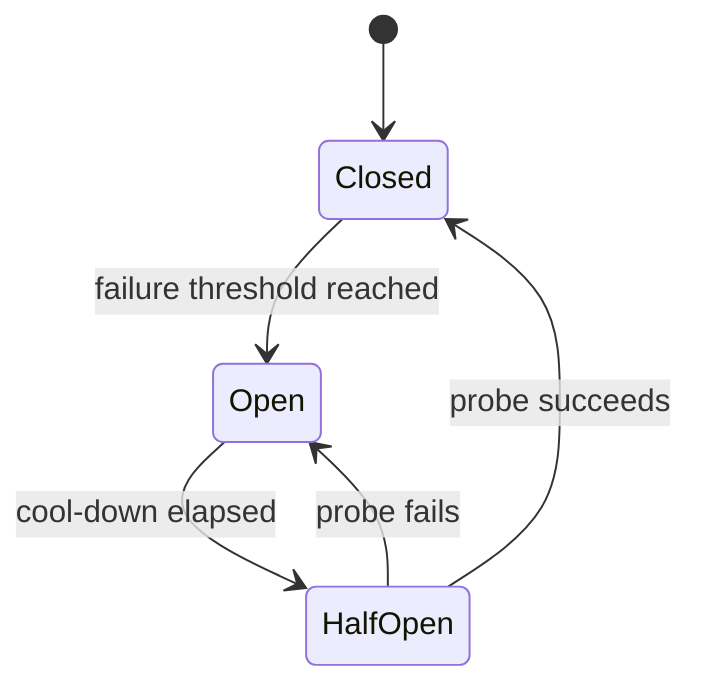

# 防止 Agent 循环、重复操作与重试风暴

Agent 会根据观察反复选择动作。开放循环如果没有进展判定、操作身份、重试预算和依赖保护，可能反复调用同一 Tool、重复产生副作用，或在依赖故障时形成重试风暴。

需要分别控制四类问题：

| 问题 | 现象 | 主要控制 |
| --- | --- | --- |
| 推理循环 | 状态没有变化却重复计划 | 进展指纹、无进展上限 |
| 重复操作 | 同一业务意图被执行多次 | Intent ID、幂等键、结果对账 |
| 局部重试失控 | 一个调用无限尝试 | 错误分类、attempt 与 deadline |
| 重试风暴 | 多层、多实例同时放大请求 | 共享预算、退避、Jitter、熔断 |

`maxSteps` 只能限制总步数，不能保证写操作只发生一次，也不能保护正在恢复的下游服务。

## 前置知识与适用边界

前置阅读：

- [Agent 的核心组件与运行闭环](01-agent-components.md)。
- [Agent 的步骤、Token、成本与总超时预算](02-agent-budgets-and-timeouts.md)。
- [Agent 的暂停、取消、恢复、失败步骤与部分完成](03-pause-cancel-resume-and-partial-completion.md)。
- [Tool 输入验证、超时、有限重试与幂等](../09-tool-design/03-validation-timeout-retry-idempotency.md)。

本文关注运行控制，不讨论如何让模型产生更长的推理。安全不变量：

- 权限拒绝不重试。
- 不确定写入结果先对账，不直接重做。
- 同一业务意图使用稳定身份。
- 重试不能获得新预算或更高权限。
- 循环停止后保留证据并给出明确终态。

## 循环从哪里产生

## 计划循环

轨迹：

```text
观察：缺少订单状态
→ 计划：查询订单
→ Tool：未找到
→ 观察：缺少订单状态
→ 计划：查询订单
→ Tool：未找到
```

如果 `not_found` 是确定结果，重复同一查询不会产生新信息。应请求更正 ID 或停止。

## 表达变化循环

模型把同一动作改写：

```text
search(query="退款政策 2026")
search(query="2026 年退款政策")
search(query="退款的最新规则")
```

字符串不同不代表任务不同。需要规范化 Intent 和资源 scope。

## 状态轮询循环

异步任务：

```text
create_job → pending
get_job → pending
get_job → pending
...
```

轮询必须遵循服务端建议、最小间隔、deadline 和最大次数。优先使用事件、Webhook 或队列通知。

## Evaluator 循环

```text
生成 → 评价“还可改进” → 修改 → 评价“还可改进”
```

没有通过阈值、最小改进量和最大迭代时，开放式“继续优化”没有终点。

## 错误重试循环

```text
Tool timeout → Agent 重试
SDK 重试 → HTTP client 重试
Queue 重新投递 → Worker 再执行
```

每层最多三次可能放大为：

```text
3 × 3 × 3 = 27 次下游调用
```

重试次数必须按一次用户任务统一核算。

## 进展不是“又执行了一步”

有效进展至少改变一种受控状态：

- 新增经过验证的事实。
- 关闭一个明确 gap。
- 完成一个 Task。
- 获得用户输入。
- 获得审批。
- 资源版本变化。
- 产生可验证且更好的 Candidate。

以下不算进展：

- 同一 Tool 返回相同结果。
- 只改写计划文字。
- 同一错误换一种描述。
- 重复读取同一资源版本。
- 自报“更接近完成”。

## Progress Ledger

```json
{
  "runId": "agent-run-812",
  "goalVersion": "goal-v3",
  "openGaps": [
    "missing_order_id"
  ],
  "verifiedFacts": [
    {
      "key": "customer_id",
      "valueHash": "sha256:...",
      "sourceVersion": "crm:customer-91:v7"
    }
  ],
  "completedIntentIds": [],
  "lastProgressAtStep": 3,
  "noProgressSteps": 1
}
```

Ledger 只存规范化事实和引用，不把模型自然语言总结当权威状态。

## 进展指纹

```text
progressFingerprint = hash(
  goalVersion
  + sorted(openGaps)
  + sorted(verifiedFactHashes)
  + sorted(completedIntentIds)
  + approvalState
  + relevantResourceVersions
)
```

执行一步后指纹不变，说明该步没有改变可观察任务状态。

### 指纹边界

指纹不能包含：

- 当前时间。
- 随机 request ID。
- 模型措辞。
- 每次都会变化的 trace ID。

否则每次都不同，无法检测循环。

也不能过度压缩：

- 只用 Tool 名。
- 只用错误码。
- 只用任务步数。

否则不同资源操作会被错误合并。

## Action Fingerprint

对候选动作规范化：

```json
{
  "toolId": "orders.get",
  "operation": "read",
  "resource": {
    "tenantId": "tenant-17",
    "orderId": "order-991"
  },
  "parameters": {
    "fields": ["status", "updatedAt"]
  }
}
```

```text
actionFingerprint = hash(
  toolId
  + canonicalResourceIdentity
  + canonicalParameters
  + permissionScope
)
```

JSON key 排序、默认值、日期、大小写和 ID 格式需要规范化。不能简单 hash 原始 Prompt。

## 循环检测策略

### 连续无进展

```text
if progressFingerprint unchanged:
  noProgressSteps += 1
else:
  noProgressSteps = 0
```

达到阈值：

- 换一种经过允许的策略一次。
- 请求用户输入。
- 人工接管。
- 以 `stopped_no_progress` 结束。

### 动作重复

同一 `actionFingerprint`：

- 读操作、资源版本不变：复用旧结果。
- 读操作、TTL 到期：按策略刷新。
- 写操作完成：返回原结果。
- 写操作进行中：查询状态。
- 写操作结果未知：对账。
- 永久失败：不重做。

### 周期检测

指纹序列：

```text
A → B → C → A → B → C
```

只检查相邻重复发现不了周期。保存最近 `N` 个状态指纹，检测重复子序列，并限制内存。

### 语义重复

Embedding 可以辅助发现近似重复计划，但不能作为写操作去重依据。业务幂等必须基于稳定 Intent、资源和参数。

## Intent 与 Attempt

必须区分：

- **Intent**：用户希望产生一次的业务效果。
- **Attempt**：为实现 Intent 的一次技术尝试。

```json
{
  "intentId": "schedule-report:tenant-17:report-2026-q2",
  "attempt": 3,
  "operationId": "op-991",
  "idempotencyKey": "idem-tenant17-reportq2",
  "payloadHash": "sha256:...",
  "status": "in_progress"
}
```

重试增加 `attempt`，不更换 `intentId` 或幂等键。

## 幂等语义

HTTP 规范中，幂等方法是多次相同请求的预期效果与一次相同。它描述请求语义，不保证响应字节相同，也不阻止日志等附带记录。

Agent 的 POST 写操作需要应用级幂等：

1. 客户端生成稳定幂等键。
2. 服务端把 key 与规范化 payload hash 一起存储。
3. 首次请求原子声明执行权。
4. 相同 key、相同 payload：
   - 已完成：返回保存结果。
   - 进行中：返回 operation 状态。
   - 已失败：按合同返回原失败或允许新 attempt。
5. 相同 key、不同 payload：冲突，不能覆盖。

## 幂等记录

```json
{
  "scope": "tenant-17:reports.create",
  "idempotencyKey": "idem-tenant17-reportq2",
  "payloadHash": "sha256:8d...",
  "status": "succeeded",
  "operationId": "op-991",
  "responseRef": "artifact:report-job-281",
  "createdAt": "2026-07-18T14:00:00Z",
  "expiresAt": "2026-07-25T14:00:00Z"
}
```

Key 唯一范围和保存期必须明确。过早删除会使迟到重试重复执行；永久保存会增加隐私和存储成本。

## 不确定结果先对账

请求超时可能有三种事实：

```text
请求未到达
请求执行失败
请求成功但响应丢失
```

客户端无法从 timeout 区分。写操作流程：

```text
timeout
→ 使用 operationId / idempotencyKey 查询状态
→ succeeded: 复用结果
→ in_progress: 等待或订阅
→ not_found 且合同保证未执行: 才可重试
→ unknown: 人工或补偿流程
```

“没收到成功响应”不等于“没有成功”。

## 错误分类

| 类别 | 示例 | 自动重试 |
| --- | --- | --- |
| `invalid_input` | Schema、格式、缺字段 | 否，先修正 |
| `permission_denied` | 401/403、资源越界 | 否 |
| `not_found_stable` | 已验证 ID 不存在 | 否 |
| `conflict` | 版本冲突、key payload 不同 | 重新读取后决策 |
| `rate_limited` | 429 | 遵循 Retry-After 和预算 |
| `transient_dependency` | 502/503、连接重置 | 有限重试 |
| `timeout_read` | 只读请求 timeout | 可有限重试 |
| `timeout_write_unknown` | 写入 timeout | 先对账 |
| `permanent_dependency` | 不支持、长期禁用 | 否 |
| `cancelled` | 用户取消 | 否 |
| `budget_exhausted` | 无剩余预算 | 否 |

不能把所有 `5xx` 当瞬时错误。服务文档、错误码和操作语义共同决定。

## Retry Budget

一次 Run：

```json
{
  "retryBudget": {
    "maxExtraAttempts": 5,
    "maxRetryCostUsd": 0.15,
    "maxRetryTimeMs": 12000,
    "maxPerOperationAttempts": 2
  },
  "spent": {
    "extraAttempts": 2,
    "retryCostUsd": 0.04,
    "retryTimeMs": 1800
  }
}
```

重试前原子预留。SDK、Worker 和 Agent 不能各自拥有看不见的独立预算。

### Deadline

```text
nextAttemptAllowed
  = remainingDeadline
    >= plannedBackoff
     + operationTimeout
     + finalizationReserve
```

剩余时间不足时直接停止。

### 重试位置

尽量在最了解错误且能保持幂等的一层重试一次：

- HTTP SDK 已重试时，向上暴露 attempt metadata。
- Agent 不再次盲重试同一调用。
- Queue redelivery 计入同一 operation attempt。

## 退避

指数退避：

```text
cap = min(maxDelay, baseDelay × 2^attempt)
```

不带随机的所有实例会同时重试。Full Jitter：

```text
delay = random(0, cap)
```

Equal Jitter：

```text
delay = cap / 2 + random(0, cap / 2)
```

服务返回合法 `Retry-After` 时优先遵循，同时受本地 deadline 约束。

Jitter 用于分散相关行为，不是增加无限等待。记录实际 delay、算法和 attempt，便于调试。

## Circuit Breaker

Circuit Breaker 保护一个依赖或 endpoint：



### Closed

正常请求通过，滑动窗口统计受保护错误。

### Open

快速失败，不调用依赖。Agent 收到 `circuit_open` 后不能在同一 Run 中绕过。

### Half-open

只允许少量探测。不能让全部等待请求同时成为探测流量。

Circuit breaker 与 Retry 不同：

- Retry 假定短暂故障可能恢复。
- Circuit breaker 在持续故障时阻止更多调用。

熔断维度应合理，例如按 provider/region/endpoint，而不是全系统一个开关，也不能按每个 request 独立到失去共享保护。

## 并发放大

假设：

```text
100 个 Agent Run
× 4 个并行 Worker
× 每 Worker 3 个 attempt
= 1200 次依赖请求
```

依赖容量只有 100 RPS 时，重试会延长故障。

控制：

- 全局和每租户并发上限。
- 每依赖 bulkhead。
- Retry token bucket。
- Circuit breaker。
- Queue backpressure。
- 停止新的低优先级工作。
- 尊重 `Retry-After`。

增加 Worker 数量不能修复一个已饱和依赖。

## 可执行的循环与重试控制器

下面 JavaScript 演示：

- 稳定 Action fingerprint。
- 无进展和重复动作停止。
- 错误分类。
- 共享 Retry budget。
- 指数上限与可复现 Full Jitter。

```javascript
"use strict";

const crypto = require("node:crypto");

function canonicalize(value) {
  if (Array.isArray(value)) {
    return value.map(canonicalize);
  }
  if (value && typeof value === "object") {
    return Object.fromEntries(
      Object.keys(value)
        .sort()
        .map((key) => [key, canonicalize(value[key])])
    );
  }
  return value;
}

function fingerprint(value) {
  return crypto
    .createHash("sha256")
    .update(JSON.stringify(canonicalize(value)))
    .digest("hex");
}

class LoopGuard {
  constructor({ maxRepeatedAction, maxNoProgress }) {
    this.maxRepeatedAction = maxRepeatedAction;
    this.maxNoProgress = maxNoProgress;
    this.actionCounts = new Map();
    this.lastProgressFingerprint = null;
    this.noProgress = 0;
  }

  observe({ action, progressState }) {
    const actionId = fingerprint(action);
    const progressId = fingerprint(progressState);
    const actionCount = (this.actionCounts.get(actionId) ?? 0) + 1;
    this.actionCounts.set(actionId, actionCount);

    if (progressId === this.lastProgressFingerprint) {
      this.noProgress += 1;
    } else {
      this.noProgress = 0;
      this.lastProgressFingerprint = progressId;
    }

    if (actionCount > this.maxRepeatedAction) {
      return {
        allowed: false,
        reason: "repeated_action",
        actionCount
      };
    }
    if (this.noProgress > this.maxNoProgress) {
      return {
        allowed: false,
        reason: "no_progress",
        noProgress: this.noProgress
      };
    }
    return { allowed: true };
  }
}

function classifyError(error) {
  if (error.code === "RATE_LIMITED") {
    return { retryable: true, kind: "rate_limited" };
  }
  if (error.code === "DEPENDENCY_UNAVAILABLE") {
    return { retryable: true, kind: "transient_dependency" };
  }
  if (error.code === "WRITE_TIMEOUT_UNKNOWN") {
    return { retryable: false, kind: "reconcile_first" };
  }
  return { retryable: false, kind: "permanent" };
}

function createSeededRandom(seed) {
  let state = seed >>> 0;
  return () => {
    state = (1664525 * state + 1013904223) >>> 0;
    return state / 2 ** 32;
  };
}

async function retryOperation(operation, options) {
  const {
    maxAttempts,
    baseDelayMs,
    maxDelayMs,
    deadlineMs,
    random,
    wait
  } = options;

  const startedAt = Date.now();
  let extraAttempts = 0;

  for (let attempt = 1; attempt <= maxAttempts; attempt += 1) {
    try {
      const value = await operation(attempt);
      return {
        status: "succeeded",
        attempt,
        extraAttempts,
        value
      };
    } catch (error) {
      const classification = classifyError(error);
      if (!classification.retryable) {
        return {
          status: "stopped",
          attempt,
          reason: classification.kind
        };
      }
      if (attempt === maxAttempts) {
        return {
          status: "stopped",
          attempt,
          reason: "retry_budget_exhausted"
        };
      }

      const cap = Math.min(
        maxDelayMs,
        baseDelayMs * 2 ** (attempt - 1)
      );
      const delayMs = Math.floor(random() * cap);
      const elapsed = Date.now() - startedAt;
      if (elapsed + delayMs >= deadlineMs) {
        return {
          status: "stopped",
          attempt,
          reason: "deadline"
        };
      }

      extraAttempts += 1;
      await wait(delayMs);
    }
  }

  throw new Error("unreachable");
}

async function main() {
  const loopGuard = new LoopGuard({
    maxRepeatedAction: 2,
    maxNoProgress: 1
  });
  const action = {
    toolId: "jobs.get",
    resource: { jobId: "job-91" }
  };
  const progress = {
    jobId: "job-91",
    status: "pending",
    version: 1
  };

  console.log(
    loopGuard.observe({ action, progressState: progress }).allowed
  );
  console.log(
    loopGuard.observe({ action, progressState: progress }).allowed
  );
  console.log(
    loopGuard.observe({ action, progressState: progress }).reason
  );

  const result = await retryOperation(
    async (attempt) => {
      if (attempt < 3) {
        const error = new Error("temporary");
        error.code = "DEPENDENCY_UNAVAILABLE";
        throw error;
      }
      return "ready";
    },
    {
      maxAttempts: 3,
      baseDelayMs: 100,
      maxDelayMs: 1000,
      deadlineMs: 5000,
      random: createSeededRandom(7),
      wait: async () => {}
    }
  );

  console.log(`${result.status} on attempt ${result.attempt}`);
}

main().catch((error) => {
  console.error(error);
  process.exitCode = 1;
});
```

预期输出：

```text
true
true
repeated_action
succeeded on attempt 3
```

生产系统的等待必须真实遵循 delay；示例注入空 `wait` 只用于快速验证控制逻辑。

## 案例一：Agent 创建周期报表

## 目标

用户请求：

```text
为 Q2 销售创建一次报表任务，完成后通知我。
```

业务 Intent：

```json
{
  "intentId": "report:create:tenant-17:q2-sales:2026",
  "payload": {
    "reportType": "sales",
    "period": {
      "start": "2026-04-01",
      "endExclusive": "2026-07-01"
    }
  }
}
```

## 第一次写入超时

`reports.create` 返回 timeout。Agent 不知道服务端是否已创建。

错误状态：

```json
{
  "operationId": "report-op-91",
  "idempotencyKey": "report:create:tenant-17:q2-sales:2026",
  "status": "unknown"
}
```

正确步骤：

1. 用 `operationId` 查询。
2. 服务返回 `in_progress`。
3. 保存远端 `jobId=job-882`。
4. 不再次 `reports.create`。
5. 订阅完成事件或低频轮询。

## 重复用户消息

刷新页面后同一请求再次到达。API 按 `(tenant, operation, idempotencyKey)` 查到进行中操作，返回：

```json
{
  "status": "in_progress",
  "operationId": "report-op-91",
  "jobId": "job-882",
  "duplicate": true
}
```

不会创建第二份报表。

## Payload 冲突

客户端错误地复用 key，但 period 改为 Q3：

```json
{
  "error": "IDEMPOTENCY_KEY_PAYLOAD_CONFLICT",
  "status": 409
}
```

不能用新 payload 覆盖旧记录。

## Poll 循环

服务建议 15 秒后检查。Controller：

- 优先等待 `report.completed` 事件。
- Poll 最小间隔 15 秒。
- 最大 20 次。
- 总 deadline 10 分钟。
- 连续相同 `pending/version=3` 达阈值后降低频率。
- 用户取消后停止 Poll。

## 通知去重

报表完成事件重复投递两次。通知 Intent：

```text
notify:report-op-91:completed
```

通知服务使用独立幂等键，只发送一次。创建报表的 key 不能复用于通知，因为是不同业务效果。

## 失败分支

状态查询服务打开 Circuit：

- 不再 Poll。
- Task 进入 `waiting_dependency`。
- 告知用户报表任务可能仍在运行。
- 后台等待事件或 Circuit half-open。
- 不重新创建报表。

## 验收

- 同一 Intent 最多一个远端 job。
- timeout 后先对账。
- Key 与 payload hash 绑定。
- Poll 有间隔、次数和 deadline。
- 完成事件重复不会重复通知。
- Circuit open 不触发绕路创建。

## 案例二：批量数据导入的重试风暴

## 场景

50 个 Agent Run 各启动 4 个 Worker 调用导入验证服务。该服务返回 503。

错误实现：

```text
Agent retry 3
× Worker retry 3
× SDK retry 3
× 200 初始并发
= 最坏 5400 次调用
```

## 共享控制

依赖级策略：

```json
{
  "dependency": "import-validator",
  "maxConcurrency": 20,
  "retryTokenBucket": {
    "capacity": 30,
    "refillPerSecond": 2
  },
  "circuit": {
    "windowSeconds": 20,
    "minimumRequests": 10,
    "failureRateToOpen": 0.6,
    "openSeconds": 30,
    "halfOpenProbes": 2
  }
}
```

Run 级策略：

```json
{
  "maxExtraAttempts": 2,
  "maxRetryTimeMs": 10000,
  "deadlineMs": 120000
}
```

SDK 自动重试次数设为 0 或把其 attempt 暴露并计入预算。

## 故障时间线

```text
t=0s   20 个请求进入，其余排队
t=1s   12/12 采样请求失败
t=1s   Circuit open
t=1-31s 新调用快速失败为 circuit_open
t=31s  只允许 2 个 half-open probe
t=32s  1 成功、1 失败，重新 open
```

Agent 对 `circuit_open` 不重试，保存批次为 `waiting_dependency`。

## 恢复

下一次 half-open 两个探测成功：

- Circuit closed。
- 逐步恢复并发，不瞬间释放全部队列。
- 每个 Run 只处理尚未完成 item。
- item 使用稳定 idempotency key。
- 过期 Run 不恢复。

## 部分失败

10,000 个 item 已验证 8,400 个。依赖持续不可用并超过 deadline：

```json
{
  "status": "partial",
  "completed": 8400,
  "waiting": 0,
  "failedTransient": 1600,
  "retryableUntil": "2026-07-18T16:00:00Z",
  "reason": "dependency_unavailable"
}
```

用户可以创建“仅重试失败 item”的新 Intent，不重跑 8,400 个成功项。

## 观测

循环指标：

- `no_progress_steps`。
- `repeated_action_blocked`。
- `cycle_detected`。
- `same_result_reused`。

幂等指标：

- key 首次、命中、冲突。
- unknown write。
- reconciliation success。
- duplicate side effect。

重试指标：

- 初始请求与 extra attempt。
- retry amplification factor。
- budget exhaustion。
- delay 分布。
- `Retry-After` 遵循率。

依赖指标：

- Circuit state。
- open 次数。
- half-open probe。
- bulkhead active/queued。
- downstream error rate。

```text
retryAmplification
  = totalDependencyAttempts / initialLogicalOperations
```

正常值不一定是 1，但应有明确基线和上限。

## 人工接管

触发：

- 写入状态持续 unknown。
- 同一 Intent 多个远端 operation。
- 补偿可能影响用户数据。
- Circuit 长时间 open。
- 无进展达到上限。
- 重试预算耗尽且任务高价值。

接管包：

```json
{
  "runId": "agent-run-812",
  "intentId": "report:create:tenant-17:q2-sales:2026",
  "reasonCode": "WRITE_OUTCOME_UNKNOWN",
  "attempts": 2,
  "idempotencyKey": "report:create:tenant-17:q2-sales:2026",
  "remoteOperationIds": ["report-op-91"],
  "lastKnownState": "unknown",
  "safeActions": [
    "query_remote_state",
    "mark_for_manual_reconciliation"
  ]
}
```

人工界面不能提供“再次执行”而不展示重复副作用风险。

## 失败注入

- 写操作成功后丢失响应。
- 同一 key 并发请求。
- 相同 key 不同 payload。
- Queue 重复投递。
- Worker 在提交结果前崩溃。
- 429 带 Retry-After。
- 503 持续一分钟。
- Circuit half-open 探测失败。
- Agent 和 SDK 同时重试。
- 用户取消后迟到 retry timer。

验证：

- 不重复副作用。
- 取消后不启动新 attempt。
- 429 不早于 Retry-After。
- Circuit open 快速失败。
- 所有层 attempt 进入同一预算。
- 状态 unknown 进入对账。

## 常见错误

### 用 Prompt 防重复

“不要重复调用”不能处理崩溃、重复消息和 timeout。

修正：Intent、幂等存储和执行 Gate。

### 每次重试生成新 key

服务端把它视为新操作。

修正：同一 Intent 所有 attempt 复用 key。

### 只比较参数字符串

JSON 顺序、默认值和日期表示造成假差异。

修正：Schema 驱动规范化与 payload hash。

### timeout 直接重写

可能重复扣款、通知或创建。

修正：operation 查询和对账。

### 退避没有 Jitter

大量客户端保持同步。

修正：Full/Equal Jitter。

### 每层都重试

造成乘法放大。

修正：统一预算和 attempt metadata。

### Circuit open 后换 endpoint 绕过

如果 endpoint 指向同一故障资源，只会转移压力。

修正：按实际故障域共享 breaker。

### 把所有 4xx 永久化

409 版本冲突可能要重新读取，429 可延后。

修正：按错误语义分类。

### 把相同 Tool 结果当进展

模型仍会循环。

修正：基于验证状态的 progress fingerprint。

## 综合练习：安全的外部发布 Agent

构建一个 Agent，创建一次外部发布任务并跟踪完成。

要求：

1. 定义 Intent、Attempt、operation 和 idempotency record。
2. Key 与 tenant、operation、payload hash 绑定。
3. 写 timeout 后先查询状态。
4. 同 key 不同 payload 返回冲突。
5. Progress fingerprint 不包含时间和 request ID。
6. 同一状态连续两步后停止主动轮询。
7. 错误分为永久、瞬时、限流、unknown write。
8. 所有层共享最多 3 个 extra attempt。
9. 实现 exponential backoff + Full Jitter。
10. 实现 Closed/Open/Half-open。
11. 重复完成事件不重复通知。
12. 状态持续 unknown 时人工接管。

验收标准：

- 模拟响应丢失后只产生一个发布任务。
- 100 个并发 Run 下 attempt 不出现乘法放大。
- Circuit open 时没有实际依赖调用。
- 取消后没有新 retry。
- 每次停止有明确 reason code。
- Trace 能关联 Intent、Attempt、Tool 和依赖请求。

## 来源

- [RFC 9110：HTTP Semantics — Idempotent Methods](https://www.rfc-editor.org/rfc/rfc9110.html#section-9.2.2)，访问日期：2026-07-18。
- [AWS Architecture Blog：Exponential Backoff And Jitter](https://aws.amazon.com/blogs/architecture/exponential-backoff-and-jitter/)，访问日期：2026-07-18。
- [Microsoft Azure Architecture Center：Retry Storm antipattern](https://learn.microsoft.com/en-us/azure/architecture/antipatterns/retry-storm/)，访问日期：2026-07-18。
- [Microsoft Azure Architecture Center：Circuit Breaker pattern](https://learn.microsoft.com/en-us/azure/architecture/patterns/circuit-breaker)，访问日期：2026-07-18。
- [OWASP：AI Agent Security Cheat Sheet](https://cheatsheetseries.owasp.org/cheatsheets/AI_Agent_Security_Cheat_Sheet.html)，访问日期：2026-07-18。
