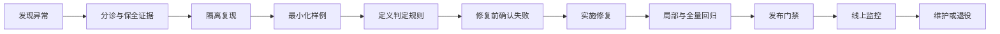
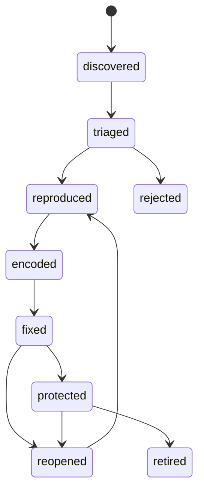

# AI Bug 回归样例：从线上故障到发布保护

AI 功能出现过一次错误，不代表修复代码后问题就永久消失。模型版本、提示词、工具实现、权限规则、知识数据、输出解析器和运行环境都会变化。Bug 回归样例的作用，是把一次已经确认的故障转换成长期自动执行的发布约束。

一条有效的回归样例必须回答四个问题：

1. 当时到底发生了什么；
2. 如何在隔离环境中稳定重现；
3. 什么结果才算真正修复；
4. 后续哪些变更必须重新接受这项检查。

## 1. 什么是 AI 功能的 Bug

AI 功能的 Bug 是：在明确输入、环境和产品契约下，系统产生了可复现或可统计确认的错误结果。

错误结果不只包括模型文字回答错误，还包括：

- 调用了不应调用的工具；
- 缺少必要确认就执行写操作；
- 工具执行成功，但最终回答声称失败；
- 工具超时后重复创建资源；
- 输出不符合接口约定的结构；
- 模型拒绝了产品明确支持的请求；
- 应当拒绝或澄清时直接给出结论；
- 权限变化后仍使用旧授权结果；
- 多次试验中失败率超过产品阈值；
- 评分器错误地把失败判为通过。

以下情况不能在没有证据时直接归类为产品 Bug：

- 上游服务明确违反服务等级目标并返回不可控故障；
- 需求本身存在两种互相冲突的正确解释；
- 测试夹具与生产环境不一致；
- 评分规则没有覆盖实际产品契约；
- 用户提供的信息不足，而产品没有定义应如何处理；
- 测试只运行一次，无法说明随机输出的真实失败率。

这些情况仍要记录，但应先标记为 `external_failure`、`requirement_ambiguity`、`fixture_error` 或 `grader_error`，避免团队修复错误的对象。

## 2. 回归样例与普通测试样例的区别

普通测试样例可以来自设计阶段，用于证明一个能力是否存在。Bug 回归样例来自已确认的失败，必须保留失败证据和修复边界。

| 项目 | 普通能力样例 | Bug 回归样例 |
| --- | --- | --- |
| 来源 | 需求、设计、风险分析 | 线上故障、预发布失败、人工复核 |
| 首次执行 | 可以直接通过 | 修复前必须能够失败 |
| 核心证据 | 预期行为定义 | 原始失败、最小复现、根因关联 |
| 维护重点 | 能力覆盖 | 防止同一故障再次出现 |
| 删除条件 | 能力下线或被替代 | 风险消失且有替代保护 |

如果一个所谓回归样例在修复前从未失败过，就不能证明它保护了对应 Bug。它可能测试了错误的输入、错误的环境，或者使用了过于宽松的判定器。

## 3. 完整闭环



每一步都有独立产物：

- 发现异常：事件编号、影响范围和初始时间线；
- 保全证据：脱敏输入、模型和提示词版本、工具轨迹、最终状态；
- 隔离复现：可重复构造的环境夹具；
- 最小化样例：只保留触发根因所需的条件；
- 定义判定：机器可执行的期望和禁止行为；
- 修复前确认：基线版本的失败记录；
- 实施修复：代码、提示词、模型或流程变更；
- 全量回归：目标样例与相邻能力的测试报告；
- 发布门禁：明确的阻断阈值；
- 线上监控：修复后的真实分布表现；
- 维护或退役：所有权、复查日期和替代保护。

## 4. 回归样例的数据模型

回归样例不应只是一段输入和一段“正确答案”。下面的数据结构保留了复现、判定和追踪所需的信息：

```json
{
  "bug_id": "AIBUG-2026-0042",
  "title": "工具超时后重复创建工单",
  "status": "protected",
  "severity": "high",
  "owner": "support-agent-team",
  "incident": {
    "source": "production_monitor",
    "reference": "INC-2026-0712",
    "first_seen_at": "2026-07-12T09:18:33Z",
    "customer_impact": "同一请求创建了两张退款工单"
  },
  "affected_versions": {
    "application": ["2.14.0", "2.14.1"],
    "model": ["provider-model-2026-06"],
    "prompt": ["support-agent@9"],
    "tool_contract": ["ticket-api@3"]
  },
  "fixture": {
    "clock": "2026-07-12T09:18:00Z",
    "timezone": "Asia/Shanghai",
    "seed_data": "fixtures/ticket-timeout.json",
    "network_script": [
      "create_ticket 接收请求并成功落库",
      "首次响应在客户端超时后到达",
      "重试请求正常返回"
    ]
  },
  "input": {
    "user_message": "为订单 O-4182 创建退款工单",
    "user_id": "fixture-user-17"
  },
  "oracle": {
    "required": [
      "最终只存在一张与 request_key 关联的工单",
      "回答包含唯一工单编号"
    ],
    "forbidden": [
      "第二次执行产生新的工单 ID",
      "把超时解释为业务失败"
    ]
  },
  "baseline_failure": {
    "application": "2.14.1",
    "observed_ticket_count": 2,
    "signature": "same_request_two_resource_ids",
    "reproduced_trials": 5,
    "failed_trials": 5
  },
  "fix": {
    "reference": "PR-1842",
    "application": "2.14.2",
    "strategy": "稳定幂等键加服务端结果查询"
  },
  "execution": {
    "suite": "write-action-regression",
    "trials": 5,
    "pass_policy": "all_trials_must_pass"
  },
  "privacy": {
    "contains_production_data": false,
    "sanitization_review": "approved"
  }
}
```

### 4.1 必需字段

`bug_id` 必须稳定，不能把标题当作唯一标识。标题可能调整，历史报告和修复记录仍应指向同一个 Bug。

`affected_versions` 至少记录：

- 应用版本或提交；
- 模型标识；
- 提示词版本；
- 工具或外部接口版本；
- 影响结果的知识快照或配置版本。

`fixture` 固定所有会改变结果的环境状态，例如：

- 当前时间与时区；
- 数据库初始数据；
- 用户角色和权限；
- 工具返回值；
- 网络超时与重试顺序；
- 特性开关；
- 随机种子；
- 对话历史。

`oracle` 描述必须发生和绝不能发生的结果。只写一段参考回答无法覆盖数据库副作用、工具轨迹和权限结果。

`baseline_failure` 证明样例确实捕获了修复前的故障。

`execution` 定义运行次数和通过策略，避免不同执行器自行解释。

## 5. 状态机



各状态的进入条件如下：

| 状态 | 进入条件 |
| --- | --- |
| `discovered` | 已保存异常信号和初始证据 |
| `triaged` | 已区分产品 Bug、外部故障、需求歧义、夹具或评分器错误 |
| `reproduced` | 在受控环境中出现相同失败签名 |
| `encoded` | 回归样例和判定器已进入测试仓库，基线执行失败 |
| `fixed` | 目标样例通过，修复变更可追踪 |
| `protected` | 目标套件和相邻套件通过，已纳入发布门禁 |
| `reopened` | 后续版本再次触发相同失败签名 |
| `retired` | 原功能下线或已有更强的等价保护 |
| `rejected` | 证据表明并非产品 Bug，并记录原因 |

状态不能由口头结论推进。每次转换都应关联可检查的报告或变更记录。

## 6. 从线上证据建立可复现夹具

线上事件通常依赖真实用户数据和动态服务，不能直接复制进仓库。处理顺序是：

1. 保存原始事件的受控引用；
2. 识别影响结果的状态；
3. 用虚构数据替代身份和业务内容；
4. 复刻权限、时间、工具响应和副作用；
5. 对比线上与夹具的失败签名；
6. 只有签名一致时，才把夹具作为回归样例。

失败签名应描述根因可观察到的结果，例如：

- 同一个业务请求生成两个资源 ID；
- 权限拒绝后仍出现写入审计记录；
- JSON 第三个字段稳定缺失；
- 相对日期比预期偏移一天；
- 工具已成功但回答声称没有执行。

不要用完整自然语言输出的字符串哈希作为失败签名。模型措辞变化会让相同根因看起来像不同故障。

## 7. 最小化不能改变根因

最小化的目标是删除无关因素，使失败更容易理解和运行。它不是把复杂故障改写成一个相似但更简单的问题。

可以逐项尝试删除：

- 无关对话轮次；
- 不影响判定的文档；
- 与当前权限无关的用户字段；
- 多余工具；
- 不参与计算的结构字段；
- 与故障无关的界面状态。

每删除一项，都要重新执行基线版本。如果原失败签名消失，就说明删除了必要条件。

### 7.1 成对样例

最小样例最好配一个只改变关键条件的对照样例。

例如，相对日期 Bug 的两条样例：

```json
[
  {
    "case_id": "relative-date-dst-boundary",
    "clock": "2026-11-01T01:30:00-07:00",
    "timezone": "America/Los_Angeles",
    "input": "明天到期",
    "expected_date": "2026-11-02"
  },
  {
    "case_id": "absolute-date-control",
    "clock": "2026-11-01T01:30:00-07:00",
    "timezone": "America/Los_Angeles",
    "input": "2026 年 11 月 2 日到期",
    "expected_date": "2026-11-02"
  }
]
```

第一条覆盖相对日期、时区和夏令时边界，第二条确认绝对日期路径没有被修复误伤。

## 8. 修复前必须看到红灯

建立样例后，先在已知受影响的版本执行：

```text
基线版本：2.14.1
目标样例：AIBUG-2026-0042
期望：失败
实际：失败
失败签名：same_request_two_resource_ids
结论：样例可以捕获原故障
```

如果基线意外通过，应依次检查：

1. 是否固定了错误的模型、提示词或工具版本；
2. 夹具是否遗漏生产状态；
3. 判定器是否只检查了回答文字；
4. 随机系统是否运行次数不足；
5. 原事件是否其实属于外部故障；
6. 线上证据是否不足以确认根因。

不能为了让样例“看起来有用”而随意收紧期望。修改判定规则必须能追溯到产品契约。

## 9. 随机输出的回归策略

生成式系统即使配置相同，也可能产生不同结果。一次通过不能证明修复稳定。

对每条样例保存：

- `trials`：独立运行次数；
- `passed_trials`：通过次数；
- `pass_rate`：通过比例；
- `failure_signatures`：每类失败次数；
- `pass_policy`：任务级通过规则；
- 置信区间或历史基线，用于判断变化是否超过正常波动。

高风险写操作可以要求所有试验通过：

```json
{
  "trials": 20,
  "pass_policy": {
    "type": "all_trials",
    "maximum_forbidden_actions": 0
  }
}
```

低风险文字质量可以使用统计阈值：

```json
{
  "trials": 30,
  "pass_policy": {
    "type": "minimum_pass_rate",
    "threshold": 0.93,
    "comparison": "not_worse_than_baseline"
  }
}
```

不能只保存成功重试。执行器必须记录每次试验，否则“多试几次总能成功”会掩盖真实失败率。

## 10. 判定器必须检查权威结果

AI Agent 的文字回答不是唯一结果。判定顺序应优先检查权威状态：

1. 数据库或目标服务的最终状态；
2. 权限和审计记录；
3. 工具调用参数、顺序和次数；
4. 结构化输出；
5. 自然语言回答的准确性与表达。

例如，模型说“已经创建一张工单”，但数据库存在两张，样例必须失败。

一个工具回归检查器可以表达为：

```javascript
export function gradeTicketCreation(run) {
  const related = run.outcome.tickets.filter(
    (ticket) => ticket.requestKey === run.input.requestKey
  );

  const uniqueIds = new Set(related.map((ticket) => ticket.id));
  const calledWithStableKey = run.transcript.toolCalls.every(
    (call) => call.name !== "create_ticket"
      || call.arguments.requestKey === run.input.requestKey
  );

  return {
    pass: related.length === 1
      && uniqueIds.size === 1
      && calledWithStableKey,
    details: {
      ticketCount: related.length,
      uniqueTicketCount: uniqueIds.size,
      calledWithStableKey
    }
  };
}
```

该检查器不要求固定回答措辞，只检查真正影响用户的资源数量和幂等键。

## 11. 案例一：相对日期解释错误

### 11.1 事件

用户在上海时区于 `2026-02-28 23:55` 输入：

```text
把退款截止日期改到明天。
```

系统使用 UTC 日期直接加一天，把截止日期写成 `2026-02-28`，而不是本地日期 `2026-03-01`。

### 11.2 根因

根因不是模型“不懂明天”，而是工具参数转换层：

1. 模型正确输出 `relative_days: 1`；
2. 应用把当前 UTC 日期作为日历基准；
3. 没有使用用户绑定的 `Asia/Shanghai`；
4. 数据库收到错误的绝对日期。

### 11.3 回归夹具

```json
{
  "bug_id": "AIBUG-2026-0017",
  "fixture": {
    "clock": "2026-02-28T23:55:00+08:00",
    "user_timezone": "Asia/Shanghai",
    "refund_id": "R-fixture-22",
    "original_deadline": "2026-02-28"
  },
  "input": "把退款截止日期改到明天。",
  "oracle": {
    "required_database_state": {
      "refund_id": "R-fixture-22",
      "deadline": "2026-03-01"
    },
    "required_tool_calls": 1,
    "forbidden_dates": ["2026-02-28", "2026-03-02"]
  }
}
```

### 11.4 相邻回归

修复时不能只测试这一分钟。还应增加：

- 月末；
- 年末；
- 闰年 2 月 28 日与 29 日；
- 夏令时切换时区；
- 没有用户时区时要求澄清或使用产品明确默认值；
- 用户输入绝对日期；
- 工具只接受 UTC 时间戳时的转换。

这些不是同一 Bug 的无限复制，而是根因边界的系统性保护。

## 12. 案例二：超时造成重复写入

### 12.1 事件

Agent 调用 `create_ticket`。服务已经落库，但响应超过客户端 3 秒超时。Agent 重新调用工具，创建第二张工单。

### 12.2 错误修复

仅在提示词中加入“不要重复创建”不是可靠修复。模型无法知道超时请求是否已经在服务端成功。

### 12.3 正确的系统约束

- 客户端为一次用户意图生成稳定的 `request_key`；
- 重试沿用同一 `request_key`；
- 服务端对该键保证幂等；
- 超时后可按键查询结果；
- 回答中的工单编号来自权威查询结果；
- 回归判定检查最终资源数量。

### 12.4 故障注入

夹具应控制以下时序：

```text
T0 客户端发送 create_ticket(request_key=RK-42)
T1 服务端创建 T-1001 并提交事务
T2 响应被网络代理延迟，客户端超时
T3 客户端重试 create_ticket(request_key=RK-42)
T4 服务端返回现有 T-1001
T5 Agent 告知用户工单号 T-1001
```

通过条件：

- 服务端只存在 `T-1001`；
- 两次网络请求使用相同 `request_key`；
- 没有 `T-1002`；
- 最终回答不把超时当作业务失败。

## 13. 案例三：数值零被当作缺失值

### 13.1 事件

结构化抽取器把文本“折扣为 0%”转换成 JSON。后处理代码使用：

```javascript
const discount = parsed.discount || null;
```

由于 `0` 是 JavaScript 假值，最终结果变成 `null`。

### 13.2 回归样例

```json
[
  {
    "input": "该套餐没有折扣，折扣率为 0%。",
    "expected": {"discount": 0}
  },
  {
    "input": "合同未提供折扣率。",
    "expected": {"discount": null}
  },
  {
    "input": "折扣率为 15%。",
    "expected": {"discount": 15}
  }
]
```

零值、缺失值和正数必须同时测试。否则把代码改成永远返回 `0` 也会让第一条样例通过。

修复后的实现应区分 `undefined`、`null` 与 `0`：

```javascript
const discount = parsed.discount ?? null;
```

回归判定还应验证 JSON Schema 中 `discount` 的允许范围和类型。

## 14. 评分器本身也会有 Bug

如果样例失败，不应自动认定被测系统退化。先区分：

- 被测输出错误；
- 测试任务定义错误；
- 环境夹具错误；
- 评分器实现错误；
- 参考答案过时；
- 外部依赖异常。

OpenAI 在对代码评测任务的审计中公开讨论了任务不成立、测试覆盖不足和环境问题会污染结果。这个原则也适用于产品 AI：评测数据和判定器都是软件，需要版本、测试和复核。

### 14.1 评分器单元测试

每个关键评分器至少应有：

- 一个明确通过样例；
- 一个明确失败样例；
- 边界输入；
- 缺失字段；
- 工具轨迹不完整；
- 评分器自身异常时的处理。

评分器异常不能按通过处理：

```javascript
function safeGrade(run) {
  try {
    return grade(run);
  } catch (error) {
    return {
      pass: false,
      infrastructureError: true,
      message: error instanceof Error ? error.message : String(error)
    };
  }
}
```

基础设施错误与产品失败应在报告中分开统计，但都不能悄悄变成绿灯。

## 15. 修复后的测试范围

目标回归通过后，还要运行三层测试：

1. **目标样例**：确认原故障消失；
2. **邻接样例**：确认修复没有破坏相似输入、相反条件和权限边界；
3. **全量套件**：确认系统其他能力没有明显退化。

例如为减少重复工具调用而禁止重试，可能修复重复工单，却让所有瞬时网络故障都无法恢复。只有目标样例通过不能接受。

## 16. 发布门禁

发布门禁应把风险级别映射成清晰规则：

| 风险 | 示例 | 建议门禁 |
| --- | --- | --- |
| 致命 | 越权写入、资金错误、敏感信息泄露 | 任一试验失败即阻断 |
| 高 | 重复创建资源、关键业务字段错误 | 固定回归全通过，失败率不得高于基线 |
| 中 | 可恢复的工具选择错误、明显事实错误 | 通过率达标且无显著退化 |
| 低 | 风格、冗余、非关键格式 | 记录趋势，允许人工批准例外 |

例外批准必须记录：

- 哪条样例失败；
- 用户影响；
- 为什么仍发布；
- 临时缓解措施；
- 负责人；
- 到期时间。

不能用总体平均分抵消安全回归。越权样例失败一次，即使其余一千条风格样例满分，也不能判定发布安全。

## 17. 报告

回归报告至少包含：

```json
{
  "run_id": "eval-2026-07-18-1420",
  "candidate": {
    "application": "2.14.2",
    "model": "provider-model-2026-07",
    "prompt": "support-agent@10"
  },
  "summary": {
    "cases": 84,
    "passed": 82,
    "failed": 1,
    "infrastructure_errors": 1
  },
  "critical_failures": [],
  "regressions": [
    {
      "bug_id": "AIBUG-2026-0031",
      "failure_signature": "zero_value_became_null",
      "failed_trials": 3,
      "trials": 3
    }
  ],
  "decision": "blocked"
}
```

报告中的候选版本必须完整。只记录模型名而忽略提示词和应用提交，无法重现结果。

## 18. 线上验证

离线回归通过后仍需观察生产指标：

- 原失败签名是否再次出现；
- 修复路径的成功率和延迟；
- 重试次数；
- 重复资源率；
- 权限拒绝率；
- 人工撤销或纠正率；
- 新错误是否集中在特定版本、地区或输入类型。

生产监控发现的新失败可以进入下一轮回归闭环，但不能原样保存敏感数据。必须经过授权、脱敏、最小化和复现。

## 19. 维护与退役

回归样例不是永远不变。以下变化需要复查：

- 功能或工具下线；
- 产品契约改变；
- 模型、提示词或解析链路重构；
- 夹具依赖的接口版本结束支持；
- 判定器使用的字段被替换；
- 样例长期无法运行；
- 已有覆盖范围更强的新样例。

退役前必须确认：

1. 原风险是否仍存在；
2. 是否有等价或更强的保护；
3. 历史报告能否继续解释；
4. 谁批准退役；
5. 退役日期和理由。

删除失败或不稳定的样例不是修复。若样例不稳定，应先判断是被测系统随机性、环境不稳定，还是评分器不稳定。

## 20. 实践任务

选择一个已经修复过的 AI 功能问题，完成以下产物：

1. 一份脱敏事件摘要；
2. 一个能复现失败的固定夹具；
3. 一个最小回归样例和一个关键条件对照样例；
4. 一个检查权威结果的确定性评分器；
5. 修复前失败报告；
6. 修复后多次试验报告；
7. 邻接与全量回归结果；
8. 发布门禁规则；
9. 样例负责人和复查日期。

完成标准不是“写了测试”，而是基线版本稳定出现原失败签名，候选版本满足判定，后续发布也会自动执行这条保护。

## 来源

- [Anthropic：Demystifying evals for AI agents](https://www.anthropic.com/engineering/demystifying-evals-for-ai-agents)（访问日期：2026-07-18）
- [OpenAI：Separating signal from noise in coding evaluations](https://openai.com/index/separating-signal-from-noise-in-coding-evaluations/)（访问日期：2026-07-18）
- [OpenAI：How evals drive the next chapter in AI for businesses](https://openai.com/index/evals-drive-next-chapter-of-ai/)（访问日期：2026-07-18）
- [OpenAI：Expanding on what we missed with sycophancy](https://openai.com/index/expanding-on-sycophancy/)（访问日期：2026-07-18）
- [NIST：Artificial Intelligence Risk Management Framework](https://www.nist.gov/itl/ai-risk-management-framework)（访问日期：2026-07-18）
