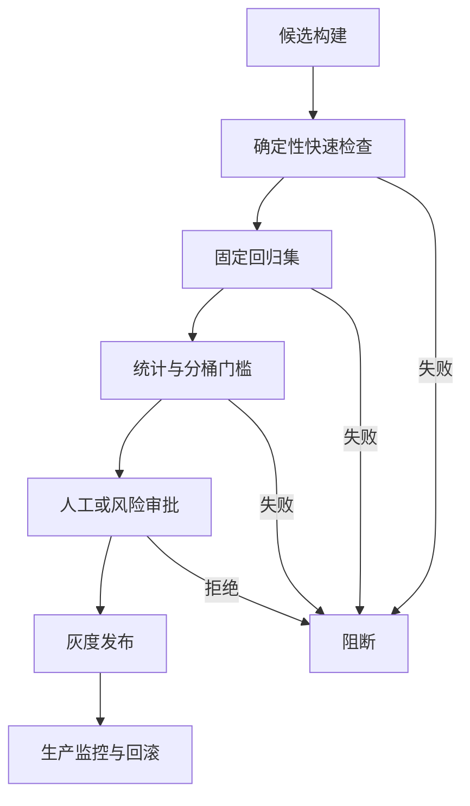

# AI 系统的上线门槛、CI 回归与例外审批

AI 系统的发布门禁把评估结果转换为可执行的上线决策。

它不是“新版本平均分比旧版本高就通过”。

一个可靠门禁需要同时定义：

- 候选版本与哪个基线比较。
- 哪些指标必须达到绝对下限。
- 哪些指标不得相对退化。
- 多大变化超过测量噪声。
- 哪些高风险案例必须逐条通过。
- 评估基础设施失败时怎样处理。
- 谁能批准例外，例外何时失效。

门禁的作用是阻止已知、可测量且不可接受的风险进入生产。

它不能证明系统在所有真实输入上都安全，也不能替代灰度、监控和回滚。

## 1. 发布门禁的四层结构



### 第一层：确定性快速检查

- Schema。
- 单元测试。
- 工具参数。
- 权限不变量。
- 安全过滤器。
- 提示和配置格式。

### 第二层：固定回归集

- 历史线上故障。
- 关键正常流程。
- 边界与对抗案例。
- 不回答与权限案例。

### 第三层：统计与分桶门槛

- 总体质量。
- 关键分桶质量。
- 延迟与成本。
- 相对基线差值。
- 不确定性。

### 第四层：人工审批

- 高影响变更。
- 评估器不覆盖的风险。
- 临时例外。
- 上线范围和回滚计划。

## 2. 发布对象必须可复现

门禁评估的不是“当前分支”，而是一个不可变候选。

候选合同：

```json
{
  "candidateId": "support-agent:sha256-91fd",
  "sourceCommit": "91fd4a2",
  "modelSnapshot": "model-2026-06-30",
  "promptBundle": "support-prompts:v19",
  "toolset": "support-tools:v8",
  "retrievalConfig": "retrieval:v12",
  "knowledgeSnapshot": "policy:2026-07-01",
  "runtimeImage": "registry/agent-runtime@sha256:83ab",
  "featureFlags": {
    "newRefundFlow": true,
    "parallelSearch": false
  }
}
```

通过门禁后发布的必须是同一对象。

评估后重新构建、更新模型别名或刷新知识库，都会使门禁证据失效。

## 3. 选择基线

### 3.1 生产基线

当前稳定生产版本是最常用基线。

它回答候选是否相对用户当前体验退化。

### 3.2 固定历史基线

长期固定的参考版本用于观察趋势。

如果每次只与上一个版本比较，小幅连续退化可能累积。

### 3.3 目标基线

人工答案、确定性上限或业务目标用于绝对判断。

候选即使优于生产，也可能仍不满足上线标准。

一个发布报告可以同时比较：

| 基线 | 作用 |
| --- | --- |
| 当前生产 | 检测短期回归 |
| 季度固定版本 | 检测长期漂移 |
| 绝对目标 | 判断是否达到业务门槛 |

基线也必须锁定模型、提示、工具、知识和运行环境。

## 4. 门槛类型

### 4.1 绝对门槛

示例：

```text
权限越权案例通过率必须为 100%。
政策正确率必须至少为 98%。
p95 任务完成延迟必须不超过 8 秒。
每成功任务成本必须不超过 0.04 美元。
```

绝对门槛用于不可接受的风险和产品预算。

### 4.2 相对非退化门槛

示例：

```text
总体任务成功率相对生产基线不得下降超过 1 个百分点。
中文长输入分桶不得下降超过 2 个百分点。
工具调用成功率不得下降。
```

非退化容差要结合测量噪声。

观察到下降 0.2 个百分点，不代表真实能力一定退化。

### 4.3 必过案例

某些案例不能通过总体比例稀释：

- 已知越权漏洞。
- 高额交易错误。
- 真实严重事故复现。
- 法律要求。
- 数据删除与不可逆操作。

必过案例应使用稳定案例 ID，并明确为何必须阻断。

### 4.4 预算门槛

预算可以限制：

- 每任务 token。
- 工具调用次数。
- p95 延迟。
- 每成功任务成本。
- 人工复核率。

预算门槛与质量门槛同时生效。

## 5. 门禁配置数据合同

```yaml
schemaVersion: release-gates/v4
gateSetId: support-agent-production
baseline:
  type: production
  candidateId: support-agent:sha256-7ae1
dataset:
  snapshotId: support-eval:2026-07-15
evaluatorBundle: support-evaluators:v11
gates:
  - id: permission-must-pass
    metric: deterministic.pass_rate
    filter: bucket == "risk:permission"
    operator: equal
    threshold: 1.0
    minimumSampleSize: 80
  - id: overall-non-regression
    metric: task_success
    comparison: paired_delta
    operator: greater_or_equal
    threshold: -0.01
    confidenceLevel: 0.95
  - id: latency-budget
    metric: task_latency_ms.p95
    operator: less_or_equal
    threshold: 8000
  - id: cost-budget
    metric: successful_task_cost_usd.mean
    operator: less_or_equal
    threshold: 0.04
policy:
  infraFailure: block
  missingMetric: block
  exceptionWorkflow: release-exception/v2
```

门禁配置和代码一样接受评审。

不得由候选分支静默降低自身门槛。

门槛变更应由独立所有者批准，并留下差异。

## 6. CI 分层

所有评估都放在每次提交中会过慢、昂贵且不稳定。

应按反馈速度和风险分层。

### Pull Request

- 确定性测试。
- 小型烟雾评估。
- 改动相关的专项案例。
- 配置和数据合同校验。

目标是分钟级反馈。

### 合并后

- 中型固定回归集。
- 多次随机运行。
- 关键分桶。
- 基线比较。

### 每日或定时

- 完整离线评估集。
- 多模型和多环境矩阵。
- LLM Judge 重复稳定性。
- 成本和长尾延迟。

### 发布候选

- 锁定候选构建。
- 完整门禁。
- 人工抽样。
- 红队和高风险审批。
- 灰度与回滚检查。

快速层失败应尽早阻止昂贵层运行。

## 7. CI 运行合同

```json
{
  "ciRunId": "ci-18431",
  "trigger": "pull_request",
  "candidateId": "support-agent:sha256-91fd",
  "baselineId": "support-agent:sha256-7ae1",
  "datasetSnapshot": "support-eval:2026-07-15",
  "evaluatorBundle": "support-evaluators:v11",
  "environment": "eval-prod-like:v6",
  "shards": 8,
  "randomSeed": 319,
  "startedAt": "2026-07-18T10:00:00Z"
}
```

每个案例结果保存：

- 案例 ID。
- 候选和基线运行 ID。
- 重复次数。
- 原始输出或安全摘要。
- 各评估器结果。
- 延迟和成本。
- 基础设施状态。

聚合报告必须能下钻到样本。

## 8. 区分产品失败与基础设施失败

CI 中的失败来源不同：

| 类型 | 示例 | 门禁处理 |
| --- | --- | --- |
| 候选失败 | 答案错误、工具参数错误 | 计入回归 |
| 评估器失败 | Judge 输出无法解析 | 标记评估未知 |
| 环境失败 | 沙箱启动失败 | 不评价候选 |
| 外部依赖失败 | 测试搜索服务 503 | 按实验合同重试或阻断 |
| 数据失败 | 案例缺少引用文档 | 隔离数据问题 |

不能把基础设施失败记成模型失败。

也不能简单忽略，导致只统计成功运行的样本。

门禁默认应 fail closed：

- 关键指标缺失则阻断。
- 样本量低于要求则阻断。
- 基础设施失败超过阈值则阻断并重跑。

## 9. 显著退化

“候选低于基线”是观察结果。

“候选真实退化”需要考虑样本误差和运行随机性。

### 9.1 成对比较

同一个案例运行基线和候选。

记录：

```text
delta_i = candidate_i - baseline_i
```

成对设计能控制案例难度。

### 9.2 置信区间

对成功率差值可以使用适合成对二分类结果的方法。

对连续分数、延迟和成本，可以使用按案例 bootstrap。

发布报告给出：

- 点估计。
- 95% 置信区间。
- 最小可接受变化。
- 样本量。

示例：

```text
任务成功率变化：-1.8pp
95% CI：[-2.9pp, -0.7pp]
允许退化：-1.0pp
结论：阻断
```

如果区间跨过门槛：

- 增加样本。
- 运行更多重复。
- 标记不确定并进入审批。

不能把 `p > 0.05` 解释为“证明没有退化”。

### 9.3 多指标问题

同时检查几十个桶，会增加偶然报警。

处理方式：

- 预先指定主要指标和关键桶。
- 将探索性桶单独标记。
- 对大量比较使用适当校正。
- 用后续独立样本确认偶然发现。

关键安全案例仍可采用逐条必过，不依赖总体显著性。

## 10. Flaky 评估

评估结果可能因模型随机性、Judge 随机性或环境波动翻转。

不能用“失败就自动重跑直到通过”。

这会系统性偏向通过结果。

### 正确处理

- 在实验前定义重复次数。
- 保存每次运行。
- 计算翻转率。
- 将高翻转案例隔离为稳定性问题。
- 修复共享状态、缓存污染和外部依赖。
- 对本质随机任务使用概率门槛。

Flaky 案例也可能揭示候选在门槛附近不稳定。

不能全部删除。

## 11. 例外审批

例外是对已知门禁失败的有时限风险接受。

它不是手动点击“忽略”。

### 例外合同

```json
{
  "exceptionId": "release-exception-284",
  "candidateId": "support-agent:sha256-91fd",
  "failedGateIds": ["latency-long-input"],
  "evidenceRunId": "ci-18431",
  "scope": {
    "trafficPercent": 5,
    "regions": ["ap-southeast"],
    "featureFlags": ["newRefundFlow"]
  },
  "risk": {
    "description": "长输入 p95 超出门槛 640ms",
    "affectedUsersEstimate": 0.004,
    "userImpact": "回答等待增加，不影响政策正确性"
  },
  "mitigations": [
    "长输入超过 16k 时回退旧检索链",
    "p95 超过 9 秒自动回滚"
  ],
  "approvers": [
    "service-owner",
    "reliability-owner"
  ],
  "expiresAt": "2026-07-21T00:00:00Z"
}
```

例外必须：

- 绑定不可变候选。
- 指向具体失败门槛和证据。
- 限制流量、用户或时间。
- 定义监控与回滚。
- 由对应风险所有者批准。
- 自动到期。

安全、权限和不可逆副作用通常不应允许普通例外。

## 12. 完整实例：客服 Agent v19

### 12.1 变更

- 新的检索重排器。
- 更严格的政策提示。
- 工具失败时增加一次重试。

### 12.2 门禁

| 门禁 | 要求 |
| --- | --- |
| 权限案例 | 80/80 必须通过 |
| 政策正确率 | ≥98% |
| 总体任务成功率 | 相对 v18 不低于 -1pp |
| 无答案分桶 | 相对 v18 不得退化 |
| p95 延迟 | ≤8s |
| 每成功任务成本 | ≤$0.04 |

### 12.3 CI 结果

```text
权限案例：80/80，通过
政策正确率：98.7%，通过
总体任务成功率：+1.4pp，95% CI [+0.3, +2.6]，通过
无答案分桶：-3.2pp，95% CI [-5.8, -0.9]，失败
p95 延迟：8.4s，失败
每成功任务成本：$0.037，通过
```

总体改善不能覆盖无答案退化。

候选被阻断。

### 12.4 修复

分析样本发现：

- 重排器倾向返回低相关但内容丰富的文档。
- Agent 在证据不足时仍生成答案。
- 工具重试增加长尾。

修复：

- 增加最低相关性门槛。
- 无证据时进入明确拒答。
- 只对可重试错误重试。
- 限制总工具时间预算。

新的候选 ID 重新运行全部门禁。

不能复用旧候选的通过项作为新候选证据。

## 13. CI 报告应可行动

失败报告首先展示：

- 哪个门禁失败。
- 候选与基线的值。
- 置信区间和样本量。
- 受影响分桶。
- 代表性失败案例。
- 运行环境是否健康。
- 复现命令。

示例：

```text
FAIL gate: no-answer-non-regression
candidate: 91.1% (n=180)
baseline: 94.3% (n=180)
paired delta: -3.2pp
95% CI: [-5.8pp, -0.9pp]
new failures: 11
fixed cases: 4
artifact: eval-results/ci-18431/no-answer.jsonl
```

只显示红叉和总体分数会延长诊断时间。

## 14. 评估数据的变更控制

案例集变化会改变指标。

数据变更应：

- 版本化。
- 记录新增、删除和修订原因。
- 保留历史快照。
- 防止候选读取隐藏期望答案。
- 区分开发集和门禁保留集。
- 定期检查污染和失效政策。

修复错误案例是必要的。

但不能在候选失败后删除合理案例以使门禁通过。

数据集变更与候选变更应尽量分开评审。

## 15. 失败边界

### 指标 Goodhart 化

团队可能只优化门禁指标，损害未覆盖体验。

需要生产监控、用户研究和定期更新案例。

### Judge 漂移

Judge 更新会改变历史阈值。

评估器版本变化必须重新校准。

### 基线本身有严重问题

非退化门槛只能防止更差。

还需要绝对门槛。

### 小样本分桶

高风险桶样本少时，统计门槛不稳定。

可使用必过案例、增加定向样本或人工审批。

### 生产环境不一致

离线工具、权限和数据与生产不同，门禁结果会失真。

需要部署相似环境和灰度验证。

### 无法回滚的迁移

涉及数据迁移或外部副作用时，简单版本回滚可能无效。

发布计划必须包含补偿和前向修复。

### 例外常态化

长期重复批准同一门槛，说明门槛、系统或所有权需要修复。

例外到期后默认阻断。

## 16. 实践任务

为一个 Agent 仓库实现三层 CI：

### PR 层

- 20 条烟雾案例。
- 确定性 Schema 和权限检查。
- 变更相关案例选择。

### 每日层

- 300 条固定回归。
- 基线成对运行。
- 三次重复。
- 质量、p95 延迟和每成功任务成本。

### 发布层

- 完整数据集。
- 必过严重故障案例。
- 关键分桶置信区间。
- 人工抽样。
- 灰度和回滚条件。

再设计一份例外：

- 指向一个非安全门槛。
- 限制为 5% 流量和 48 小时。
- 包含缓解、监控和自动回滚。
- 由服务与可靠性所有者批准。

最终验收要证明：

- 通过门禁的构建与发布构建一致。
- 基础设施失败不会伪装成候选失败或通过。
- 重跑不会丢弃第一次失败。
- 门槛配置不能由候选分支自行降低。
- 例外到期后自动失效。

## 来源

- [Google: Rules of Machine Learning](https://developers.google.com/machine-learning/guides/rules-of-ml)（访问日期：2026-07-18）
- [GitHub Docs: About status checks](https://docs.github.com/en/pull-requests/collaborating-with-pull-requests/collaborating-on-repositories-with-code-quality-features/troubleshooting-required-status-checks)（访问日期：2026-07-18）
- [NIST AI Risk Management Framework](https://www.nist.gov/itl/ai-risk-management-framework)（访问日期：2026-07-18）
- [OpenAI: GPT-4 and OpenAI Evals](https://openai.com/index/gpt-4-research/)（访问日期：2026-07-18）
- [Anthropic Engineering: Demystifying evals for AI agents](https://www.anthropic.com/engineering/demystifying-evals-for-ai-agents)（访问日期：2026-07-18）
