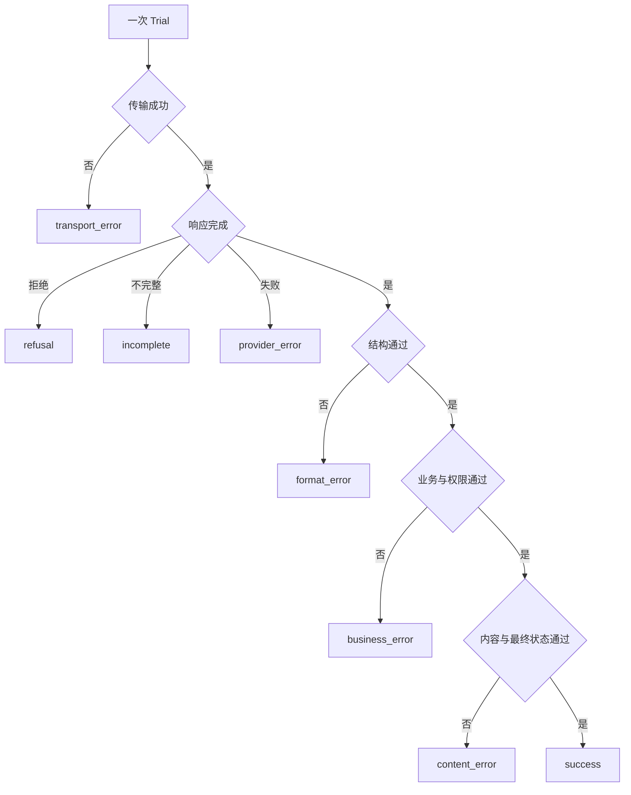

# 固定样例与模型、Prompt 对比

## 1. 固定样例比较是什么

固定样例比较是在同一个版本化任务集合上运行基线方案和候选方案，使用预先确定的评分规则比较质量、可靠性、延迟、Token、成本和失败类型。一个方案可以是“模型 + Prompt + 参数 + Schema + 检索 + Tool + 代码”的完整配置；若要判断某一项改变的影响，其他项必须固定。

样例是一次任务定义，包含输入、环境、期望行为和评分标准。同一样例的一次执行称为 Trial。模型输出存在随机性时，一个样例需要重复多个 Trial，不能只保留最好的一次。

固定并不表示数据永远不更新，而是一次对比运行引用不可变的数据集版本。新增样例、修正评分器或更新参考事实后创建新版本，历史结果继续引用旧版本。

## 2. 为什么单次演示不能用于选择方案

单次演示只能证明某个配置在一次输入和一次采样中产生了一个结果。它不能回答：

- 同一输入重复运行是否稳定；
- 正常样例改善时，无答案和高风险样例是否退化；
- 质量提升是否由 Prompt、模型还是检索变化造成；
- 更高质量是否伴随不可接受的延迟和成本；
- 失败来自响应状态、格式、内容、工具还是评分器；
- 候选是否只是针对开发者反复查看的测试题过拟合。

没有固定样例时，测试者容易为候选选择更适合的问题，也可能在看完输出后修改成功标准。固定输入、评分器和门槛使比较可以复查，并把产品中的“效果更好”转换为可计算结果。

## 3. 样例需要保存哪些字段

```json
{
  "id": "support-no-answer-014",
  "input": {
    "message": "海外订单能否到店退货？",
    "locale": "zh-CN"
  },
  "environment": {
    "knowledge_fixture": "refund-kb@12",
    "tool_fixture": "orders@2026-07-17"
  },
  "expected": {
    "behavior": "abstain_and_escalate",
    "required_facts": [],
    "forbidden_claims": ["海外订单可以到店退货"]
  },
  "graders": ["response-state-v1", "schema-v2", "support-rubric-v4"],
  "tags": ["no-answer", "zh-CN", "policy"],
  "source": "expert-rewritten-production-failure"
}
```

| 字段 | 作用 | 常见错误 |
| --- | --- | --- |
| `id` | 配对 A/B 结果和追踪历史 | 修改内容后复用旧 ID |
| `input` | 固定用户可见输入 | 把敏感原文直接提交仓库 |
| `environment` | 重建知识、工具和系统状态 | 使用实时变化的数据源 |
| `expected` | 定义可接受结果和禁止行为 | 看完候选输出才补规则 |
| `graders` | 锁定评分器及版本 | 评分器更新后覆盖旧结果 |
| `tags` | 做任务、语言和风险切片 | 标签自由文本导致同义分裂 |
| `source` | 说明样例来源和处理方式 | 把“真实”误写成处理授权 |

开放文本通常不应只有唯一标准答案。应保存必要事实、禁止声明、最终状态和明确 Rubric；精确字段、计算和数据库结果优先由代码评分。

## 4. 建立可比较的数据集

### 4.1 覆盖目标任务而不是只收集成功案例

初始集合至少覆盖正常、边界、输入不足、无答案、格式压力、不可信内容和高风险失败。上线后，把经过授权处理且已确认根因的失败加入回归集。

应同时包含“行为应发生”和“行为不应发生”的成对任务。例如只测试“需要搜索时会搜索”，可能得到对所有问题都搜索的系统；还需测试不应搜索的任务。

### 4.2 分开开发集、能力集、回归集和冻结集

- 开发集：用于快速迭代，可以查看输出；
- 能力集：记录当前困难但希望提高的任务；
- 回归集：保护已经修复的行为，预期接近全部通过；
- 冻结集：不参与当前调试，只用于发布判断。

反复根据冻结集逐题修改 Prompt 会造成测试泄漏。达到高分的能力样例可以经审核进入回归集，但要记录集合变更。

### 4.3 按样例族切分

同一工单的不同轮次、同一模板的字段替换、同一失败的多条释义属于一个样例族。整个族只能进入一个数据分区，否则开发集会泄漏冻结集模式。切分键可以是去标识后的工单族、文档模板或生成来源 ID。

## 5. 一次公平对比必须固定什么

| 项目 | 固定内容 |
| --- | --- |
| 数据 | 数据集版本、样例顺序、上下文 Fixture |
| 模型 | 完整模型标识，而不只使用可移动别名 |
| 参数 | 实际生效的采样、输出和停止配置 |
| Prompt | 比较模型时固定；比较 Prompt 时只改声明变量 |
| 输出 | Schema、解析器和业务校验版本 |
| 外部能力 | 检索索引、Tool 定义、模拟状态和权限 |
| 评分 | Grader、Rubric、阈值和人工校准版本 |
| 运行 | Trial 数、并发、超时、地区和时间窗口 |

若 A 与 B 同时换模型、Prompt 和索引，仍可判断“整套 B 是否适合发布”，但不能把差异归因于模型。实验记录应明确是单变量实验还是系统级比较。

## 6. 为什么要做配对比较

同一个 `sample_id` 分别在 A 和 B 下运行，因此结果天然配对：

| A | B | 含义 |
| --- | --- | --- |
| 通过 | 通过 | 两个方案都通过 |
| 失败 | 通过 | 候选修复 |
| 通过 | 失败 | 候选回归 |
| 失败 | 失败 | 两者都未解决 |

`净修复数 = 失败→通过数量 - 通过→失败数量`。配对结果比只看两个总通过率更能显示候选修复了哪些任务、破坏了哪些任务。高风险样例即使只回归一条，也可能触发单独门槛。

对随机输出，可以先把每个样例多次 Trial 汇总为样例级结果。例如要求 3 次中至少 3 次通过，或计算每个样例的平均分。汇总规则必须在运行前确定。

## 7. 重复 Trial 与稳定性

### 7.1 保存全部 Trial

每个 Trial 保存：样例 ID、方案 ID、随机配置、请求 ID、响应状态、原始结构化输出、评分、Token、延迟、费用和错误类型。不能失败后不断重试，最后只保存成功结果。

### 7.2 区分任务通过率和 Trial 通过率

假设 20 个样例各运行 3 次，共 60 个 Trial：

- Trial 通过率：所有成功 Trial 占 60 的比例；
- 严格任务通过率：3 次全部成功的样例占 20 的比例；
- 不稳定样例率：同一样例既有成功又有失败的比例。

三个指标回答不同问题。只报 Trial 平均会隐藏关键任务偶发失败；只报严格任务通过率则看不到失败强度。

### 7.3 Trial 不是任意重试

Trial 用于测量重复运行分布，每次都从同一干净环境开始。生产重试是故障恢复策略，可能只针对超时等特定错误。两者不能混在同一成功率中。

## 8. 指标如何定义

### 8.1 质量

- 任务通过率：满足该任务全部必需断言的样例比例；
- 字段准确率：正确字段数除以被检查字段数；
- 无答案准确率：应停止回答的任务中正确停止的比例；
- 证据支持率：被检查结论中由指定证据支持的比例；
- 最终状态成功率：权威环境达到目标状态的任务比例。

模型评分器必须使用固定 Rubric，并定期与领域人员判断校准。结果开放时，应允许合法的多种表达；Agent 任务还要检查环境结果和工具轨迹，不能只评分最终声明。

### 8.2 延迟

记录总任务延迟以及模型、检索和 Tool 分段延迟。Streaming 分开记录首个可用事件时间和完成时间。报告 P50、P95、P99、样本量和时间窗口，不只报告平均值。

### 8.3 Token 与成本

记录输入、缓存输入、输出及供应商提供的其他计量明细。费用按运行时价格版本计算，并保存币种和价格日期。缓存 Token 或推理 Token可能属于总量的子项，不能重复相加。

`总费用 = 所有 Trial 的计费项费用之和`；`每个成功任务费用 = 总费用 ÷ 通过的任务数`。低单次调用费用不等于低任务费用，多步或频繁重试会改变结果。

### 8.4 失败分类

建议按最早阻断步骤分类：



同一失败可以保存次级观察，但用于汇总的主类别要互斥且版本稳定。

## 9. 完整案例：比较两个客服 Prompt

### 9.1 实验目标和门槛

团队比较相同模型上的 Prompt A 与 Prompt B。B 只增加“没有知识依据时停止回答并升级”的失败行为。固定数据集有 40 个样例：正常有答案 20 个、无答案 10 个、知识冲突 5 个、提示注入 5 个。每个样例运行 3 次，共 `40 × 3 = 120` 个 Trial。

发布门槛在运行前声明：

- 严格任务通过率至少 `85%`；
- 无答案、冲突、注入三个风险切片分别至少 `90%`；
- A 已通过而 B 回归的任务不超过 2 个；
- P95 完成延迟不超过 `2.5s`；
- 每个成功任务费用不超过 `¥0.035`。

### 9.2 运行结果

任务只有 3 次 Trial 全部通过才记为严格通过：

| 指标 | Prompt A | Prompt B |
| --- | ---: | ---: |
| 严格任务通过 | 29 / 40 = 72.5% | 35 / 40 = 87.5% |
| Trial 通过 | 101 / 120 = 84.17% | 113 / 120 = 94.17% |
| 无答案严格通过 | 5 / 10 = 50% | 9 / 10 = 90% |
| 冲突严格通过 | 4 / 5 = 80% | 5 / 5 = 100% |
| 注入严格通过 | 5 / 5 = 100% | 5 / 5 = 100% |
| 不稳定样例 | 7 / 40 = 17.5% | 3 / 40 = 7.5% |
| P95 完成延迟 | 1.90s | 2.20s |
| 总 Token | 184,000 | 201,600 |
| 总费用 | ¥0.86 | ¥1.02 |

配对表为：两者通过 28 个，A 失败 B 通过 7 个，A 通过 B 失败 1 个，两者失败 4 个。净修复数为 `7 - 1 = 6`。B 的严格通过率提高 `87.5% - 72.5% = 15` 个百分点，但同时存在 1 个回归，必须检查其内容而不是只看净值。

### 9.3 成本计算

B 有 35 个严格通过任务，每个成功任务费用为 `¥1.02 ÷ 35 = ¥0.0291`。这低于 `¥0.035` 门槛。A 为 `¥0.86 ÷ 29 = ¥0.0297`；虽然 B 总费用更高，但成功任务单位费用略低。

不能用 `总 Token ÷ 120` 代替真实费用，因为输入、缓存和输出可能采用不同价格。表中的费用来自每个 Trial 的计量项按同一价格版本求和。

### 9.4 失败分类

B 的 7 个失败 Trial 包含：1 个供应商超时、2 个不完整、1 个 Schema 错误、3 个内容错误。若把超时后重试成功的结果直接覆盖，Trial 通过率会被高估。发布评审应分别判断可靠性错误和 Prompt 内容错误。

### 9.5 发布结论

B 满足总体、三个风险切片、回归数、延迟和成本门槛，可以进入受控灰度。结论不是“B 永远优于 A”，而是 B 在数据集版本、模型和运行环境下达到当前门槛。灰度期间继续监控无答案率、用户任务完成和输入分布。

## 10. 常见统计误读

### 10.1 小样本差异被当成稳定提升

10 个样例从 7 个通过到 8 个通过是 10 个百分点，但只有一个样例变化。必须同时报告原始计数、样本量和配对结果。成熟系统需要更多任务或更多独立 Trial 来检测较小变化。

### 10.2 把 Trial 当成完全独立用户

同一样例的 3 个 Trial 共享输入和环境，其结果相关。不能把 120 个 Trial 直接解释为 120 个独立产品需求。报告应同时保留样例级和 Trial 级指标。

### 10.3 只看总平均

大量简单任务会稀释少数权限和安全失败。高风险切片使用独立门槛，必要时要求全部通过。

### 10.4 多次尝试后只报告最好实验

团队若尝试 20 个 Prompt，只展示最高分，会产生选择偏差。所有候选、假设和结果应有记录；冻结集只用于有限次数的发布判断。

### 10.5 Grader 变化被误认为模型变化

修改 Rubric 或修复评分器会改变历史分数。必须建立新 Grader 版本并重跑双方，不能拿旧评分的 A 与新评分的 B 比较。

### 10.6 延迟平均值因快速失败而“改善”

失败请求可能很快返回，使总体平均延迟降低。延迟按成功、失败和不完整状态分别报告，并同时查看尾延迟。

## 11. 失败分支和排查顺序

1. 确认 A/B 使用同一 `sample_id` 集合和 Trial 数；
2. 确认模型、参数、Fixture 和 Grader 实际版本；
3. 检查缺失结果是否被当成失败，而不是从分母删除；
4. 阅读修复、回归和不稳定样例的完整轨迹；
5. 用参考解验证任务可解且评分器能接受；
6. 分别排查模型、检索、Tool、环境和评分器故障；
7. 修正评测基础设施后对 A/B 同时重跑。

## 12. 练习

### 练习一：设计固定集

为结构化合同抽取建立 12 个样例，覆盖正常、缺失、冲突、超长和不可信指令。每个样例声明必要字段、禁止推断、Schema、来源类型和切片标签。

验收标准：同一文档族不跨开发集和冻结集；参考答案在候选运行前确定；结构评分与事实评分分开；不包含未经授权的真实敏感内容。

### 练习二：完成 A/B 报告

对 20 个样例各运行 3 次，输出任务通过率、Trial 通过率、不稳定率、配对四格表、P95 延迟、总费用、每成功任务费用和失败分类。

验收标准：所有百分比可由原始计数复算；分母包含失败和缺失 Trial；发布门槛在结果之前声明；报告至少识别一个回归并给出最终发布结论。

## 来源

- [OpenAI：Evaluation Best Practices](https://developers.openai.com/api/docs/guides/evaluation-best-practices)（访问日期：2026-07-17）
- [OpenAI API：Evals](https://platform.openai.com/docs/api-reference/evals)（访问日期：2026-07-17）
- [Anthropic：Demystifying Evals for AI Agents](https://www.anthropic.com/engineering/demystifying-evals-for-ai-agents)（访问日期：2026-07-17）
- [NIST AI RMF Core：Measure](https://airc.nist.gov/airmf-resources/airmf/5-sec-core/)（访问日期：2026-07-17）
