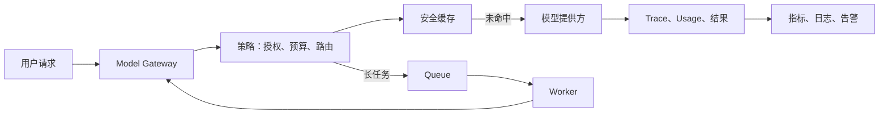
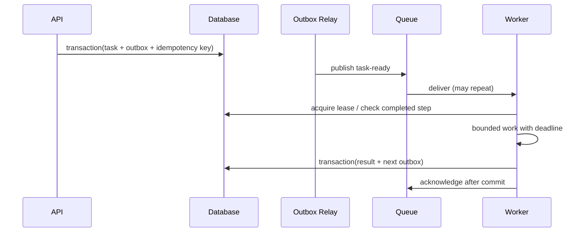

# AI 生产工程：模型网关、缓存队列、可观测性与可靠性

生产级 AI 服务的目标不是“成功调用一次模型”，而是在模型、网络、队列、工具和依赖服务都会失败的前提下，仍然给用户一个可解释、可恢复、可计量的结果。模型网关负责把厂商差异隔在业务之外；缓存和队列负责控制重复计算与长任务；可观测性回答一次结果是怎样产生的；可靠性机制限制局部故障扩大为全站故障。

本文把阶段九的四组能力放在同一条请求链路中：它们共享请求身份、权限、预算、幂等键和状态事实，拆开实现会留下无法追踪的失败边界。



## 1. 先定义生产请求合同

每次模型请求至少要有以下稳定字段。它们不是为了记录更多日志，而是让授权、成本归属、回放、告警和删除请求能指向同一个对象。

| 字段 | 作用 | 不能替代它的字段 |
| --- | --- | --- |
| `requestId` | 一次 API 调用的唯一标识 | 用户 ID；同一用户可发多个请求 |
| `traceId` | 跨网关、检索、工具和 Worker 的链路标识 | 请求 ID；重试可有多个请求 ID |
| `tenantId` | 隔离和成本归属的安全边界 | 组织名称；名称可以变更 |
| `operation` | 业务意图，如 `answer_with_docs` | 模型名称；模型不是业务能力 |
| `idempotencyKey` | 防止写操作或入队重复执行 | `requestId`；重试通常会生成新的请求 ID |
| `policyVersion` | 路由、预算、数据规则的版本 | 部署版本；策略可独立发布 |
| `promptVersion` | 可重放的指令模板版本 | 最终 Prompt 文本；后者可能含敏感数据 |
| `deadlineAt` | 整条链路的绝对截止时间 | 单个 SDK timeout |

`deadlineAt` 由入口计算并向下游传递。每一跳使用“剩余时间减去安全余量”作为自己的 timeout；不能让网关等 30 秒、检索再等 30 秒、工具又等 30 秒。

```json
{
  "requestId": "req_01JZP3",
  "traceId": "trace_b8f2",
  "tenantId": "tenant_acme",
  "operation": "support_answer",
  "idempotencyKey": "chat_882:turn_14",
  "deadlineAt": "2026-07-23T10:00:12.000Z",
  "policyVersion": "routing-2026-07-20",
  "promptVersion": "support-v24"
}
```

入口必须在调用模型前完成身份认证、租户授权、输入大小限制、配额检查和敏感数据处理。模型供应商返回成功，不等于业务请求获准成功。

## 2. 模型网关：统一能力而非抹平差异

网关提供业务需要的稳定操作，例如生成、流式生成、向量化、结构化输出和工具调用。它把厂商请求体、流协议、错误码和用量字段转换为内部合同，但不假装所有模型具备相同能力。

```ts
type GenerationRequest = {
  operation: "support_answer" | "extract_invoice";
  messages: Array<{ role: "system" | "user" | "assistant"; content: string }>;
  responseSchema?: Record<string, unknown>;
  tools?: ToolDefinition[];
  deadlineAt: string;
  tenantId: string;
  traceId: string;
};

type GenerationResult = {
  status: "completed" | "partial" | "refused" | "failed";
  text: string;
  structured?: unknown;
  finishReason: "stop" | "length" | "tool_calls" | "content_filter" | "error";
  usage: { inputTokens?: number; outputTokens?: number; estimatedCostUsd?: number };
  provider: { name: string; model: string; requestId?: string };
};

interface ModelGateway {
  generate(request: GenerationRequest, signal: AbortSignal): Promise<GenerationResult>;
  stream(request: GenerationRequest, signal: AbortSignal): AsyncIterable<StreamEvent>;
  embed(input: { texts: string[]; tenantId: string }): Promise<number[][]>;
}
```

内部合同应保留：模型标识、完成原因、提供方请求 ID、已知与未知的 usage、可重试分类和能力声明。`usage` 可能在流结束时才完整出现；“没有 usage”应是明确状态，不能伪造为 0。

### 路由决策

模型选择是受约束的策略函数，不是把“最强模型”写死。候选模型必须先满足数据驻留、允许的模态、上下文长度、结构化输出能力和租户策略；再在合格集合内比较预先测得的质量、目标延迟、预测 Token 和价格。

```ts
function chooseModel(input: {
  needsVision: boolean;
  needsJsonSchema: boolean;
  inputTokens: number;
  deadlineMs: number;
  dataClass: "public" | "internal" | "restricted";
}): "fast-text" | "reasoning-text" | "vision-json" {
  if (input.needsVision && input.needsJsonSchema) return "vision-json";
  if (input.dataClass === "restricted") return "reasoning-text";
  if (input.inputTokens > 80_000 || input.deadlineMs > 8_000) return "reasoning-text";
  return "fast-text";
}
```

这段代码只演示决策形状。生产策略还要从受版本控制的能力目录读取上下文上限、区域、价格、健康度和禁用状态；不能仅按模型名称推断能力。

### Fallback 的限制

Fallback 只能发生在等价或可接受降级的操作上。文本摘要可从同区域的模型 A 降级到模型 B；要求严格 JSON 的写库操作不能在 Schema、授权或安全策略不等价时静默切换。任何 fallback 都要写入 trace，并向上游返回实际模型和降级状态。

## 3. 缓存：复用结果，但不跨越权限和新鲜度

缓存保存的是某个输入和授权语境下的派生结果。键必须包含租户、操作、模型或策略版本、可见数据版本和规范化输入；只以用户问题做 key 会把一个用户或租户的结果泄露给另一个人。

| 类型 | 键的核心组成 | 适用场景 | 主要风险 |
| --- | --- | --- | --- |
| Exact cache | 完整规范化输入 + 策略版本 | 固定抽取、相同请求重试 | 忽略权限或知识版本 |
| Semantic cache | 租户范围 + embedding + 相似度阈值 | 可容忍措辞变化的 FAQ | 相似不等于同一问题 |
| Retrieval cache | 查询、过滤器、索引版本 | 短时间内重复检索 | 文档更新后过期 |
| Tool-result cache | 工具参数、主体、资源版本 | 可安全复用的只读工具 | 把动态事实当静态事实 |
| Prefix cache | 相同前缀的模型计算状态 | 提供方或本地推理支持时 | 依赖具体实现和会话隔离 |

缓存命中也要重新做授权。缓存层不能成为绕过资源权限的后门。

### 案例一：知识库问答的检索缓存

输入：`“差旅报销的住宿上限是多少？”`，用户属于 `tenant_acme` 的中国区财务组，知识库索引版本为 `kb-2026-07-21`。

处理：

1. 入口授权得出可访问的 `policy_region=CN`、`department=finance`。
2. 查询规范化后连同过滤条件、索引版本和租户写入 key。
3. 缓存未命中时执行 hybrid retrieval，缓存候选文档 ID、分数和索引版本，而不是缓存跨用户可见的全文。
4. 生成前再次按当前身份检查每个文档 ID；权限被撤销的文档被剔除。
5. 文档发布事件使受影响的索引版本失效，或使用短 TTL 等待重建完成。

输出验证：trace 应同时看到 `retrieval.cache=miss/hit`、`indexVersion`、过滤条件摘要和最终引用 ID。权限测试中，换成普通员工身份必须没有财务政策片段。

失败分支：若索引版本推进而旧缓存仍命中，回答可能引用已废止政策。修复是将索引版本放入 key，并在删除或紧急撤回时主动失效；仅提高 TTL 不会解决版本错配。

### 案例二：只读订单工具结果缓存

`get_order_status(orderId)` 的安全 key 至少包含租户、授权主体、订单 ID、字段投影和订单 `updatedAt` 或短 TTL。它不能用于 `create_refund`、库存扣减或付款，因为写操作必须由服务端在每次请求中执行幂等与状态校验。

当订单状态从 `paid` 变为 `shipped` 时，事件消费者删除该订单相关 key；即使删除消息丢失，30 秒 TTL 也限制陈旧窗口。返回值附带 `observedAt`，让上游能识别“缓存中的最近观察”不是实时承诺。

## 4. Queue：把可等待工作从同步路径移走

文档解析、批量 embedding、批量生成、长 Agent 任务应进入队列。数据库保存事实，队列只负责通知和调度；常见队列提供至少一次投递，因此消费者必须能处理重复消息。



### 队列合同与幂等

```json
{
  "messageId": "msg_01JZP9",
  "kind": "embedding-batch-requested",
  "taskId": "task_ingest_42",
  "stepId": "step_embed_003",
  "tenantId": "tenant_acme",
  "attempt": 1,
  "notBefore": "2026-07-23T10:03:00Z",
  "deadlineAt": "2026-07-23T10:13:00Z"
}
```

Worker 先用 `stepId` 获取或创建执行记录，再获取租约；已成功的步骤直接返回已保存结果。外部写入使用服务端生成的幂等键。确认消息必须在结果事务提交后执行，否则“先确认、后崩溃”会丢任务。

重试仅用于暂时性、幂等且还有剩余 deadline 的失败，例如 429、连接重置、可确认的 5xx。退避要加入 jitter，避免大量 Worker 同时重试；达到次数或遇到永久错误后进入死信队列，并生成可审计的人工处理项。死信队列不是终点：必须有分类、修复、重放前验证和过期删除流程。

取消是持久化的 `desiredState=cancelled`。Worker 在每个模型调用、工具调用和批次提交前检查它；已经提交到外部系统的副作用要记录补偿或人工处理路径，不能假称“取消后一定没有发生”。

## 5. 可观测性：从一次答案追到每个决定

日志记录离散事件，指标聚合趋势，trace 保留一次请求的因果路径。三者互补：只看平均延迟找不到慢请求；只看 trace 看不出错误率趋势；只存完整 Prompt 会形成隐私风险。

| Span / 事件 | 必要字段 | 不应默认记录 |
| --- | --- | --- |
| gateway.request | trace、tenant、operation、policy、deadline | 原始用户全文 |
| model.call | provider、model、attempt、TTFT、duration、finish reason、usage | Secret、完整输出 |
| retrieval | index version、filter 摘要、topK、命中数、分数分布 | 无授权的文档正文 |
| tool.call | 工具名、参数摘要、授权决策、结果码、幂等键 | 凭据和敏感字段 |
| queue.step | task/step、attempt、lease、状态、耗时 | 大型 artifact |

TTFT（time to first token）从网关开始接收请求到第一个可展示 token 的时长；总时长从同一开始点到终态。流式回答只记录总时长会掩盖首屏很慢的问题。成本必须标识为供应商返回、价格表估算或未知，且价格表版本可追溯。

```ts
const span = tracer.startSpan("model.generate", {
  attributes: {
    "ai.operation": request.operation,
    "ai.model": selected.model,
    "ai.tenant_hash": hash(request.tenantId),
    "ai.prompt_version": request.promptVersion,
  },
});
try {
  const result = await client.generate(request, signal);
  span.setAttribute("ai.finish_reason", result.finishReason);
  span.setAttribute("ai.usage.input_tokens", result.usage.inputTokens ?? -1);
  return result;
} catch (error) {
  span.recordException(error as Error);
  throw error;
} finally {
  span.end();
}
```

生产中应使用受审计的字段白名单和脱敏器，而不是相信开发者每次都不会把正文放入 attribute。需要调试完整内容时，保存到权限隔离、短保留期的证据库，并在 trace 中只保留引用。

## 6. 可靠性机制的适用边界

| 机制 | 解决的问题 | 错误用法 |
| --- | --- | --- |
| Timeout | 限制等待和资源占用 | 用固定大 timeout 代替端到端 deadline |
| Exponential backoff + jitter | 降低瞬时故障时重试碰撞 | 对 4xx、无幂等写操作无限重试 |
| Circuit breaker | 依赖持续失败时快速隔离 | 把业务拒绝当成依赖故障 |
| Rate limit | 保护租户、服务和供应商配额 | 只在前端按钮上限制 |
| Fallback | 在已定义的等价降级内保持服务 | 静默换成权限或能力不等价模型 |
| Partial success | 返回已验证的完成部分 | 把半截或未校验结果标为完成 |

Circuit breaker 通常有 closed、open、half-open 三态。连续错误或延迟异常达到阈值后 open，短时间内直接返回受控降级；冷却后只允许少量 half-open 探测请求。阈值应按操作和依赖配置，不能所有模型共用一个全局开关。

### 案例三：流式客服回答遇到提供方限流

约束：响应必须在 8 秒内给出首 token，供应商返回 429，已有检索证据，不能丢失用户会话。

处理：

1. 网关读取剩余 deadline；若不足以等待，不进行重试。
2. 若响应含明确可等待时间且预算仍足够，按限流提示加随机抖动重试一次。
3. 仍失败时，选择已批准的同区域 fallback；trace 标记 `fallback_reason=provider_rate_limit`。
4. fallback 不支持相同结构化能力时，返回明确的 `temporarily_unavailable`，而不是将自由文本写入下游数据库。
5. 已生成的、通过完整性校验的段落可以标记为 partial，并提供“继续”操作；未闭合 JSON 和未验证工具结果不交付。

验证：压测中检查 429 峰值时重试请求不会同步成尖峰、TTFT 分位数有上升但不会无限等待、每个 partial 都能追到 provider attempt。恢复后比较任务完成率、成本和 fallback 比例。

## 7. 生产边界与发布检查

网关不是授权中心，缓存不是数据库，队列不是事务日志，trace 不是无限期数据仓库，fallback 不是质量保证。以下控制必须在模型外确定执行：资源授权、写操作确认、业务不变量、账务结果、数据保留和删除。

上线前至少验证：

- 同租户和跨租户缓存命中行为；权限变化后的二次授权。
- 供应商超时、429、5xx、流中断和 usage 缺失。
- Queue 重复投递、Worker 崩溃、死信、恢复和取消竞争。
- 模型切换时结构化输出、工具权限、引用和评估集是否仍通过。
- 每个告警是否能由 trace 找到模型、Prompt、上下文、检索或 Tool 步骤。
- 成本、Token、延迟和错误按 tenant、operation、model 维度可查询。

## 8. 综合练习：可恢复的文档问答服务

实现一个“上传政策文档后问答”的最小生产闭环。

验收标准：

1. 上传解析和 embedding 进入队列；重复消息不会产生重复索引。
2. 查询网关记录 trace、索引版本、模型、Prompt 版本、TTFT、总时长和 usage 状态。
3. 检索缓存 key 含 tenant、权限过滤和索引版本；改动文档后旧结果不可复用。
4. 429、超时和 Worker 崩溃各有可观察的受控结果；无剩余 deadline 时不重试。
5. 跨租户、撤销权限、重复入队和取消任务的测试全部通过。
6. 任意一条用户回答都能从 `traceId` 定位到选用模型、检索结果和完成原因，不暴露正文或凭据。

## 来源

- [OpenTelemetry Specification：Trace、Span 与语义约定](https://opentelemetry.io/docs/specs/otel/)（访问日期：2026-07-23）
- [AWS Builders' Library：Timeouts、retries 与 backoff with jitter](https://aws.amazon.com/builders-library/timeouts-retries-and-backoff-with-jitter/)（访问日期：2026-07-23）
- [OpenAI API：生产最佳实践与 rate limits](https://platform.openai.com/docs/guides/rate-limits)（访问日期：2026-07-23）
- [Hugging Face Transformers：KV Cache 策略](https://huggingface.co/docs/transformers/kv_cache)（访问日期：2026-07-23）
