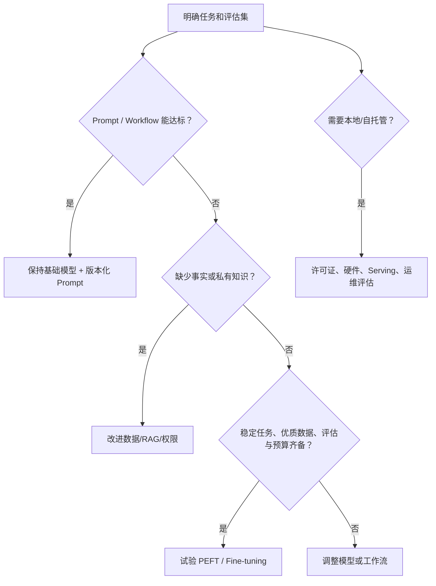
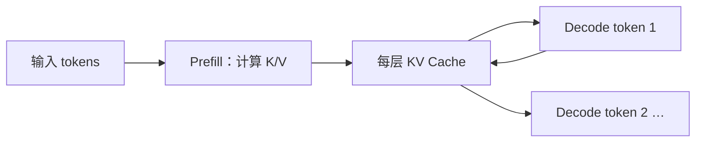

# 进阶选修：开源模型本地推理与 Fine-tuning 决策

开源模型、本地推理和 Fine-tuning 都是实现路径，不是默认升级路线。它们适用于数据边界、定制能力、离线可用性、吞吐可控性或长期单位成本等约束明确的场景；也同时引入显存规划、服务运维、许可证、模型安全、训练数据治理和更严格的评估责任。

本章先建立“是否需要本地化或训练”的决策门，再分别说明本地推理的资源与服务机制、量化和 KV Cache 的取舍，以及 Fine-tuning 的数据、训练、评估和发布闭环。



## 1. 决策边界：不要用训练修复错误的问题

Fine-tuning 改变模型参数对输入分布的响应方式；它不会自动获得最新事实、绕过资源权限、修复错误检索或替代确定性业务规则。先对真实任务建立包含正常、边界、无答案、权限和安全样例的评估集，再比较方案。

| 问题信号 | 优先方案 | 不应直接选择 Fine-tuning 的原因 |
| --- | --- | --- |
| 输出格式偶尔失效 | Schema、运行时校验、重试 | 格式属于接口合同，仍需代码验证 |
| 回答缺少最新政策 | RAG 与版本/权限过滤 | 权重无法保证实时知识 |
| 需要查订单或执行动作 | Tool 与服务端授权 | 训练不能授予安全能力 |
| 固定分类/风格在大量样例上不稳定 | 评估后尝试 PEFT | 可能受益于稳定任务分布 |
| 外网或数据驻留不允许 | 本地/受控部署评估 | 仍需模型许可证与运维控制 |
| 单位调用成本/延迟长期超标 | 路由、缓存、批处理、本地 serving | 先量化总成本与质量损失 |

“模型更懂业务”不是验收条件。应该定义准确率、任务完成率、格式通过率、拒答质量、延迟、吞吐、GPU 利用率、每任务成本和安全回归结果。

## 2. 开源模型与本地推理的组成

本地推理通常包含模型权重、tokenizer、推理运行时、硬件驱动、调度器、API 服务、可观测性和访问控制。下载到本机不等于离线或安全：运行时可能拉取远程代码、遥测、依赖或模型更新；部署流程应显式锁定版本、校验哈希并控制出站网络。

| 组件 | 作用 | 需要验证的边界 |
| --- | --- | --- |
| Model weights | 参数和架构配置 | 模型版本、哈希、许可证、允许用途 |
| Tokenizer | 文本到 token 的映射 | 与权重匹配、特殊 token、语言覆盖 |
| Runtime | 调度、kernel、采样、KV 管理 | 支持的硬件、精度、并发和错误模型 |
| Serving API | 鉴权、队列、流式响应、限流 | 不把裸端口暴露给不可信网络 |
| GPU/CPU memory | 权重、KV cache、激活和临时空间 | 峰值而非只算权重大小 |
| Registry | 产物、adapter、配置、回滚 | 不可变版本、签名/校验与访问权限 |

### 显存与吞吐的基本关系

推理显存至少包含权重、KV Cache、运行时工作区和碎片余量。权重精度影响静态占用；上下文长度和并发数主要推动 KV Cache 增长。不能只用“参数量 × 量化 bit”预算后就把剩余显存全部给并发请求。

生成阶段通常分为 prefill 和 decode。prefill 处理完整输入，计算量大但可批量；decode 每步只生成少量 token，受内存访问和 KV Cache 影响。吞吐应分开报告输入 token/s、输出 token/s、并发、TTFT、端到端延迟和排队时间；只报“每秒 token”没有可比较意义。

```text
端到端时长 = 排队等待 + prefill + 首 token 等待 + decode + 后处理
每任务总成本 = 硬件/托管成本 + 能耗 + 运维 + 失败重试 + 许可证/合规成本
```

## 3. 量化：以数值精度换资源，而不是免费压缩

量化用较低精度表示权重、激活或 KV Cache，以减少存储和带宽。不同运行时、模型架构和硬件支持不同格式；4-bit、8-bit 等名字不能直接推导质量、速度或兼容性。

| 选择 | 常见收益 | 常见代价 | 验证方法 |
| --- | --- | --- | --- |
| 低比特权重 | 减少权重显存和加载带宽 | 质量或 kernel 兼容性变化 | 固定评估集 + 真实硬件 benchmark |
| 低精度计算 | 利用硬件吞吐 | 数值稳定性、硬件依赖 | 训练/推理分别测试 |
| Quantized KV Cache | 长上下文时降低 Cache 占用 | 额外量化开销和可能的延迟下降 | 长上下文、并发、TTFT 对比 |
| CPU offload | 小 GPU 下避免 OOM | 传输导致时延上升 | 峰值内存与 P95/P99 延迟 |

Hugging Face 的 Cache 文档明确指出：KV Cache offload 以速度交换 GPU 内存，量化 Cache 在上下文较短且显存充足时可能伤害延迟。因此量化配置必须与目标上下文长度、并发和 SLA 一起测试，不能只以“模型成功加载”作为通过。

## 4. KV Cache：为什么长上下文和并发会吃掉内存

自回归 Transformer 在生成第 `t` 个 token 时，需要访问此前 token 的 attention key/value。KV Cache 保存这些中间状态，避免每一步重新计算整段前缀。它降低重复计算，却随序列长度、层数、隐藏维度和并发请求增长。



KV Cache 的生命周期必须绑定到会话、请求和租户。会话取消、超时、断开和模型切换都要释放或回收对应块；缓存复用必须保证相同模型、tokenizer、前缀和隔离语境。错误地跨用户复用前缀不仅会产生错误输出，也可能造成数据泄露。

### 案例一：受限 GPU 的内部摘要服务

约束：一张小 GPU、输入文档可能很长、目标是 30 秒内返回摘要、同一时刻只有少量员工。

1. 先测量未量化模型在 2k、8k、16k token 下的峰值显存、TTFT、总时长和质量集得分。
2. 设置每请求最大输入、输出 token 和并发上限；超出时排队或改为异步任务，不让 OOM 终止所有租户。
3. 若长上下文 OOM，分别实验 chunk + map-reduce、KV offload、quantized KV；记录哪一种满足质量与 SLA。
4. 对每个模型/量化产物锁定 tokenizer、runtime 和配置版本，结果 trace 记录实际版本。

验证：压测中注入长文档和取消请求，检查排队可见、OOM 不导致进程崩溃、取消后显存回落、P95 不越过 SLA。失败分支：只降低权重量化却忽略并发 KV Cache，负载高时仍 OOM；修复是按实际请求长度和并发设置 admission control。

## 5. Serving：Batch、调度与隔离

Batch 将多个请求合并，提高设备利用率，但会增加等待和尾延迟。动态或连续 batching 可以在生成过程中加入新请求，具体行为依赖运行时。调度策略至少考虑租户配额、请求大小、deadline、交互/批处理优先级和取消；不能让一个超长请求永久阻塞交互任务。

| 场景 | 调度倾向 | 原因 |
| --- | --- | --- |
| 交互式 chat | 小批、短队列、TTFT 优先 | 用户感知首 token |
| 夜间批量提取 | 大批、吞吐优先 | 可接受较长等待 |
| 长文档任务 | 分段、异步、严格预算 | 避免挤占 KV Cache |
| 多租户平台 | 每 tenant 并发/Token 配额 | 防止 noisy neighbor |

服务端仍需认证、授权、rate limit、输入限制、审计和内容处理。自托管 API 不应因为“模型在内网”而跳过这些控制；内网服务同样可能被横向调用或经 SSRF 访问。

## 6. 许可证与总持有成本

模型许可、权重访问条件、再分发限制、地区、商业用途和归属义务由具体模型卡或许可证定义，不能从“开源”一词推断。上线前将权重版本、许可证文本、用途判断、供应链来源和审核结论登记到模型目录。

总持有成本（TCO）不只含 GPU 单价：还包括容量闲置、峰值冗余、驱动和运行时升级、监控、on-call、漏洞修复、模型评估、数据处理、日志存储、合规和失败重试。与 API 方案比较时使用相同请求分布、SLA、质量门槛和人力成本，避免用理想吞吐对比按量付费账单。

## 7. Fine-tuning 的输入、输出与风险

Fine-tuning 用带标签样本更新全部或部分参数。它最适合任务定义稳定、输入输出模式重复、已有足量高质量代表样本且离线评估可证明收益的场景。训练集、验证集和测试集必须按真实泛化边界划分，避免同一文档、同一用户或近重复样本泄漏到测试集。

| 产物 | 必须包含 | 常见失败 |
| --- | --- | --- |
| 数据合同 | 来源、许可、主体、字段、标签定义、删除方式 | 把未经许可生产对话直接训练 |
| 训练集 | 输入、目标、质量规则、去重结果 | 标签互相矛盾或只含成功样本 |
| 验证/测试集 | 不参与训练的代表性任务 | 近重复泄漏导致虚高 |
| 训练配置 | 基座模型、tokenizer、方法、超参、随机种子 | 无法复现或恢复 |
| 模型卡/登记 | 版本、用途、限制、评估和安全风险 | 只发布权重不说明边界 |

训练可能提高某一任务，却损伤基础能力、安全行为或其他语言/领域表现。因此评估应同时包含目标任务、保留能力、拒答、权限、安全和格式回归；只看训练 loss 不能判断真实任务质量。

## 8. PEFT、LoRA 与全量训练的取舍

参数高效 Fine-tuning（PEFT）冻结大部分基座参数，只训练较少的 adapter 参数。LoRA 是常见的 adapter 方法：在特定线性层旁引入低秩可训练更新。它通常降低训练显存、检查点存储和多任务切换成本，但不保证在所有任务上等价于全量 Fine-tuning，也会引入 adapter 兼容、合并和推理开销问题。

| 方法 | 适用条件 | 优点 | 边界 |
| --- | --- | --- | --- |
| Prompt / few-shot | 基座已基本能完成 | 快、可审阅、无需训练 | 增加上下文成本，能力上限有限 |
| RAG / Tool | 缺少外部事实或确定性动作 | 数据新鲜、权限可控 | 检索和服务本身需要评估 |
| PEFT / LoRA | 稳定任务、资源有限、多 adapter | 训练参数和产物较小 | 仍需高质量数据和回归评估 |
| Full fine-tuning | 有强证据表明 adapter 不足且资源充足 | 表达能力更大 | 成本、遗忘、发布风险更高 |

Hugging Face PEFT 文档指出，adapter 训练只更新带 `requires_grad=True` 的参数，检查点通常保存 adapter 权重和配置而非整个基座模型。部署必须同时锁定基座模型修订、adapter、tokenizer 和推理配置；仅复制 `adapter_model` 不能构成可复现服务。

### 案例二：发票字段抽取的 PEFT 试验

约束：公司有授权的历史发票及人工校正标签；目标是稳定抽取 12 个字段；任何金额都必须通过规则校验；不能把客户 PII 泄漏进评估报告。

1. 先建立基线：基础模型 + 严格 JSON Schema + OCR 文本/RAG，记录字段级准确率、解析率、延迟和人工修正时间。
2. 以供应商、日期和模板族为单位划分数据，保证同一模板的近重复不泄漏到测试集。
3. 审核许可、最小字段、脱敏策略和删除机制；将数据版本哈希写入训练登记。
4. 用 LoRA 训练候选 adapter；保留学习率、rank、目标层、epoch、随机种子、基座 revision 和 tokenizer。
5. 在未见供应商、模糊 OCR、缺失字段和注入文本上比较基线与候选；金额、税号和日期仍由确定性校验器检查。
6. 只有目标指标提升且保留/安全评估不回退，才灰度发布；发布后将人工更正回流为待审核训练候选，而不是自动混入。

```python
from peft import LoraConfig, TaskType
from transformers import AutoModelForCausalLM

model = AutoModelForCausalLM.from_pretrained("base-model-revision", device_map="auto")
config = LoraConfig(
    task_type=TaskType.CAUSAL_LM,
    r=8,
    lora_alpha=16,
    lora_dropout=0.05,
    target_modules=["q_proj", "v_proj"],
)
model.add_adapter(config, adapter_name="invoice-extraction-v1")
```

代码只展示 adapter 配置，不代表可以直接投入训练。真实训练还要实现数据加载、损失掩码、checkpoint、评估、访问控制和硬件兼容性检查。

失败分支：测试集中混入同一供应商模板，离线字段准确率很高，发布后新模板失败。修复是按模板/供应商群组切分、增加未见分布测试，并把模板识别或 OCR 质量单独观测；增加训练 epoch 不能修复数据泄漏。

## 9. 训练与发布的恢复策略

训练作业应可从 checkpoint 恢复，checkpoint 与数据版本、代码 revision、基座模型、tokenizer、超参、优化器状态和随机数状态关联。恢复后先运行小规模评估确认产物一致，再继续长作业。不要把可变的 `latest` 基座模型或未固定的数据查询作为训练输入。

发布采用不可变模型/adapter 版本、评估报告、灰度流量、回滚目标和自动门禁。线上出现质量下降、OOM、许可证问题或安全回归时，路由应能立即回到已批准的基线；训练产物不能覆盖原版本。

## 10. 生产边界

本地运行不消除模型幻觉、提示注入、授权、备份、数据删除或业务不变量问题。Fine-tuning 不应承担事实更新、支付判断、权限决策或安全策略。所有方案仍需：结构化输出校验、服务端授权、工具影响确认、版本化评估、审计和成本/延迟监控。

选择本地/训练的最终依据是：在明确的约束和代表性评估集上，收益超过额外风险和总持有成本，并且团队能长期维护模型、数据与运行时版本。

## 11. 综合练习：部署与定制决策报告

为一个“内部政策分类与摘要”服务完成一份可执行决策报告和实验。

验收标准：

1. 列出 API、基础模型本地 serving、量化本地 serving、RAG 和 PEFT 五种候选，并用同一评估集比较质量、P95、吞吐和总成本。
2. 本地实验记录权重/许可证、tokenizer、runtime、硬件、量化、最大上下文、并发和 KV Cache 策略。
3. 压测至少包含短交互、长上下文、并发高峰、取消和 OOM 边界；能给出 admission control 与恢复行为。
4. 若尝试训练，数据按真实泛化边界切分，登记许可与删除方案，且测试集未参与任何调参。
5. 结构化输出、授权和引用仍在模型外验证；红队和质量回归不因本地化或训练而跳过。
6. 发布、灰度、回滚和模型/adapter 产物版本均可审计。

## 来源

- [Hugging Face Transformers：KV Cache 策略](https://huggingface.co/docs/transformers/kv_cache)（访问日期：2026-07-23）
- [Hugging Face PEFT：Parameter-efficient fine-tuning](https://huggingface.co/docs/transformers/peft)（访问日期：2026-07-23）
- [Hugging Face PEFT：方法概览](https://huggingface.co/docs/peft/main/methods/overview)（访问日期：2026-07-23）
- [Hugging Face：模型卡文档](https://huggingface.co/docs/hub/model-cards)（访问日期：2026-07-23）
