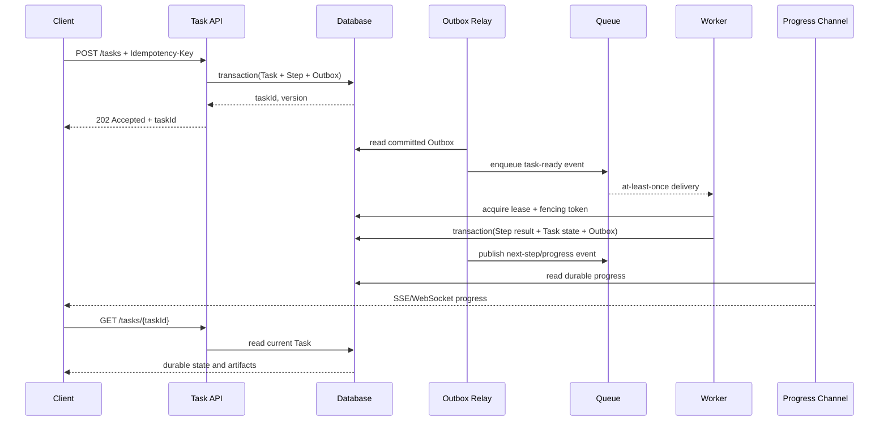
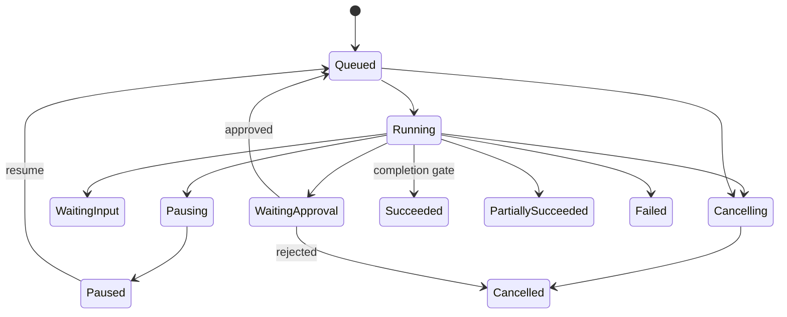

# Agent 长任务架构：持久化步骤、队列、Worker、进度与完成

Agent 长任务不能依赖一次 HTTP 连接或单个 Worker 进程存活。可靠架构把任务事实和步骤持久化到数据库，通过 Queue 通知 Worker，Worker 使用租约执行有限步骤，结果和进度重新写回数据库，并在完成 Gate 通过后进入终态。

```text
创建 Task
→ 数据库事务保存 Task + Outbox
→ Relay 投递 Queue
→ Worker 领取并获得 Lease
→ 持久化 Step 与 Artifact
→ Outbox 发布进度
→ 继续下一 Step / 等待审批
→ 完成 Gate
→ 数据库终态 + 完成事件
```

数据库是任务事实来源；Queue 是工作通知和负载缓冲，不是唯一状态存储。浏览器断线、Queue 重复投递、Worker 崩溃和服务重启都不应丢失任务。

## 前置知识与边界

前置阅读：

- [Agent 的暂停、取消、恢复、失败步骤与部分完成](03-pause-cancel-resume-and-partial-completion.md)。
- [防止 Agent 循环、重复操作与重试风暴](04-loop-duplicate-and-retry-storm-prevention.md)。
- [AI 任务状态机](../ai-ux/01-ai-task-state-machine.md)。
- [页面刷新后的长任务恢复](../ai-ux/08-long-task-refresh-recovery.md)。

适合进入长任务架构的工作：

- 超过同步请求 SLA。
- 包含多个模型或 Tool 步骤。
- 需要排队和限流。
- 会等待人工审批或用户输入。
- 需要跨进程恢复。
- 结果以 Artifact 交付。
- 需要逐步进度和审计。

简单且能在一个短请求内可靠完成的操作不需要 Queue 和 Worker。

## 责任边界

| 组件 | 负责 | 不负责 |
| --- | --- | --- |
| Task API | 创建、查询、取消、恢复请求 | 执行长步骤 |
| Database | Task、Step、Attempt、Artifact、Approval、Outbox | 消费任务 |
| Outbox Relay | 把已提交事件投递到 Queue | 判断业务完成 |
| Queue | 缓冲、投递、重投 | 保存完整业务事实 |
| Scheduler | 找到可运行 Step、优先级和预算 | 执行领域逻辑 |
| Worker | 执行一个有界 Step | 决定任意权限和终态 |
| Progress Projector | 把持久步骤投影成用户进度 | 以动画代替真实状态 |
| Completion Gate | 检查验收、审批和 Artifact | 仅凭模型自报完成 |

## 架构链路



进度推送是优化体验的通道。刷新后客户端始终通过 Task API 读取数据库状态恢复。

## Task 数据模型

```json
{
  "taskId": "task-podcast-812",
  "tenantId": "tenant-17",
  "createdBy": "user-91",
  "taskType": "podcast-processing",
  "taskVersion": "podcast-workflow-v6",
  "status": "queued",
  "desiredState": "running",
  "currentStage": "validate-media",
  "version": 1,
  "priority": "normal",
  "inputArtifactIds": ["upload-991"],
  "outputArtifactIds": [],
  "budget": {
    "maxCostUsd": 3,
    "deadlineAt": "2026-07-18T18:00:00Z"
  },
  "progress": {
    "completedUnits": 0,
    "totalUnits": null,
    "percent": null,
    "messageCode": "QUEUED"
  },
  "createdAt": "2026-07-18T16:00:00Z",
  "updatedAt": "2026-07-18T16:00:00Z"
}
```

关键字段：

- `taskId`：公开稳定身份。
- `tenantId/createdBy`：每次查询和操作都授权。
- `taskType/taskVersion`：恢复时使用同一流程合同。
- `status`：已持久化的实际状态。
- `desiredState`：用户希望 running/paused/cancelled。
- `version`：乐观并发控制。
- `currentStage`：用户可理解阶段，不是 Worker 内存位置。
- `budget`：运行时硬边界。
- `progress`：从持久步骤投影。

不要把完整 Prompt、Secret 或大型模型输出塞进 Task 行；使用受权限控制的 Artifact。

## Task 状态



状态进入条件由代码定义。`Succeeded` 不是 Worker 可直接提交的任意字符串。

## Step、Attempt 与 Artifact

Task 是用户目标；Step 是可恢复边界；Attempt 是一次执行。

```json
{
  "stepId": "step-transcribe-segment-018",
  "taskId": "task-podcast-812",
  "stepKey": "transcribe:segment-018",
  "kind": "transcribe-segment",
  "status": "running",
  "required": true,
  "dependsOn": ["step-segment-media"],
  "attempt": 2,
  "maxAttempts": 3,
  "inputArtifactIds": ["audio-segment-018"],
  "outputSchema": "transcript-segment-v3",
  "lease": {
    "workerId": "transcriber-7",
    "fencingToken": 42,
    "expiresAt": "2026-07-18T16:04:30Z"
  },
  "startedAt": "2026-07-18T16:03:30Z"
}
```

Artifact：

```json
{
  "artifactId": "transcript-segment-018-v2",
  "taskId": "task-podcast-812",
  "stepId": "step-transcribe-segment-018",
  "attempt": 2,
  "schemaVersion": "transcript-segment-v3",
  "contentHash": "sha256:...",
  "storageRef": "protected-object-reference",
  "status": "accepted",
  "createdAt": "2026-07-18T16:04:10Z"
}
```

Artifact 不可变。重试产生新 attempt/Artifact，验收后选择一个 accepted 输出。

## 创建 Task

客户端：

```http
POST /v1/tasks
Idempotency-Key: podcast-upload-991-process-v1
Content-Type: application/json
```

```json
{
  "taskType": "podcast-processing",
  "inputArtifactId": "upload-991",
  "options": {
    "language": "zh-CN",
    "publishAfterApproval": true
  }
}
```

服务端事务同时写：

1. Idempotency record。
2. Task。
3. 初始 Step。
4. Outbox event。

返回：

```json
{
  "taskId": "task-podcast-812",
  "status": "queued",
  "statusUrl": "/v1/tasks/task-podcast-812",
  "eventsUrl": "/v1/tasks/task-podcast-812/events"
}
```

使用 `202 Accepted` 表示已接受异步处理，不表示任务成功。

## Dual Write 问题

错误流程：

```text
INSERT task COMMIT
→ process crashes
→ enqueue 没有发生
```

数据库里有 queued Task，但 Worker 永远收不到。

相反：

```text
enqueue 成功
→ INSERT task 失败
```

Worker 收到不存在的 Task。

## Transactional Outbox

在创建 Task 的同一数据库事务写 Outbox：

```json
{
  "eventId": "event-task-ready-812",
  "aggregateType": "task",
  "aggregateId": "task-podcast-812",
  "aggregateVersion": 1,
  "eventType": "task.ready",
  "payload": {
    "taskId": "task-podcast-812",
    "stepId": "step-validate-media"
  },
  "status": "pending",
  "createdAt": "2026-07-18T16:00:00Z"
}
```

Outbox Relay 只读取已提交行，投递 Queue 后记录发送状态。

Relay 在“Broker 已接收、数据库未标 sent”之间崩溃会重复投递。消费者必须用 `eventId/stepId/attempt` 幂等处理。

## Outbox 顺序

一个 Task 的事件带：

- `aggregateId`。
- `aggregateVersion`。
- `eventId`。

Projector 收到 version 9 后又收到 version 8：

- 不把状态回退。
- 记录迟到事件。
- 必要时从数据库重建。

全局严格顺序通常代价很高；任务内单调版本更实用。

## Queue 语义

标准 Queue 常见语义是 at-least-once：

- 消息可能重复。
- 完成顺序可能变化。
- 可见性超时后可能重新投递。
- ack 丢失会导致重复。

因此：

- Queue message 只携带 ID 和最小路由信息。
- Worker 每次从 DB 重新读取 Task/Step。
- 状态更新使用 version/fencing。
- Tool 写入使用幂等键。
- 成功结果先提交数据库，再 ack。

Queue 消息不能携带长期有效 Secret 或完整敏感 Artifact。

## Scheduler

Scheduler 找到：

```text
status = queued/ready
AND dependencies completed
AND desiredState = running
AND deadline not expired
AND budget available
AND approval satisfied
```

然后发布 ready event。并发更新使用锁或 compare-and-swap，避免同一 Step 被调度器重复生成不同逻辑身份。

## Worker Lease

Worker 领取 Step 时：

```sql
UPDATE steps
SET
  status = 'running',
  worker_id = :worker_id,
  fencing_token = fencing_token + 1,
  lease_expires_at = :expires_at,
  attempt = attempt + 1
WHERE step_id = :step_id
  AND status IN ('ready', 'retry_waiting')
  AND lease_expires_at < :now
RETURNING fencing_token, attempt;
```

实现会因数据库而异。关键是领取与 token 增加原子发生。

## Lease 与 Heartbeat

Lease 证明 Worker 在有限时间内拥有当前 attempt 的提交权。Heartbeat 延长：

```json
{
  "stepId": "step-transcribe-segment-018",
  "fencingToken": 42,
  "extendUntil": "2026-07-18T16:05:00Z"
}
```

Heartbeat：

- 间隔显著短于 lease。
- 只更新匹配 token。
- Task desired state 变化时返回停止信号。
- 不把模型正在输出当唯一 heartbeat。

Lease 到期不保证旧 Worker 停止。

## Fencing Token

时间线：

```text
Worker A 获得 token 41
→ A 网络暂停，lease 到期
→ Worker B 获得 token 42
→ B 完成并提交
→ A 恢复并提交旧结果
```

数据库拒绝 `41 < current 42`。只比较 Worker ID 不够，重启后身份可能复用。

下游有副作用时也要传 operation version/idempotency key；仅在本地数据库拒绝晚到结果，无法撤销旧 Worker 已发出的外部写。

## 持久化步骤边界

步骤应：

- 输入 Artifact 固定。
- 输出 Schema 固定。
- 副作用明确。
- 可单独重试。
- 时间有上限。
- 完成后原子提交。

不应把两小时工作放在一个无法 checkpoint 的 Step。可分：

```text
validate media
→ segment
→ transcribe segment N
→ merge transcript
→ generate chapters
→ approval
→ publish
```

分得过细会产生大量数据库和 Queue 开销。粒度依据重试成本、Artifact 边界和观测需要。

## Step 提交事务

一次事务：

1. 验证 Step 当前 fencing token。
2. 写 Artifact metadata。
3. Step → completed。
4. 更新 Task progress/version。
5. 创建下一 Step 或 completion check。
6. 写 Outbox。

提交成功后再 ack Queue。提交失败不 ack，允许重投。

## 可执行的租约与完成 Gate

下面 JavaScript 用内存状态模拟：

- Task 创建与 Outbox 同步写入。
- Lease 递增 fencing token。
- 旧 Worker 结果被拒绝。
- Step、Task 和完成事件在一个提交函数中更新。

```javascript
"use strict";

function createStore() {
  return {
    tasks: new Map(),
    steps: new Map(),
    outbox: [],
    nextFence: 0
  };
}

function createTask(store, input) {
  if (store.tasks.has(input.taskId)) {
    throw new Error("TASK_ALREADY_EXISTS");
  }

  const task = {
    taskId: input.taskId,
    status: "queued",
    desiredState: "running",
    version: 1,
    requiredStepIds: [...input.requiredStepIds],
    outputArtifactIds: [],
    approval: input.approvalRequired ? "pending" : "not_required"
  };
  store.tasks.set(task.taskId, task);

  for (const stepId of input.requiredStepIds) {
    store.steps.set(stepId, {
      stepId,
      taskId: task.taskId,
      status: "ready",
      attempt: 0,
      fencingToken: 0,
      artifactId: null
    });
  }

  store.outbox.push({
    eventId: `task-created:${task.taskId}:v1`,
    aggregateId: task.taskId,
    aggregateVersion: 1,
    type: "task.created"
  });
  return structuredClone(task);
}

function acquireLease(store, stepId, workerId) {
  const step = store.steps.get(stepId);
  if (!step || !["ready", "retry_waiting"].includes(step.status)) {
    throw new Error("STEP_NOT_LEASABLE");
  }

  store.nextFence += 1;
  step.status = "running";
  step.attempt += 1;
  step.workerId = workerId;
  step.fencingToken = store.nextFence;

  return {
    stepId,
    attempt: step.attempt,
    fencingToken: step.fencingToken
  };
}

function expireLease(store, stepId, fencingToken) {
  const step = store.steps.get(stepId);
  if (step.fencingToken !== fencingToken || step.status !== "running") {
    throw new Error("STALE_FENCING_TOKEN");
  }
  step.status = "retry_waiting";
  step.workerId = null;
}

function approveTask(store, taskId) {
  const task = store.tasks.get(taskId);
  if (!task) {
    throw new Error("TASK_NOT_FOUND");
  }
  task.approval = "approved";
  task.version += 1;
}

function submitStep(store, command) {
  const step = store.steps.get(command.stepId);
  const task = store.tasks.get(step?.taskId);
  if (!step || !task) {
    throw new Error("STEP_NOT_FOUND");
  }
  if (
    step.status !== "running" ||
    step.fencingToken !== command.fencingToken
  ) {
    throw new Error("STALE_FENCING_TOKEN");
  }

  step.status = "completed";
  step.artifactId = command.artifactId;
  task.outputArtifactIds.push(command.artifactId);
  task.version += 1;

  const allRequiredComplete = task.requiredStepIds.every(
    (stepId) => store.steps.get(stepId)?.status === "completed"
  );
  const approvalSatisfied = ["approved", "not_required"].includes(
    task.approval
  );

  if (allRequiredComplete && approvalSatisfied) {
    task.status = "succeeded";
  } else if (allRequiredComplete) {
    task.status = "waiting_approval";
  } else {
    task.status = "running";
  }

  store.outbox.push({
    eventId: `step-completed:${step.stepId}:attempt-${step.attempt}`,
    aggregateId: task.taskId,
    aggregateVersion: task.version,
    type: "step.completed"
  });

  if (task.status === "succeeded") {
    store.outbox.push({
      eventId: `task-succeeded:${task.taskId}:v${task.version}`,
      aggregateId: task.taskId,
      aggregateVersion: task.version,
      type: "task.succeeded"
    });
  }

  return structuredClone(task);
}

const store = createStore();
createTask(store, {
  taskId: "task-91",
  requiredStepIds: ["step-1"],
  approvalRequired: false
});

const leaseA = acquireLease(store, "step-1", "worker-a");
expireLease(store, "step-1", leaseA.fencingToken);
const leaseB = acquireLease(store, "step-1", "worker-b");

try {
  submitStep(store, {
    stepId: "step-1",
    fencingToken: leaseA.fencingToken,
    artifactId: "artifact-stale"
  });
} catch (error) {
  console.log(`stale rejected: ${error.message}`);
}

const finalTask = submitStep(store, {
  stepId: "step-1",
  fencingToken: leaseB.fencingToken,
  artifactId: "artifact-current"
});

console.log(`task status: ${finalTask.status}`);
console.log(`outbox events: ${store.outbox.length}`);
```

预期输出：

```text
stale rejected: STALE_FENCING_TOKEN
task status: succeeded
outbox events: 3
```

内存示例不提供真正事务。生产数据库必须用事务、唯一约束和条件更新保证原子性。

## 恢复

## API 进程重启

API 无本地任务状态。重启后从 DB 读取：

- Task。
- 当前 version。
- Step。
- Approval。
- Artifact。

## Worker 崩溃

- Heartbeat 停止。
- Lease 到期。
- Reaper 把 Step 设为 retry_waiting。
- 新 Worker 获得更高 fencing token。
- 旧 Worker 晚到提交被拒绝。

## Scheduler 崩溃

Task/Step 仍在 DB。恢复扫描：

- ready 但无 outbox 的异常。
- 过期 lease。
- waiting_retry 到期。
- 已完成 Step 后尚未创建下一 Step。

扫描器必须幂等，不重复创建逻辑 Step。

## Outbox Relay 崩溃

未标 sent 的 committed event 重新发送。消费者去重。

## Queue 丢失或清空

Queue 不应是唯一事实。Reconciler 根据 DB 重新发布仍需执行的 ready Step。

## Worker 结果已提交但 ack 丢失

消息重复投递。Worker 读取 Step 已 completed，ack 并退出，不重新调用模型或 Tool。

## Progress 语义

进度不是装饰百分比。每个值要说明：

- 计算单位。
- 分母是否已知。
- 是否单调。
- 是否持久化。
- 是否估算。

## 阶段进度

```json
{
  "taskId": "task-podcast-812",
  "status": "running",
  "stage": {
    "code": "TRANSCRIBING",
    "label": "正在转写",
    "completedUnits": 37,
    "totalUnits": 80,
    "unit": "audio_segment"
  },
  "overall": {
    "percent": 58,
    "estimated": true
  },
  "updatedAt": "2026-07-18T16:08:00Z",
  "version": 74
}
```

`37/80` 是可解释进度。`58%` 可能按阶段权重估算：

```text
validate 5%
segment 5%
transcribe 60%
chapters 20%
approval 5%
publish 5%
```

阶段权重来自历史耗时或产品语义，不伪装为精确完成时间。

## 未知总量

扫描文档时尚不知道页数：

```json
{
  "completedUnits": 12,
  "totalUnits": null,
  "percent": null,
  "messageCode": "DISCOVERING_WORK"
}
```

使用不确定进度 UI，不显示虚假的 63%。

## 单调与重算

发现更多 item 后分母变大，原始比例可能下降。选择：

- 阶段内允许比例重算，并解释发现更多工作。
- 对外只显示完成单位和阶段。
- overall percent 使用单调投影，但标记 estimated。

不能让 UI 的单调性篡改真实 `completed/total`。

## 进度持久化频率

每个 Token 更新数据库会过载。策略：

- Worker 内部高频计数。
- 每完成 item/segment 持久化。
- 或每 1–5 秒节流。
- 阶段、错误、审批和终态立即持久化。

推送层可更高频，但恢复依赖 durable progress。

## Progress Event

```json
{
  "eventId": "task-podcast-812:progress:74",
  "taskId": "task-podcast-812",
  "taskVersion": 74,
  "eventType": "task.progress",
  "stage": "TRANSCRIBING",
  "completedUnits": 37,
  "totalUnits": 80,
  "createdAt": "2026-07-18T16:08:00Z"
}
```

客户端保存最后 version：

- 新 version 才应用。
- 断线后带 `Last-Event-ID` 重连。
- 历史缺口过大时重新 GET Task。
- 不把 WebSocket close 当 Task 失败。

## 暂停与取消

用户操作更新 `desiredState`：

```text
pause_requested
cancel_requested
```

Worker 在安全点：

- 停止创建新子步骤。
- 取消可取消的调用。
- 保存 checkpoint。
- 释放 lease。
- 进入 paused/cancelled。

无法立即中止的外部调用：

- 记录 operation ID。
- 取消后继续对账。
- 晚到结果不自动发布。
- 必要时补偿或人工。

暂停不是释放所有业务锁的通用承诺；每个 Step 定义安全点。

## Approval

高风险动作与生成过程分离：

```text
生成发布草稿
→ 保存 Preview Artifact
→ Task waiting_approval
→ 用户查看 Diff、范围和目标
→ 服务端记录 Approval
→ 重新授权
→ 发布 Step ready
```

Approval：

```json
{
  "approvalId": "approval-71",
  "taskId": "task-podcast-812",
  "stepId": "step-publish",
  "artifactHash": "sha256:...",
  "action": "publish",
  "target": "podcast-feed-17",
  "decision": "approved",
  "decidedBy": "user-91",
  "decidedAt": "2026-07-18T16:30:00Z"
}
```

Approval 绑定具体 Artifact hash、动作和目标。内容改变后旧批准失效。

Worker 不能从聊天文本推断批准。发布时再次检查用户权限和 Approval。

## Completion Gate

Task 完成条件：

```json
{
  "requiredStepsCompleted": true,
  "acceptedArtifactsPresent": true,
  "schemaValidationPassed": true,
  "businessValidationPassed": true,
  "requiredApprovalsSatisfied": true,
  "unresolvedBlockingErrors": 0,
  "effectsReconciled": true,
  "budgetWithinLimit": true
}
```

Gate 在数据库事务中：

1. 锁定或按 version 读取 Task。
2. 计算条件。
3. 若通过，Task → succeeded。
4. 写 final Artifact 引用。
5. 写 `task.succeeded` Outbox。

模型输出“DONE”只是一段数据。

## 终态与事件投递分离

数据库已 `succeeded`、完成事件尚未投递：

- 业务 Task 已完成。
- 通知状态为 pending。
- Outbox Relay 后续重发。

不要因通知暂时失败把已完成任务重新执行。

## Partially Succeeded

只有合同允许时：

```json
{
  "status": "partially_succeeded",
  "completedItems": 4980,
  "failedItems": 20,
  "requiredArtifacts": ["batch-result-91"],
  "failureManifest": "batch-failures-91",
  "retryIntentAvailable": true
}
```

安全、审批或必需 Artifact 缺失不能标为部分成功。

## 案例一：播客转写、章节与发布

## 流程

```text
validate upload
→ normalize audio
→ segment
→ transcribe N segments
→ merge
→ generate chapters
→ quality gate
→ waiting approval
→ publish
```

## 创建

上传完成得到 immutable `upload-991`。Task API 在同一事务创建 Task、validate Step 和 Outbox。

## 动态分段

音频 82 分钟，分成 80 个 segment。分段 Step 提交：

- 80 个 Segment Artifact。
- 80 个唯一 transcribe Step。
- Task `totalUnits=80`。
- ready events。

唯一约束：

```text
UNIQUE(task_id, step_key)
```

Scheduler 重跑不会创建第 81 份重复 Step。

## 并发转写

- 每 Task 并发 5。
- 每租户并发 10。
- 每 Segment 最多 3 attempts。
- 输出带时间戳和 confidence。
- 失败 Segment 写入 manifest。

Segment 18 的 Worker A lease 过期，Worker B 重做。A 晚到结果因 fencing token 失败，不进入 merge。

## Merge Gate

- 80 个 required Segment 都 accepted。
- 时间戳单调。
- 相邻 segment overlap 去重。
- 总时长误差在阈值内。
- 敏感信息策略检查。

缺一个 Segment 时不生成“完整 transcript”。

## 章节

章节模型只读取 merged transcript Artifact。输出：

```json
{
  "chapters": [
    {
      "title": "架构目标",
      "startMs": 42000,
      "evidenceSegmentIds": ["segment-003", "segment-004"]
    }
  ]
}
```

验证 startMs 范围、排序和证据。

## 审批

用户看到：

- Transcript 预览。
- Chapters。
- 标题和描述。
- 目标 feed。
- 发布后影响。

批准绑定 Artifact hash。用户修改标题后需要新 Approval。

## 发布

发布 Step 使用：

```text
idempotencyKey = publish:task-podcast-812:artifact-hash
```

timeout 后先查询远端 episode ID。成功只发布一次。

## 最终完成

Gate：

- Transcript accepted。
- Chapters accepted。
- Approval 当前。
- Remote publish reconciled。
- Episode ID 保存。

完成事件重复不会重复发送用户通知。

## 失败分支

20 个 Segment 中 2 个持续失败：

- Task 进入 `failed` 或 `needs_input`，取决于是否能重新上传。
- 已成功 78 个 Artifact 保留。
- 新上传只重新分段受影响区间。
- 不把 78/80 标为完整 Transcript。

## 案例二：数据仓库历史回填与质量报告

## 目标

为 2025 年 365 个日期分区执行只读源校验和目标回填，再生成质量报告。写入目标表前需要数据负责人批准范围。

## Task 设计

阶段：

1. `discover_partitions`。
2. `validate_source`。
3. `waiting_approval`。
4. `backfill_partition`。
5. `validate_target`。
6. `quality_report`。

每个 partition Step：

```json
{
  "stepKey": "backfill:2025-03-17",
  "partition": "2025-03-17",
  "sourceSnapshot": "warehouse-snapshot-882",
  "targetVersion": 17,
  "idempotencyKey": "backfill:dataset-7:2025-03-17:v17"
}
```

## Approval

审批展示：

- 365 个目标分区。
- 预计扫描量。
- 预计写入行数。
- 目标表。
- 并发。
- 回滚策略。

批准绑定 partition manifest hash。发现第 366 个分区后需要新审批。

## Worker

Worker：

- 领取一个 partition。
- 检查当前目标 version。
- 执行幂等 merge。
- 写 row count/checksum Artifact。
- 提交 Step。

重复 Queue 消息读取 Step completed 后直接 ack。

## 进度

```json
{
  "stage": "BACKFILLING",
  "completedUnits": 241,
  "totalUnits": 365,
  "unit": "partition",
  "failedUnits": 2,
  "activeUnits": 8
}
```

不使用“已运行 66% 时间”替代完成分区。

## 质量 Gate

每分区：

- source count。
- target count。
- 主键重复。
- checksum 或业务聚合。
- watermark。

总 Gate：

- 所有必需分区终态。
- 失败分区不超过合同门槛。
- 不存在 blocking mismatch。
- Quality report Artifact accepted。

## 部分失败

两个分区源文件损坏：

```json
{
  "status": "partially_succeeded",
  "completedPartitions": 363,
  "failedPartitions": [
    {
      "partition": "2025-05-12",
      "code": "SOURCE_CORRUPT"
    },
    {
      "partition": "2025-08-03",
      "code": "SOURCE_CORRUPT"
    }
  ],
  "retryable": false
}
```

只有组织合同允许缺失分区时才是部分成功；财务结算数据可能必须整体失败。

## 恢复

部署期间 Worker 全部重启：

- DB 中 8 个 running lease 到期。
- Reaper 重新排队。
- 363 个 completed 不重跑。
- Outbox 重投不重复 merge。
- Projector 从 task version 恢复进度。

## 可观测性

## Trace

```text
Task create span
Task run trace
  Step validate attempt 1
  Step segment attempt 1
  Step transcribe-018 attempt 1
  Step transcribe-018 attempt 2
  Step merge attempt 1
  Approval wait event
  Step publish attempt 1
```

异步 Queue 传播 trace context，但 Task ID 是跨长时间恢复的稳定关联键。不要依赖单个内存 span 活数小时。

## 指标

Task：

- queued/running/waiting/terminal 数。
- 成功、部分成功、失败率。
- end-to-end p50/p95。
- deadline miss。
- 每成功 Task 成本。

Queue：

- depth。
- oldest message age。
- enqueue/dequeue。
- redelivery。
- DLQ。

Worker：

- active lease。
- heartbeat failure。
- lease expiry。
- stale fencing rejection。
- step duration。
- attempt distribution。

Outbox：

- pending rows。
- oldest pending age。
- publish retry。
- duplicate event。

Progress：

- durable progress freshness。
- 推送延迟。
- version gap。
- refresh recovery。

Approval：

- waiting count。
- waiting time。
- approved/rejected/expired。
- Artifact 改变后失效。

## 日志

结构化字段：

```json
{
  "event": "step_commit_rejected",
  "taskId": "task-podcast-812",
  "stepId": "step-transcribe-segment-018",
  "attempt": 1,
  "workerId": "transcriber-4",
  "fencingToken": 41,
  "currentFencingToken": 42,
  "reason": "STALE_FENCING_TOKEN"
}
```

日志不保存音频、Transcript 全文、Token 或 Secret。

## 对账任务

定时 Reconciler 检查：

- queued 太久且无 pending event。
- running lease 过期。
- completed Step 无 Artifact。
- succeeded Task 缺 final Artifact。
- waiting approval 的 Approval 已过期。
- Outbox pending 太久。
- Queue message 指向不存在 Step。
- 外部 operation unknown。

对账修复使用幂等命令并记录事件。

## 安全

- Task API 每次按 tenant/user 授权。
- Queue 不含长期凭证。
- Worker 使用短期 capability。
- Artifact 按 tenant 和敏感级别隔离。
- Tool 每次重新授权。
- Approval 在可信 UI 中产生。
- 写操作最小权限、幂等和审计。
- 外部内容不能改变 Task policy。
- Worker 不运行任意命令或 URL。

Worker compromise 的影响范围应被 Task scope 和短期凭证限制。

## 失败注入

- Task 事务提交后 API 崩溃。
- Relay 投递后未标 sent。
- Queue 重复消息。
- Worker 在模型调用后、DB 提交前崩溃。
- Worker 提交后 ack 丢失。
- Lease 到期后旧 Worker 恢复。
- 数据库短暂只读。
- Progress channel 断开。
- 用户刷新和多标签页。
- Approval 后 Artifact 改变。
- 发布成功但响应丢失。
- 完成事件投递失败。

验收：

- Task 不丢失。
- 副作用不重复。
- 旧 token 不能提交。
- 刷新后状态正确。
- 过期 Approval 不能发布。
- 完成通知失败不重跑业务。

## 常见错误

### Task 只存在 Redis/Queue

Queue 丢失或过期后无法恢复。

修正：数据库持久化 Task/Step。

### DB 提交后直接 enqueue

中间崩溃造成 stranded Task。

修正：Transactional Outbox 或等价原子机制。

### Worker 内存保存进度

重启后归零。

修正：在有意义边界持久化。

### Lease 当作锁

旧 Worker 仍可能运行。

修正：fencing token。

### 先 ack 再提交结果

提交失败后消息丢失。

修正：先持久化，再 ack。

### Queue 重复就重复执行

产生重复成本和副作用。

修正：读取 Step 状态、幂等键和唯一约束。

### 进度固定每秒加 1%

与真实工作无关。

修正：阶段、单位、分母和 estimated 标记。

### WebSocket 断开即取消

页面刷新会错误终止任务。

修正：连接与 Task 生命周期分离。

### 模型输出 DONE

缺少 Artifact、测试或审批。

修正：Completion Gate。

### 批准后内容变化仍执行

用户批准的不是当前 Artifact。

修正：Approval 绑定 hash。

### succeeded 后通知失败就回滚

业务事实和通知耦合。

修正：终态 + Outbox，通知独立重试。

## 方案取舍

### 数据库轮询

优点：

- 简单。
- DB 是事实来源。

限制：

- 高频扫描压力。
- 延迟取决于间隔。

适合小规模起步，需索引和批量领取。

### Queue + Database

优点：

- 低延迟。
- 背压。
- Worker 横向扩展。

限制：

- 重复投递。
- Dual write。
- 对账复杂。

使用 Outbox 和幂等消费者。

### 托管 Workflow Engine

优点：

- 持久计时器。
- 重试。
- 状态与可视化。

限制：

- 平台语义。
- 配额和成本。
- 业务 Artifact、权限和审批仍需设计。

不要把平台的“执行成功”直接等同于产品任务完成。

## 综合练习：长时间批量知识卡生成

构建一个任务，把 1,000 个已批准文档片段生成知识卡并等待人工发布。

要求：

1. POST 使用 Idempotency-Key，返回 202 和 taskId。
2. 同事务创建 Task、初始 Step 和 Outbox。
3. 数据库保存 Task、Step、Attempt、Artifact、Approval 和 Outbox。
4. Queue 消息只含 ID、version 和 trace context。
5. Worker lease 有 heartbeat 与 fencing token。
6. 每个片段 Step 有稳定 `stepKey`。
7. 重复消息不重复调用模型。
8. 进度使用 `completed/total`。
9. 未知总量时 percent 为 null。
10. 用户取消停止新 Step，迟到结果受 fencing 保护。
11. 发布 Approval 绑定 final Artifact hash。
12. Completion Gate 检查所有必需 Artifact 和审批。
13. 完成事件通过 Outbox 发布。
14. 注入 API、Relay、Worker、Queue 和推送故障。

验收标准：

- 任一进程重启后可恢复。
- Queue 清空后 Reconciler 可重新发布 ready Step。
- 旧 Worker 不能覆盖新结果。
- 同一片段最多一个 accepted Artifact。
- 进度可由数据库重建。
- 浏览器刷新不影响运行。
- 修改发布内容后旧 Approval 失效。
- 通知失败不重跑生成。
- 所有终态有 reason、成本、时间和 Artifact。

## 来源

- [AWS Prescriptive Guidance：Transactional outbox pattern](https://docs.aws.amazon.com/prescriptive-guidance/latest/cloud-design-patterns/transactional-outbox.html)，访问日期：2026-07-18。
- [Amazon SQS：Visibility timeout](https://docs.aws.amazon.com/AWSSimpleQueueService/latest/SQSDeveloperGuide/sqs-visibility-timeout.html)，访问日期：2026-07-18。
- [LangGraph：Persistence](https://docs.langchain.com/oss/python/langgraph/persistence)，访问日期：2026-07-18。
- [OpenTelemetry Specification：Overview](https://opentelemetry.io/docs/specs/otel/overview/)，访问日期：2026-07-18。
- [OWASP：AI Agent Security Cheat Sheet](https://cheatsheetseries.owasp.org/cheatsheets/AI_Agent_Security_Cheat_Sheet.html)，访问日期：2026-07-18。
