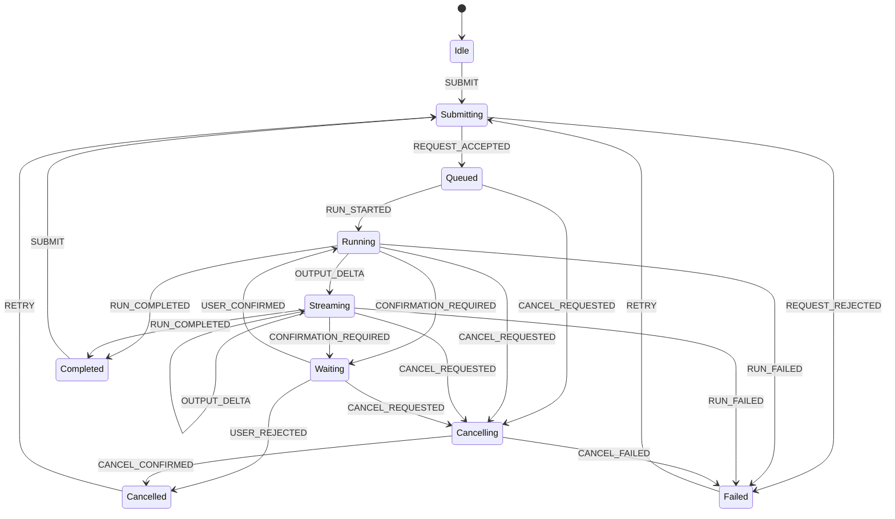

# AI 任务状态机与界面状态

AI 功能不是一个“点击后等待文本”的按钮。一次请求可能排队、上传文件、检索、调用工具、等待确认、流式输出、失败、取消或在断线后继续。界面必须把这些事实建模为有限状态和事件，而不是依赖 `isLoading` 一个布尔值。

状态机的作用是限定当前允许发生的事件、下一状态、界面操作与服务端副作用。模型输出只能提供候选内容，不能自行决定业务任务已经成功。

## 前置知识与范围

读者应掌握：

- Promise、异步请求与 HTTP 错误。
- 前端组件状态管理。
- 服务端任务 ID 与幂等键。
- [工作记忆与数据库事实](../context-engineering/10-memory-types-and-database-facts.md)。

本文讨论文本、检索、工具调用等 AI 任务的产品状态。流式断线、Markdown 渲染与长任务恢复将在后续文章展开。

## 为什么 `isLoading` 不够

下面的实现无法回答“是否已经提交”“能否取消”“结果是否完整”：

```javascript
let isLoading = false;

async function submit(prompt) {
  isLoading = true;
  try {
    output = await fetchAnswer(prompt);
  } finally {
    isLoading = false;
  }
}
```

具体缺陷：

- 排队和执行都显示为 loading，用户不知道是否需要等待。
- 流开始后有文本，但任务可能尚未完成。
- HTTP 连接断开不等于服务端任务停止。
- 用户连点会创建重复请求。
- 工具调用等待确认时既不是 loading，也不是完成。
- `finally` 结束只说明客户端 Promise settled，不说明业务成功。
- 页面刷新后布尔值消失，无法恢复服务端状态。

## 状态、事件、动作和守卫

### 状态

状态表示系统在某一时刻可验证的阶段：

```text
idle
submitting
queued
running
waiting_for_confirmation
streaming
completed
failed
cancelling
cancelled
```

### 事件

事件表示已经发生的事实：

```text
SUBMIT
REQUEST_ACCEPTED
RUN_STARTED
OUTPUT_DELTA
CONFIRMATION_REQUIRED
USER_CONFIRMED
USER_REJECTED
RUN_COMPLETED
RUN_FAILED
CANCEL_REQUESTED
CANCEL_CONFIRMED
```

### 动作

动作是状态迁移产生的受控副作用，例如：

- 发送创建任务请求。
- 保存 run ID。
- 追加流事件。
- 展示确认对话框。
- 发送取消命令。
- 宣布可访问状态消息。

### 守卫

守卫决定事件在当前数据下是否允许。例如：

- 没有 prompt 时禁止 `SUBMIT`。
- 只有待确认状态允许 `USER_CONFIRMED`。
- 已完成任务不能取消。
- 当前用户无工具权限时禁止提交确认。

## 状态图



这个状态图是应用设计示例，不是协议标准。产品可以增加 `paused`、`rate_limited` 或 `partially_completed`，但每个状态必须有可验证定义。

## 状态定义表

| 状态 | 服务端事实 | 主要界面 | 允许操作 |
|---|---|---|---|
| idle | 没有活动 run | 输入框和提交按钮 | 提交 |
| submitting | 创建请求尚无确定结果 | 提交中，不重复发送 | 本地取消等待 |
| queued | 服务端已接受，尚未执行 | 排队状态和等待说明 | 取消 |
| running | 执行中，尚无可展示增量 | 当前步骤或不定进度 | 取消 |
| streaming | 已收到增量，终态未到达 | 临时输出与停止按钮 | 取消、滚动 |
| waiting_for_confirmation | 服务端等待用户决定 | 风险、参数、确认和拒绝 | 确认、拒绝 |
| cancelling | 已请求取消，未确认 | “正在停止” | 无重复取消 |
| completed | 收到完成事件且输出通过校验 | 最终内容与后续操作 | 复制、继续、重做 |
| failed | 收到失败或无法恢复 | 错误类型和恢复选项 | 重试、编辑输入 |
| cancelled | 服务端确认停止 | 已产生内容标为不完整 | 重试、保留草稿 |

## 任务状态与连接状态分离

WebSocket、SSE 或 fetch stream 的连接状态不能代替任务状态。至少维护两个维度：

```json
{
  "task": {
    "runId": "run_204",
    "status": "streaming",
    "lastSequence": 18
  },
  "transport": {
    "status": "reconnecting",
    "attempt": 2,
    "lastError": "network_timeout"
  }
}
```

断网时：

- transport 可以是 `disconnected`。
- task 可能仍是 `running`。
- 已显示文本仍是临时结果。
- 重连后应从 `lastSequence` 继续，而不是创建新任务。

## 生成状态与业务状态分离

模型完成生成不等于业务工具成功：

```text
response.completed
    ≠ payment.completed
    ≠ email.sent
    ≠ database.committed
```

界面应展示对应事实：

- “回答已生成”。
- “退款申请已提交，等待支付系统处理”。
- “邮件草稿已生成，尚未发送”。

如果模型说“邮件已发送”，但工具回执失败，界面必须以工具状态为准。

## 数据结构

```javascript
export const initialTask = {
  runId: null,
  status: "idle",
  transport: "idle",
  prompt: "",
  output: "",
  outputStatus: "empty",
  lastSequence: 0,
  pendingConfirmation: null,
  error: null,
  retryOf: null,
  createdAt: null,
  updatedAt: null
};
```

`outputStatus` 单独存在，因为 `output` 非空不能证明完整：

- `empty`
- `provisional`
- `complete`
- `incomplete`
- `invalid`

## 一个纯函数 reducer

状态迁移写成纯函数，便于穷举测试：

```javascript
export function transition(state, event) {
  switch (`${state.status}:${event.type}`) {
    case "idle:SUBMIT":
    case "failed:RETRY":
    case "cancelled:RETRY":
    case "completed:SUBMIT":
      if (!event.prompt?.trim()) {
        return {
          ...state,
          error: { code: "empty_prompt", retryable: false }
        };
      }
      return {
        ...initialTask,
        status: "submitting",
        prompt: event.prompt,
        retryOf: event.retryOf ?? null,
        createdAt: event.at,
        updatedAt: event.at
      };

    case "submitting:REQUEST_ACCEPTED":
      return {
        ...state,
        runId: event.runId,
        status: event.queuePosition ? "queued" : "running",
        updatedAt: event.at
      };

    case "queued:RUN_STARTED":
      return { ...state, status: "running", updatedAt: event.at };

    case "running:OUTPUT_DELTA":
    case "streaming:OUTPUT_DELTA":
      if (event.sequence <= state.lastSequence) return state;
      if (event.sequence !== state.lastSequence + 1) {
        return {
          ...state,
          transport: "needs_resync",
          error: { code: "event_gap", retryable: true }
        };
      }
      return {
        ...state,
        status: "streaming",
        output: state.output + event.text,
        outputStatus: "provisional",
        lastSequence: event.sequence,
        updatedAt: event.at
      };

    case "running:CONFIRMATION_REQUIRED":
    case "streaming:CONFIRMATION_REQUIRED":
      return {
        ...state,
        status: "waiting_for_confirmation",
        pendingConfirmation: event.confirmation,
        updatedAt: event.at
      };

    case "waiting_for_confirmation:USER_CONFIRMED":
      return {
        ...state,
        status: "running",
        pendingConfirmation: null,
        updatedAt: event.at
      };

    case "waiting_for_confirmation:USER_REJECTED":
      return {
        ...state,
        status: "cancelled",
        outputStatus: state.output ? "incomplete" : "empty",
        pendingConfirmation: null,
        updatedAt: event.at
      };

    case "running:CANCEL_REQUESTED":
    case "streaming:CANCEL_REQUESTED":
    case "queued:CANCEL_REQUESTED":
    case "waiting_for_confirmation:CANCEL_REQUESTED":
      return { ...state, status: "cancelling", updatedAt: event.at };

    case "cancelling:CANCEL_CONFIRMED":
      return {
        ...state,
        status: "cancelled",
        outputStatus: state.output ? "incomplete" : "empty",
        updatedAt: event.at
      };

    case "running:RUN_COMPLETED":
    case "streaming:RUN_COMPLETED":
      return {
        ...state,
        status: "completed",
        output: event.finalOutput ?? state.output,
        outputStatus: "complete",
        updatedAt: event.at
      };

    default:
      return invalidTransition(state, event);
  }
}

function invalidTransition(state, event) {
  return {
    ...state,
    error: {
      code: "invalid_transition",
      from: state.status,
      event: event.type,
      retryable: false
    }
  };
}
```

对于生产系统，非法迁移还应进入遥测。静默忽略会隐藏乱序事件和前端缺陷。

## 事件顺序与去重

每个服务端事件需要：

```json
{
  "runId": "run_204",
  "eventId": "evt_019",
  "sequence": 19,
  "type": "output.delta",
  "createdAt": "2026-07-17T09:10:11.120Z",
  "payload": {
    "text": "下一段"
  }
}
```

客户端按 `runId + sequence` 处理：

- `sequence <= lastSequence`：重复事件，忽略。
- `sequence === lastSequence + 1`：正常追加。
- `sequence > lastSequence + 1`：存在缺口，暂停提交最终状态并请求补发。
- run ID 不匹配：不能写入当前任务。

事件 ID 用于全局去重，sequence 用于单个 run 的顺序。只依赖到达顺序会在重连后重复文本。

## 提交的幂等性

用户双击、代理重试和超时重发都可能重复创建任务。创建请求应携带幂等键：

```http
POST /api/ai-runs
Idempotency-Key: 62f3c7cf-6bd9-4d19-986b-9e1d7a8ef041
Content-Type: application/json

{"prompt":"分析这份合同","attachmentIds":["file_8"]}
```

服务端对同一用户、端点和幂等键返回同一个 run。幂等键需要有限保留期，不能由 Prompt 内容 hash 单独代替，因为用户可能有意提交相同内容两次。

## 界面映射

### 提交按钮

- idle：启用，“发送”。
- submitting：禁用，“正在提交”。
- queued/running/streaming：替换为“停止”。
- cancelling：禁用，“正在停止”。
- failed/cancelled：提供“重试”，并保留可编辑输入。

按钮文案来自状态，不从模型文本推断。

### 输出区域

输出区域在 streaming 时标记内容仍在生成：

```html
<section aria-labelledby="answer-title" aria-busy="true">
  <h2 id="answer-title">回答</h2>
  <div id="answer">正在接收的内容……</div>
</section>
<p role="status" aria-live="polite">正在生成回答</p>
```

不应把每个 Token 都放入 `aria-live`，否则读屏器会持续打断。可以按句子、步骤或节流后的状态播报。

### 不确定进度

模型生成通常无法提供真实百分比。没有可测总量时使用不定进度，不伪造“87%”。若任务有 10 个确定文件，可显示“已处理 4/10”；这表示文件完成数，不表示剩余耗时。

## 错误不是一个状态码

`failed` 状态需要结构化原因：

```json
{
  "code": "rate_limited",
  "scope": "model_provider",
  "retryable": true,
  "retryAfterMs": 12000,
  "userMessage": "请求较多，可在 12 秒后重试",
  "requestId": "req_91"
}
```

常见分类：

- 输入无效：要求用户修改。
- 权限拒绝：不能通过重试解决。
- 限流：在明确时间后重试。
- 网络中断：恢复原 run。
- 模型失败：可能用相同 run 的受控重试。
- 工具失败：显示哪个工具、是否产生副作用。
- 输出校验失败：不能把无效结构标为完成。
- 超时：区分客户端等待超时与服务端任务超时。

## 完整案例一：流式知识问答

### 初始条件

用户提交一个问题，服务端需要检索资料并流式生成带引用的回答。

### 事件序列

```text
SUBMIT
REQUEST_ACCEPTED(run_31)
RUN_STARTED
PHASE_CHANGED(retrieving)
PHASE_CHANGED(generating)
OUTPUT_DELTA(sequence=1)
OUTPUT_DELTA(sequence=2)
RUN_COMPLETED(finalOutput, citations)
```

### 界面行为

1. submitting 时锁定重复提交，但允许用户在输入副本中查看原问题。
2. queued/running 显示真实阶段，不显示虚构百分比。
3. 首个 delta 到达后进入 streaming。
4. 引用在服务端确认 source ID 后显示；未闭合的临时标记不变成链接。
5. 收到完成事件并通过引用校验后，将 outputStatus 设为 complete。
6. 保存 run ID，刷新后仍能加载最终结果。

### 验证

- 相同 sequence 重放两次，界面不重复文本。
- 故意跳过 sequence 2，界面进入 needs_resync。
- 完成事件先于缺失 delta 到达时，不提前显示 complete。
- 引用 source ID 不存在时显示校验错误，不生成伪链接。

### 失败分支

网络断开时，界面显示“连接已中断，任务可能仍在继续”，不显示“生成失败”。重新连接后按 lastSequence 补发。只有服务端返回 failed，或恢复策略耗尽且无法查询任务时，才进入相应错误状态。

## 完整案例二：需要确认的邮件助手

### 初始条件

用户要求总结客户邮件并发送回复。生成草稿无需确认，发送是外部副作用，必须确认收件人、主题与正文。

### 事件序列

```text
RUN_STARTED
OUTPUT_DELTA(draft)
CONFIRMATION_REQUIRED(
  action=email.send,
  recipients=["customer@example.com"],
  subject="合同更新",
  bodyHash="sha256:..."
)
USER_CONFIRMED(bodyHash)
TOOL_STARTED(email.send)
TOOL_COMPLETED(messageId)
RUN_COMPLETED
```

### 界面行为

- 草稿区域明确标为“未发送”。
- 确认框显示实际收件人、主题和正文，不只显示“允许工具吗”。
- 用户编辑正文后产生新 hash，旧确认失效。
- 确认按钮点击后进入 running，防止重复发送。
- 只有邮件服务返回 message ID 后显示“已发送”。

### 验证

- 旧 bodyHash 的确认请求被服务端拒绝。
- 双击确认只生成一个 message ID。
- 工具超时后查询幂等结果，不能直接再次发送。
- 用户拒绝时任务进入 cancelled，草稿仍可复制。

### 失败分支

邮件服务接受请求后客户端断线。前端恢复时先查询工具操作 ID；若已完成，显示发送结果；若仍运行，继续等待；若失败，显示可安全重试条件。不能把连接错误等同为“未发送”。

## 测试状态机

### 迁移表测试

```javascript
const allowed = [
  ["idle", "SUBMIT", "submitting"],
  ["submitting", "REQUEST_ACCEPTED", "running"],
  ["running", "OUTPUT_DELTA", "streaming"],
  ["streaming", "RUN_COMPLETED", "completed"],
  ["running", "CANCEL_REQUESTED", "cancelling"],
  ["cancelling", "CANCEL_CONFIRMED", "cancelled"]
];

for (const [from, eventType, expected] of allowed) {
  const result = transition(
    { ...initialTask, status: from },
    fixtureEvent(eventType)
  );
  if (result.status !== expected) {
    throw new Error(`${from} + ${eventType} should be ${expected}`);
  }
}
```

### 属性检查

应持续成立：

- completed 必须有 run ID。
- completed 的 outputStatus 必须是 complete。
- waiting 状态必须有 confirmation。
- idle 不得有活动 run ID。
- lastSequence 只能单调增加。
- cancelled 后不能接收新的 delta。
- 同一事件处理两次结果相同。

### 端到端检查

- 快速双击提交。
- 提交响应超时但服务端已创建。
- 排队时取消。
- 首个 delta 前失败。
- 流中断、重连、重复和缺失事件。
- 确认内容在确认前被修改。
- 工具成功后浏览器断线。
- 页面刷新后恢复 queued、waiting 和 completed。

## 可观测性

一次任务至少记录：

- run ID、trace ID、用户和租户的安全标识。
- 每次状态迁移的前态、事件、后态和时间。
- 阶段耗时：排队、首 Token、生成、工具等待、总耗时。
- transport 断开与重连次数。
- 重复事件和 sequence gap 数。
- 用户取消发生在哪个阶段。
- 确认接受、拒绝和过期。
- 最终业务结果，而非只有模型完成状态。

状态迁移日志应来自 reducer 或服务端状态机，不应从页面文案反向推断。

## 常见错误

### 收到第一个 Token 就标为成功

流式内容可能中断、校验失败或等待工具。第一个 Token 只能进入 streaming。

### “停止”只关闭浏览器连接

关闭连接不一定停止服务端计算。需要发送取消命令并等待取消结果；界面在此期间是 cancelling。

### 重试复用旧 UI 但创建无关联 run

应记录 `retryOf`，保留原失败证据，并为新 run 生成新幂等键。

### 所有异常都显示“网络错误”

权限、限流、输出无效与工具副作用具有不同恢复方式。错误分类必须来自服务端结构。

### 进度条不断自动前进

没有真实分母时，自动增长的百分比是错误信息。改为阶段、已处理项数或不定进度。

### 允许过期确认

确认必须绑定工具名、参数 hash、主体、run 和过期时间。参数变化后重新确认。

## 生产边界与取舍

### 客户端状态机还是服务端状态机

客户端状态机负责交互一致性，服务端状态机负责持久化任务和副作用。只在客户端实现无法跨刷新恢复；只在服务端实现会使组件内部出现散乱布尔值。两者通过版本化事件协议同步。

### 事件日志还是只保存当前状态

只保存当前状态读取快，但难以调试乱序与恢复。事件日志可重放但需要压缩、归档和兼容旧事件。常见方案是当前快照加追加事件。

### 乐观界面

无副作用、可撤销的操作可以乐观展示。付款、发送、删除等操作应等待权威回执。即使采用乐观状态，也必须有 pending 标记与回滚路径。

## 生产验收清单

- [ ] 任务状态与连接状态分离。
- [ ] 模型完成与工具、业务完成分离。
- [ ] 状态、事件、动作和守卫有明确表格。
- [ ] run ID 与 conversation ID 不混用。
- [ ] 创建请求使用幂等键。
- [ ] 流事件有 event ID 和单调 sequence。
- [ ] 重复、乱序和缺口有确定处理。
- [ ] 取消有 cancelling 中间态与服务端确认。
- [ ] 确认绑定准确参数和版本。
- [ ] 不伪造进度百分比。
- [ ] 输出在终态前标为 provisional。
- [ ] 错误包含可重试性和恢复方式。
- [ ] 页面刷新可以恢复活动任务。
- [ ] 状态更新对键盘和读屏器可用。
- [ ] 状态迁移与副作用进入可观测性。

## 集成练习

实现一个“分析文档并创建待办”的 AI 页面：

1. 文档上传、分析、流式摘要、待办确认和创建分别有状态。
2. 用户可以在 queued、running、streaming 和 waiting 阶段取消。
3. 断线后使用 run ID 与 lastSequence 恢复。
4. 待办确认显示标题、截止日期、负责人和目标项目。
5. 修改任何参数都会使旧确认失效。
6. 创建接口使用幂等键；超时后先查询结果。
7. 测试重复事件、缺失事件、确认过期、工具成功后断线。
8. 可观测记录能还原每次迁移，但不保存文档完整敏感正文。

## 来源

- [WHATWG HTML：Server-sent events](https://html.spec.whatwg.org/multipage/server-sent-events.html)（访问日期：2026-07-17）
- [W3C WAI-ARIA 1.2：Live Region Roles 与 aria-live](https://www.w3.org/TR/wai-aria/)（访问日期：2026-07-17）
- [W3C Technique ARIA25：使用 live region 传达进度状态](https://www.w3.org/WAI/WCAG21/Techniques/aria/ARIA25)（访问日期：2026-07-17）
- [OpenAI API：Streaming events](https://platform.openai.com/docs/api-reference/responses-streaming)（访问日期：2026-07-17）
