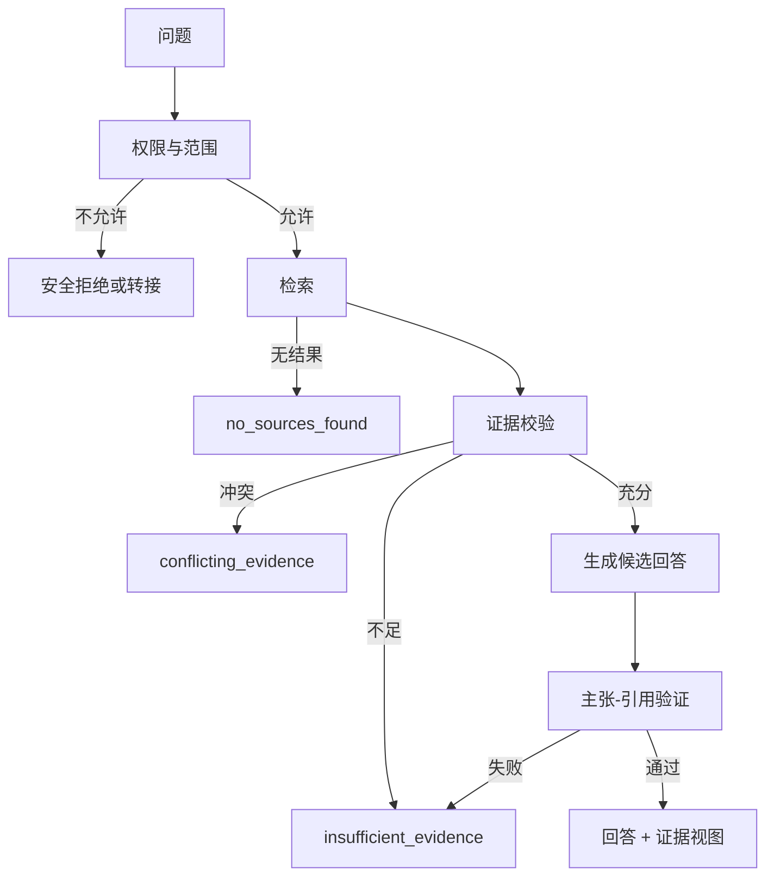

# 引用、证据视图与无法回答状态

AI 回答中的引用必须把具体主张连接到用户有权查看的证据位置。显示一个 URL 列表不能证明答案受到资料支持。产品还要区分“没有检索到资料”“资料相互冲突”“资料存在但不足以回答”“用户无权查看证据”和“模型生成失败”，并提供明确的无法回答状态。

## 前置知识与边界

- 检索结果、chunk 与文档版本的基本概念。
- [Artifact 的差异、历史与恢复](05-artifact-diff-history-restore.md)。
- [最终模型输入的记录与可重放性](../context-engineering/07-final-model-input-recording.md)。

本文讨论证据产品与数据模型，不保证模型生成的每一句话必然正确。高风险结论仍需要领域审核与确定性业务检查。

## 四个对象

### Source

原始资料及其版本：

```json
{
  "sourceId": "src_88",
  "title": "退款政策",
  "uri": "kb://policy/refund",
  "revision": "2026-07-01",
  "contentHash": "sha256:...",
  "accessScope": "support_agents"
}
```

### Evidence span

源中的可定位证据：

```json
{
  "evidenceId": "ev_203",
  "sourceId": "src_88",
  "revision": "2026-07-01",
  "locator": {
    "type": "text_offset",
    "start": 418,
    "end": 603
  },
  "quoteHash": "sha256:..."
}
```

### Claim

回答中可被验证的主张：

```json
{
  "claimId": "claim_7",
  "text": "标准退款申请需要在购买后 30 天内提交。",
  "answerRange": {"start": 102, "end": 127}
}
```

### Citation

主张与证据的关系：

```json
{
  "claimId": "claim_7",
  "evidenceIds": ["ev_203"],
  "relation": "supports",
  "verification": "passed"
}
```

只有 source 没有 evidence locator，用户无法快速核对；只有 evidence 没有 claim，无法判断它支持哪句话。

## 引用不是普通链接

普通链接表示导航目标。引用还应表达：

- 支持的主张。
- 来源标题与发布者。
- 资料 revision 或访问时间。
- 证据所在页、章节、段落、时间码或字符区间。
- 用户是否有访问权限。
- 证据关系：支持、反驳或背景。

不要允许模型直接生成任意 HTML anchor 并称为引用。模型可以选择 source ID，应用根据检索 manifest 解析真实链接。

## 引用编号

界面可以使用 `[1]`、脚注或内联卡片，但编号必须由应用生成：

```javascript
export function numberCitations(claims) {
  const evidenceOrder = new Map();
  let next = 1;

  return claims.map(claim => ({
    ...claim,
    citations: claim.evidenceIds.map(evidenceId => {
      if (!evidenceOrder.has(evidenceId)) {
        evidenceOrder.set(evidenceId, next++);
      }
      return {
        evidenceId,
        number: evidenceOrder.get(evidenceId)
      };
    })
  }));
}
```

同一证据重复使用时编号保持一致。删除一段回答后应重新建立展示编号，但持久化关系使用稳定 evidence ID。

## 定位器

不同资料使用不同 locator：

| 资料 | 定位器 |
|---|---|
| HTML | 稳定 heading ID、DOM path 加文本 hash |
| PDF | 页码、bounding box、文本 hash |
| Markdown | heading path、字符范围、revision |
| 音视频 | 起止时间码、转写片段 hash |
| 数据库 | 查询 ID、行主键、快照 version |
| 代码 | repository、commit、path、line |

只保存页面 URL 容易在内容更新后指向不同文本。revision 与 quote hash 可以检测漂移。

## 证据视图

证据面板至少展示：

- 当前主张。
- 支持或反驳的原文片段。
- 前后必要上下文。
- 来源标题、发布者和版本。
- 打开原文的受控入口。
- 资料是否过期或权限变化。

高亮范围不能只依赖模型返回的自由文本。服务端应确认 evidence ID 属于本次检索且 locator 在当前 source revision 中有效。

## 权限

回答可以引用用户无权直接打开的内部资料吗？产品必须选择并明确：

- 严格模式：无权打开证据就不把内容用于回答。
- 摘要模式：允许输出经过策略批准的非敏感结论，但不暴露原文。
- 分级模式：显示“依据受限资料”，隐藏片段与元数据。

任何模式都要在检索前做权限过滤。不能先把跨租户 chunk 交给模型，再只隐藏引用链接。

## 引用验证

### 存在性

- evidence ID 存在。
- 属于本次允许的 source manifest。
- revision 匹配。

### 可定位性

- locator 在文档范围内。
- quote hash 与原文一致。
- 页面或文件仍可访问。

### 主张覆盖

- 可验证主张是否有引用。
- 引用位置是否紧邻对应主张。
- 一个段落多个主张是否被错误地共用一个来源。

### 支持关系

证据存在不等于支持主张。可以使用规则、人工标注或辅助模型评估 relation，但关键结论需要人工或领域校验。辅助模型分数不能伪装成确定事实。

## 冲突证据

资料可能互相冲突：

```json
{
  "claim": "退款期限为 30 天",
  "evidence": [
    {"id":"ev_old","value":"30 天","revision":"2025-01","status":"stale"},
    {"id":"ev_new","value":"14 天","revision":"2026-07","status":"current"}
  ]
}
```

应用应：

1. 比较来源权威性、适用范围和 revision。
2. 不把相似度最高自动当成最新规则。
3. 在无法决定时展示冲突。
4. 请求用户选择适用地区、产品或日期。
5. 阻止高风险动作，直到规则确定。

## “无法回答”是一组状态

| 状态 | 含义 | 用户下一步 |
|---|---|---|
| no_sources_found | 没找到相关资料 | 改写问题、扩大允许范围 |
| insufficient_evidence | 有资料但不能支撑结论 | 补充资料或缩小问题 |
| conflicting_evidence | 资料冲突且无法消解 | 选择适用条件、人工判断 |
| source_access_denied | 相关资料存在但无权读取 | 申请权限或联系负责人 |
| unsupported_question | 系统范围外 | 转到适合渠道 |
| unsafe_to_answer | 风险策略要求拒绝 | 提供安全替代 |
| processing_failed | 检索或模型故障 | 重试或报告故障 |

“我不知道”不应把权限拒绝伪装成没有资料，也不应泄露受限文档存在。

## 判定流程



判定应由检索与验证状态驱动，不只让模型自由决定“要不要拒答”。

## 生成契约

模型可以输出结构化候选：

```json
{
  "answerStatus": "answered",
  "claims": [
    {
      "id": "claim_1",
      "text": "退款期限为 14 天。",
      "evidenceIds": ["ev_91"]
    }
  ],
  "unresolved": []
}
```

服务端随后检查：

- `answerStatus` 枚举。
- evidence ID 允许且存在。
- 每个需证据主张有关系。
- 引用 source revision 未过期。
- 未引用内容是否只是明确的界面说明或推理结果。
- 高风险结论是否需要升级审核。

校验失败时不能直接删除无效引用后照常展示主张。

## 无答案界面

良好的无答案界面包含：

- 明确状态：“当前资料不足以确认退款期限”。
- 已知范围：“已检索中国区、当前生效的 3 份政策”。
- 缺失条件：“需要购买日期和产品类型”。
- 不泄露受限内容的理由。
- 可执行下一步：补充信息、上传文件、调整筛选或转人工。

不要生成一段看似完整的猜测，再在末尾放“仅供参考”。

## 答案中的不确定部分

可以把回答拆为：

- 已由证据支持。
- 合理推导但证据未直接陈述。
- 尚未解决。

视觉颜色不能是唯一信号。使用文本标签和可访问名称，例如“证据支持”“推导”“待确认”。

## 完整案例一：企业政策问答

### 问题

“上海办公室今年还有几天带薪病假？”

### 检索结果

- 全球员工手册：每年 10 天，revision 2025。
- 中国区补充政策：按当地规则，revision 2026。
- 上海办公室说明：试用期与正式员工不同，revision 2026。

### 处理

1. 用户身份允许读取三个资料。
2. 问题缺少雇佣状态和本年度已用天数。
3. 资料只能说明总额度规则，不能回答“还有几天”。
4. 返回 `insufficient_evidence`。
5. 界面展示可确认的规则和两个缺失字段。
6. 用户授权查询 HR 系统后，业务服务读取已用天数。
7. 最终回答引用政策 evidence，并把已用天数标为数据库快照。

### 输出

```json
{
  "answerStatus": "needs_information",
  "known": [
    {
      "claim": "正式员工年度病假额度为 10 天",
      "evidenceIds": ["ev_policy_3"]
    }
  ],
  "requiredInputs": [
    "employment_status",
    "used_sick_leave_days"
  ]
}
```

### 失败分支

用户无权查询同事的 HR 数据。系统不能引用同事记录，也不能通过问答泄露余额；返回权限拒绝和正确申请路径。

### 验证

- 每个政策数字可打开对应段落。
- 数据库余额带读取时间。
- 资料更新后旧 quote hash 触发 stale。
- 缺少字段时不猜测。

## 完整案例二：技术故障排查

### 问题

“为什么生产 API 昨晚出现 500？”

### 证据

- 监控显示 02:10–02:18 错误升高。
- 部署记录显示 01:55 发布。
- 数据库日志显示 02:09 连接耗尽。
- 没有分布式 trace 能证明发布直接导致连接耗尽。

### 回答结构

- 事实：时间、错误率、连接池状态，各有证据。
- 相关性：发布在事件前发生。
- 未证实：发布是否为根因。
- 下一步：对比配置 diff、复现连接泄漏、补 trace。

### 界面

“根因”状态显示为“尚未确认”，不能把时间先后写成因果。证据面板按时间线展示 source 与 locator。

### 失败分支

一个旧 runbook 写着“此类错误通常由连接泄漏导致”。它只能作为排查假设，不能覆盖当前日志。引用 relation 标为 background，不是 supports root cause。

### 验证

- 事实与假设视觉和文本上区分。
- 时间统一到明确时区。
- 旧 runbook 显示 revision。
- 缺失 trace 明确列出。

## 引用漂移

来源更新后：

- 固定 revision 引用仍指向历史版本，但可能已过时。
- 跟随 current 的引用可能指向不同文字。

保存回答时记录 revision。再次打开时可以：

1. 展示原引用版本。
2. 检查 current 是否变化。
3. 标记“来源已更新”。
4. 提供重新验证回答。

不能静默把旧主张绑定到新文本。

## 来源删除

若 source 被删除或访问权限撤销：

- 回答文本的保留取决于数据策略。
- 证据面板不再展示原文。
- 引用标为 unavailable。
- 缓存与搜索索引同步清理。
- 高风险 artifact 可以标记需要重新审核。

## 可访问性

- 引用标记有可读名称，如“引用 2：退款政策”。
- 键盘可打开和关闭证据面板。
- 焦点返回触发引用。
- 证据高亮不只依靠颜色。
- PDF 或复杂文档提供文本片段。
- 状态变化用 `role="status"` 适度宣布。
- 无答案理由和下一步按正常阅读顺序出现。

## 可观测性与评估

指标：

- 有证据主张覆盖率。
- 无效 evidence ID 比例。
- locator 打开成功率。
- stale source 比例。
- 用户打开证据的比例。
- 无答案各原因分布。
- 用户在无答案后补充信息的成功率。
- 冲突证据被人工解决的时间。
- 回答被用户纠正和举报的类别。

“引用数量”不是质量指标。大量无关引用可能降低可核查性。

## 常见错误

### 段落末尾放一个来源

段落有多个主张时关系不明确。按主张或紧邻句子绑定。

### 模型生成 URL

URL 可能不存在或未授权。通过 evidence ID 映射 manifest。

### 检索到就视为支持

相关 chunk 可能反驳或仅提供背景。验证 relation。

### 没证据时继续补全

返回具体无答案状态和下一步，不用流畅语言掩盖缺口。

### 隐藏无权来源但使用其内容

输出本身仍可能泄露。权限过滤必须在模型输入前。

### 来源更新后引用自动跟随

记录 revision 并提示漂移。

## 生产验收清单

- [ ] source、evidence、claim 和 citation 有独立 ID。
- [ ] 引用包含可验证 locator 与 revision。
- [ ] 展示编号由应用生成。
- [ ] evidence ID 必须属于授权 manifest。
- [ ] 相关性与支持关系分开。
- [ ] 冲突、过期和不可访问来源有状态。
- [ ] 无答案原因使用受控枚举。
- [ ] 无答案界面给出缺失条件和下一步。
- [ ] 权限过滤在检索与生成之前。
- [ ] 高风险推导与直接证据区分。
- [ ] 来源更新触发漂移检查。
- [ ] 引用与证据面板可键盘操作。
- [ ] 指标衡量覆盖、有效性和恢复，不只数引用。

## 集成练习

实现一个带引用的内部政策问答：

1. 每个 source 有 revision、hash 和访问范围。
2. 每个 evidence 有 locator 与 quote hash。
3. 回答按 claim 关联 evidence ID，编号由前端生成。
4. 模拟无结果、证据不足、冲突、无权限和处理失败。
5. 五种状态显示不同原因和下一步。
6. 更新一份来源后，旧回答显示 stale 并可重新验证。
7. 删除来源权限后，证据正文不再泄露。
8. 测试键盘打开引用、焦点返回与读屏名称。

## 来源

- [W3C PROV-O：The PROV Ontology](https://www.w3.org/TR/prov-o/)（访问日期：2026-07-17）
- [W3C Web Annotation Data Model](https://www.w3.org/TR/annotation-model/)（访问日期：2026-07-17）
- [IETF RFC 9110：HTTP Semantics](https://www.rfc-editor.org/rfc/rfc9110)（访问日期：2026-07-17）
- [NIST AI Risk Management Framework](https://www.nist.gov/itl/ai-risk-management-framework)（访问日期：2026-07-17）
- [OpenAI API：File search 与 citations](https://platform.openai.com/docs/guides/tools-file-search)（访问日期：2026-07-17）
