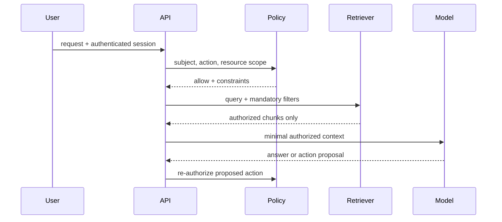

# 上下文权限与租户隔离

上下文权限控制决定当前主体在当前请求中可以加载哪些事实。过滤必须发生在数据查询和检索阶段；把跨租户内容交给模型后再要求“不要泄露”已经越过了保密边界。

## 前置知识与范围

前置阅读：

- [可信边界与不可信上下文](02-trust-boundaries-untrusted-context.md)。
- [Secret、最小权限与费用上限](../foundations/secrets-permissions-cost.md)。
- [模型 API 的消息角色](../model-api/message-roles.md)。

本文覆盖上下文加载、缓存和派生数据隔离。身份认证、组织权限模型和数据库 RLS 的完整实现应与后端安全模块结合。

## 四个需要独立回答的问题

1. **主体是谁**：用户、服务账号、Agent、后台任务。
2. **代表谁行动**：用户本人、租户、组织或系统维护者。
3. **能访问什么**：资源、字段、操作和时间范围。
4. **为何在本次任务中需要**：最小必要目的。

仅有 `tenant_id` 不等于完整授权。租户内仍可能有私有项目、角色限制、字段级敏感信息和法律冻结。

## 权限决策链



检索前授权保护输入；动作前重新授权保护副作用。两次检查面对的对象版本和操作不同，不能省略。

## 认证信息不能来自 Prompt

可信身份来自：

- 已验证会话。
- OAuth/OIDC token 验证结果。
- mTLS 服务身份。
- 作业队列中签名且不可篡改的任务信封。

以下内容不可信：

- 请求体中的 `tenantId`。
- 用户说“我是管理员”。
- 模型从对话推断的角色。
- 文档中的权限声明。
- 第三方工具返回的“已授权”文本。

应用应从认证上下文注入租户和主体，客户端只能选择它确实有权使用的范围。

## 资源过滤模型

```json
{
  "subject": {
    "userId": "user_7",
    "tenantId": "tenant_42",
    "roles": ["support_agent"]
  },
  "request": {
    "action": "answer",
    "purpose": "support_case",
    "caseId": "case_991"
  },
  "constraints": {
    "allowedProjects": ["project_a"],
    "classificationAtMost": "internal",
    "excludeFields": ["payment_card", "access_token"]
  }
}
```

这个对象在服务端构造，并传给检索器和字段投影器。模型只接收过滤结果，不负责执行约束。

## 检索时的强制过滤

向量查询的相似度条件之外必须包含授权条件：

```text
tenant_id = authenticated.tenant_id
AND deleted_at IS NULL
AND classification <= subject.clearance
AND (
  visibility = 'tenant'
  OR project_id IN subject.allowed_projects
)
```

如果向量数据库不能可靠表达权限谓词，应采用：

- 按安全边界拆分索引。
- 先取得授权资源 ID，再检索其子集。
- 检索后过滤只作第二层防御，不能作为唯一控制。
- 更换能满足隔离要求的存储。

Top-K 后才过滤会导致授权结果不足，也可能通过分数、数量或时延泄露其他租户内容是否存在。

## 复合租户键

共享数据库中的每个派生对象都需要租户归属：

- document。
- document version。
- chunk。
- embedding。
- conversation。
- memory。
- evaluation trace。
- cached response。

`chunk_id` 全局唯一仍不能证明它属于当前租户。查询和引用关系应携带 `tenant_id`，数据库使用复合外键或 RLS 保护一致性。

## 缓存隔离

错误缓存键：

```text
answer-cache:${normalizedQuestion}
```

两个租户问相同问题时会共享答案。安全缓存键至少考虑：

```text
tenant
subject permission fingerprint
resource version set
model
prompt version
normalized query
```

权限 fingerprint 改变时缓存失效。不能把管理员看到的答案缓存给普通用户。

## 派生内容的权限继承

摘要、Embedding 和模型输出不因“派生”而自动降敏。常见规则：

```text
derived_classification >= max(source_classifications)
derived_tenants = intersection of allowed audiences
derived_expiry <= earliest required source expiry
```

若一个摘要混合多个项目，只有同时有权读取所有来源的主体才能看到完整摘要。更实用的做法是避免跨安全域混合。

## 服务端过滤示例

```javascript
export function buildRetrievalFilter(auth, request) {
  if (!auth?.userId || !auth?.tenantId) {
    throw new Error("authenticated subject required");
  }

  const allowedProjects = request.projectId
    ? auth.projectIds.filter((id) => id === request.projectId)
    : [...auth.projectIds];

  if (request.projectId && allowedProjects.length === 0) {
    return {status: "deny", reason: "project_not_allowed"};
  }

  return {
    status: "allow",
    filter: {
      tenantId: {$eq: auth.tenantId},
      projectId: {$in: allowedProjects},
      deletedAt: {$eq: null},
      classificationRank: {$lte: auth.clearanceRank},
    },
  };
}
```

模型不能修改返回的 filter。向量存储适配器还要验证所有强制字段存在，避免调用方漏传。

## 应用案例一：多租户客服助手

### 输入

客服 Alice 属于租户 42，只能处理 `project_a`。她询问：

```text
客户上一笔失败支付是什么原因？
```

相似检索候选中：

- chunk A：tenant 42/project_a 的支付错误，分数 0.83。
- chunk B：tenant 17 的相似支付错误，分数 0.96。
- chunk C：tenant 42/project_secret，分数 0.91。

### 正确流程

1. API 从会话得到 Alice 的用户和租户。
2. policy service 确认她可读 case 991 和 project_a。
3. 检索器在相似度搜索前强制 tenant/project 过滤。
4. B、C 不进入候选排名和模型上下文。
5. 结构化查询加载 case 991 的当前支付状态。
6. 字段投影移除卡号和访问令牌。
7. 模型依据 A 与当前状态生成回答。

### 输出

```json
{
  "status": "answered",
  "answer": "支付网关返回了超时，当前订单仍为待支付。",
  "evidence": [
    {"caseId": "case_991", "eventId": "evt_55"},
    {"documentId": "runbook_12", "chunkId": "chunk_a"}
  ]
}
```

### 验证

- 以租户 17 的高相似文档做 canary，任何输出或 trace 都不应出现其 ID。
- Alice 被移出 project_a 后，同一缓存键不能继续命中。
- 管理员与普通客服分别运行，结果字段符合各自权限。
- 无授权结果时返回无答案，不扩大检索范围。
- 审计记录保存过滤条件摘要和返回资源 ID。

### 失败分支

若先全局 Top-3 再过滤，B、C 被移除后可能只剩一个低质量结果；更严重的是某些向量服务可能在日志或分数中暴露它们。应在索引分区或查询谓词层强制安全边界。

## 应用案例二：项目代码助手

### 输入

工程师 Bob 可访问公开仓库和项目 X，不可访问安全团队的私有仓库。任务是查找认证中间件用法。

系统拥有：

- 代码搜索索引。
- Git 历史。
- 构建日志。
- 只读文件工具。

### 处理步骤

1. 根据 Bob 当前组织成员关系得到仓库 allowlist。
2. 搜索索引按 repository ID 过滤。
3. 结果携带 commit SHA 和文件权限版本。
4. 文件读取工具再次校验仓库与路径。
5. 模型引用代码时服务端验证行号属于同一 commit。
6. 不把私有仓库名称计入“找到 N 个结果”的计数。

### 输出

```json
{
  "matches": [
    {
      "repository": "project-x",
      "commit": "4f2c9ab",
      "path": "src/auth/middleware.ts",
      "lines": [18, 41]
    }
  ],
  "searchedRepositories": ["public-lib", "project-x"]
}
```

### 验证

- 在私有仓库放置唯一 canary 字符串，Bob 永远不能检索到。
- 撤销仓库权限后，旧会话、记忆、缓存和索引查询均受新权限约束。
- 符号链接和路径遍历不能逃出授权仓库。
- 模型请求读取未在结果中的私有路径时，工具拒绝。

### 失败分支

若会话开始时把全部代码预加载，之后撤权不会移除已进入上下文的内容。敏感资源应按请求加载，长任务还需在关键步骤重新检查权限。

## 长任务中的权限变化

任务可能运行数小时，期间用户离职、项目撤权或审批过期。策略：

- 每个读取步骤重新检查短期授权租约。
- 写操作总是即时授权。
- 任务持久化资源 ID，不持久化长期 bearer token。
- 撤权事件取消或暂停相关任务。
- 恢复任务时重新建立身份上下文。
- 已生成但未交付的敏感结果需要再次检查受众。

## Agent 的委托权限

Agent 代表用户执行时需要明确：

- delegator：委托人。
- delegate：Agent 或服务身份。
- scope：允许动作与资源。
- audience：令牌可用于哪个服务。
- expiry：委托到期。
- task binding：仅可用于哪个任务。
- approval：哪些动作仍需确认。

不能把用户的长期全权限 token 直接放入模型上下文或第三方 MCP Server。

## 权限与引用

引用 URL 本身也可能泄露：

- 私有文档标题。
- 项目名称。
- 对象 ID。
- 带签名下载 URL。
- 搜索命中数量。

生成引用时应返回应用内受控 ID；用户点击后再次授权。预签名 URL 设短期有效、最小权限且不写入长期日志。

## 调试与失败注入

### 测试矩阵

| 场景 | 预期 |
|---|---|
| 无身份 | 拒绝，不调用检索 |
| 错误 tenant 参数 | 忽略客户端值或拒绝 |
| 租户内无项目权限 | 无结果，不泄露存在性 |
| 权限刚撤销 | 缓存失效，后续读取拒绝 |
| 长任务恢复 | 重新授权 |
| 管理员降权 | 不继承旧上下文 |
| 跨租户相似 canary | 零召回、零输出 |
| 模型伪造 resource ID | 工具拒绝 |

### 观测

- policy decision ID。
- 主体和代表关系。
- 强制过滤 fingerprint。
- 检索资源 ID。
- 缓存隔离键摘要。
- 动作前重新授权结果。
- 权限拒绝原因，不向终端用户泄露敏感存在性。

## 方案取舍

### 每租户独立索引

隔离直观，删除和恢复粒度清晰；大量小租户会增加运维和资源碎片。

### 共享索引带 metadata filter

资源利用率高；必须验证存储确实在搜索前执行过滤，并防止调用方遗漏。

### 每安全域独立服务

适合强合规和高敏感环境；成本、部署和跨域工作流复杂。

### 检索后过滤

只能作第二层校验，不适合作唯一权限控制。

## 生产边界

- 认证、授权与模型提示分离。
- 默认拒绝缺少租户 metadata 的资源。
- 所有派生对象可追溯来源权限。
- 缓存键包含安全上下文。
- 访问日志脱敏且不可被普通用户读取。
- Secret 和令牌不进入上下文。
- 第三方模型与 MCP 的数据处理政策经过评审。
- 删除、撤权和租户迁移有全链路对账。
- 跨租户 canary 测试进入 CI 和持续监控。

## 综合练习：企业知识助手

实现共享索引上的企业知识助手，权限包含租户、部门、项目和文档密级。

验收标准：

- 身份来自验证后的会话，不使用 Prompt 中的租户。
- 检索前强制四个权限维度。
- chunk、embedding、摘要和缓存都携带租户归属。
- 管理员答案不会缓存给普通用户。
- 用户撤权后进行中任务暂停并重新授权。
- 引用点击时再次检查权限。
- canary 文档验证跨租户和跨项目零泄露。
- trace 能证明一次回答只使用了哪些授权资源。

## 来源

- [OWASP RAG Security Cheat Sheet](https://cheatsheetseries.owasp.org/cheatsheets/RAG_Security_Cheat_Sheet.html)（访问日期：2026-07-17）
- [OWASP AI Agent Security Cheat Sheet](https://cheatsheetseries.owasp.org/cheatsheets/AI_Agent_Security_Cheat_Sheet.html)（访问日期：2026-07-17）
- [NIST：Software and AI Agent Identity and Authorization Concept Paper](https://www.nccoe.nist.gov/sites/default/files/2026-02/accelerating-the-adoption-of-software-and-ai-agent-identity-and-authorization-concept-paper.pdf)（访问日期：2026-07-17）
- [PostgreSQL 18：Row Security Policies](https://www.postgresql.org/docs/18/ddl-rowsecurity.html)（访问日期：2026-07-17）
