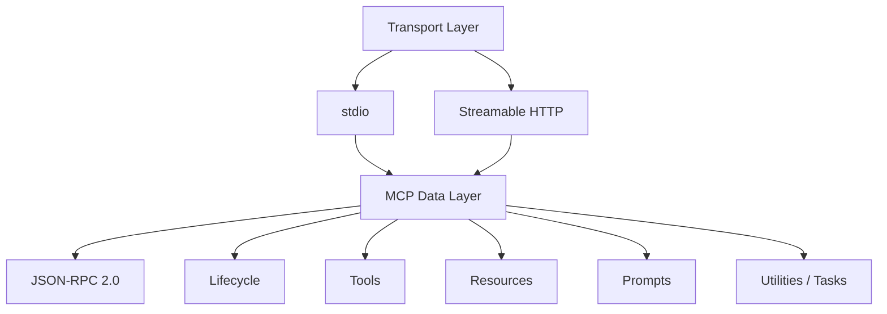

# MCP Transport、Tools、Resources、Prompts 与 Capabilities

MCP 的 transport 承载 JSON-RPC 消息，Tools、Resources 和 Prompts 是 Server 提供给 Host 的三类核心 primitive，Capabilities 在初始化时声明会话支持哪些方法与通知。正确实现需要区分传输、协议功能和业务权限，按协商结果调用，并对每种 primitive 采用不同的数据与副作用边界。

## 前置知识与能力目标

前置阅读：

- [MCP Host、Client 与 Server](01-host-client-server.md)。
- [Tool 单一职责、简洁 Schema 与稳定输出](../tool-design/02-single-responsibility-schema-stable-output.md)。

完成后应能：

- 选择 stdio 或 Streamable HTTP。
- 处理 framing、session、版本 header 与断线。
- 正确发现和调用三类 primitive。
- 理解 Server/Client capabilities。
- 处理 list changed、subscribe、pagination。
- 防止把 Resource/Prompt 当受信指令。

## 两层结构



Transport 不改变 `tools/list` 的业务语义，但连接、认证、session 和消息边界不同。

## stdio

Client 启动 Server 子进程：

- stdin：Client→Server。
- stdout：Server→Client。
- stderr：日志。

消息是逐行分隔的 JSON-RPC，必须 UTF-8，消息本身不能包含未转义换行。

### 规则

- stdout 只能写有效 MCP 消息。
- 日志写 stderr。
- inherited environment 最小化。
- executable/arguments 来自 Host 配置，不来自模型。
- working directory 明确。
- 子进程退出触发连接失败。

### 安全

- Server 拥有本机进程权限，因此需要 sandbox/低权限用户。
- 不把全部环境变量传给子进程。
- 不自动执行下载的未知二进制。
- workspace roots 不是整个文件系统。

### 故障

stdout 多一个 `console.log("started")` 会破坏协议。Client 应报告 malformed message 和 stderr 摘要，不尝试把日志当 JSON 修复。

## Streamable HTTP

Server 暴露一个 MCP endpoint，支持 POST 与可选 GET；Server 可用 SSE 流式发送多条消息。

### POST

每个 JSON-RPC message 使用新的 POST。Client Accept 包含：

```text
application/json, text/event-stream
```

request 可以得到：

- `application/json` 单一响应。
- `text/event-stream` 流。
- 对 notification/response 的 `202 Accepted` 空 body。

### Session

Server 可在 initialize 响应返回 `MCP-Session-Id`。后续请求携带。规则：

- session ID 当 opaque。
- 不放 URL query。
- 按用户/Client 隔离。
- Server 404 表示 session 不存在，Client 重新 initialize。
- Client 可 DELETE endpoint 结束 session；Server 可返回 405。

### Version Header

initialize 后 HTTP 请求携带：

```text
MCP-Protocol-Version: 2025-11-25
```

值使用协商版本。

### Origin

Streamable HTTP Server 验证 Origin 防 DNS rebinding；无效 Origin 返回 403。本地 Server 绑定 `127.0.0.1`，不能默认 `0.0.0.0`。

### Authorization

HTTP authorization 属于 transport。access token 用 Authorization header，不放 JSON-RPC params 和模型 context。

## Transport 选择

| 条件 | stdio | Streamable HTTP |
|---|---|---|
| 本地单用户 | 合适 | 可用但增加网络面 |
| 远程多用户 | 不合适 | 合适 |
| 进程生命周期 | Host 管 | Server 独立 |
| Auth | 环境/本地信任 | OAuth/HTTP |
| 扩展部署 | 单机 | 服务化 |
| 网络风险 | 较少 | Origin、SSRF、TLS、session |

不要使用已被替代的旧 HTTP+SSE transport 设计新实现。兼容旧协议时按版本明确处理。

## Tools

Tools 是可执行函数：

```json
{
  "jsonrpc": "2.0",
  "id": 2,
  "method": "tools/list",
  "params": {}
}
```

结果中每个 Tool：

- name。
- title 可选。
- description 可选。
- inputSchema。
- outputSchema 可选。
- annotations 可选。
- execution 可选。

调用：

```json
{
  "jsonrpc": "2.0",
  "id": 3,
  "method": "tools/call",
  "params": {
    "name": "get_order",
    "arguments": {
      "orderId": "ORDER-000812"
    }
  }
}
```

### Tool Result

- `content` 可含 text/image/audio/resource。
- `structuredContent` 可提供结构结果。
- `isError` 表示 Tool 执行错误。
- JSON-RPC protocol error 与 Tool business error 不同。

若声明 outputSchema，Server structured result 必须符合，Client 应验证。

### Annotations

`readOnlyHint`、`destructiveHint`、`idempotentHint`、`openWorldHint` 都是 hint。来自不受信 Server 时不能用于安全决策。

## Resources

Resource 是可读取上下文：

- URI identity。
- name/title。
- description。
- MIME type。
- annotations。

发现：

```json
{
  "jsonrpc": "2.0",
  "id": 4,
  "method": "resources/list",
  "params": {}
}
```

读取：

```json
{
  "jsonrpc": "2.0",
  "id": 5,
  "method": "resources/read",
  "params": {
    "uri": "project://docs/refund-policy"
  }
}
```

### URI

- 由 Server 定义 scheme。
- Client 当 opaque identity。
- 不把 Resource URI 直接传给本地文件/HTTP 库。
- Server 重新验证当前用户权限。

### Resource Templates

模板声明参数化 URI。Host 只允许 Schema/模板范围内参数，不让模型拼任意 path。

### Subscribe

Server 声明 `resources.subscribe` 后，Client 可订阅；变更 notification 不携带“自动信任的新正文”。收到后重新 read、授权和验证 revision。

### 内容边界

Resource 内容作为数据，不提升为 system instruction。外部文档中的 Prompt injection 保持 untrusted。

## Prompts

Prompts 是 Server 提供的可复用消息模板：

```json
{
  "jsonrpc": "2.0",
  "id": 6,
  "method": "prompts/get",
  "params": {
    "name": "review_policy",
    "arguments": {
      "region": "cn-east"
    }
  }
}
```

### 特性

- 通过 `prompts/list` 发现。
- 可有 arguments。
- get 返回 messages。
- Host 决定是否展示和使用。

### 安全

Server Prompt 不是 Host system policy。Host：

- 标记来源。
- 检查是否请求敏感数据。
- 不自动执行其中 Tool。
- 不允许覆盖用户/组织策略。
- 对外部 Server Prompt 做批准。

Prompts 适合用户选择模板，不适合作为隐藏远程控制通道。

## Capabilities

Server：

```json
{
  "tools": {"listChanged": true},
  "resources": {"subscribe": true, "listChanged": true},
  "prompts": {"listChanged": true},
  "logging": {},
  "tasks": {
    "list": {},
    "cancel": {},
    "requests": {"tools": {"call": {}}}
  }
}
```

Client：

- roots。
- sampling。
- elicitation。
- tasks。

### 协商规则

- capability 缺失则不能假设支持。
- 子能力如 listChanged/subscribe 也需声明。
- experimental 放独立 namespace/对象。
- capability 在 session 内稳定；变化通常重新 initialize。

### Tasks

2025-11-25 引入的 Tasks 是实验功能：

- 只有双方声明相应 tasks capability 才能使用。
- Tool 还通过 `execution.taskSupport` 声明 forbidden/optional/required。
- default 是 forbidden。
- durable task 有 ID、status、poll/cancel。

不能把所有长请求都当 Tasks，需按 capability。

## Pagination

list 结果可能有 `nextCursor`。Client：

- cursor opaque。
- 设置最大页/总 items。
- 处理重复 cursor。
- catalog 构建期间保持同一 session。
- partial list 不直接标完整。

Server cursor 绑定 tenant、filter 和 snapshot，不能接受篡改跨权限。

## List Changed

`notifications/tools/list_changed` 等表示列表变化。

Host：

1. 去抖。
2. 重新 list。
3. 验证全部 entries。
4. 计算 catalog diff。
5. 审核新增高风险能力。
6. 发布新 catalog version。

不因 notification 直接执行或自动批准新 Tool。

## 应用案例一：项目知识 Server

### Primitives

- Resource：roadmap、notes。
- Prompt：review_note。
- Tool：search_notes。

### Transport

本地 stdio。

### 边界

- Resource 只读 workspace roots。
- Prompt 不进入 system role。
- search tool 输出 locator。
- list changed 在 Git branch 切换后触发。

### 测试

- stdout 日志污染。
- Resource URI path traversal。
- Prompt 请求写文件。
- list pagination。
- Server crash/restart。
- capability 未声明。

### 失败恢复

重连后重新 initialize/list；旧 Resource revision citation 保留，不静默换到新内容。

## 应用案例二：远程工单 Server

### Primitives

- Tool：search_tickets/get_ticket/add_comment。
- Resource：ticket schema。
- Prompt：summarize_ticket。

### Transport

Streamable HTTP + OAuth。

### 安全

- add_comment 写入确认。
- Resource schema 可公开给授权用户，但 ticket data 逐对象授权。
- Prompt 内容来自 organization-approved Server。
- session/user/cache 隔离。

### 故障

POST 返回 SSE 后中断：

- request ID 保持。
- read 可有限重试。
- add_comment 用 idempotency key/status。
- session 404 重新 initialize，不盲目重发写。

## 应用案例三：长解析 Task

Tool `parse_document` 声明 `taskSupport=required`，Server/Client 都声明 tasks。

调用产生 task ID；Host：

- 展示 queued/running/completed。
- poll 有 backoff。
- cancel 发送协议 task cancel。
- 最终 result 仍通过 outputSchema。

若 Client 未声明 tasks，Server 对要求 task 的调用返回协议定义错误，不退化成同步 20 分钟请求。

## 错误层

### Transport

- connection。
- HTTP status。
- framing。
- session。

### JSON-RPC

- parse error。
- invalid request。
- method not found。
- invalid params。
- internal error。

### Primitive

- Tool `isError`。
- Resource not found/forbidden。
- Prompt argument invalid。

Host UI 与 retry policy按层处理。

## 安全测试

| 攻击/故障 | 断言 |
|---|---|
| stdio stdout debug | protocol error |
| HTTP invalid Origin | 403 |
| token in params | reject/log redacted |
| Resource URI file:// | 不直接打开 |
| Prompt 改 system | 不提升 |
| Tool hint 伪造 | policy 不改变 |
| capability 缺失 | 不调用 |
| list_changed 新 write | 需审批 |
| pagination loop | 上限终止 |
| task unsupported | 不尝试 |

## 调试

按层展示：

- transport。
- protocol version。
- capabilities。
- primitive request/response。
- schema。
- business status。

Inspector 可帮助发送方法，但不能替代权限与负载测试。

## 综合练习

实现一个 stdio Server 和一个 HTTP Server：

1. 都支持 initialize。
2. 分别暴露 Tool/Resource/Prompt。
3. stdio 日志写 stderr。
4. HTTP session/version/Origin/auth。
5. list pagination/change。
6. Resource subscribe。
7. 实验 Task capability。
8. 注入三层错误。

### 验收标准

- Transport 与 primitive 责任分开。
- capability 决定协议方法可用性。
- Tool/Resource/Prompt 安全语义不同。
- token 不进 JSON-RPC。
- Resource/Prompt 是不可信数据。
- Task 按双方和 Tool 协商。
- notification 不自动批准新能力。
- 三层错误可定位。

## 来源

- [MCP Transports 2025-11-25](https://modelcontextprotocol.io/specification/2025-11-25/basic/transports)（访问日期：2026-07-18）
- [MCP Tools 2025-11-25](https://modelcontextprotocol.io/specification/2025-11-25/server/tools)（访问日期：2026-07-18）
- [MCP Resources 2025-11-25](https://modelcontextprotocol.io/specification/2025-11-25/server/resources)（访问日期：2026-07-18）
- [MCP Prompts 2025-11-25](https://modelcontextprotocol.io/specification/2025-11-25/server/prompts)（访问日期：2026-07-18）
- [MCP Tasks 2025-11-25](https://modelcontextprotocol.io/specification/2025-11-25/basic/utilities/tasks)（访问日期：2026-07-18）
