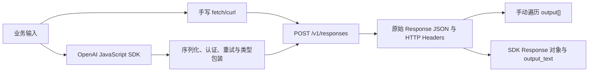

# SDK 与原始 HTTP 模型调用

这篇文章用同一个 OpenAI Responses API 请求贯通原始 HTTP 与 JavaScript SDK，重点不是背两套代码，而是能看清线上真正传输了什么、SDK 又替你做了什么。

## 学习边界与前置知识

开始前应知道 JSON 对象、环境变量、HTTP 方法与状态码；不熟悉时先读 [HTTP、JSON、REST API、状态码、认证与流式响应](../foundations/http-json-api.md)。本文只使用当前的 `POST /v1/responses`，不使用 Chat Completions。

原始 HTTP 是线上的协议交换：客户端发送方法、URL、Header 和字节形式的请求体，服务端返回状态码、Header 和响应体。SDK 是本地语言库：它把同一协议包装成方法、类型、错误类、自动重试和便利属性。SDK 不是另一套模型服务，也不能改变服务端契约。

下图展示两条调用路径最终汇合的位置：



无论入口是哪一种，服务端事实都来自 `POST /v1/responses`。`response.output_text` 是 SDK 汇总文本的便利属性；原始 REST JSON 的权威内容是异构的 `output[]`，其中可能同时出现消息、工具调用和其他输出项。

## 一次请求由哪些部分组成

| 名称 | REST 位置 | 作用与边界 |
| --- | --- | --- |
| 方法 | `POST` | 创建一次 Response；错误地使用 `GET` 不会创建响应。 |
| URL | `https://api.openai.com/v1/responses` | `/v1` 与资源路径都属于接口契约；不要把密钥写进 URL。 |
| `Authorization` | Header | 值为 `Bearer $OPENAI_API_KEY`；只在服务端环境读取，禁止进入浏览器包和 Git。 |
| `Content-Type` | Header | JSON 请求使用 `application/json`；它描述传输格式，不保证 JSON 内容语义正确。 |
| `model` | JSON 字段 | 必填模型标识；别名便于升级，快照更适合可复现实验，仍须确认账户可用性。 |
| `input` | JSON 字段 | 可以是字符串或输入项数组；数组才能明确角色和多模态内容。 |
| `instructions` | JSON 字段 | 当前响应的高层指令；使用 `previous_response_id` 时不会自动继承前一响应的该字段。 |
| `max_output_tokens` | JSON 字段 | 限制输出 Token；过小可能得到 `incomplete`，并在 `incomplete_details` 给出原因。 |
| `store` | JSON 字段 | 控制响应是否可供以后通过 API 检索；它不是应用自身的数据保留策略。 |
| `stream` | JSON 字段 | `false`/缺省得到完整响应，`true` 改为事件流；流式处理见专门文章。 |

响应也不能只取一段文字：

| 原始字段 | 含义 | 使用规则 |
| --- | --- | --- |
| `id` | Response 唯一标识 | 用于检索、串联、取消支持的后台响应和排障；不等同 HTTP 请求 ID。 |
| `created_at` | 创建时间的 Unix 秒 | 用于事件时间，业务延迟仍应用单调时钟在客户端测量。 |
| `status` | 响应状态 | 只有 `completed` 才能按完整成功处理；`incomplete`、`failed`、`cancelled` 等要分支。 |
| `error` | 模型响应失败对象或 `null` | HTTP 成功不保证这里一定没有失败状态。 |
| `incomplete_details` | 不完整原因或 `null` | 例如达到 `max_output_tokens`；不完整 JSON 不得进入业务。 |
| `model` | 实际返回的模型标识 | 与请求值一起记录，避免只知道别名。 |
| `output` | 异构输出项数组 | 必须按每项 `type` 处理，不能假定 `output[0].content[0].text` 永远存在。 |
| `usage` | Token 用量 | 包含输入、输出、总量及缓存/推理等明细；结算优先使用服务端 Usage。 |

## 最小案例：先用原始 HTTP 看清契约

输入是固定问题“JSON 中 `null` 与字段缺失是否相同？”，要求两句话回答。以下命令需要 Bash/zsh、`curl`、`jq` 和已设置的 `OPENAI_API_KEY`；它只创建模型响应，不写业务数据：

```bash
curl --fail-with-body --silent --show-error \
  https://api.openai.com/v1/responses \
  -H "Authorization: Bearer $OPENAI_API_KEY" \
  -H "Content-Type: application/json" \
  -d '{
    "model": "gpt-5-mini",
    "instructions": "用中文准确回答，最多两句话。",
    "input": "JSON 中 null 与字段缺失是否相同？",
    "max_output_tokens": 120,
    "store": false
  }' > response.json

jq '{id, status, model, output, usage, error, incomplete_details}' response.json
```

逐步处理如下：

1. Shell 展开 Header 中的环境变量，但单引号保护 JSON，用户输入不会被当作命令执行。
2. `curl` 把 JSON 字节发送到 Responses endpoint；`--fail-with-body` 让 4xx/5xx 返回非零退出码，同时保留可诊断错误体。
3. 服务端认证、验证 `model` 与请求字段，再生成 Response。
4. `jq` 展示原始对象；此时没有使用任何 SDK 便利属性。
5. 程序先检查 `status`、`error` 与 `incomplete_details`，成功后才遍历 `output[]` 中 `type == "message"` 的内容。

输出文本不是固定措辞，不能把某次模型句子写成断言。可验证的结构是不变量：文件必须是合法 JSON，顶层有字符串 `id`，成功案例的 `status` 为 `completed`，`usage.total_tokens` 为非负整数。

```bash
jq -e '
  (.id | type == "string") and
  (.status == "completed") and
  (.error == null) and
  (.usage.total_tokens | type == "number" and . >= 0)
' response.json
```

`jq -e` 通过时退出码为 `0`。若响应为 `incomplete`，验证会失败；修正不是忽略状态，而是检查 `incomplete_details.reason`，评估提高输出上限、缩短任务或分步处理。

## 用 SDK 完成同一请求

安装官方 JavaScript SDK 后运行此 ES module。SDK 默认读取 `OPENAI_API_KEY`；不要在源码里写密钥。

```bash
npm install openai
node sdk-example.mjs
```

```js
// sdk-example.mjs
import OpenAI from "openai";

const client = new OpenAI({
  timeout: 30_000,
  maxRetries: 1,
});

const response = await client.responses.create({
  model: "gpt-5-mini",
  instructions: "用中文准确回答，最多两句话。",
  input: "JSON 中 null 与字段缺失是否相同？",
  max_output_tokens: 120,
  store: false,
});

if (response.status !== "completed") {
  throw new Error(`response not complete: ${response.status}`);
}

console.log(response.output_text);
console.log(JSON.stringify({
  id: response.id,
  model: response.model,
  usage: response.usage,
}, null, 2));
```

请求体字段仍对应 REST 的 `model`、`instructions`、`input`、`max_output_tokens` 和 `store`。`client.responses.create()`、自动读取环境变量、超时、错误类以及 `response.output_text` 属于 SDK 便利层。尤其要记住：

- REST 响应不承诺顶层 `output_text`；跨语言或脱离 SDK 时应解析 `output[]`。
- `output_text` 适合确认“把所有文本汇总给人看”，不适合保留工具调用、引用、拒绝或各输出项身份。
- SDK 对象上的 `_request_id`（若该版本提供）来自 HTTP 响应 Header，和 Response body 的 `id` 是两个观测标识。
- `maxRetries` 是 SDK 行为，不会出现在发给 Responses API 的 JSON 中。

## HTTP 与 SDK 的选择

| 场景 | 首选 | 原因与代价 |
| --- | --- | --- |
| 学习接口、提交最小复现 | `curl` | 依赖少且能直接展示请求；手写错误和流解析较繁琐。 |
| 正常应用开发 | 官方 SDK | 类型、错误类与流迭代减少样板；必须审计版本与默认重试。 |
| 排查代理、Header、错误体 | 原始 HTTP/抓包 | 能观察线上事实；日志必须脱敏。 |
| SDK 暂未暴露的新字段 | SDK 的额外请求能力或 HTTP | 先核对当前 SDK 支持，不要用 `any` 掩盖拼写错误。 |
| 建立统一模型 Client | SDK Adapter + 契约测试 | 业务不依赖厂商对象，同时保留原始扩展。 |

两者不是二选一：生产代码通常用 SDK，故障复现和契约测试保留一条原始 HTTP 路径。

## 错误分层与排查

### HTTP 层失败

`401` 通常指认证失败，`403` 涉及权限或区域，`429` 可能是速率限制，也可能是额度/账单限制，`5xx` 才可能是暂时服务故障。先保存脱敏后的状态码、错误 `type/code` 与请求 ID，再决定是否重试；不能把所有非 `200` 当网络断开。

### HTTP 成功但任务未完成

检查 `response.status`、`response.error`、`response.incomplete_details` 和输出项类型。`completed` 也只表示接口生成结束，不表示答案事实正确；事实、Schema 和业务约束仍需独立验证。

### SDK 与 curl 结果不同

依次比较 endpoint、模型标识、完整 JSON 字段、SDK 版本、代理、超时和重试次数。输出文本的随机差异不能证明协议不同；应比较结构、状态、Usage 和错误类别。

### 安全边界

- API Key 只放服务端 Secret 管理或本地环境变量；前端必须调用自己的后端。
- 调试日志不记录 Authorization，也不默认保存完整输入输出。
- 不把模型输出直接拼进 Shell、SQL 或 HTML；分别做参数化、转义与业务校验。
- 自动重试只覆盖可重试且无副作用的请求，重试总预算只由一层控制。

## 验证清单

1. 用 `jq empty response.json` 验证原始响应是合法 JSON。
2. 检查 Response `id` 与 HTTP 请求 ID 是否分别记录。
3. 将 `max_output_tokens` 临时调得很小，确认应用进入 `incomplete` 分支而非显示成功。
4. 临时使用无效模型名，确认错误体可见、密钥与堆栈不出现在用户界面。
5. 将 SDK `maxRetries` 设为 `0` 做基线，再确认外层没有叠加无限重试。
6. 对 `output[]` 加入含非消息项的 fixture，确保解析器不会只取固定数组下标。

## 练习与验收

1. 分别用 `curl` 与 JavaScript SDK 提交同一固定输入。验收：保存两份脱敏请求，逐字段说明哪些进入 HTTP JSON、哪些只是 SDK 配置。
2. 写 `extractText(response)` 遍历 `output[]`，只汇总 `message` 中的 `output_text`。验收：对空输出、工具调用在前和多个消息项的 fixture 都有测试。
3. 注入 `401`、`429`、`500` 与 `incomplete` fixture。验收：四者显示不同恢复建议，只有允许的暂时失败进入有限重试。
4. 输出一条实验记录。验收：同时包含请求模型、响应模型、Response ID、请求 ID、状态、Usage、总延迟和 SDK 版本，不包含 Secret。

## 来源

- [OpenAI API Reference：Create a model response](https://developers.openai.com/api/reference/resources/responses/methods/create)（访问日期：2026-07-17）
- [OpenAI API：Text generation](https://developers.openai.com/api/docs/guides/text)（访问日期：2026-07-17）
- [OpenAI API：Error codes](https://developers.openai.com/api/docs/guides/error-codes)（访问日期：2026-07-17）
- [RFC 9110：HTTP Semantics](https://www.rfc-editor.org/rfc/rfc9110.html)（访问日期：2026-07-17）
