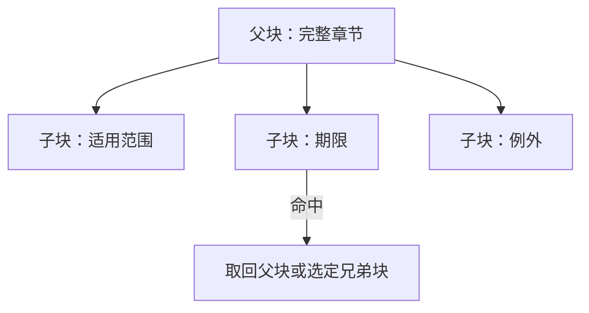

# 固定、段落、标题、语义、滑动窗口与父子分块

Chunk 是从某个不可变来源 revision 中选出的、可独立索引和定位的内容单元。分块决定检索器能命中什么、生成模型能看到多少上下文、引用能否回到原文，也决定索引体积和更新成本。固定长度、段落、标题、语义、滑动窗口和父子分块不是互斥产品功能，而是可以组合的边界策略与取回策略。

## 前置知识与边界

前置阅读：

- [异构文档格式解析](../rag-parsing/01-document-formats-and-parsing.md)。
- [标题、页码、来源与原文定位](../rag-parsing/02-structure-page-source-locators.md)。
- [按文件记录解析质量](../rag-parsing/04-parsing-quality-by-file.md)。

分块输入应是通过质量门的结构化 block，而不是从 PDF 再复制一份纯文本。本文讨论如何形成 chunk；embedding、索引、查询和 rerank 在后续检索文章处理。

## Chunk 的数据合同

一个可维护的 chunk 至少包含：

```json
{
  "chunkId": "chk-policy-v18-0042",
  "sourceId": "refund-policy",
  "sourceRevision": "git:8c14d2a",
  "chunkerVersion": "heading-window-v3",
  "ordinal": 42,
  "text": "特殊商品的退款期限为……",
  "headingPath": ["退款政策", "中国区", "特殊商品"],
  "blockIds": ["b91", "b92", "b93"],
  "locators": [
    {
      "type": "text_range",
      "start": 3810,
      "end": 4024,
      "offsetEncoding": "utf-8-bytes"
    }
  ],
  "parentId": "section-cn-special",
  "previousChunkId": "chk-policy-v18-0041",
  "nextChunkId": "chk-policy-v18-0043",
  "tokenCount": 164,
  "effectiveAt": "2026-07-01T00:00:00+08:00",
  "acl": ["support-cn"]
}
```

### 字段作用

| 字段 | 作用 | 约束 |
|---|---|---|
| `chunkId` | 索引和追踪身份 | 在同一 chunker 版本中稳定 |
| `sourceRevision` | 防止新旧内容混用 | URL 不能代替 revision |
| `chunkerVersion` | 重现实验 | 包含配置内容 hash |
| `ordinal` | 恢复文档顺序 | 不代表相关性 |
| `blockIds` | 连接解析 artifact | 不应只存复制文本 |
| `locators` | 引用原文 | 允许多个不连续区域 |
| `parentId` | 父子取回 | 权限必须与子块一致 |
| 邻接 ID | 扩展上下文 | 取邻居时再次权限和版本过滤 |
| `tokenCount` | 预算与分布统计 | 绑定 tokenizer 版本 |
| 时间与 ACL | 检索过滤 | 服务端重新校验 |

Chunk 文本可以包含注入的标题或列名，但应区分：

- `sourceText`：原文。
- `contextPrefix`：为了独立理解而添加的结构上下文。
- `embeddingText`：实际送入 embedding 的组合。
- `displayText`：给用户引用查看的文本。

把这些都写进一个字符串会让引用显示出原文不存在的内容。

## 分块的三个决策


### 边界

决定哪些 block 可以放在一起，在哪里切断。

### 大小

决定一个 chunk 的目标和硬上限。上限通常按目标 tokenizer 的 Token 计算，不能把字符、字节和 Token 混用。

### 取回

决定索引命中的小单元与送入模型的上下文是否相同。父子分块属于取回关系，不只是切分方式。

## 固定长度分块

固定长度以字符或 Token 窗口连续切分。

### 机制

```text
start = 0
while start < token_count:
  end = min(start + max_tokens, token_count)
  emit(tokens[start:end])
  start = end - overlap_tokens
```

上面是算法描述，不是直接可执行代码。生产实现还要把 Token 范围映射回 block 和 locator。

### 适用

- 大量结构较弱的纯文本。
- 日志、转写或旧数据没有可靠标题。
- 需要稳定吞吐的初始基线。

### 参数

| 参数 | 含义 | 无效配置 |
|---|---|---|
| `max_tokens` | 每块硬上限 | 小于等于 0 |
| `target_tokens` | 尽量达到的长度 | 大于硬上限 |
| `overlap_tokens` | 相邻块重复范围 | 大于等于 max |
| `min_tokens` | 孤立尾块处理门槛 | 大于 target |
| `boundary_snap` | 向附近句/段边界调整 | 没有保留 offset 映射 |

### 特性与风险

- Token 大小可控，适合估算索引和上下文费用。
- 同一 tokenizer 和输入下易复现。
- 可能切断句子、列表、表格和条件—例外关系。
- tokenizer 升级会改变边界，必须增加 chunker 版本。
- 纯 Token slice 不能自动得到准确字符 locator。

## 段落分块

段落分块以解析器提供的 paragraph block 为原子单元，在目标长度内合并相邻段落。

### 合并规则

1. 从同一 heading path 下的相邻段落开始。
2. 加入下一段后不超过硬上限，则合并。
3. 列表、表格、代码块等特殊 block 走专用规则。
4. 单段超过硬上限，进入长段落二次切分。
5. 短尾块优先与同节前块合并，不跨越权限或时间边界。

### 适用

- 编辑质量较好的文章和政策。
- 段落本身能表达完整主张。
- 引用希望定位到原段落。

### 风险

- HTML 中的视觉段落不一定是 `<p>`。
- PDF 解析可能把每行当段落。
- 一个段落可能极长。
- 条款编号与正文可能被解析成两个 block。
- 相邻段落可能属于不同表格单元。

必须先验证解析结构，不能把 parser 的 block 类型当成天然正确。

## 标题分块

标题分块以 section 为主要边界，并把 heading path 保存在 metadata 或 context prefix。

### 机制

```text
退款政策
└── 中国区
    ├── 适用范围
    └── 特殊商品
```

“特殊商品”节的正文块携带完整路径：

```json
{
  "headingPath": ["退款政策", "中国区", "特殊商品"],
  "embeddingPrefix": "退款政策 > 中国区 > 特殊商品"
}
```

### 适用

- API 文档。
- 产品手册。
- 法规、政策和知识库文章。
- 标题层级准确的 Markdown、HTML 和 Word。

### 特殊情况

- 小节短于最小长度：可与同一父标题的相邻小节合并，但保留内部边界。
- 小节超过上限：先保留 heading context，再用段落或句群二次切分。
- 标题层级跳跃：保留原层级 warning，不猜测缺失标题。
- 同名标题：依赖完整 path 和 source locator，不用标题文字作为 ID。

### 风险

标题注入会改变 embedding。重复注入过长路径会让很多 chunk 在向量空间中过度相似。应比较“metadata only”“短路径 prefix”“完整路径 prefix”。

## 语义分块

语义分块根据相邻句子或段落的表示变化寻找主题边界。

### 常见流程

1. 将结构化 block 切成句群。
2. 计算相邻窗口的 embedding。
3. 计算距离或相似度变化。
4. 在超过阈值的位置提出边界。
5. 应用最小长度、最大长度和结构硬边界。
6. 保存 embedding 模型和阈值版本。

### 适用

- 没有可靠标题的长转写。
- 同一段落包含多个主题。
- 语义主题比版面段落更重要的资料。

### 不变量

- 不能跨 source revision。
- 不能跨权限域。
- 不能跨明确表格或代码块硬边界。
- 不能因为 embedding 模型返回错误就静默退化到任意切分。
- 结果必须保留字符或 block locator。

### 风险

- 每个文档增加 embedding 成本。
- 模型升级会导致边界漂移。
- 相似度阈值不跨模型通用。
- 短句和编号会产生噪声。
- “语义变化”不等于“适合检索的证据边界”。

语义分块需要在检索 gold set 上验证，而不是只看切出来的文本是否自然。

## 滑动窗口

滑动窗口让相邻 chunk 重复一段内容，或在查询时扩展命中块的邻居。

### 索引时重叠

例如：

```text
chunk 1: token 0–399
chunk 2: token 320–719
chunk 3: token 640–1039
```

优点：

- 减少答案恰好跨边界时的丢失。
- 实现简单。

代价：

- 增加 embedding、索引和存储。
- 检索结果可能被相邻重复块占满。
- 生成上下文重复 Token。
- 引用可能出现多个几乎相同来源。

### 查询时邻接扩展

只索引非重叠块；命中后按 `previousChunkId` 和 `nextChunkId` 取邻居。

优点：

- 索引不重复。
- 可按查询动态决定扩展范围。

代价：

- 检索服务多一步读取。
- 邻居可能跨节或已失效。
- 必须重新检查 revision、ACL 和有效期。

两种方法应分别评估，不能把它们都叫“overlap”而不记录实现。

## 父子分块

父子分块使用小块检索、大块提供上下文。



### 数据模型

```json
{
  "parent": {
    "id": "section-refund-cn",
    "tokenCount": 1240,
    "blockIds": ["b80", "b81", "b82", "b83"]
  },
  "children": [
    {
      "id": "child-refund-window",
      "parentId": "section-refund-cn",
      "tokenCount": 180,
      "blockIds": ["b81"]
    }
  ]
}
```

### 取回策略

- 命中子块后取完整父块。
- 命中子块后取该子块和相邻兄弟。
- 多个子块命中同一父块时去重父块。
- 父块超出预算时回退到子块加结构摘要。

### 风险

- 父块过大，挤占上下文。
- 子块 ACL 与父块不一致。
- 父块包含与问题无关甚至冲突的其他时段内容。
- 多个命中子块反复加入同一个父块。
- 只引用父块，无法精确高亮支持句。

父块可以提供阅读上下文，citation locator 仍应指向实际支持主张的子块或原始 block。

## 策略组合

生产系统常见组合：

### 结构文档

```text
标题硬边界
→ 段落合并
→ 超长段落按句群切分
→ 少量查询时邻接扩展
```

### 转写

```text
说话人/时间硬边界
→ 语义边界
→ 最大 Token 限制
→ locator 使用时间码
```

### 表格

```text
逻辑表格硬边界
→ 按行组切分
→ 每块注入列名、单位与表名
→ locator 使用 cell range / bbox
```

### API 文档

```text
endpoint 或 symbol 为父块
→ 参数、响应、错误为子块
→ 子块检索
→ 父块或指定兄弟取回
```

“混合策略”必须写成确定性规则和版本配置，不能只在说明文档中描述。

## 应用案例一：退款政策

### 输入

一份 18 页政策包含地区、商品类型、期限、例外和生效时间。问题包括：

- “中国区标准退款期限？”
- “定制商品能否退款？”
- “2026 年 6 月购买适用哪个版本？”

### 候选

1. 400 Token 固定长度，80 Token 重叠。
2. 标题 + 段落，最大 500 Token。
3. 父子分块：小节子块检索，地区章节作为父块。

### 处理

- 三种配置使用同一解析 revision。
- heading、block、locator 与 ACL 不变。
- embedding 和检索参数固定。
- 80 条问题有 gold evidence。
- 比较 Recall@5、重复 Token、引用跨度和生成 groundedness。

### 结果解释

固定块能命中标准期限，但某些例外落在相邻块；重叠提高召回，同时重复候选增加。标题段落保留规则范围。父子方案在复杂例外题上给模型更多上下文，但父块对简单问题过大。

最终可选择：

- 标题段落作为默认。
- 命中“例外”“同时满足”等复杂问题时扩展父块。
- 不在所有查询上固定取父块。

### 失败分支

若父块包含 2025 和 2026 两个版本，模型可能混用。版本必须在解析和 chunk 层拆成不同 source revision，并按查询时间过滤。

## 应用案例二：API 参考

### 输入

每个 endpoint 包含：

- 方法与路径。
- 权限。
- 参数表。
- 请求示例。
- 响应 Schema。
- 错误码。

### 设计

- endpoint 是父块。
- 参数、响应、错误分别形成子块。
- 所有子块注入 endpoint 名和方法。
- 参数表按行组切分时重复列名。
- 命中错误码子块后取权限与错误两个兄弟块，不默认取完整父块。

### 验证

- 查询具体错误码能命中 exact keyword。
- 查询“如何创建订单”能命中 endpoint 概览。
- 引用打开到对应参数行或错误码行。
- 文档删除 endpoint 后，父子索引全部 tombstone。
- 父块和子块权限一致。

### 失败分支

若只保存序列化后的参数表，`required` 和 `default` 列错位也可能仍有可读文本。分块前必须通过表格结构质量门。

## 失败与调试

| 现象 | 可能原因 | 观察点 |
|---|---|---|
| 相关段落从不召回 | chunk 太大或边界错 | gold evidence 与 chunk overlap |
| 结果全是相邻重复 | 索引 overlap 过高 | duplicate token ratio |
| 答案缺少例外 | 条件与例外分块 | heading path、邻接关系 |
| 表格数字无意义 | 列名未注入 | table metadata |
| 引用高亮错位 | Token 到字符映射失败 | locator replay |
| 更新后新旧混用 | revision/filter 缺失 | chunk lineage |
| 父块越权 | ACL 未继承或未复核 | policy decision ID |
| 语义边界漂移 | embedding/chunker 版本变化 | config hash |

调试顺序：

1. 找到问题的 gold evidence 原始 block。
2. 查看它进入哪个 chunk，是否被截断。
3. 检查 embeddingText 与 displayText 的差异。
4. 检查候选中是否出现该 chunk。
5. 若出现但排名低，进入 retrieval/rerank 调试。
6. 若进入上下文但答案缺失，进入 generation/groundedness 调试。
7. 修复后在同一 source revision 和问题集上配对回归。

## 性能与生产边界

### 索引体积

估算：

```text
embedding_count = chunk_count
duplicate_ratio = 重复进入不同 chunk 的 source Token / 所有 chunk Token
```

overlap 和过细子块都会增加向量数量。还要计算 metadata、倒排字段和父块存储。

### 稳定 ID

可使用：

```text
chunk_id = hash(source_revision + chunker_version + ordered_block_ids + slice_range)
```

不要只用 ordinal；文档前部插入一段会让后续编号变化，且无法判断内容是否相同。

### 并发与幂等

- 同一 source revision + chunker version 使用幂等键。
- 解析 artifact accepted 后才排队分块。
- 任务取消要停止后续 embedding。
- 部分失败不能发布半套 parent-child。
- 新索引完成验证后再切换 generation。

### 安全

- ACL 在 chunk、parent、neighbor 扩展和缓存中都必须存在。
- 注入标题和 metadata 时进行脱敏。
- 模型生成的“语义标题”标记为派生内容，不能当原文引用。
- 外部 embedding 服务的数据范围和保留策略必须明确。

## 综合练习

实现一个可比较的 chunk 实验台：

1. 准备政策、API 文档和转写各一份。
2. 保留 source revision、block、heading、表格和 locator。
3. 实现固定、段落、标题、语义、滑动窗口和父子方案。
4. 为每类文档准备至少 20 条带 gold evidence 的问题。
5. 固定 embedding 与检索配置。
6. 输出 chunk 数、Token 分布、重复率、Recall@5 和引用回放。
7. 注入文档更新、ACL 变化和超长表格。
8. 提供基线与候选的逐样例差异。

### 验收标准

- 六种策略的配置、版本和适用边界清楚。
- 每个 chunk 能回到原始 block 与 locator。
- parent、child 和 neighbor 不跨 revision 与权限域。
- 表格分块保留列名和单位。
- 语义模型改变会产生新 chunker version。
- 结果按文档类型分别报告，不用一个均值代替。
- 能解释一条失败发生在分块、检索还是生成。

## 来源

- [Retrieval-Augmented Generation for Knowledge-Intensive NLP Tasks](https://arxiv.org/abs/2005.11401)（访问日期：2026-07-18）
- [Sentence-BERT: Sentence Embeddings using Siamese BERT-Networks](https://arxiv.org/abs/1908.10084)（访问日期：2026-07-18）
- [LangChain Text splitters 概念文档](https://python.langchain.com/docs/concepts/text_splitters/)（访问日期：2026-07-18）
- [Unstructured Chunking](https://docs.unstructured.io/open-source/core-functionality/chunking)（访问日期：2026-07-18）
