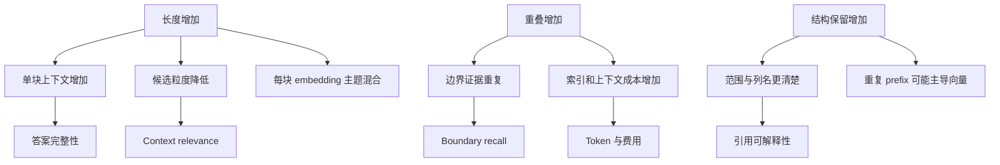

# Chunk 长度、重叠与结构保留的比较

Chunk 长度决定单个候选包含多少信息，重叠决定边界附近内容是否重复，结构保留决定标题、列表和表格关系能否随文本进入检索。三者会同时影响召回、噪声、上下文 Token、引用精度、索引体积和更新成本。参数选择必须使用固定问题与证据集做受控比较，不能从一次回答推断。

## 前置知识与实验边界

前置阅读：

- [固定、段落、标题、语义、滑动窗口与父子分块](01-chunking-strategies.md)。
- [标题、页码、来源与原文定位](../rag-parsing/02-structure-page-source-locators.md)。

本文假定解析 artifact 已通过质量门。实验期间固定：

- source revision。
- parser 与 cleaner 版本。
- embedding 模型。
- keyword 与 vector 索引配置。
- query rewrite。
- reranker。
- 生成模型和 Prompt。
- 评估集。

只改变 chunk 配置，才能把差异归因到长度、重叠或结构。

## 三类变量

### 长度

必须说明单位：

- Unicode code point。
- UTF-8 byte。
- tokenizer Token。
- parser block 数量。

模型预算与费用通常按 Token，locator 通常按 byte、code point 或 UTF-16 unit。实现要保留二者映射。

配置示例：

```json
{
  "tokenizer": "application-model-tokenizer-v4",
  "targetTokens": 420,
  "maxTokens": 520,
  "minTokens": 80,
  "boundarySnapTokens": 48
}
```

`targetTokens` 是合并目标，`maxTokens` 是硬上限，`minTokens` 处理孤立小块，`boundarySnapTokens` 表示可向附近合法边界调整的范围。

### 重叠

重叠可以按固定 Token、比例、句子或相邻 block 计算。配置必须明确：

```json
{
  "mode": "neighbor-block",
  "maxOverlapTokens": 72,
  "preserveWholeSentence": true
}
```

相同 `20% overlap` 对 200 和 1000 Token 块的绝对重复量不同。报告要同时给绝对 Token 和比例。

### 结构保留

结构可通过 metadata、embedding prefix 或取回扩展保留：

| 方式 | 进入 embedding | 进入展示文本 | 用途 |
|---|---:|---:|---|
| heading metadata | 否 | 可选 | 过滤、导航、调试 |
| heading prefix | 是 | 标注后可展示 | 改善独立语义 |
| table header prefix | 是 | 是 | 解释表格行 |
| parent relation | 否 | 按需 | 命中子块后扩展 |
| neighbor relation | 否 | 按需 | 恢复边界上下文 |

结构保留不是“把全部标题重复到每个块”。只注入独立理解所需的信息。

## 因果关系



任何一个方向都不是单调更好。大块可能包含完整规则，也可能带入无关例外；重叠可能找回跨边界答案，也可能让 Top-K 全被重复块占据。

## 实验配置矩阵

不要一开始搜索所有组合。先基于文档结构设定有限候选：

```json
{
  "experimentId": "chunk-grid-policy-v6",
  "sourceSnapshot": "kb-20260718-r3",
  "questionSet": "refund-qa-v5",
  "variants": [
    {
      "id": "v1",
      "targetTokens": 240,
      "maxTokens": 320,
      "overlapTokens": 0,
      "structure": "metadata-only"
    },
    {
      "id": "v2",
      "targetTokens": 420,
      "maxTokens": 520,
      "overlapTokens": 64,
      "structure": "short-heading-prefix"
    },
    {
      "id": "v3",
      "targetTokens": 720,
      "maxTokens": 900,
      "overlapTokens": 96,
      "structure": "heading-and-parent"
    }
  ]
}
```

配置还应保存：

- chunker 代码 commit。
- tokenizer 完整版本。
- 句子边界规则。
- 表格、列表和代码块专用规则。
- 孤立短块合并方向。
- embeddingText 构造规则。

## 数据集设计

### 问题类型

至少覆盖：

- 单段直接事实。
- 条件与结果跨两个段落。
- 规则与例外。
- 多列表项汇总。
- 表格行列交叉。
- 多节证据。
- 无答案。
- 过期版本。
- 权限受限。
- 精确错误码或型号。

### Gold evidence

每题标注 source revision 与 locator，不只标答案：

```json
{
  "caseId": "refund-017",
  "question": "定制商品在质量问题下能否退款？",
  "goldEvidence": [
    {
      "sourceRevision": "policy-v18",
      "blockIds": ["b41", "b42"],
      "relation": "both_required"
    }
  ],
  "risk": "high"
}
```

`both_required` 表示只命中其中一段还不足以回答。这样才能发现边界切分问题。

### 数据拆分

- development：选择候选参数。
- test：最终比较，不反复调参。
- challenge：边界、长表格、冲突和权限。

同一文档的近重复问题不能随机分散到多个集合，否则会高估泛化。

## 分块层指标

### Token 分布

报告：

- p10、p50、p90、p95、max。
- 低于 min 的块比例。
- 触及 hard max 的比例。
- 按文档类型分组。

平均值会掩盖大量超长表格或孤立短标题。

### 重复 Token 比例

定义一个可复现近似：

```text
duplicate_token_ratio =
  因 overlap 或 prefix 重复写入的 Token 数
  / 所有 embeddingText Token 数
```

来源本身重复不计入 overlap；结构 prefix 单独报告。最好同时给：

- overlap duplicate。
- heading prefix duplicate。
- table header duplicate。
- parent storage。

### 边界保留

对标注的不可拆证据，计算是否存在至少一个 chunk 完整覆盖：

```text
boundary_coverage =
  被某个 chunk 完整覆盖的 gold evidence 组
  / 所有 gold evidence 组
```

如果 gold evidence 本就跨节，允许通过 parent/neighbor 组合覆盖，但要单独统计。

### 结构可用性

抽查：

- heading path 是否正确。
- 列表项是否带父条件。
- 表格行是否带列名和单位。
- code sample 是否与描述同块或有关联。
- locator 是否只高亮原文。

## 检索指标

### Evidence Recall@K

```text
Recall@K =
  前 K 个候选覆盖的必要 gold evidence
  / 该问题全部必要 gold evidence
```

文档级 recall 会把“命中了同一份长文档但没有命中支持段落”算对，不适合比较 chunk。

### Context Precision

进入生成上下文的块中，有多少与问题及 gold 主张相关。大块经常保持文档级相关，却包含较多无关 Token，因此还需统计相关 span 占比。

### 排名多样性

Top-K 中：

- 唯一 source 数。
- 唯一 parent 数。
- 相邻重叠块数量。
- 同一证据重复覆盖次数。

重叠配置高时必须在候选合并或上下文选择阶段去重。

## 生成与引用指标

分块实验不能只停在召回：

- grounded claim ratio。
- citation accuracy。
- citation span precision。
- answer completeness。
- 正确拒答。
- 输入 Token。
- 总延迟和费用。

大块可能提升 completeness，却降低 citation span precision。团队要根据风险明确优先级。

## Pareto 选择

不存在天然正确的单一加权总分。可先设置硬门槛：

1. 权限泄漏必须为零。
2. 高风险 evidence recall 不低于门槛。
3. locator replay 通过。
4. p95 输入 Token 与延迟不超过容量。
5. 在合格方案中比较成本和普通样例质量。

如果方案 A 质量高但成本高，方案 B 成本低但质量略低，二者可能都在 Pareto 边界。可按任务路由，而不是强行选一个全局配置。

## 应用案例一：客户支持政策

### 输入

120 份政策，80 条问题。文档中规则和例外常分两个相邻段落。

### 三个候选

| 候选 | 长度 | 重叠 | 结构 |
|---|---:|---:|---|
| S | 240 target / 320 max | 0 | metadata |
| M | 420 / 520 | 64 | 短 heading prefix |
| L | 720 / 900 | 96 | heading + parent |

### 运行

1. 使用同一 source snapshot。
2. 三套索引用同一 embedding。
3. query 和 reranker 固定。
4. 每题保存候选、分数、上下文和引用。
5. 运行三次检查模型波动；检索本身应确定性重放。

### 观察

- S 对直接事实粒度好，但条件—例外完整覆盖不足。
- M 的小幅重叠覆盖多数边界题，重复成本可控。
- L 的 completeness 高，但简单题 context waste 增加。
- heading prefix 改善地区范围，完整三级路径对部分通用词检索造成偏置。

### 决策

默认使用 M；复杂多条件题允许取 parent。heading prefix 只包含最近两个标题，完整路径留在 metadata。

### 验证

- test 集保持相同趋势。
- 高风险问题无回退。
- 引用仍指向 source block，不把 prefix 当原文。
- 删除某 policy revision 后三个索引都不再返回它。

### 失败分支

若在选择 M 后才修改 reranker，无法确认改善来自 chunk 还是 rerank。新 reranker 必须作为下一次独立实验。

## 应用案例二：工程故障手册

### 输入

故障码、症状、诊断步骤和安全警告。问题可能精确查询 `E-431`，也可能描述“启动后连续三次闪烁”。

### 配置

- 每个故障码 section 是硬边界。
- 安全警告与操作步骤不可拆。
- 长步骤列表按完整 list item 分块。
- 每块注入故障码和设备型号。
- 无索引 overlap，查询时命中后取前后一个兄弟块。

### 对照

与 500 Token 固定块加 100 overlap 比较：

- keyword exact hit。
- dense symptom recall。
- safety warning coverage。
- duplicate candidate rate。
- 操作步骤完整性。

### 结果解释

结构方案在错误码和警告上更稳定，固定块对没有标题的旧附件覆盖较好。最终按解析质量路由：

- heading 可靠：结构方案。
- heading 不可靠：固定基线，并记录 degraded strategy。

### 失败分支

如果低质量文档也被强制按标题切分，误判的小字号正文会产生大量碎块。chunker 必须读取 parsing quality report。

## 失败注入

| 注入 | 期望发现 |
|---|---|
| 把 max 从 520 降到 120 | 孤立短块、必要证据断裂 |
| overlap 从 64 升到 300 | 重复候选和索引成本激增 |
| 删除 heading prefix | 地区范围召回变化 |
| 重复完整三级标题 | embedding 主题被共同前缀主导 |
| tokenizer 升级 | Token 边界和超限块改变 |
| 表格列名不注入 | 数字引用缺少语义 |
| 邻接扩展跨 revision | 新旧政策混入同一上下文 |
| 缓存键遗漏 config | 候选实验复用旧结果 |

失败注入后应能在分块统计、候选 trace 和最终指标中看到对应变化。

## 调试

当某题变差：

1. 找出 gold block 和 source revision。
2. 对每个候选配置展示覆盖该 block 的 chunk。
3. 比较 sourceText、prefix、embeddingText 和 Token 边界。
4. 查看 gold 是否进入 Top-K。
5. 查看是否被相邻重复块挤出。
6. 查看 rerank 与上下文去重。
7. 查看最终引用是否落在正确 locator。
8. 把根因标成 parsing、chunk-boundary、retrieval、rerank、context 或 generation。

如果 gold 从未进入任何 chunk，修改 Prompt 没有作用。

## 生产边界

### 发布

- 候选索引使用独立 generation。
- 全量构建后检查 chunk 数和 Token 分布。
- 先影子查询，再小流量切换。
- index alias 原子切换。
- 保留上一 generation 供回滚。

### 成本

记录：

- embedding 输入 Token。
- 向量数量。
- 倒排索引字节。
- parent 和 metadata 存储。
- 每查询候选和 rerank 数。
- 最终上下文 Token。

### 安全

- prefix 不注入无权父标题。
- 邻接与 parent 取回重新执行 ACL。
- 不在日志中展示完整敏感 chunk。
- 外部评估服务只接收允许范围。
- 过期与删除通过 generation 和 tombstone 验证。

## 综合练习

完成一次受控 chunk 参数实验：

1. 选三类文档，各至少 20 条真实问题。
2. 标注必要 evidence block 和 locator。
3. 构建至少三个长度配置、三个重叠配置和两种结构配置。
4. 先做小型筛选，再在 test 集比较入围方案。
5. 报告 Token 分布、重复率、边界覆盖、Recall@K、Groundedness、Citation Accuracy、延迟和成本。
6. 对表格、列表、超长段落和权限问题单独分组。
7. 保存 manifest、逐样例差异和回滚索引。

### 验收标准

- 实验期间除 chunk 配置外的链路版本固定。
- 每个指标定义分子、分母、单位和聚合方式。
- gold evidence 绑定 source revision。
- 结构 prefix 与原文分开保存。
- 高风险门槛优先于平均总分。
- 能从一条退化定位到具体 chunk 边界。
- 发布后可以在一个切换操作内回到基线 generation。

## 来源

- [Retrieval-Augmented Generation for Knowledge-Intensive NLP Tasks](https://arxiv.org/abs/2005.11401)（访问日期：2026-07-18）
- [Lost in the Middle: How Language Models Use Long Contexts](https://arxiv.org/abs/2307.03172)（访问日期：2026-07-18）
- [Sentence-BERT: Sentence Embeddings using Siamese BERT-Networks](https://arxiv.org/abs/1908.10084)（访问日期：2026-07-18）
- [Unstructured Chunking](https://docs.unstructured.io/open-source/core-functionality/chunking)（访问日期：2026-07-18）
