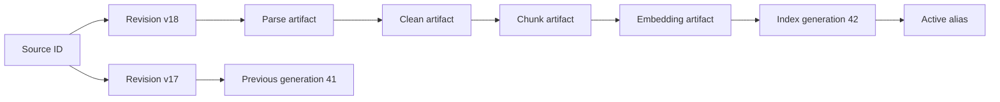
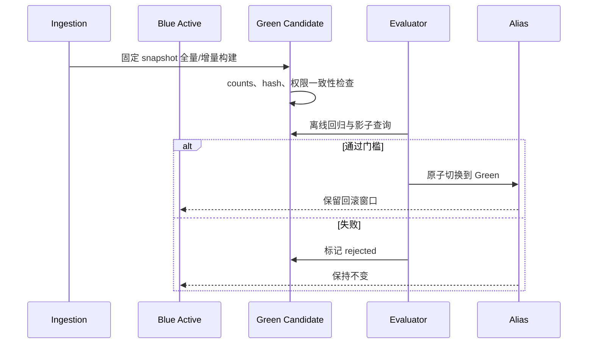

# 文档版本、更新、删除与重新索引

RAG 索引是来源内容经过解析、清洗、分块和 embedding 后产生的派生数据。来源更新时，旧 chunk、向量、关键词条目、缓存和引用都可能继续存在。可靠系统要用不可变 revision 和 generation 管理派生链路，让更新可验证、删除可证明、重新索引可切换、失败可回滚。

## 前置知识与能力边界

前置阅读：

- [固定、段落、标题、语义、滑动窗口与父子分块](01-chunking-strategies.md)。
- [按文件记录解析质量](../rag-parsing/04-parsing-quality-by-file.md)。
- [标题、页码、来源与原文定位](../rag-parsing/02-structure-page-source-locators.md)。

本文讨论 source 到 searchable generation 的生命周期。数据库备份、向量算法和线上缓存实现在其他主题展开。

完成后应能：

- 区分 source identity、source revision、artifact version 和 index generation。
- 计算内容更新影响哪些派生物。
- 让删除传播到全部检索通道和缓存。
- 蓝绿构建新索引并原子切换。
- 验证不存在新旧 embedding 空间混用。
- 在发布失败时回到上一代。

## 四种身份

### Source identity

业务上的同一来源：

```text
repo://policies/refund
```

它可以长期存在并经历多个内容版本。

### Source revision

某一时刻不可变的内容：

```text
git:8c14d2a
sha256:54c1...
object-version:3Lg...
```

revision 应来自来源系统版本或内容 hash。`updatedAt` 和 URL 不足以唯一标识内容。

### Artifact version

解析、清洗、chunk 与 embedding 的每个输出同时依赖：

- source revision。
- 处理器代码版本。
- 配置 hash。
- 模型或 tokenizer 完整版本。

### Index generation

一次对外一致可查询的索引快照。generation 包含一组通过质量门的 artifact 与过滤 metadata。



Active alias 只指向通过验收的一代。生成新 artifact 不应立刻改变线上查询。

## Lineage manifest

```json
{
  "generationId": "support-kb-g42",
  "createdAt": "2026-07-18T08:30:00Z",
  "sourceSnapshot": "kb-snapshot-20260718-01",
  "pipeline": {
    "parser": "pdf-layout-5.2.1",
    "cleaner": "clean-v3:sha256:21a...",
    "chunker": "heading-420-v6:sha256:7bc...",
    "tokenizer": "tokenizer-v4",
    "embeddingModel": "embedding-e4-2026-06",
    "embeddingDimensions": 2048
  },
  "stores": {
    "vectorNamespace": "support-g42-vector",
    "keywordIndex": "support-g42-keyword",
    "metadataSnapshot": "support-g42-meta"
  },
  "counts": {
    "sources": 18422,
    "chunks": 412806,
    "vectors": 412806
  },
  "status": "ready"
}
```

manifest 本身不可变。状态变化可以写事件或新记录，不覆盖构建所用配置。

## 变更检测

### 内容改变

下载来源后计算内容 hash。若 revision 改变：

1. 创建新 source revision。
2. 解析与质量检查。
3. 清洗和分块。
4. 生成 embedding。
5. 写入候选 generation。
6. 标记旧 revision 在候选 generation 中不可见。

### Metadata 改变

ACL、生效时间、标题和分类改变时，是否需要重算 embedding 取决于字段是否进入 `embeddingText`：

| 变化 | 重解析 | 重分块 | 重 embedding | 更新索引 metadata |
|---|---:|---:|---:|---:|
| ACL | 否 | 否 | 否 | 是 |
| 标题且进入 prefix | 否/按来源 | 是 | 是 | 是 |
| 生效时间只作 filter | 否 | 否 | 否 | 是 |
| 正文字节 | 是 | 是 | 是 | 是 |
| chunker 配置 | 否 | 是 | 是 | 是 |
| embedding 模型 | 否 | 否 | 是 | 是 |

这里的“否”仍需验证上游 artifact 可复用，并保存依赖关系。

### 删除

删除事件必须包含：

```json
{
  "eventId": "delete-0192",
  "sourceId": "refund-policy-legacy",
  "deletedRevision": "sha256:81ab...",
  "requestedAt": "2026-07-18T09:10:00Z",
  "reason": "source_deleted",
  "actorPolicyDecisionId": "pd-7721"
}
```

删除不是只删 source 表的一行，而是一个跨派生系统的工作流。

## 更新计划

从 source snapshot 计算 diff：

```json
{
  "planId": "reindex-plan-42",
  "baseGeneration": "support-kb-g41",
  "targetGeneration": "support-kb-g42",
  "changes": {
    "insert": ["source-91"],
    "update": ["source-12", "source-44"],
    "delete": ["source-08"],
    "metadataOnly": ["source-77"]
  }
}
```

计划生成后，来源仍可能变化。执行时要：

- 固定 snapshot。
- 或使用乐观版本检查。
- 或在完成前再做一次增量追赶。

不能一边扫描可变来源，一边宣称得到一致快照。

## Chunk 身份与变更范围

### 内容寻址

可计算：

```text
chunk_content_hash =
  hash(source_revision
       + chunker_config_hash
       + ordered_block_ids
       + slice_ranges
       + embedding_prefix)
```

优点：

- 相同输入可幂等复用。
- 内容变化产生新身份。
- 能证明 vector 对应哪段 embeddingText。

### 逻辑身份

产品可能希望“退款期限”跨 revision 保持逻辑 identity。可另设：

```json
{
  "logicalChunkId": "refund-cn-window",
  "chunkRevisionId": "refund-cn-window@v18",
  "contentHash": "sha256:..."
}
```

逻辑 ID 用于历史和 diff，检索与引用必须绑定具体 chunk revision。

### 局部重建

局部重建需要依赖图：

- heading 改变会影响该 section 下所有 prefix。
- table header 改变会影响所有 row group。
- list lead 改变会影响全部 item chunk。
- parent 边界改变会影响 child 和 neighbor。
- 前文插入不应因 ordinal 改变而误判全部内容变化。

没有依赖图时，整份 source revision 重建更安全。

## Embedding 模型迁移

不同模型、维度或归一化方式产生的向量不能直接当作同一空间比较。

迁移规则：

1. 新模型写入新 namespace 或 generation。
2. 不把新向量增量写进旧空间。
3. 全量构建或明确双读。
4. 在固定检索集比较 recall、排名、延迟与成本。
5. 切换 keyword 与 vector 融合配置。
6. 缓存键包含 embedding generation。
7. 保留旧 generation 到回滚窗口结束。

即使两个模型维度相同，也不说明向量空间兼容。

## 蓝绿索引

### 构建



### 就绪检查

- expected source 数。
- accepted parsing report 数。
- chunk 与 vector 数一一对应。
- keyword 和 vector 覆盖相同 revision 集。
- ACL 和有效时间存在。
- 删除集合不在候选 generation。
- 随机 locator 回放。
- 评估集通过。
- 查询服务可加载全部配置。

### 切换

alias 切换要原子。应用请求记录 generation ID，长请求在一次执行中保持同一代，避免第一轮检索来自 g41、后续工具检索来自 g42。

## 删除传播

需要覆盖：

- source catalog。
- parsing、cleaning 和 chunk 派生视图。
- vector namespace。
- keyword index。
- metadata/filter store。
- exact、semantic 与 retrieval cache。
- precomputed answer。
- 调试预览和临时文件。
- 备份与审计记录中的合法保留策略。

### Tombstone

先写 tombstone 可以立即阻止查询：

```json
{
  "sourceId": "source-08",
  "deletedAt": "2026-07-18T09:10:00Z",
  "deletionGeneration": "support-kb-g42",
  "state": "hidden_pending_purge"
}
```

查询必须在所有通道应用 tombstone。后台再物理清理。

### 删除证明

验证：

1. 按 source ID 搜索无结果。
2. 按已知 unique phrase 搜索无结果。
3. vector、keyword、metadata 均无可见条目。
4. 缓存失效。
5. 无权调试接口不显示标题。
6. 删除事件、执行阶段和完成时刻可审计。

“数据库返回 0 行”不足以证明其他存储已删除。

## 应用案例一：政策 v17 到 v18

### 变化

- 标准期限从 7 天改为 14 天。
- 新增定制商品例外。
- v18 在 2026-07-01 生效。
- v17 对之前订单仍有效。

### 建模

不能简单删除 v17。按订单时刻查询：

```json
{
  "sourceId": "refund-policy",
  "revisions": [
    {
      "id": "v17",
      "validFrom": "2026-01-01T00:00:00+08:00",
      "validTo": "2026-07-01T00:00:00+08:00"
    },
    {
      "id": "v18",
      "validFrom": "2026-07-01T00:00:00+08:00",
      "validTo": null
    }
  ]
}
```

### 更新

1. 读取 v18 不可变文件。
2. parsing quality accepted。
3. 生成新 chunk 与 embedding。
4. g42 同时包含 v17、v18，但 metadata 生效区间不同。
5. 查询服务必须拿订单时间做 filter。
6. 回归测试边界时刻前后。

### 验证

- 2026-06-30 订单只召回 v17。
- 2026-07-01 订单只召回 v18。
- 无订单时间时返回 needs-input，不让模型猜。
- 引用显示 revision 和生效时间。
- cache key 包含业务查询时刻或归一化生效区间。

### 失败分支

如果把 v17 物理删除，历史订单无法按当时政策回答；如果两者都召回而不做时间过滤，模型可能选择错误版本。

## 应用案例二：embedding e3 到 e4

### 目标

知识库 410,000 个 chunk，需要迁移 embedding。不能停机，也不能混合向量。

### 计划

- g41 使用 e3 和 vector namespace `support-e3`。
- g42 使用相同 chunk revision，生成 `support-e4`。
- keyword index 可复用，但 hybrid fusion 的分数校准重新评估。
- 固定 800 条检索问题比较 Recall@10、MRR、权限与 p95。
- 影子运行真实查询，不把候选返回用户。

### 容量

记录：

- 待 embedding Token。
- 速率上限。
- 预计费用。
- 每批大小。
- checkpoint。
- 错误重试与死信。

任务幂等键使用 `chunk_revision_id + embedding_model_version`。

### 发布

1. g42 向量数与 eligible chunk 数一致。
2. 随机验证 vector metadata 的 content hash。
3. 离线门槛通过。
4. 影子查询没有权限泄漏。
5. 原子切换 generation。
6. 监控一段回滚窗口。
7. 再按策略清理 e3。

### 失败分支

若直接把 e4 向量追加到 e3 namespace，即使维度相同，距离也不具备统一解释，排名会不可预测，且无法通过 query trace 区分模型。

## 应用案例三：法律删除请求

### 输入

用户要求删除其上传文档。文档已产生：

- parsing artifact。
- 14 个 chunks。
- keyword 和 vector 条目。
- 两条检索缓存。
- 一次调试 trace。

### 执行

1. 服务端验证 actor 与删除范围。
2. 写审计事件与 tombstone。
3. 查询立即过滤 source ID。
4. 队列执行各存储删除。
5. 缓存按 source dependency 失效。
6. trace 按政策删除正文预览，保留必要审计元数据。
7. 验证各通道无可见结果。
8. 返回 deletion job 状态。

### 验证

- 用原 query、unique phrase 和 source ID 检索。
- 检查 active 与 candidate generation。
- 检查重试不会恢复旧对象。
- 检查备份保存周期与删除政策。
- 删除工作流失败时不移除 tombstone。

### 失败分支

如果物理删除向量失败，tombstone 仍阻止用户查询；工作流进入 partial failure 并继续重试，而不是把源重新设为可见。

## 幂等、重试和并发

### 幂等

每一步 key：

```text
parse: source_revision + parser_config
chunk: parse_artifact + chunker_config
embed: chunk_revision + embedding_model
index: artifact_set + generation
delete: deletion_event + store
```

重复任务返回既有成功 artifact，不产生重复 chunk。

### 并发更新

source v18 与 v19 同时到达时：

- 每个 revision 独立处理。
- source catalog 用版本检查决定当前 revision。
- generation 构建固定 snapshot。
- 晚完成的旧任务不能覆盖新 alias。

### 有限重试

只重试可恢复错误：

- 临时网络失败。
- 速率限制。
- 暂时存储不可用。

Schema 不兼容、权限缺失和损坏文件进入 quarantine 或 dead letter，不无限重试。

## 观测

每个任务记录：

- trace ID。
- source revision。
- base/target generation。
- stage。
- attempt。
- input/output hash。
- count delta。
- latency。
- error code。
- cancellation。

指标：

- index freshness。
- update propagation time。
- delete visibility latency。
- stale hit rate。
- generation build success。
- orphan chunk/vector。
- retry/dead-letter。
- rollback duration。

stale hit 需要通过带 revision 的候选 trace 计算，不能只看回答是否“像旧内容”。

## 调试路径

发现旧文档仍被引用：

1. 从回答 citation 取得 chunk revision 和 generation。
2. 查看请求是否命中旧缓存。
3. 检查 source catalog 的当前与历史 revision。
4. 检查 active alias 指向。
5. 检查 keyword、vector 和 metadata 各自 generation。
6. 查看有效时间与 tombstone filter。
7. 检查长任务是否跨 generation。
8. 重放同一请求并固定 generation。

发现 chunk 缺失：

1. parsing quality 是否 accepted。
2. chunk job 是否成功。
3. embedding 是否一一对应。
4. index filter 是否错误排除。
5. alias 是否已切换。

## 生产安全边界

- 权限变化优先于内容重建，可通过 metadata/tombstone 立即收紧。
- 旧 ACL 缓存不可在新权限下复用。
- index builder 使用最小权限，不能修改来源。
- manifest 与审计日志不含 Secret。
- 外部 embedding 服务接收的数据遵守租户和区域策略。
- 模型不能决定删除范围或批准索引发布。
- 删除、切换和回滚由确定性控制面执行。

## 综合练习

实现一个最小索引生命周期控制面：

1. 建立 source、revision、artifact、generation 四类实体。
2. 为 parse、chunk、embed 和 index 保存 lineage。
3. 支持 insert、content update、metadata update 和 delete。
4. 建立 blue/green generation 与 active alias。
5. 模拟 embedding 模型迁移，禁止混合 namespace。
6. 模拟政策的有效时间版本。
7. 模拟删除部分失败与 tombstone。
8. 提供按 run/source/chunk/generation 的调试查询。

### 验收标准

- 同一输入重复执行不产生重复向量。
- 内容、chunker 或 embedding 改变会产生新 artifact。
- ACL 收紧后旧缓存不能泄漏。
- active generation 只在全部门槛通过后切换。
- v17/v18 能按业务时刻准确检索。
- 删除能在 keyword、vector、metadata 和 cache 中验证。
- 候选失败能回滚到上一代。
- 每条引用带具体 source revision 和 generation。

## 来源

- [RFC 9110 — HTTP Semantics: ETag 与条件请求](https://www.rfc-editor.org/rfc/rfc9110.html)（访问日期：2026-07-18）
- [Amazon S3 Versioning](https://docs.aws.amazon.com/AmazonS3/latest/userguide/Versioning.html)（访问日期：2026-07-18）
- [Elasticsearch Aliases](https://www.elastic.co/docs/manage-data/data-store/aliases)（访问日期：2026-07-18）
- [Qdrant Collections](https://qdrant.tech/documentation/concepts/collections/)（访问日期：2026-07-18）
- [Retrieval-Augmented Generation for Knowledge-Intensive NLP Tasks](https://arxiv.org/abs/2005.11401)（访问日期：2026-07-18）
