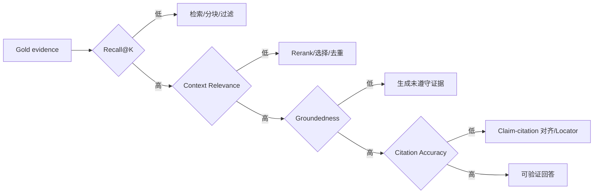

# Recall@K、Context Relevance、Groundedness 与 Citation Accuracy

RAG 是多阶段系统，必须分别测检索有没有找回证据、上下文是否相关、回答主张是否受证据支持、引用是否指向正确位置。Recall@K、Context Relevance、Groundedness 和 Citation Accuracy 对应不同责任边界，不能合成一个不透明总分后直接归因。

## 前置知识与运行记录

前置阅读：

- [相关文档与参考答案标注](02-relevant-documents-reference-answers.md)。
- [Top-K、Threshold 与 Rerank](../rag-retrieval/04-topk-threshold-rerank.md)。

一次评估至少保存：

```json
{
  "caseId": "rag-refund-0041",
  "runId": "run-g42-rerank5-prompt12",
  "retrieved": ["chunk-a", "chunk-b"],
  "context": ["chunk-b"],
  "answer": "标准期限是 14 天，但定制商品不适用。",
  "citations": [
    {"claimId": "c1", "evidenceId": "ev-window"},
    {"claimId": "c2", "evidenceId": "ev-custom"}
  ],
  "versions": {
    "dataset": "refund-eval-v5",
    "indexGeneration": "g42",
    "prompt": "support-v12",
    "model": "reader-2026-06"
  }
}
```

缺少逐阶段 artifact 就无法计算或诊断四个指标。

## Recall@K

Recall@K 测前 K 个检索候选覆盖多少 gold evidence。

### 单一相关项

```text
Recall@K =
  前 K 中相关 evidence 数
  / gold 相关 evidence 总数
```

若 gold 只有一个，结果是 0 或 1。

### 多证据

问题要求主规则和例外，gold 有两个 required evidence。前 5 只命中一个：

```text
evidence recall@5 = 1 / 2 = 0.5
complete requirement recall@5 = 0
```

两者都要报。平均 evidence recall 不能表示问题是否具备完整回答条件。

### Any-of

若两个来源任意一个都可支持同一 claim，分母不是 2。按 requirement group：

```text
requirement satisfied =
  top K 与 any-of group 至少一个成员相交
```

### 匹配单位

候选 chunk 覆盖 gold block/span：

- 完全包含。
- overlap 超过标注门槛。
- 语义等价且经标注的替代 evidence。

不能仅因候选来自同一长文档就算命中。

### Macro 与 Micro

- Macro：每题 recall 先算再平均，题目同权。
- Micro：汇总所有 evidence 分子分母，多 evidence 题权重大。

报告二者，并按任务/risk 分组。

### K 的含义

明确是：

- 第一阶段候选 K。
- fusion K。
- rerank K。
- context K。

每阶段都可算 recall 漏斗。若 candidate Recall@100 高、context recall 低，问题在 rerank/selection，不在第一阶段。

## Context Relevance

Context Relevance 判断实际发送给生成模型的内容对问题是否有帮助。

### Passage 级

每个 context chunk：

- directly relevant。
- supporting context。
- irrelevant。
- contradictory/stale。
- unauthorized（必须为零）。

```text
context precision =
  relevant context chunks
  / all context chunks
```

Chunk 大小时，passage 级会把只有一句相关的长块全算相关。

### Span/Token 级

标注或判断 chunk 中相关 span：

```text
context utilization potential =
  relevant span tokens
  / all context tokens
```

该指标更敏感于大块噪声，但分词和 span 标注成本高。

### 顺序和干扰

同样内容放在不同位置可能影响模型使用。Context Relevance 只说明内容相关，不保证模型能利用。还应记录：

- 证据位置。
- 重复比例。
- 冲突来源。
- 总 Token。
- context truncation。

### 判断方式

- gold locator 确定性匹配。
- 人工判断。
- LLM Judge。

自动 judge 要先与人工标注比较，输出 `unjudged` 而不是遇错填 0。

## Groundedness

Groundedness 问：回答中的可验证主张是否被提供的 context 支持。

### Claim segmentation

回答：

```text
标准退款期限为 14 天；定制商品不适用，而且退货运费固定为 20 元。
```

拆为：

1. 标准期限 14 天。
2. 定制商品不适用。
3. 运费固定 20 元。

前两条有证据，第三条无证据：

```text
grounded claim ratio = 2 / 3
```

### Claim 权重

普通连接词不算事实 claim。高风险数字、日期、权限和操作可提高权重，但同时报告未加权结果，避免权重掩盖失败。

### 支持关系

标签：

- entailed/supported。
- contradicted。
- not enough information。
- unverifiable/non-factual。

“context 没有反驳”不等于支持。

### 正确但不 grounded

模型可能靠预训练答对 14 天，但 context 没有该句。答案 correctness 可以高，groundedness 仍失败。RAG 产品若承诺依据企业资料，必须把两者分开。

### 推论

证据：

- 标准期限 14 天。
- 定制商品不适用。

问题问“定制商品两周后还能按标准政策退吗”。“不能按标准政策”是受控推论，不必在原文逐字出现。评估指南要允许由明确证据支持的逻辑推论，同时禁止引入额外事实。

## Citation Accuracy

引用质量至少分：

### Citation correctness

引用的 evidence 是否支持紧邻 claim。

### Citation completeness

需要引用的 claim 是否都有引用。

### Citation validity

引用 ID 是否存在、source revision 是否可访问、locator 是否可回放。

### Citation precision

引用范围是否过宽。整份 100 页 PDF 可能包含支持内容，但不是精确引用。

### Citation authority

引用是否是对请求时刻有效且允许的来源。旧 FAQ 即使写着相同数字，也可能不是正确依据。

结构：

```json
{
  "claimId": "c1",
  "citationId": "cite-1",
  "sourceRevision": "policy-v18",
  "locator": {
    "type": "text_range",
    "start": 3810,
    "end": 3862
  },
  "support": "direct",
  "validAtRequestTime": true
}
```

## 指标之间的诊断关系



正确性仍需单独测。一个完全 grounded 的回答可能忠实引用了错误的源数据。

## Correctness 与 Completeness 的补充关系

四个指标不直接回答“最终结论是否符合 gold claims”。因此端到端报告还要加入：

- `claim correctness`：回答主张与 reference claim 是否一致。
- `claim completeness`：全部 required claims 是否出现。
- `forbidden claim count`：是否增加明确错误或越界主张。
- `answer relevance`：回答是否解决用户任务，而不是只复述证据。

例如 context 本身包含一份被错误录入的“7 天”当前政策，模型逐字引用它：Groundedness 与 Citation Accuracy 都可能通过，但 Correctness 会相对经过裁决的 gold 失败。反过来，回答只写正确的“14 天”，却遗漏“定制商品例外”，Correctness 的已输出主张可通过，Completeness 仍失败。

诊断时先确认 gold 和 source governance 是否正确，再判断系统层。不能为了让模型输出匹配参考答案，而忽略生产 source 中已经存在的数据错误。

## Grader 设计

### 确定性检查

适合：

- JSON Schema。
- citation ID 存在。
- locator replay。
- source revision/effective time。
- exact numeric value。
- required evidence overlap。
- unauthorized source。

### 人工评估

适合：

- 复杂推论。
- 主张拆分。
- 冲突解释。
- 领域完整性。
- Judge 校准。

### LLM Judge

输入：

- query。
- claim。
- evidence。
- rubric。

输出：

```json
{
  "label": "supported",
  "evidenceSpans": ["ev-1:44-71"],
  "confidence": "high",
  "reasonCode": "direct_statement"
}
```

不要要求私有思维过程。保存短 reason code 和证据 span。

### Judge 校准

在人工 gold 上测：

- accuracy/F1。
- 各 label confusion matrix。
- repeated-run consistency。
- 不同输入顺序。
- 模型版本差异。
- 对否定、数字、表格和长 context 的分组。

Judge 与被评系统使用同模型家族可能共享偏差。不能把单个 Judge 当绝对真值。

## 应用案例一：规则与例外

### Gold

- required `ev-window`。
- required `ev-custom`。
- reference claims c1/c2。

### Run A

Top5 只有期限：

- Recall@5 = 1/2。
- complete requirement = 0。
- context relevance 高。
- 回答“14 天内可退”。
- groundedness 可能对所见 context 高，但 correctness 错。

根因是检索/证据完整性，而不是仅生成。

### Run B

Top5 两者都有，context 只选期限：

- candidate Recall@5 = 1。
- context evidence recall = 0.5。
- 根因是 context selector。

### Run C

context 两者都有，回答仍忽略例外：

- context relevance 高。
- groundedness/正确性失败。
- 根因进入生成。

### Run D

回答正确，但期限 claim 引用例外段，例外 claim 引用期限段：

- groundedness 高。
- citation correctness 低。
- 根因是 claim-citation 对齐。

## 应用案例二：表格费率

### 证据

row value、column header、unit、生效日期和脚注。

### 指标

- Recall 要求覆盖 data cell + header。
- Context Relevance 统计重复表头 Token。
- Groundedness 对金额、单位、地区、时间分别拆 claim。
- Citation 指向 cell range 和 header。

### 失败

模型输出 3.5 元，但引用只指向一列没有单位。数字可能正确，Citation completeness 仍不合格。

## 应用案例三：长回答

一个回答 12 句，其中：

- 8 个事实 claim。
- 2 个建议。
- 2 个界面引导。

Groundedness 分母只包含可验证事实。建议若声称“这样一定安全”则包含事实主张，需证据。引用不要统一堆在段尾，应建立 claim-citation 关系。

## 聚合与不确定性

报告：

- 样例数。
- 未判定数。
- 分子/分母。
- mean 与分位数。
- 按标签分组。
- bootstrap confidence interval。
- 与基线配对差异。

不要把不同 Judge version 的分数直接拼一条趋势线。重跑或标明断点。

## 失败注入

| 注入 | 应影响 |
|---|---|
| 删除 gold chunk | Recall |
| 加入十个主题相关噪声块 | Context Relevance |
| 回答添加无证据数字 | Groundedness |
| 交换两个 citation ID | Citation correctness |
| citation 指向整页 | Citation precision |
| 使用过期 revision | authority/time validity |
| 压缩 context 删除证据句 | Groundedness/Citation |
| ACL 移除 | unauthorized exposure 必须为零 |

注入应只改变一个变量，以验证 metric 真能捕捉目标失败。

## 调试页面

逐样例展示：

- gold requirements。
- candidate ranks。
- selected context。
- claim segmentation。
- 每 claim support label。
- citation target/highlight。
- grader version。
- raw deterministic checks。
- 人工 override 与原因。

不得向普通用户显示未授权 gold evidence。

## 综合练习

实现四层 RAG evaluator：

1. 准备 60 条带 requirement groups 和 claims 的样例。
2. 保存候选、context、answer 和 citation。
3. 计算不同阶段 Recall@K。
4. 评 Context Relevance。
5. 拆 claim 评 Groundedness。
6. 检查 Citation validity/correctness/completeness/precision。
7. 对自动 Judge 使用人工子集校准。
8. 运行八种失败注入。

### 验收标准

- K 的阶段明确。
- any-of/all-of 正确计算。
- 文档级命中不冒充 span 级命中。
- 正确性与 groundedness 分开。
- Citation 至少检查支持、覆盖、locator 与时效。
- 自动 Judge 有 confusion matrix 和版本。
- 指标退化能映射到具体阶段。
- 权限违规不被平均分掩盖。

## 来源

- [RAGAS: Automated Evaluation of Retrieval Augmented Generation](https://aclanthology.org/2024.eacl-demo.16/)（访问日期：2026-07-18）
- [ARES: An Automated Evaluation Framework for RAG Systems](https://aclanthology.org/2024.naacl-long.20/)（访问日期：2026-07-18）
- [GaRAGe: A Benchmark with Grounding Annotations for RAG Evaluation](https://aclanthology.org/2025.findings-acl.875/)（访问日期：2026-07-18）
- [Groundedness in Retrieval-augmented Long-form Generation](https://aclanthology.org/2024.findings-naacl.100/)（访问日期：2026-07-18）
