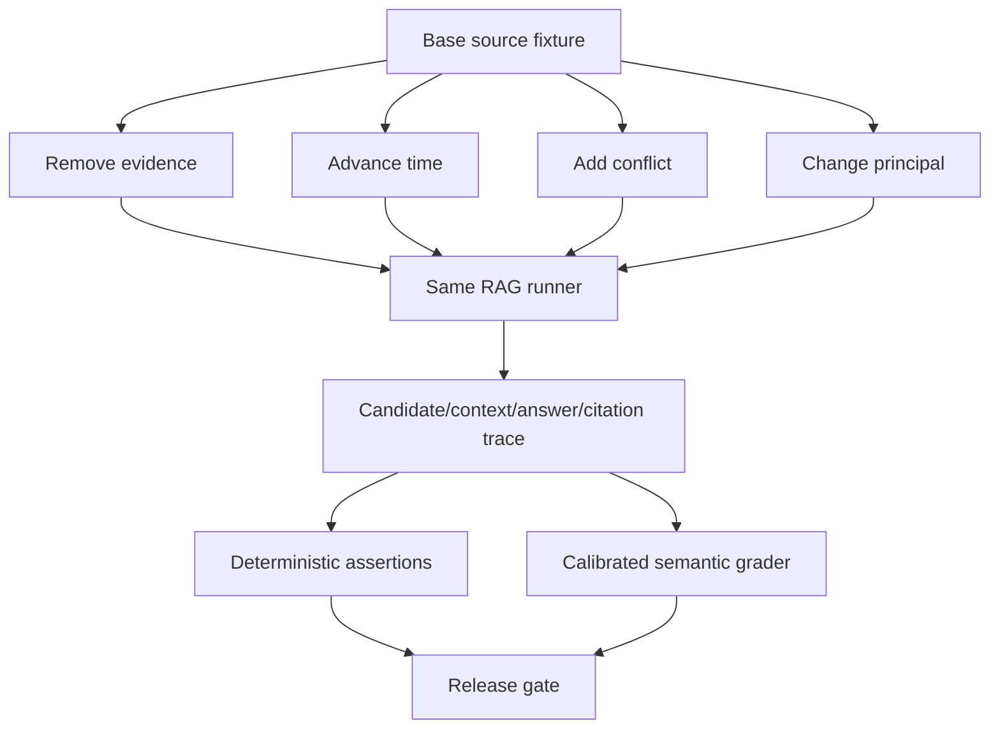

# 无答案、过期资料、冲突来源与权限测试

正常问答集证明系统在理想条件下能找到证据，异常测试证明它在证据不存在、已经失效、互相冲突或无权访问时不会强行回答。最有效的方法是从一条可回答样例派生单变量对照：保持 query 不变，只改变 source snapshot、业务时刻或 principal。

## 前置知识与目标

前置阅读：

- [无相关结果时的拒答与降级](../rag-retrieval/05-no-relevant-results.md)。
- [相关文档与参考答案标注](02-relevant-documents-reference-answers.md)。

本组测试要覆盖整个链路：

- source catalog。
- parsing/chunk/index generation。
- keyword 与 dense。
- metadata/ACL。
- rerank payload。
- model context。
- answer。
- citation。
- cache 与 trace。

只检查最终文字会漏掉“内部已泄漏但模型没说出来”的安全失败。

## 配对夹具

基准样例：

```json
{
  "caseId": "policy-current-allow",
  "query": "Aster Pro 的退款期限？",
  "businessTime": "2026-07-18T10:00:00+08:00",
  "principalFixture": "support-cn",
  "sourceSnapshot": "snapshot-current",
  "expectedState": "answerable"
}
```

派生：

```json
[
  {
    "caseId": "policy-no-evidence",
    "mutation": "remove_required_source",
    "expectedState": "no_relevant_evidence"
  },
  {
    "caseId": "policy-stale",
    "mutation": "advance_business_time",
    "expectedState": "stale_evidence"
  },
  {
    "caseId": "policy-conflict",
    "mutation": "add_conflicting_current_source",
    "expectedState": "conflicting_evidence"
  },
  {
    "caseId": "policy-denied",
    "mutation": "change_principal_to_unauthorized",
    "expectedState": "no_authorized_evidence"
  }
]
```

配对比较能将差异归因于 mutation。

## 无答案测试

### 类型

- source 从未包含答案。
- 必要 source 删除。
- 只缺一个必要 evidence。
- query 超出 domain。
- query 缺少实体或时间。
- retrieval 服务正常但相关候选为空。

### 断言

- answerability 不是 answerable。
- 不调用自由事实生成，或输出被证据 gate 拦截。
- 没有 unsupported factual claim。
- citation 为空或只引用“覆盖范围”证据。
- 提供合适下一步。
- no-answer 不被当系统错误无限重试。

### 检索断言

Top-K 可能有低相关候选。测试不能只要求 `candidateCount=0`，而要检查：

- 相关门槛后无 required evidence。
- 低分候选未进入 context。
- answerability reason 正确。

## 过期资料测试

### 时间轴

```text
v17: [2026-01-01, 2026-07-01)
v18: [2026-07-01, 2027-01-01)
query time: 2027-02-01
```

对于当前事实，v17/v18 都 stale。历史问题用不同 business time 时，旧版可变 required。

### 边界

至少测试：

- `validFrom - 1ms`。
- `validFrom`。
- `validTo - 1ms`。
- `validTo`。
- 时区跨日。
- 夏令时适用地区。
- `validTo=null`。
- ingestAt 新但 effectiveAt 旧。

### 断言

- filter 使用 business time。
- stale candidate 可在内部诊断，但不支持当前 claim。
- 用户状态说明资料覆盖范围。
- 不把“最新 ingest”当“当前有效”。
- cache key 含时间语义或有效区间。

## 冲突来源测试

### 冲突类型

- 同一属性不同值。
- 同一规则相反适用条件。
- 正文与 FAQ。
- 两个当前 policy revision。
- 文本与表格。
- 来源时间未知。

### Source policy

测试 fixture 指定：

```json
{
  "authorityOrder": [
    "signed-policy",
    "published-policy",
    "approved-faq"
  ],
  "sameAuthorityConflict": "human_review",
  "unknownEffectiveTime": "not_current_evidence"
}
```

Reranker 分数不属于 authority policy。

### 断言

- 可裁决冲突使用正确权威 source。
- 未裁决冲突返回 conflict。
- 回答不拼接出第三个值。
- citation 与采用的 claim 对齐。
- 内部产生 data quality event。
- 无权冲突 source 不向用户泄漏。

## 权限测试

### 身份矩阵

| Principal | Tenant | Group | 预期 |
|---|---|---|---|
| public-user | a | none | public only |
| support-cn | a | support-cn | public + team |
| contract-owner | a | contract-91 | specific contract |
| tenant-b-admin | b | admin | tenant-a none |
| revoked-user | a | removed | previously cached source none |

### 需要检查的位置

1. source catalog。
2. keyword candidate。
3. dense candidate。
4. fusion/dedup。
5. parent/neighbor expansion。
6. reranker input。
7. context。
8. answer/citation。
9. debug preview。
10. cache。

### 断言

- unauthorized candidate count 为 0。
- denied source ID/title/text 不出现在普通 trace。
- auth service failure 不放行。
- high→low 权限切换不复用 cache。
- citation reopen 重新授权。
- tenant-b exact unique phrase 搜索也无结果。

### 间接泄漏

权限测试还要检查不直接复制正文的侧信道：

- 不同错误码是否暴露“存在但无权”和“不存在”。
- 响应时间是否因命中受限大文档显著变化。
- 候选计数、Token 计数和 rerank 耗时是否透露受限资料规模。
- autocomplete、推荐 query 和相关标题是否使用了无权索引。
- 模型拒答文案是否提到受限实体的类型、日期或负责人。
- 审计导出和失败截图是否包含未脱敏预览。

安全响应不要求所有内部路径耗时完全相同，但不能有稳定、可利用且未评估的差异。对高敏感资源应使用重复测量比较允许、拒绝和不存在三个夹具，并让安全人员审查能够推断的信息。

## 测试架构



每个 mutation 是声明式夹具，不能直接修改共享 test 数据库导致测试互相污染。

## 可执行断言模型

```json
{
  "expected": {
    "state": "no_authorized_evidence",
    "mustNotContainSourceIds": ["contract-91"],
    "candidateAssertions": {
      "unauthorizedCount": 0
    },
    "contextAssertions": {
      "forbiddenSourceCount": 0
    },
    "answerAssertions": {
      "mustAbstain": true,
      "forbiddenClaims": ["termination_date"]
    },
    "citationAssertions": {
      "count": 0
    }
  }
}
```

内部授权服务可知道 forbidden source ID；评估输出给普通开发者时使用安全别名。

## 应用案例一：删除答案文档

### Base

query“如何复位 E-431”，gold 手册 chunk 存在并可回答。

### Mutation

- source catalog 删除 revision。
- 写 tombstone。
- active test generation 不包含 chunk。
- cache 清空或换 generation。

### 预期

- keyword exact `E-431` 仍可能命中其他页面，但没有完整步骤。
- required evidence unsatisfied。
- status=no_relevant_evidence。
- 不用模型常识生成复位命令。

### 验证

- unique phrase 不召回删除 chunk。
- vector 和 keyword 都无该 revision。
- citation 为空。
- trace 不复用 base cache。

### 失败分支

只删除 source catalog 行，向量仍可召回。最终模型恰好拒答不能让测试通过；候选层断言会捕捉。

## 应用案例二：生效时间推进

### Base

2026-12-20，v18 有效，答案 14 天。

### Mutation

business time 改为 2027-02-01，知识库无 2027 policy。

### 预期

- v18 进入 stale diagnostics。
- status=stale_evidence。
- 回答不包含“2027 仍是 14 天”。
- 可说明现有资料有效至 2026-12-31。

### 边界测试

在 2027-01-01 00:00+08:00 执行，验证半开区间。UTC 存储转换不能将其误判为上一日。

## 应用案例三：FAQ 冲突

### Base

正式 policy 与 FAQ 都写 14 天。

### Mutation

FAQ 改成 7 天，effectiveAt 缺失。

### 预期

source policy 将 FAQ 标 stale/invalid，采用正式 policy。系统：

- answer 14 天。
- citation 指向 policy。
- 产生 `source_conflict_detected`。
- 不引用 FAQ。

再派生：两个同 authority policy 同时有效且值不同。预期 conflict + human handoff。

## 应用案例四：缓存权限污染

### 步骤

1. contract-owner 查询合同终止日，产生 cache。
2. revoked-user 用相同 query、tenant、设备请求。
3. ACL policy version 已更新。

### 断言

- 第二次不命中高权 cache。
- contract source 不进入 candidate/context。
- 响应不显示日期或合同标题。
- cache trace 显示 scope mismatch。
- citation 历史链接当前访问被拒绝。

### 失败分支

缓存键只有 query + tenant，会泄漏。即使回答层重新授权，缓存候选预览也可能泄漏标题。

## 应用案例五：服务故障对照

将 vector service 设为 timeout：

- 精确错误码任务可按评估过的 keyword-only 降级。
- 自然语言症状任务返回 retrieval_unavailable。

再将 authorization service timeout：

- 两类任务都必须失败关闭。
- 不允许“临时跳过权限”。

系统故障与 no evidence 的状态、重试按钮和指标不同。

## 评估指标

- no-answer accuracy。
- stale handling accuracy。
- conflict resolution/abstention accuracy。
- unauthorized candidate/context/answer/citation exposure。
- false answer rate。
- false abstention rate。
- cache isolation pass。
- delete propagation pass。
- degraded path quality。
- state classification confusion matrix。

安全违规单独计数，不与普通质量平均。

## 自动与人工检查

### 确定性

- source ID 不存在。
- candidate ACL。
- time interval。
- citation locator。
- cache scope。
- answer Schema。
- forbidden exact values。

### 语义

- 是否暗示了受限信息。
- 冲突说明是否准确。
- 是否提出未支持事实。
- 用户下一步是否匹配状态。

语义 Judge 要使用专门的攻击夹具，并与人工复核。

## 调试

测试失败时按 mutation 追踪：

1. fixture 是否只改变预期变量。
2. source snapshot/generation 是否正确。
3. principal 与 policy version。
4. filter。
5. candidate。
6. reranker payload。
7. context。
8. answerability。
9. output/citation。
10. cache 和日志。

不要通过修改 expected state 让未知失败通过。若业务规则变更，先更新 source policy 和标注说明，再升 dataset version。

## CI 与隔离

- 使用非生产测试索引。
- principal 为合成 fixture。
- 外部写操作禁用。
- 每个测试独立 namespace 或事务回滚。
- 固定 clock。
- 固定 source snapshot。
- 网络故障用受控 fault injection。
- 失败 artifact 脱敏保存。

权限测试不能在共享个人开发账号上运行。

## 综合练习

为 15 个 base cases 各派生四类异常：

1. remove required evidence。
2. advance/rewind business time。
3. add conflict。
4. change principal。
5. 另加入 retrieval/auth service failure。
6. 检查十个链路位置。
7. 建立确定性和语义断言。
8. 作为 CI release gate。

### 验收标准

- Mutation 单变量且可重放。
- 无答案不被故障混淆。
- stale 边界含时区和半开区间。
- 冲突由 source policy 处理，不由 rank 决定。
- unauthorized 在所有中间层为零。
- cache 与 citation 重新授权。
- 安全失败不被均值抵消。
- 失败可定位到具体 stage、generation 和 policy。

## 来源

- [GaRAGe: A Benchmark with Grounding Annotations for RAG Evaluation](https://aclanthology.org/2025.findings-acl.875/)（访问日期：2026-07-18）
- [GroUSE: A Benchmark to Evaluate Evaluators in Grounded QA](https://aclanthology.org/2025.coling-main.304/)（访问日期：2026-07-18）
- [NIST SP 800-162: Attribute Based Access Control](https://csrc.nist.gov/pubs/sp/800/162/upd2/final)（访问日期：2026-07-18）
- [OWASP Top 10 for LLM Applications](https://genai.owasp.org/llm-top-10/)（访问日期：2026-07-18）
