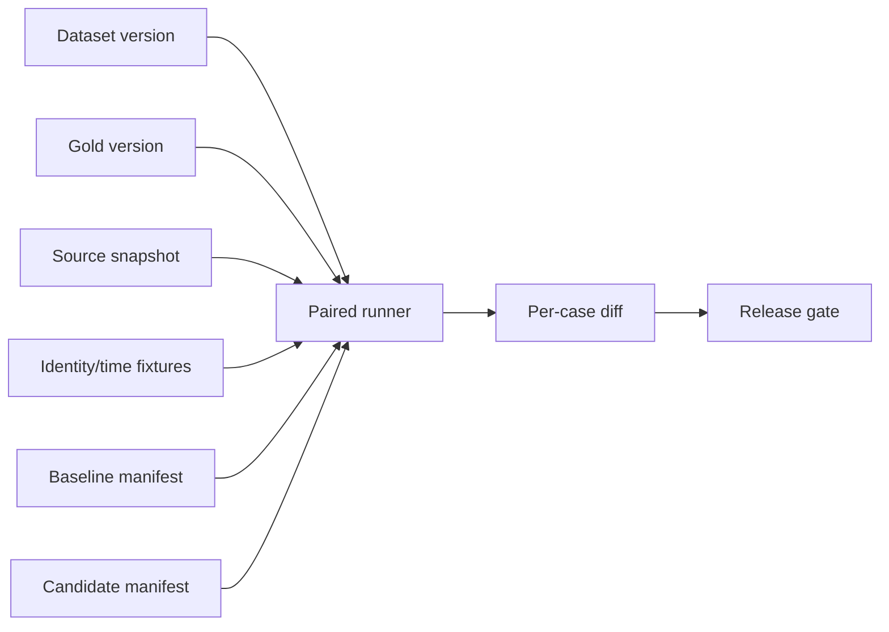

# Chunk、检索与模型变更后的 RAG 回归

RAG 回归是在同一数据与请求条件下比较基线和候选系统，判断解析、Chunk、embedding、检索、rerank、Prompt 或模型变更造成的质量、延迟、费用和安全差异。回归不是“新版本总分更高”，而是一个带版本 manifest、逐样例配对差异、发布门槛和回滚路径的工程过程。

## 前置知识与产出

前置阅读：

- [Recall@K、Context Relevance、Groundedness 与 Citation Accuracy](03-recall-context-groundedness-citations.md)。
- [文档版本、更新、删除与重新索引](../rag-chunking/04-version-update-delete-reindex.md)。

回归产出：

- baseline/candidate manifest。
- 固定 dataset/gold/source snapshot。
- 每条样例的阶段 artifact。
- 配对 metric delta。
- 质量、延迟、成本和安全门槛。
- release decision。
- 可执行 rollback。

## 实验 manifest

```json
{
  "experimentId": "rag-exp-20260718-42",
  "dataset": "refund-eval-v6",
  "gold": "refund-gold-v4",
  "sourceSnapshot": "kb-snapshot-20260718-01",
  "baseline": {
    "indexGeneration": "g41",
    "chunker": "heading-420-v5",
    "embedding": "embed-e3-2026-01",
    "retrieval": "hybrid-rrf-v3",
    "reranker": "rerank-r4",
    "prompt": "support-v11",
    "model": "reader-2026-03"
  },
  "candidate": {
    "indexGeneration": "g42",
    "chunker": "heading-520-v6",
    "embedding": "embed-e4-2026-06",
    "retrieval": "hybrid-rrf-v3",
    "reranker": "rerank-r4",
    "prompt": "support-v11",
    "model": "reader-2026-03"
  }
}
```

示例同时改变 chunk 与 embedding，不利于归因。更好的实验拆成：

1. 只改 chunk。
2. 在选定 chunk 上只改 embedding。
3. 再组合验证交互。

生产迁移有时必须多项一起改，仍需离线 ablation。

## 冻结什么



固定：

- query。
- conversation。
- request/business time。
- principal/tenant。
- source revision 集合。
- gold evidence/claims。
- Judge version。
- 运行环境可比条件。

若 candidate 使用新文档，而 baseline 使用旧文档，差异同时包含数据变化。数据更新回归可以有意这么做，但要单独命名和分析。

## 变更分类

### Parsing/Cleaning

观察：

- accepted/quarantined。
- block/structure。
- locator replay。
- downstream evidence recall。

### Chunk

观察：

- chunk count 和 Token。
- gold boundary coverage。
- duplicate ratio。
- candidate recall。
- context cost。

### Embedding/Index

观察：

- exact vs ANN。
- Recall@K/MRR/nDCG。
- filter correctness。
- index size/build time。
- query latency。

### Retrieval/Rerank

观察：

- channel contribution。
- candidate depth。
- threshold。
- rerank delta。
- context selection。

### Prompt/Model

观察：

- correctness/completeness。
- groundedness/citation。
- structured output。
- refusal。
- Token、latency、cost。

不同类别使用同一最终指标不够，必须有最近责任层的指标。

## 一次只改变一个变量

适合优化：

```text
Baseline
├── Candidate A: chunk length
├── Candidate B: overlap
├── Candidate C: heading prefix
└── Candidate D: parent retrieval
```

如果 A 提升 recall、B 降低 context precision，可组合 A+B 再验证交互。不能从 A+B+C 同时变化推断某一项有效。

## 配对比较

每条 case 同时运行 baseline/candidate：

```json
{
  "caseId": "rag-refund-0041",
  "baseline": {
    "recallAt5": 0.5,
    "groundedness": 0.5,
    "latencyMs": 820,
    "inputTokens": 1840
  },
  "candidate": {
    "recallAt5": 1,
    "groundedness": 1,
    "latencyMs": 910,
    "inputTokens": 2210
  },
  "failureTransition": "missing_exception -> pass"
}
```

逐样例差异能看到：

- 新修复。
- 新回退。
- 始终失败。
- 始终通过。

只比较两个总体均值会掩盖“修好 10 个简单题、破坏 1 个付款权限题”。

## 指标门槛

### 硬门槛

- unauthorized exposure = 0。
- 高风险 unsupported claim = 0。
- 数据删除测试全部通过。
- Schema/locator 必须通过。
- 必要 SLO 不超限。

### 非劣门槛

例如：

- 高风险 Recall@5 不下降。
- no-answer false answer 不上升。
- p95 增量不超过预算。

### 改善目标

- 普通 completeness 提升。
- context Token 降低。
- 单次费用降低。

先通过硬门槛，再比较改善。不能用成本大幅下降抵消权限泄漏。

## 统计不确定性

### 配对 bootstrap

对 case ID 重采样，计算 metric delta 分布和置信区间。配对保持同一 case 的 baseline/candidate 关系。

### 二元指标

通过/失败可查看：

- baseline fail → candidate pass。
- baseline pass → candidate fail。

McNemar test 可用于配对二元差异，但实际发布仍看风险和效应大小。

### 多次模型运行

非确定模型可对同一配置运行多次：

- 固定可固定的参数。
- 保存每次输出。
- 报告均值、方差和 worst-case。
- Judge 也检查稳定性。

一次幸运输出不能证明回归通过。

## 应用案例一：Chunk 420 → 520

### 假设

更长 chunk 能保留规则和例外，可能增加 context 噪声。

### 固定

- 同一 parsing blocks。
- 同一 embedding 模型。
- 同一 hybrid/rerank。
- 同一生成模型。
- 120 条问题。

### 指标

- boundary coverage。
- chunk count。
- duplicate Token。
- candidate Recall@5。
- context relevance。
- groundedness。
- input Token/p95。

### 结果解释

若复杂题 recall 改善、简单题 context precision 下降，可能按 evidence shape 路由 parent expansion，而不是全局使用 520。

### 失败分支

重新分块后直接复用旧 embedding vector，会造成 vector 与 chunk text 不一致。manifest 的 content hash 检查必须阻断。

## 应用案例二：Dense e3 → e4

### 构建

- 同一 chunk revision。
- 新独立 vector namespace。
- keyword 保持。
- fusion 分别校准。
- ANN 与 exact search 对比。

### 评估

按：

- exact identifiers。
- natural symptoms。
- multilingual。
- tables/numbers。
- no-answer。

分别报告 Recall@10 和 MRR。新模型可能提高自然语言却伤害型号；总体平均不够。

### 影子

对去标识生产 query 同时运行 e3/e4：

- 不改变用户响应。
- 保存候选 ID/rank 和延迟。
- 不保存未授权文本。

### 发布

g42 完成后原子切换，保留 g41。监控实际 query 分布和 stale hit。

## 应用案例三：生成模型升级

### 固定

- candidate/context 完全相同。
- Prompt 相同。
- 输出 Schema 相同。

这样差异聚焦模型。评估：

- claim correctness。
- groundedness。
- citation。
- format。
- no-answer。
- tool/权限指令遵守。
- latency/token/cost。

### 多次运行

高风险 40 条运行 3 次，任何一次产生 unauthorized/unsupported 高风险 claim 都视为失败。普通质量报告 pass rate 分布。

### 失败分支

新模型更擅长常识，答案 correctness 提升但 groundedness 下降。对于证据型产品，这不是无条件升级理由。

## 应用案例四：Prompt 修复引用

### Bug

答案正确，但引用统一放段尾，claim-citation 对齐错误。

### Candidate

Prompt 要求每个 factual claim 输出 evidence ID，并由 runtime 校验。

### 回归

- citation correctness。
- citation completeness。
- unsupported claim。
- readability。
- JSON Schema failure。

同时保留无引用纯 UI 文本的正确处理，避免每句话都添加无意义 citation。

## 应用案例五：数据更新

政策 v18 替换 v17：

- 对当前订单，candidate 应改善 freshness。
- 对历史订单，v17 仍需按 business time 可用。
- 删除旧 FAQ 后 unique phrase 不召回。

这是 data regression，baseline/candidate source snapshot 有意不同。报告明确：

- 内容变化。
- pipeline 是否相同。
- expected answer 变化。
- gold migration version。

不要把 expected answer 更新后只跑 candidate；baseline 对照仍能验证变化符合预期。

## 失败分类

每条失败归到：

```text
source_missing
parsing_loss
chunk_boundary
filter_error
retrieval_miss
rerank_drop
context_budget
generation_unsupported
citation_misaligned
output_schema
service_timeout
evaluation_error
```

`evaluation_error` 表示 gold/Judge/runner 有问题，不应算系统失败后悄悄修改。

## CI 分层

### PR 快速集

- 核心 30–60 条。
- 确定性检查优先。
- 低成本模型调用。
- 安全高风险全包含。

### Nightly

- 全量固定集。
- 多次运行。
- 多 generation。
- 失败注入。

### 发布前

- 全量离线。
- 影子生产。
- 容量压测。
- 人工复核显著差异。
- rollback 演练。

PR 集小不代表安全样例可抽样跳过。

## 线上回流

发布后监控：

- answerability 分布。
- no-answer。
- citation open failure。
- user retry/edit。
- human escalation。
- latency/cost。
- retrieval channel degrade。
- security/data quality event。

线上失败去标识后进入 challenge。不要直接把用户反馈当 gold；仍需证据与裁决。

## 调试流程

候选回退：

1. 对比 manifest，找真实改变。
2. 对比 source snapshot。
3. 找最早不同 stage。
4. 查看 gold evidence 在两侧的 lineage。
5. 查看 candidate/context/claim/citation。
6. 判断系统还是 evaluator。
7. 建最小复现。
8. 修复后运行相关分组和全量。

运行不可比：

- model alias 解析到不同 ID。
- source snapshot 漂移。
- Judge 升级。
- cache 未隔离。
- 请求时刻使用 wall clock。
- principal fixture 改变。

发现后标记 invalid run，不把结果放趋势。

## Release decision

```json
{
  "experimentId": "rag-exp-20260718-42",
  "decision": "reject",
  "hardGateFailures": [
    {
      "caseId": "permission-009",
      "metric": "unauthorized_candidate_count",
      "value": 1
    }
  ],
  "improvements": {
    "recallAt5Delta": 0.04
  },
  "rollback": "keep alias on g41"
}
```

质量改善不能覆盖 hard gate。

## 回滚

发布前确认：

- 上一 index generation 完整。
- alias 可原子切换。
- Prompt/model config 可恢复。
- cache 按 generation 隔离。
- 数据 migration 是否向后兼容。
- 回滚后的 source policy 是否仍满足当前权限。

回滚不是只把应用 commit 回退；RAG 状态包括索引、数据、Prompt 和模型。

## 综合练习

完成一次候选发布：

1. 选一个 chunk 变更和一个模型变更，分开实验。
2. 冻结 dataset/gold/source/identity/time。
3. 保存完整 manifest。
4. 运行逐阶段和端到端指标。
5. 做配对 diff 与 bootstrap。
6. 执行安全、无答案和失败注入。
7. 影子运行真实 query。
8. 写 release decision 并演练 rollback。

### 验收标准

- 每次实验可指出唯一主变量。
- baseline/candidate 输入可比。
- 每条样例有 paired artifact。
- hard gate 不被均值抵消。
- Judge 和 dataset 版本固定。
- invalid run 不进入趋势。
- 发布能回到上一 generation。
- 线上失败能进入新 gold 版本。

## 来源

- [OpenAI Evaluation best practices](https://platform.openai.com/docs/guides/evaluation-best-practices)（访问日期：2026-07-18）
- [OpenAI Evals API](https://platform.openai.com/docs/api-reference/evals)（访问日期：2026-07-18）
- [Demystifying evals for AI agents](https://www.anthropic.com/engineering/demystifying-evals-for-ai-agents)（访问日期：2026-07-18）
- [BEIR: A Heterogeneous Benchmark for Zero-shot Evaluation of IR Models](https://arxiv.org/abs/2104.08663)（访问日期：2026-07-18）
