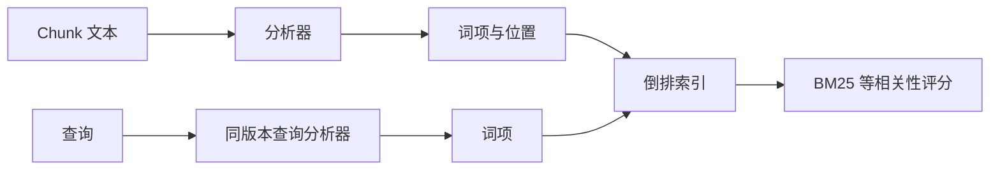
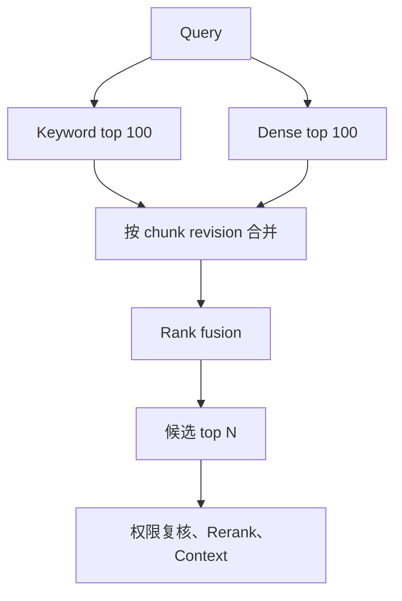

# Dense、Keyword 与 Hybrid Retrieval

检索的第一阶段从大量 chunk 中召回较小候选集。Keyword Retrieval 根据词项匹配，Dense Retrieval 根据向量空间中的相似关系，Hybrid Retrieval 合并两种候选。三者的分数含义、擅长查询和失败方式不同；混合检索不能把不可比较的原始分数直接相加。

## 前置知识与输出

前置阅读：

- [Embedding、向量、点积与余弦相似度](../foundations/embeddings-vector-similarity.md)。
- [固定、段落、标题、语义、滑动窗口与父子分块](../rag-chunking/01-chunking-strategies.md)。

第一阶段检索的输出不是答案，而是候选：

```json
{
  "queryId": "q-431",
  "indexGeneration": "support-g42",
  "candidates": [
    {
      "chunkRevisionId": "error-e431@v7",
      "channels": {
        "keyword": {"rank": 1, "score": 12.84},
        "dense": {"rank": 18, "score": 0.71}
      },
      "fusedRank": 1
    }
  ]
}
```

候选必须携带 source revision、ACL、有效期、通道排名和 generation。后续权限过滤、rerank 与 context selection 不能只拿一段裸文本。

## Keyword Retrieval

Keyword Retrieval 通常基于倒排索引。索引记录词项出现在哪些文档或 chunk，而不是逐条扫描全部正文。



### 分析器

分析器可能执行：

- Unicode 规范化。
- 大小写处理。
- 分词。
- 停用词处理。
- 词干化或词形还原。
- 同义词扩展。
- n-gram。

索引和查询的分析链必须兼容。中文、日文等不以空格分词的语言需要明确 tokenizer。产品型号、错误码、路径和代码符号通常应保留精确字段。

一个 chunk 可建立多字段：

```json
{
  "title": "E-431 电源模块异常",
  "body": "设备启动后连续三次红灯闪烁……",
  "exactIds": ["E-431", "ASTER-PRO-220"],
  "headingPath": ["故障诊断", "电源"],
  "language": "zh-CN"
}
```

`exactIds` 可使用 keyword field，不做普通语言分词。

## BM25 的核心

BM25 是常见词项评分函数。直观上：

- 查询词在文档中出现更频繁，贡献增加，但会饱和。
- 在语料中越少见的词，区分度通常越高。
- 文档长度会被归一化。

一种常见形式：

```text
score(D,Q) =
  Σ IDF(q)
    × f(q,D) × (k1 + 1)
      / (f(q,D) + k1 × (1 - b + b × |D| / avgdl))
```

其中：

| 符号 | 含义 |
|---|---|
| `f(q,D)` | 词 q 在文档 D 中的频次 |
| `|D|` | 文档长度 |
| `avgdl` | 索引平均文档长度 |
| `k1` | 词频饱和程度 |
| `b` | 长度归一化强度 |
| `IDF` | 词项在语料中的稀有程度 |

具体搜索引擎的公式、默认参数和分片统计可能不同。分数只在相同索引、查询与配置中比较，不是概率。

### Keyword 擅长

- 错误码 `E-431`。
- 型号 `ASTER-PRO-220`。
- 人名、API symbol、文件名。
- 用户引用的原句。
- 罕见术语。
- 数字与日期精确匹配。

### Keyword 失败

- 用户说“无法开机”，文档只写“启动失败”且无同义扩展。
- 拼写变化和形态变化。
- 跨语言表达。
- 查询概念与文档措辞差异大。
- 错误停用词规则删除否定。

## Dense Retrieval

Dense Retrieval 用 embedding 模型把 query 和 chunk 映射到稠密向量，通过近邻搜索召回。

```text
query_embedding = E_query(query)
chunk_embedding = E_document(embeddingText)
score = similarity(query_embedding, chunk_embedding)
```

有些模型要求 query/document 使用不同前缀或编码接口。必须遵循模型卡，不能默认两端完全相同。

### 相似函数

- 余弦相似度。
- 点积。
- 欧氏距离。

索引配置必须与模型训练和向量归一化匹配。若引擎返回 distance，数值越小可能越相关；若返回 similarity，通常越大越相关。接口要转成明确字段：

```json
{
  "metric": "cosine_similarity",
  "rawScore": 0.781,
  "higherIsBetter": true,
  "embeddingModel": "embed-e4-2026-06"
}
```

### ANN 与 exact search

向量库常用近似最近邻搜索以降低延迟和内存代价。近似索引参数会影响：

- 搜索 recall。
- 查询延迟。
- 构建时间。
- 内存与磁盘。

评估 Dense Retrieval 时，要区分：

- embedding 表示是否能把相关 chunk 排近。
- ANN 是否漏掉本来相近的向量。

小型样本可用 exact search 建立 ANN recall 基线。

### Dense 擅长

- 同义表达。
- 自然语言症状描述。
- 概念性问题。
- 用户措辞与文档不同。
- 适配良好的多语言语义。

### Dense 失败

- 精确型号只差一个字符。
- 稀有实体未被模型良好表示。
- 数字、日期和否定关系弱。
- 长 chunk 同时包含多个主题。
- query/document 前缀错误。
- embedding 模型升级后混用向量空间。
- 相似但不适用于当前地区或版本。

Dense 相似不代表事实支持，也不代表用户有权限。

## Hybrid Retrieval

Hybrid 并行运行 keyword 与 dense，再合并去重。



### 为什么不能直接相加

BM25 `12.84` 与 cosine `0.78`：

- 值域不同。
- 分布不同。
- 查询间不可校准。
- 索引更新会改变 BM25 统计。
- embedding 模型会改变 cosine 分布。

直接做 `12.84 + 0.78` 会让某通道因尺度主导。

## Reciprocal Rank Fusion

RRF 使用排名而非原始分数：

```text
RRF(d) = Σ 1 / (k + rank_channel(d))
```

文档只出现在某一通道时，只贡献该通道项。`k` 是平滑常数，不是 Top-K。

示例：

```text
chunk A: keyword rank 1, dense rank 20
chunk B: keyword rank 8, dense rank 2

k = 60
A = 1/61 + 1/80
B = 1/68 + 1/62
```

RRF 优点：

- 不需要校准分数尺度。
- 对通道实现相对独立。
- 双通道都排名靠前的候选获益。

边界：

- 丢失原始分数差距信息。
- 各通道权重相同时未必符合业务。
- 通道候选深度会影响结果。
- rank tie 和缺失候选要定义。

## 分数归一化与学习融合

### Min-max 或 z-score

按当前查询候选做归一化很容易受极端值和候选数影响。按历史分布校准需要版本化、监控漂移。

### 监督学习融合

特征可包括：

- keyword score/rank。
- dense score/rank。
- exact ID match。
- title match。
- query/document language。
- chunk length。
- freshness。

标签来自相关性标注或点击，但点击含展示位置和历史系统偏差。学习融合需要独立 test 与权限硬过滤。

### 规则加权

例如查询匹配错误码格式时提高 keyword 权重。规则必须：

- 由确定性 query classifier 触发。
- 在评估集中有对应标签。
- 记录命中原因。
- 有默认路径。

## 候选去重

Hybrid 会召回同一 chunk，也会召回高度重叠邻居。

去重层次：

1. `chunkRevisionId` 完全去重。
2. 同一 parent 下高度重叠 chunk 合并。
3. 同一 source 的版本过滤。
4. 相同内容 hash 去重。

不能仅按文本 hash 去重而丢掉：

- 不同 ACL。
- 不同生效时间。
- 不同来源归属。
- 引用位置。

可选择一个展示候选，同时保存所有来源 lineage。

## 应用案例一：故障手册

### 查询集合

- “E-431 怎么处理？”
- “开机后红灯闪三次。”
- “ASTER PRO 220 无法启动。”
- “换电源模块前要做什么？”

### 索引

- `errorCode` 与 `model` 建 exact keyword field。
- 标题和正文建 BM25 字段。
- 结构化 embeddingText 建 dense vector。
- ACL、产品线和 revision 建 filter。

### 实验

分别运行：

- keyword only。
- dense only。
- RRF hybrid。
- hybrid + reranker。

固定 120 条问题和 gold chunk。报告：

- exact ID Recall@5。
- symptom Recall@5。
- MRR。
- unique channel contribution。
- p95 延迟。
- rerank 输入数。

### 结果解释

Keyword 对 `E-431` 稳定；Dense 对“红灯闪三次”措辞变化有用；Hybrid 覆盖两者。若 hybrid 在错误码题反而退化，应检查融合，而不是删除 Dense 通道。

### 失败分支

分析器把 `E-431` 拆成 `e`、`431`，导致大量无关错误码。修复是独立 exact field，并用 analyzer 测试证明 token 输出。

## 应用案例二：产品政策

### 查询

“定制版在购买两周后能退吗？”

文档使用“个性化商品”“14 日内”“不适用标准无理由退款”。

### 处理

1. Keyword 召回“14 日”和“退款”。
2. Dense 召回“个性化商品”相关语义。
3. RRF 合并。
4. metadata filter 限定地区与生效时间。
5. reranker 判断条件组合。
6. context selector 同时保留主规则与例外。

### 验证

- gold evidence 标注主规则和例外为共同必要。
- query 变体覆盖“两周”“14天”“十四日”。
- 检索指标与 groundedness 分开。
- 引用分别指向支持句。
- 无足够证据时拒答。

### 失败分支

Dense 召回语义相近的旧地区政策。如果把 freshness 当软排序而不是有效期硬过滤，旧政策仍可能进入上下文。

## 调试路径

当 gold chunk 未进入候选：

1. 确认 source revision 在 active generation。
2. 检查 ACL 和有效期是否先过滤。
3. 查看 keyword analyzer 对 query 与 chunk 的 tokens。
4. 查看 embedding 模型、前缀、维度和相似函数。
5. 用 exact vector search 对比 ANN。
6. 分别查看两个通道的 top 100。
7. 检查 fusion 的 rank、权重和候选深度。
8. 检查去重是否删错版本。

当候选进入但最终缺失：

1. 查看 rerank 前后。
2. 查看 threshold。
3. 查看 Token 预算和 context 去重。
4. 不要回头盲目增加召回 K。

## 性能与运维

记录分阶段延迟：

- query analyze。
- query embedding。
- keyword search。
- dense ANN。
- fusion。
- metadata fetch。

并行通道总延迟通常接近慢通道加融合开销，但资源消耗是两套。需要：

- query embedding cache，键包含模型、输入和租户安全域。
- 并发上限。
- 通道超时与 partial status。
- 失败时是否允许单通道降级。
- active generation 一致性。

单通道降级应在响应 trace 中可见，并在评估中单独测量。

## 安全边界

- 权限过滤优先下推到两种索引。
- query 和候选日志脱敏。
- embedding 服务不能跨租户泄漏。
- 同文本不同 ACL 不按 hash 合并成公共对象。
- 用户输入不能控制索引名、过滤表达式或字段脚本。
- 模型不能绕过服务器过滤。

## 综合练习

为故障手册实现三路实验：

1. 建 keyword、dense 和 hybrid。
2. 准备至少 60 条问题：20 精确 ID、20 症状改写、10 无答案、10 权限或过期。
3. 标注 chunk revision。
4. 实现 RRF，并保存通道 rank。
5. 比较 Recall@5、MRR、unique hit、延迟和成本。
6. 注入 analyzer 错误、ANN 低召回、旧 revision 和单通道超时。
7. 提供逐样例 trace。

### 验收标准

- BM25 与 vector 分数不直接相加。
- exact identifier 有独立字段。
- embedding 配置和相似函数一致。
- Hybrid 结果可解释每个通道贡献。
- 权限与有效期在候选阶段生效。
- 能把失败定位到 analyzer、embedding、ANN、fusion 或后续 rerank。
- 发布保留基线与回滚 generation。

## 来源

- [Okapi at TREC-3](https://trec.nist.gov/pubs/trec3/papers/city.ps.gz)（访问日期：2026-07-18）
- [Dense Passage Retrieval for Open-Domain Question Answering](https://arxiv.org/abs/2004.04906)（访问日期：2026-07-18）
- [Reciprocal Rank Fusion outperforms Condorcet and individual Rank Learning Methods](https://dl.acm.org/doi/10.1145/1571941.1572114)（访问日期：2026-07-18）
- [HYRR: Hybrid Infused Reranking for Passage Retrieval](https://arxiv.org/abs/2212.10528)（访问日期：2026-07-18）
