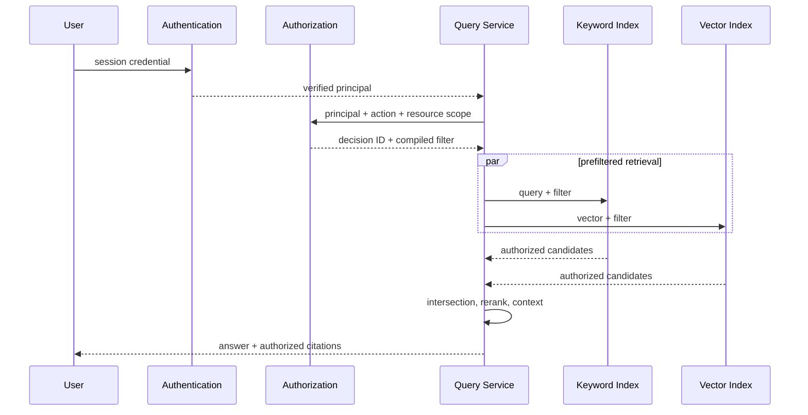

# Metadata Filter 与权限过滤

Metadata Filter 用结构化字段限制检索范围，例如文档类型、地区、产品、生效时间和语言。权限过滤根据已认证主体与资源授权关系排除无权内容。两者可能使用相同过滤语法，但安全含义不同：业务 metadata 可帮助相关性，权限过滤是服务端必须执行的边界，不能由模型或前端决定。

## 前置知识与目标

前置阅读：

- [上下文权限与租户隔离](../context-engineering/06-context-permission-tenant-isolation.md)。
- [Dense、Keyword 与 Hybrid Retrieval](01-dense-keyword-hybrid.md)。
- [文档版本、更新、删除与重新索引](../rag-chunking/04-version-update-delete-reindex.md)。

完成后应能：

- 设计可索引、可版本化的 metadata。
- 从认证主体生成服务端授权决策。
- 在 keyword、dense、rerank、cache 和引用中保持同一安全范围。
- 比较预过滤、后过滤和按安全域分索引。
- 测试越权、ACL 更新与租户缓存污染。

## Metadata 的数据类型

不要把所有字段存成字符串。常见类型：

| 类型 | 示例 | 过滤 |
|---|---|---|
| keyword | `product=AsterPro` | 等值、集合 |
| boolean | `published=true` | 等值 |
| integer/float | `versionNumber=18` | 范围 |
| timestamp | `validFrom` | 时间区间 |
| geo | 服务区域 | 空间关系 |
| array | `regions=["cn-east"]` | contains |
| hierarchical path | `["policy","refund"]` | 前缀/祖先 |
| security principal | `group:support-cn` | 授权交集 |

metadata Schema：

```json
{
  "schemaVersion": "kb-meta-v7",
  "fields": {
    "tenantId": {"type": "keyword", "required": true},
    "sourceRevision": {"type": "keyword", "required": true},
    "documentType": {"type": "keyword"},
    "validFrom": {"type": "timestamp"},
    "validTo": {"type": ["timestamp", "null"]},
    "aclPolicyId": {"type": "keyword", "required": true},
    "classification": {"type": "keyword", "required": true}
  }
}
```

Schema 改变后需要新版本并验证旧记录迁移。未知字段不能自动拼进底层查询表达式。

## 权限主体

检索请求不能相信客户端传来的 `tenantId` 或 role。服务端从验证过的身份得到：

```json
{
  "principalId": "user-8291",
  "tenantId": "tenant-a",
  "groups": ["support-cn", "policy-readers"],
  "scopes": ["knowledge.read"],
  "authenticationTime": "2026-07-18T08:20:00Z",
  "sessionId": "sid-hash"
}
```

授权服务再返回：

```json
{
  "decisionId": "pd-7721",
  "policyVersion": "authz-v19",
  "effect": "allow",
  "resourceFilter": {
    "tenantId": "tenant-a",
    "aclAnyOf": ["support-cn", "policy-readers"],
    "classificationMax": "internal"
  },
  "expiresAt": "2026-07-18T08:25:00Z"
}
```

模型看不到可修改的授权 token。查询构造器只消费受控决策对象。

## 查询管线



权限应在检索前或检索引擎内部生效。先召回全部，再在应用层丢弃会造成：

- 候选存在性泄漏。
- 外部 reranker 接触无权正文。
- Top-K 被无权结果占满，过滤后召回不足。
- 日志和 trace 泄漏标题。
- 计算资源浪费。

## Metadata Filter 的语义

### 等值与集合

```json
{
  "documentType": {"in": ["policy", "manual"]},
  "product": {"eq": "aster-pro"}
}
```

定义：

- 字段缺失时是否匹配。
- 大小写与规范化。
- 数组是 any 还是 all。
- 空数组是“无约束”还是“无结果”。

空允许集合必须返回无结果，不能为了“可用性”删除过滤。

### 时间

查请求时刻 `t` 有效内容：

```text
validFrom <= t
AND (validTo IS NULL OR t < validTo)
```

要明确半开区间、时区和业务时刻。请求创建时刻、订单时刻、文档 ingest 时刻不是同一概念。

### 层级

地区或组织树不能只做字符串前缀，除非编码能防止歧义。可存：

```json
{
  "orgPath": ["company", "cn", "support", "tier2"]
}
```

授权计算基于稳定 ID，不基于可改名称。

### 缺失值

敏感字段缺失时默认 deny。例如 `tenantId`、`aclPolicyId` 或 classification 缺失，索引 gate 应拒绝该 chunk。

普通业务字段缺失可：

- 不匹配严格 filter。
- 进入 unknown 分支。
- 请求用户补充。

行为必须写入 Schema 和测试。

## 预过滤

预过滤在 ANN/倒排搜索前限制可见集合。

优点：

- 无权对象不进入候选。
- 相关性 K 在授权集合内计算。
- 外部下游不接触敏感文本。

代价：

- 高选择性过滤会改变 ANN 性能。
- 复杂 ACL 可能生成大集合。
- 两个索引引擎过滤能力不同。
- policy 更新需要及时同步 metadata。

向量库可能使用：

- filter-aware graph traversal。
- 先选择 posting list 再向量搜索。
- filtered brute force。

需要在高选择性、低选择性和空集合上分别测 recall/latency。

## 后过滤

先取 N 个候选，再过滤。

安全系统不应把它作为唯一权限措施。它可用于非安全的展示偏好，例如结果类型多样性。

若引擎不支持权限预过滤，可选：

- 按安全域分索引。
- 将授权集合与候选在可信存储内求交，并增加召回深度，但仍要证明无权数据未离开边界。
- 更换支持过滤的检索实现。

“召回更多再过滤”不能解决存在性、外部处理和日志泄漏。

## 按安全域分索引

每租户或大安全域独立 index。

优点：

- 物理隔离更强。
- 查询 filter 简单。
- 删除租户数据清楚。

代价：

- 大量小索引运维复杂。
- 共享公共文档需要复制或双查。
- 跨团队授权查询难。
- 每个索引 ANN 数据少，参数特性不同。

常见组合：

- tenant 物理/逻辑 namespace。
- tenant 内用 ACL metadata 预过滤。
- 公共库单独查询，并在融合前保持来源边界。

## ACL 表达

### 直接 principal 列表

适合少量共享：

```json
{"allowUsers": ["u1", "u2"], "allowGroups": ["g7"]}
```

列表很大时索引和更新成本高。

### Policy ID

chunk 保存 `aclPolicyId`，授权服务把当前主体可访问的 policy IDs 编译为 filter。适合复用，但允许集合可能很大。

### 属性授权

基于 tenant、部门、地区、classification。表达力高，也更需要一致的属性来源、版本和 deny 规则。

### 文档级与行级

同一文档内部权限不同，就不能把不同 ACL 的 block 合并成同一 chunk 或 parent。表格行级权限要求 row-group 不跨安全边界。

## 缓存隔离

检索缓存键至少包含：

```text
normalized_query
index_generation
tenant_id
authorization_decision_scope_hash
query_filter_hash
retrieval_config
```

不建议把短期 access token 直接作为键。使用决策范围 hash，并让 TTL 不超过授权决策有效期。

缓存值也保存：

- source revision。
- ACL policy version。
- result generation。
- created time。

ACL 收紧时：

- 更新 generation。
- 或主动失效依赖该 policy 的 cache。
- 或让短 TTL 和 policy version 保证不复用。

只把 user ID 放进缓存键仍可能遗漏 group/role 改变。

## Rerank 与生成边界

权限在召回后还需防御性复核：

1. 候选取正文前检查 revision 与 ACL。
2. 发送外部 reranker 前检查数据处理许可。
3. context assembly 再检查 tenant、有效期和 tombstone。
4. citation 打开时重新授权当前用户。

这是多层防御，不表示允许前一层漏掉。

## 应用案例一：企业知识库

### 数据

- 全公司公开手册。
- tenant-a 内部政策。
- support-cn 团队工单。
- 仅指定用户可见合同。

### 索引设计

```json
{
  "tenantId": "tenant-a",
  "securityDomain": "internal",
  "aclPolicyId": "policy-support-cn-v8",
  "documentType": "ticket",
  "effectiveAt": "2026-07-01T00:00:00+08:00",
  "sourceRevision": "ticket-882@rev3"
}
```

公共内容放 public namespace，租户内容放 tenant namespace。查询服务并行检索两者，公共通道也应用 published filter。

### 请求

support-cn 用户问：“工单 882 的处理结果？”

1. Authentication 得到 principal。
2. Authorization 返回 tenant-a 与 policy IDs。
3. keyword/dense 都下推 filter。
4. 候选只含授权 source。
5. reranker 在租户环境执行。
6. citation URL 是短期、当前用户授权后的链接。

### 验证

- 同 tenant 无组用户看不到工单。
- tenant-b 无法通过精确标题发现存在性。
- support-cn 用户可见。
- 用户退出 group 后缓存不复用。
- trace 只显示 denied count，不显示 denied 标题。

### 失败分支

如果 public 与 tenant 结果先合并、后按 tenant 过滤，公共结果和 tenant 结果可能共用相同文本 hash，去重时保留了无权 source locator。去重必须在安全身份与 lineage 上工作。

## 应用案例二：按订单时刻查询政策

### 数据

退款政策 v17 与 v18：

- v17 有效至 2026-07-01。
- v18 从 2026-07-01 起有效。
- 两者都保留用于历史订单。

### Filter

请求携带由订单服务读取的 `purchasedAt`，不是用户自由输入：

```text
source = refund-policy
AND validFrom <= purchasedAt
AND (validTo IS NULL OR purchasedAt < validTo)
AND region = order.region
AND ACL allows principal
```

### 结果

检索 trace 保存过滤参数的 hash、订单时刻和 policy decision ID。模型只看到一个有效 revision。

### 失败分支

若用户说“去年买的”而订单服务没有记录，系统应请求订单或明确无法确定，不让模型把相对时间编译成授权/政策 filter。

## 应用案例三：高选择性向量过滤

### 场景

一千万个 chunk 中，某用户仅可访问 300 个。ANN 预过滤 p95 很高。

### 对照

- 全局索引 + ACL filter。
- tenant namespace + group filter。
- 授权集合 exact vector search。

### 评估

- authorized Recall@10。
- p50/p95/p99。
- 内存。
- ACL update latency。
- 空集合行为。
- 越权候选必须为零。

### 决策

对于极小授权集合，可在 tenant 安全域内使用 exact search；对于大集合使用 filter-aware ANN。性能优化不能改成全局检索后把无权正文发送 reranker。

## 安全测试矩阵

| 测试 | 改变 | 必须保持 |
|---|---|---|
| 跨租户 | tenant-a → tenant-b | query 相同 |
| 组撤销 | group allow → deny | source 与索引相同 |
| ACL 更新 | policy v7 → v8 |用户相同 |
| cache 污染 | 先高权后低权 | query 相同 |
| keyword/dense 差异 | 分别关闭通道 |授权结果一致 |
| tombstone | source visible → deleted | unique phrase 相同 |
| 外部 rerank | 本地 → 外部 | 无权候选仍不发送 |
| citation reopen | 权限后来撤销 | 历史回答相同 |

检查范围包括候选、分数、trace、错误、缓存和 citation，不只最终答案。

## 调试路径

越权结果：

1. 确认 authenticated principal 来源。
2. 查看 authorization decision、policy version 与 TTL。
3. 查看 compiled filter，不显示敏感允许列表给普通开发角色。
4. 分别检查 keyword 与 vector 请求。
5. 检查 fusion、dedup 和 parent/neighbor 扩展。
6. 检查 cache key。
7. 检查 reranker payload。
8. 检查 citation reopen 授权。

召回不足：

1. 区分“无权”与“有权但未召回”。
2. 在授权集合内用 exact search 建基线。
3. 检查 filter selectivity 与 ANN。
4. 检查 metadata 缺失导致默认 deny。
5. 不通过放宽权限修复相关性。

## 观测与审计

记录：

- request/trace ID。
- principal pseudonym。
- tenant。
- action。
- authorization decision ID。
- policy/filter hash。
- index generation。
- authorized candidate count。
- filtered count（不含敏感标识）。
- latency。
- citation access decision。

告警：

- `unauthorized_candidate_count > 0`。
- 缺失 tenant/ACL metadata。
- policy 更新传播延迟。
- 高权缓存被低权命中。
- 两通道授权候选集合不一致。
- deleted source 被召回。

审计日志不可存 access token、完整 ACL 或 denied 文档正文。

## 综合练习

实现多租户安全检索：

1. 两个 tenant，每个包含 public、team 和 user-private 文档。
2. 同时建立 keyword 和 dense。
3. 服务端从认证主体生成 policy decision。
4. 在两通道下推 filter。
5. 实现按时刻有效的政策。
6. 实现 tenant + scope hash 缓存。
7. 注入组撤销、ACL 更新、删除和 citation reopen。
8. 比较全局 filter、tenant namespace 与授权集合 exact search。

### 验收标准

- 客户端无法覆盖 tenant 和允许范围。
- 空允许集合返回空，不移除 filter。
- 两通道无权候选均为零。
- cache 不跨权限范围。
- parent、neighbor、rerank 和 citation 重新授权。
- ACL 收紧在规定时限内生效。
- 性能报告只在满足安全门槛的方案间比较。
- 审计可定位 decision 和 generation，不泄漏正文。

## 来源

- [NIST SP 800-162: Guide to Attribute Based Access Control](https://csrc.nist.gov/pubs/sp/800/162/upd2/final)（访问日期：2026-07-18）
- [RFC 9068: JWT Profile for OAuth 2.0 Access Tokens](https://www.rfc-editor.org/rfc/rfc9068.html)（访问日期：2026-07-18）
- [Elasticsearch Document and field level security](https://www.elastic.co/docs/deploy-manage/users-roles/cluster-or-deployment-auth/controlling-access-at-document-field-level)（访问日期：2026-07-18）
- [Qdrant Filtering](https://qdrant.tech/documentation/concepts/filtering/)（访问日期：2026-07-18）
