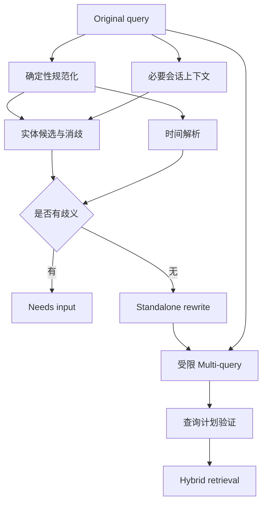

# Query Rewrite、Multi-query、实体与时间过滤

Query Processing 把用户表达转成检索可用的结构。Query Rewrite 生成一条保持原意的独立检索句，Multi-query 生成少量互补查询，实体链接把名称映射到稳定 ID，时间解析把相对表达绑定到具体时刻。任何改写都可能引入意图漂移，因此原查询、派生查询、结构化约束和候选 lineage 必须同时保存。

## 前置知识与边界

前置阅读：

- [上下文去重、过期与冲突](../context-engineering/05-dedup-staleness-conflicts.md)。
- [Dense、Keyword 与 Hybrid Retrieval](01-dense-keyword-hybrid.md)。
- [Metadata Filter 与权限过滤](02-metadata-permission-filters.md)。

本文不把改写当成“让 Prompt 更漂亮”。输出是受控查询计划：

```json
{
  "originalQuery": "它上季度在华东退货规则改了吗？",
  "standaloneQuery": "Aster Pro 2026 年第二季度华东地区退货规则变更",
  "entities": [
    {"surface": "它", "canonicalId": "product:aster-pro", "source": "conversation"}
  ],
  "timeRange": {
    "start": "2026-04-01T00:00:00+08:00",
    "end": "2026-07-01T00:00:00+08:00",
    "timezone": "Asia/Shanghai",
    "basis": "request_time"
  },
  "queries": [
    {"id": "q0", "text": "它上季度在华东退货规则改了吗？", "kind": "original"},
    {"id": "q1", "text": "Aster Pro 华东 退货政策 生效日期", "kind": "entity-time"}
  ]
}
```

模型生成的实体和过滤条件在服务端验证后才能执行。

## 为什么保留原查询

改写可能：

- 删除否定。
- 把代词指向错误对象。
- 将“能否”改为肯定事实。
- 擅自补地区或版本。
- 把问题拆成不等价子问题。
- 将相对时间绑定到错误时区。

原查询用于：

- 关键词精确召回。
- 意图保持评估。
- 调试派生错误。
- 给 reranker 判断原始需求。
- 生成最终回答。

不能用改写结果覆盖用户输入。

## Query Rewrite

### 多轮独立化

对话：

```text
用户：Aster Pro 在华东销售吗？
助手：……
用户：它上季度的退货规则改了吗？
```

检索句需要补回产品，但不能把全部历史拼进去。输入给改写器的上下文应是：

- 当前问题。
- 已解析且可信的会话实体。
- 必要的上一轮主题。
- 请求时间和时区。

不应包含无关历史或未授权记忆。

### 规则改写

适合：

- 产品别名映射。
- 错误码规范化。
- 日期格式。
- 常见缩写。
- 已知拼写纠正。

规则优点是可复现，风险是覆盖有限。别名表要版本化并区分同名实体。

### 模型改写

适合复杂代词、口语和省略。输出必须结构化：

```json
{
  "standaloneQuery": "Aster Pro 华东地区 2026 年第二季度退货规则是否变更",
  "resolvedReferences": [
    {
      "surface": "它",
      "targetId": "product:aster-pro",
      "evidenceTurnId": "turn-7"
    }
  ],
  "uncertainties": []
}
```

若存在两个可能对象，返回 `needs_input`，不要随机选择。

### 意图保持

检查关键槽位：

- action：查询、比较、解释、执行。
- polarity：肯定、否定。
- entities。
- time。
- region。
- requested output。
- uncertainty。

可做规则 diff，再用人工标注集评估。不能只用同一个模型判断自己的改写。

## Multi-query

Multi-query 用多个检索视角增加召回，而不是生成大量同义句。

### 互补类型

原问题：

```text
定制版超过两周还能退吗？
```

候选查询：

1. 原文：保留用户措辞和精确词。
2. 规范实体：`个性化商品 14 日 退款例外`。
3. 规则主题：`退款政策 定制商品 不适用 条件`。
4. 必要子问题：`标准退款期限` 与 `定制商品例外`。

每个 query 标记用途，限制数量。

### 查询扇出

若每条 query 同时跑 keyword/dense：

```text
retrieval_calls = query_count × channel_count
```

还会增加候选合并、rerank 和日志。设置：

- 最大 query 数。
- 每通道 candidate K。
- 总候选上限。
- 总超时。
- Token/费用预算。

### 合并

候选保留：

```json
{
  "chunkRevisionId": "policy-custom-v18-c7",
  "matchedQueries": [
    {"queryId": "q0", "channel": "dense", "rank": 8},
    {"queryId": "q2", "channel": "keyword", "rank": 1}
  ],
  "bestRankByChannel": {"dense": 8, "keyword": 1}
}
```

RRF 可扩展到 query × channel，但同一改写的多个近重复结果不能无上限叠加。可先在每个通道内合并 query，再跨通道融合。

### Multi-query 失败

- 查询全是同义重复，没有 recall 增益。
- 某条改写引入不存在实体。
- 子问题丢失原始条件。
- 扇出使尾延迟失控。
- 候选融合让错误改写获得多次投票。
- 日志重复保存敏感输入。

## 实体识别与实体链接

实体识别找出文本片段，实体链接映射到知识库 stable ID。

```text
"Aster Pro" → mention
mention + tenant catalog → product:aster-pro-v2
```

### 候选生成

- 精确别名。
- 规范化别名。
- 前缀/模糊匹配。
- 上下文中的最近实体。
- 向量实体索引。

### 消歧

“Pro”可能是产品、套餐或团队。使用：

- 当前功能允许的实体类型。
- tenant。
- region。
- 会话中已确认对象。
- 版本与有效期。
- 用户显式选择。

结果：

```json
{
  "mention": "Pro",
  "candidates": [
    {"id": "product:aster-pro", "score": 0.66},
    {"id": "plan:pro", "score": 0.61}
  ],
  "decision": "needs_input"
}
```

分数不是概率，低差距时不要强制过滤。

### 实体进入检索

- stable ID 作为 metadata filter。
- canonical name 与别名进入 keyword query。
- 原 mention 保留给 dense query。
- 实体类型进入 reranker 特征。

用户文本不能直接作为底层字段名或过滤表达式。

## 时间解析

### 绝对时间

“2026-07-01”仍需确定：

- 时区。
- 当日开始还是一个时刻。
- 用户业务区域。
- inclusive/exclusive。

### 相对时间

“上季度”需要：

- request/reference time。
- 时区。
- 自然季度或财务季度。
- 业务规则版本。

若当前请求时刻为 `2026-07-18 Asia/Shanghai`，自然“上季度”为：

```text
[2026-04-01T00:00:00+08:00,
 2026-07-01T00:00:00+08:00)
```

文章中的这个结果依赖明确输入，不是永远固定的日期。

### 事件时间

查询政策可能需要订单购买时间，而不是请求时间。时间对象：

```json
{
  "field": "policy_effective_at",
  "range": {
    "start": "2026-06-14T10:20:00+08:00",
    "end": "2026-06-14T10:20:01+08:00"
  },
  "source": "order-service",
  "sourceRecordId": "order-812",
  "trusted": true
}
```

模型不能从用户描述替代受控订单事实。

### 时间冲突

用户说“上周订单”，订单服务显示三个月前：

- 检索政策使用受控订单时间。
- 界面提示输入与记录冲突。
- 若用户要查询“假设上周”，明确进入模拟场景。

## 处理架构



验证器检查：

- query 数。
- 每条长度。
- 允许字符与字段。
- 实体 ID 存在且在 tenant 内。
- 时间区间合法。
- filter 只使用 allowlist 字段和操作符。
- 原始否定和 action 未丢失。

## 应用案例一：多轮产品政策

### 输入

```text
turn 7: Aster Pro 在华东有卖吗？
turn 8: 它上季度退货规则改了吗？
request time: 2026-07-18 10:00 Asia/Shanghai
```

### 计划

- `它` 链接到 turn 7 的 `product:aster-pro`。
- “上季度”解析自然季度 Q2。
- “改了吗”需要至少两个 policy revision 或 changelog。
- 生成原 query、产品政策 query、变更 query。
- filter 限定产品、地区与相关生效区间。

### 候选

需要：

- Q2 期间有效政策。
- Q2 前一版本或变更记录。

只召回当前政策无法回答“是否改变”。

### 输出

模型根据两个 revision 的结构 diff 描述变化，引用每个版本。若缺少历史 revision，回答“无法从当前证据确认是否改变”。

### 验证

- 代词标注正确。
- 时间区间边界正确。
- `changed` 问题的 gold evidence 要求两个版本。
- 改写不把问句变成“规则已经改变”。
- 未授权历史政策不泄漏。

### 失败分支

会话中最近对象是“Aster Basic”，但用户的“它”指更早的 Pro。若两个候选接近，应询问，而不是以最近实体规则强制链接。

## 应用案例二：故障描述

### 输入

“那个 431 的错，换了适配器还是不行。”

上下文已有设备型号，但“431”可能是错误码或工单号。

### 处理

1. 候选实体：error:E-431、ticket:431。
2. 当前功能是设备诊断，提高 error type 候选，但仍检查 tenant 目录。
3. 规则规范化 `431` 为 `E-431` 仅在设备文档 exact field 中。
4. 保留自然语言 dense query。
5. Multi-query 生成“E-431 适配器更换后仍失败”和“E-431 后续诊断步骤”。

### 验证

- keyword 命中错误码。
- dense 命中症状。
- ticket 431 无权时不会进入候选。
- 改写保留“已经更换适配器”的已完成状态。
- 回答不会重复建议同一步作为唯一方案。

### 失败分支

把所有数字都扩展成错误码会污染普通数量和日期。规范化必须由实体类型与功能范围约束。

## 应用案例三：精确数字查询

### 输入

“华东 Pro 3.2kg 2026-07-10 的费率。”

### 策略

这种查询已结构清楚，Multi-query 可能没有收益：

- region → `cn-east`。
- product level → `pro`。
- weight → 3.2 kg。
- event date → 2026-07-10。

检索表格 row，确定性计费服务完成区间和金额计算。

### 对照

在带标注费率问题上比较：

- 原 query。
- 一条规范化 query。
- 三条模型扩展 query。

报告 Number Match、evidence recall、延迟和成本。若扩展未提升召回且引入其他地区，关闭该任务的 Multi-query。

## 评估

### Rewrite

- entity preservation。
- polarity preservation。
- time accuracy。
- standalone completeness。
- human semantic equivalence。
- needs-input accuracy。

### Multi-query

- unique relevant recall gain。
- duplicate query rate。
- candidate duplication。
- fanout latency。
- cost。
- drifted query rate。

### Entity

- mention precision/recall。
- candidate recall。
- link accuracy。
- abstention/clarification accuracy。
- tenant boundary violations。

### Time

- absolute time accuracy。
- relative range accuracy。
- timezone accuracy。
- event-time source accuracy。
- boundary tests。

指标按问题类型报告，不能只看最终答案。

## 调试路径

1. 查看 original query 和请求时刻。
2. 查看传入的会话实体及其来源 turn。
3. 查看 entity candidates，不只看最终 ID。
4. 查看时间解析的 basis、timezone 和区间。
5. 对比 standalone query 的 action、polarity 和 slots。
6. 查看每条 multi-query 的候选贡献。
7. 检查 drift query 是否主导 fusion。
8. 检查 filter 与 source revision。
9. 最后进入 rerank 与生成。

所有派生 query 都带 lineage。日志脱敏后仍应能通过 hash 和受控预览定位。

## 生产边界

- 最大改写 Token 与 query 数。
- 总检索 deadline。
- 模型超时可回退原 query，但状态标记 degraded。
- 实体目录与别名表版本化。
- 时间解析库和财务日历版本化。
- 结构化输出 runtime validation。
- Prompt injection 文本只作为数据。
- 过滤字段 allowlist。
- query cache 包含 rewrite policy 和 reference time。
- 敏感 query 按保存政策脱敏。

## 综合练习

构建 Query Planner：

1. 收集 80 条问题，含单轮、多轮、实体歧义、相对时间、精确数字和无答案。
2. 保存 original query。
3. 实现规则规范化、实体候选、时间解析、standalone rewrite 与最多三条 multi-query。
4. 对 filter 使用 allowlist Schema。
5. 为每条派生 query 保存候选贡献。
6. 注入否定丢失、错误代词、错误时区和 query 扇出。
7. 比较原 query、单改写与 multi-query。

### 验收标准

- 原查询永不被覆盖。
- 不确定实体返回 needs-input。
- 相对时间绑定 reference time 与 timezone。
- 业务事件时间来自受控系统。
- Multi-query 有硬上限和 deadline。
- 改写保持 action、polarity、entity 和 time。
- 能量化每条派生 query 的独特召回。
- 无收益的任务可关闭改写或扇出。

## 来源

- [Query2doc: Query Expansion with Large Language Models](https://arxiv.org/abs/2303.07678)（访问日期：2026-07-18）
- [Precise Zero-Shot Dense Retrieval without Relevance Labels](https://arxiv.org/abs/2212.10496)（访问日期：2026-07-18）
- [UTRAG at SemEval-2026 Task 8](https://aclanthology.org/2026.semeval-1.237/)（访问日期：2026-07-18）
- [ISO 8601-1:2019 Date and time representations](https://www.iso.org/standard/70907.html)（访问日期：2026-07-18）
