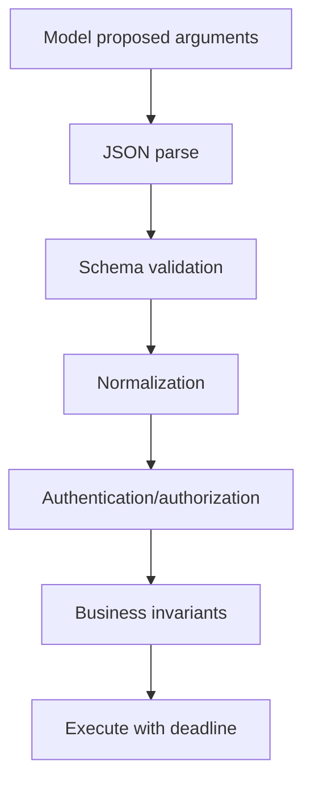
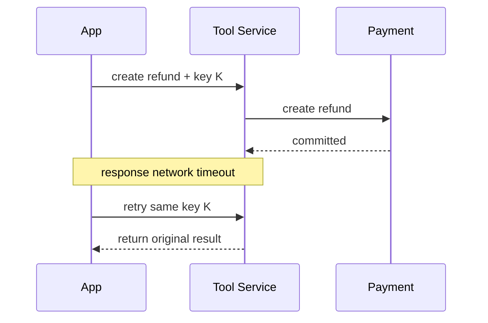

# Tool 输入验证、超时、有限重试与幂等

Tool 调用横跨模型、应用、队列和下游服务。参数合法不代表业务允许；请求超时不代表下游没有执行；重试可能重复写入；幂等也不等于每次响应字节相同。可靠执行需要分层验证、总 deadline、错误分类、有限退避和服务端幂等记录。

## 前置知识与产出

前置阅读：

- [Tool 单一职责、简洁 Schema 与稳定输出](02-single-responsibility-schema-stable-output.md)。
- [取消、超时、有限重试、限流与 Usage](../model-api/reliability-rate-limits-usage.md)。

本文产出：

- validation pipeline。
- deadline 与 cancellation 传播。
- retry policy。
- idempotency contract。
- 状态查询与不确定结果处理。
- 故障注入测试。

## 四层验证



### JSON 解析

- 必须是一个完整 JSON value。
- 拒绝半截 JSON 和重复顶层结果。
- 限制字节、深度和数组大小。
- 不用 `eval`。

### Schema

- 类型。
- required。
- enum。
- min/max。
- additional properties。

### 规范化

规范化不能改变语义：

- 日期解析为带时区 instant。
- ID 去除允许的展示分隔。
- Unicode 规范化。
- 金额 decimal → minor units。

规范化前后都可保留 hash，不记录 Secret。

### 授权

从 authenticated principal 判断 action/resource。模型参数中的 tenant/user 不可信。

### 业务不变量

- 订单可退款。
- 金额不超过余额。
- 资源版本未变。
- 写入在允许窗口。
- 状态转换合法。

业务检查尽量与写入同一事务，避免检查后状态改变。

## 错误分类

```json
{
  "status": "invalid_input",
  "error": {
    "code": "amount_exceeds_refundable_balance",
    "retryable": false,
    "safeDetails": {
      "maximumMinorUnits": 12900,
      "currency": "CNY"
    }
  }
}
```

分类：

| 类别 | 是否自动重试 |
|---|---:|
| parse/schema | 否，可让模型修一次参数 |
| auth forbidden | 否 |
| not found | 通常否 |
| state conflict | 否，重新读取/确认 |
| rate limited | 按 Retry-After、预算 |
| transient unavailable | 有限重试 |
| timeout before dispatch | 可按幂等性 |
| timeout after dispatch | 状态不确定 |
| contract violation | 通常否，告警 |

模型“修参数”也要有限次数，不能无限循环。

## 超时的层次

### 总 deadline

用户任务剩余 8 秒，Tool 不应设置 30 秒。

```text
tool_deadline =
  min(task_deadline, configured_tool_timeout, approval_expiry)
```

### 阶段预算

- queue wait。
- connection。
- request。
- downstream。
- response validation。

每层独立 timeout 不能相加超过总 deadline。

### Cancellation

用户 Stop 后：

- 停止未开始任务。
- 向下游传播 cancellation。
- 已提交事务不能假装撤销。
- 状态写 cancelled 或 cancellation_requested。
- 返回已产生 artifact。

取消是请求，不保证所有外部系统支持。

## 超时不等于失败未执行

序列：



若重试换新 key，会创建第二笔。若没有状态查询，只能告诉用户“失败”，也可能错误引导重复操作。

## 有限重试

### 条件

自动重试需同时满足：

- 错误被分类为 transient。
- 操作幂等或有幂等 key。
- deadline 足够。
- 尝试次数未超。
- 全局费用/配额未超。
- 用户未取消。

### Exponential backoff + jitter

```text
base = 200ms
attempt 0: random(0, 200)
attempt 1: random(0, 400)
attempt 2: random(0, 800)
cap = 2000ms
```

具体 jitter 方案要统一库实现。服务端返回 Retry-After 时，在 deadline 内尊重；不能盲目睡眠超过用户任务。

### 不重试

- 400/Schema。
- 401/403。
- 404（除非明确最终一致性流程）。
- 409 状态冲突。
- 写操作没有幂等保护。
- 输出 contract violation。
- Prompt injection 触发安全拒绝。

### Retry budget

大量请求同时失败时，每个请求重试会放大故障。设置：

- 每请求 max attempts。
- 每服务 retry budget。
- circuit breaker。
- queue backpressure。
- 总 deadline。

## 幂等定义

同一逻辑请求重复执行，产生一次预期业务效果。

不要求：

- 每次 request ID 相同。
- 日志只写一次。
- 每次响应时间相同。

要求：

- 不重复扣款/退款/发送。
- 返回第一次业务结果或稳定冲突。

## Idempotency Key

调用：

```json
{
  "tool": "create_refund",
  "arguments": {
    "previewId": "preview-91",
    "confirmationToken": "confirm-17"
  },
  "idempotencyKey": "refund:order-812:preview-91"
}
```

key 由应用或服务端生成，不让模型任意决定语义。

### 服务端记录

```json
{
  "keyHash": "sha256:...",
  "principalId": "user-91",
  "tenantId": "tenant-a",
  "operation": "refund.create",
  "requestHash": "sha256:...",
  "status": "completed",
  "resourceId": "refund-331",
  "responseSchemaVersion": "2",
  "expiresAt": "2026-07-19T10:00:00Z"
}
```

### 同 key 不同请求

返回：

```json
{
  "status": "conflict",
  "error": {
    "code": "idempotency_key_reused_with_different_request",
    "retryable": false
  }
}
```

不能按新参数执行。

### 并发

两个相同 key 同时到达：

- 数据库唯一约束。
- 一方成为 owner。
- 另一方等待、返回 processing 或读取完成结果。

先查再插没有事务/唯一约束会竞态。

### TTL

TTL 至少覆盖：

- 客户端可能重试窗口。
- 队列最长延迟。
- 用户刷新恢复。
- 下游对账。

财务类记录可能需长期业务唯一约束，不能 TTL 后允许第二次退款。

## 业务唯一性

幂等 key 防重复请求，业务约束防不同 key 重复效果：

```text
UNIQUE(order_id, refund_scope, source_payment_id)
```

实际约束按业务设计。模型可能发两个不同 key，数据库仍不允许超过 refundable balance。

## Request Hash 的规范化

幂等记录比较的是业务请求，不是未经处理的 JSON 字节。以下输入可能语义相同：

```json
{"amountMinorUnits":12900,"previewId":"preview-91"}
```

```json
{"previewId":"preview-91","amountMinorUnits":12900}
```

服务端先通过 Schema，转换成受控内部 command，再用稳定字段顺序、明确数值单位和 Unicode 规则生成 request hash。不能对原始 JSON 字符串直接 hash 后把字段顺序差异当冲突。

规范化也不能吞掉真实差异：`129.00 CNY` 与 `129.00 USD`、preview-91 与 preview-92 必须不同。身份、tenant 和 operation 虽可单独绑定在幂等记录中，也必须参与查找范围。

## 幂等响应中的权限变化

第一次调用成功后，用户权限可能被撤销。第二次用同 key 查询原结果时，不应因为 key 命中就返回敏感响应。服务端应：

- 确认 key 属于当前 principal/tenant。
- 重新检查读取该结果的权限。
- 可返回“操作已存在但当前不可查看”的安全状态。
- 不重新执行原副作用。

幂等抑制与结果读取授权是两个判断。

## Read Tool 的幂等性

读取通常无业务写副作用，但：

- 可能刷新缓存。
- 写访问日志。
- 触发计费。
- 获取一次性下载 URL。

不要把所有 GET-like 工具视为零成本无限重试。结果可能随时间变化，响应中带 revision/observedAt。

## 应用案例一：创建退款

### 流程

1. preview 计算金额。
2. 用户确认 preview。
3. App 生成 idempotency key。
4. create_refund Schema 验证。
5. 服务端验证 confirmation、ACL、余额和版本。
6. 同一事务创建幂等记录与退款。
7. 调支付服务。
8. 保存外部 transaction ID。
9. 返回结果。

### 故障

支付已提交，响应丢失。Tool 标 processing/unknown，不创建新 key，轮询 `get_refund_status`。

### 测试

- 重复同 key/同参数。
- 同 key/不同金额。
- 两请求并发。
- 支付前 timeout。
- 支付后 timeout。
- 服务重启。
- key TTL。
- 余额并发变化。

### 失败分支

在客户端保存“已点过按钮”不够；刷新、另一个设备或重放仍可能重复。服务端必须执行。

## 应用案例二：批量文档解析

### 特性

解析是长任务，可安全重试但成本高。

key：

```text
source_revision + parser_version + config_hash
```

### 状态

- queued。
- running。
- completed。
- failed_retryable。
- failed_permanent。
- cancelled。

### 恢复

Worker 每页 checkpoint。重试读取完成页面 artifact，但最终报告只在全量检查后 accepted。

### 测试

- page 20 崩溃。
- Worker lease 超时。
- 重复消息。
- parser 版本变化。
- 用户取消后重投。
- source revision 被删除。

### 失败分支

只用文件名作 key，会把同名新内容误当完成；必须用不可变 revision。

## 应用案例三：发送通知

发送邮件通常非幂等外部操作。业务 key 使用：

```text
notification_template_version
+ recipient_identity
+ business_event_id
```

下游支持 provider idempotency 时透传受控 key；不支持时在本地 outbox 记录，并对 provider message ID 对账。

“超时后再发一封”会重复通知。先查本地状态和 provider delivery。

## Outbox 与队列

数据库写业务状态与 outbox event 同一事务：

```json
{
  "eventId": "evt-812",
  "type": "refund.created",
  "aggregateId": "refund-331",
  "status": "pending"
}
```

Worker 至少一次投递，消费者用 event ID 幂等。Exactly-once 不能只靠队列宣传，需要端到端业务约束。

## 状态不确定的 UX

不要显示“失败，请重试”。

显示：

- “请求已提交，正在确认结果。”
- status resource ID。
- 取消是否仍可用。
- 最近更新时间。
- 安全的重新查询。

写操作不能允许模型在 unknown 状态自动创建新操作。

## 调试与观测

记录：

- task/tool call ID。
- idempotency key hash。
- attempt。
- deadline。
- dispatch time。
- downstream request ID。
- completion status。
- retry reason。
- duplicate hit。
- cancellation。

指标：

- timeout rate。
- retries/request。
- duplicate suppression。
- uncertain outcomes。
- retry budget used。
- downstream latency。
- idempotency conflict。

## 故障注入

| 注入点 | 预期 |
|---|---|
| Schema 后断线 | 无副作用 |
| DB commit 前崩溃 | 可重试 |
| DB commit 后响应前崩溃 | 同 key 返回原结果 |
| 下游 429 | 按预算/Retry-After |
| 下游 500 | 有限重试 |
| 下游超时但已提交 | processing/状态查询 |
| 两个并发同 key | 一次效果 |
| 用户 cancel | 停止未提交，已提交查询状态 |

## 安全边界

- idempotency key 不含 Secret/PII。
- key 与 principal、tenant、operation 绑定。
- 不能用 key 越权读取他人原响应。
- 错误详情脱敏。
- retry 不绕过重新授权和资源状态检查。
- timeout 不释放业务唯一约束。
- 模型不能修改 max attempts。

## 综合练习

实现可靠退款 Tool：

1. 分层验证。
2. 总 deadline 与阶段 timeout。
3. transient 错误分类。
4. full-jitter 有限重试。
5. idempotency 表唯一约束。
6. processing 状态查询。
7. 并发与崩溃故障注入。
8. 观测面板。

### 验收标准

- 无效参数不触达下游。
- 403 不重试。
- 总耗时不超过 deadline。
- 同 key 同请求只有一次效果。
- 同 key 不同请求冲突。
- 响应丢失可查询原结果。
- 不确定状态不引导新 key 重试。
- retry storm 有预算和 breaker。

## 来源

- [RFC 9110: HTTP Semantics](https://www.rfc-editor.org/rfc/rfc9110.html)（访问日期：2026-07-18）
- [RFC 9457: Problem Details for HTTP APIs](https://www.rfc-editor.org/rfc/rfc9457.html)（访问日期：2026-07-18）
- [AWS Builders Library: Timeouts, retries and backoff with jitter](https://aws.amazon.com/builders-library/timeouts-retries-and-backoff-with-jitter/)（访问日期：2026-07-18）
- [Stripe Idempotent requests](https://docs.stripe.com/api/idempotent_requests)（访问日期：2026-07-18）
