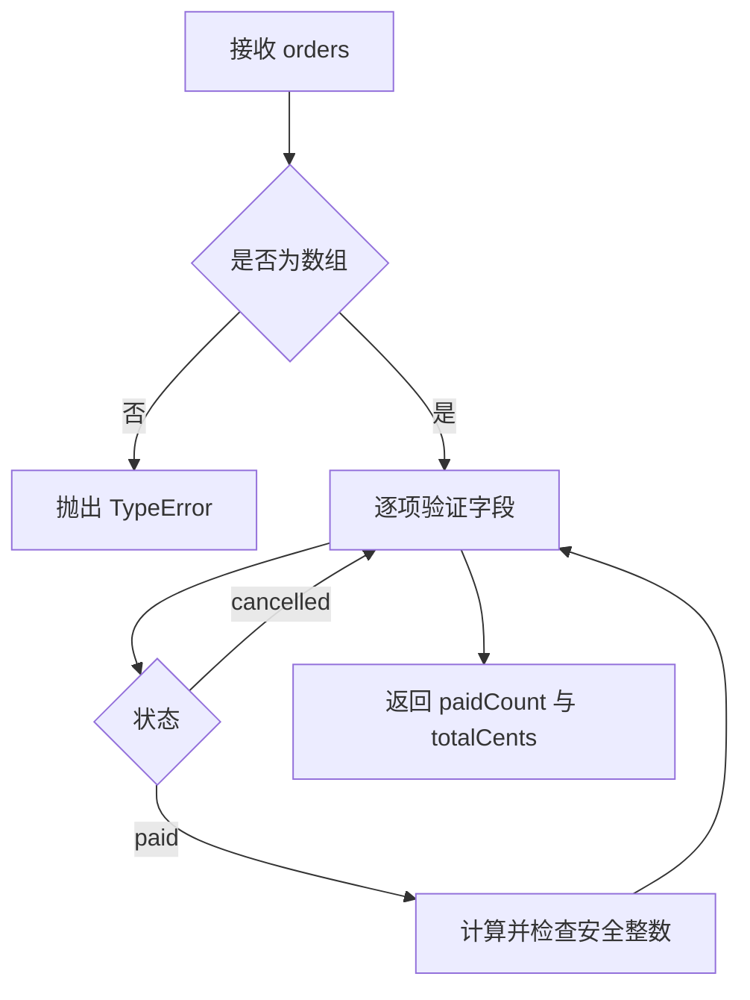

# 值、变量、类型、控制流、函数与错误

## 学习目标

完成本文后，应能准确说明 JavaScript 值、绑定和类型的关系，选择 `const` 或 `let`，写出边界明确的控制流与函数，并让调用者可靠地区分成功与失败。

## 1. 值、绑定与类型

值是程序计算时处理的数据。变量声明创建的是名称与存储位置之间的绑定；赋值改变绑定当前引用的值。JavaScript 是动态类型语言：类型属于值，不固定在变量名上。

```js
let result = 42;       // result 当前绑定 Number 值
result = "finished";  // 同一绑定随后引用 String 值
```

ECMAScript 定义七种原始类型和一种对象类型：

| 类型 | 示例 | 关键规则 |
| --- | --- | --- |
| Undefined | `undefined` | 未提供或未产生结果时常见；只有一个值 |
| Null | `null` | 程序显式表示“没有对象”；只有一个值 |
| Boolean | `true`、`false` | 用于逻辑条件 |
| String | `"订单"` | 不可变的 UTF-16 码元序列 |
| Symbol | `Symbol("id")` | 每次创建得到唯一值，常用作属性键 |
| Number | `3.5`、`NaN` | IEEE 754 双精度浮点；也包含正负无穷和 `NaN` |
| BigInt | `9007199254740993n` | 任意精度整数；不能直接与 Number 做算术运算 |
| Object | `{}`、`[]`、函数 | 属性集合；数组和函数都是对象的特定形态 |

`null` 与 `undefined` 的业务含义应由接口约定。例如请求字段缺失可用 `undefined`，用户明确清空字段可用 `null`。不要仅凭两者“都没有内容”而混用。

`typeof null` 返回 `"object"` 是历史兼容行为，判断空值应写 `value === null`。`typeof` 对未声明标识符返回 `"undefined"`，但直接读取该标识符会抛出 `ReferenceError`。

## 2. Number 与 BigInt 的边界

Number 可精确表示的整数范围是 `-(2^53-1)` 到 `2^53-1`，可用 `Number.isSafeInteger` 检查。金额通常转换为最小货币单位的安全整数，或者使用业务认可的十进制定点库。

```js
0.1 + 0.2 === 0.3;                    // false
Number.isSafeInteger(9_007_199_254_740_991); // true
9007199254740993n + 1n;               // 9007199254740994n
```

`1n + 1` 会抛出 `TypeError`，必须显式决定转换方向。把超过安全整数的 BigInt 转成 Number 可能丢失低位；BigInt 也不能直接由 `JSON.stringify` 序列化，接口需约定为十进制字符串等表示。

`NaN` 表示无效数值计算结果。它与包括自身在内的任何 Number 都不相等，所以用 `Number.isNaN(value)` 检查。`Number.isFinite` 可同时拒绝 `NaN`、`Infinity` 与 `-Infinity`，适合验证业务数值。

## 3. 声明、作用域与生命周期

优先使用 `const`：它禁止重新赋值绑定，但不冻结对象内部属性。确实需要重绑定时使用 `let`。`let` 和 `const` 是块级作用域；`var` 是函数级作用域，并具有不同的声明初始化规则，新代码通常没有必要使用。

```js
const order = { status: "pending" };
order.status = "paid"; // 合法：对象可变
// order = {};          // TypeError：不能重绑定 const
```

从块开始到声明被求值前，`let`/`const` 绑定处于暂时性死区，访问会抛出 `ReferenceError`。这不是“变量不存在”，而是绑定已建立但尚未初始化。

```js
{
  // console.log(count); // ReferenceError
  const count = 1;
}
```

避免依赖外层可变变量。函数需要的数据优先通过参数传入，计算结果通过返回值给出，这会让测试无需准备隐式状态。

## 4. 相等、转换与真值

条件表达式会执行 `ToBoolean`。假值只有 `false`、`0`、`-0`、`0n`、`""`、`null`、`undefined` 和 `NaN`；空数组与空对象都是真值。

`===` 不做类型转换，应作为默认相等判断。`Object.is` 与 `===` 的主要可见差异是：`Object.is(NaN, NaN)` 为真，`Object.is(0, -0)` 为假。`==` 包含较复杂的抽象相等转换，只有在明确需要其语义并有测试时采用。

```js
[] ? "truthy" : "falsy";   // "truthy"
0 === false;                // false
0 == false;                 // true：发生类型转换
Object.is(NaN, NaN);        // true
```

默认值不能一律写 `input || fallback`，因为它还会替换合法的 `0`、`false` 和空字符串。只希望替换 `null` 或 `undefined` 时使用空值合并：`input ?? fallback`。

## 5. 条件与分支

`if / else if / else` 适合按布尔条件选择路径。`switch` 使用严格相等匹配；每个 `case` 若没有 `break`、`return` 或 `throw` 会继续执行后续分支，这称为贯穿。

```js
function shippingFee(level) {
  switch (level) {
    case "standard": return 500;
    case "express": return 1200;
    default: throw new RangeError(`unsupported level: ${level}`);
  }
}
```

业务分支应覆盖不可识别状态。静默落入默认成功路径会把上游数据错误变成错误计算。多个条件有优先级时，先处理拒绝条件和边界，再执行主路径。

## 6. 循环与迭代

`for` 适合显式索引，`for...of` 遍历可迭代对象产生的值，`for...in` 枚举对象的可枚举字符串属性键。数组通常用 `for...of`；不要把 `for...in` 当成数组值遍历。

```js
for (const amount of [100, 250]) console.log(amount); // 100、250
for (const key in { id: 7, paid: true }) console.log(key); // id、paid
```

`while` 在每次循环前判断，`do...while` 至少执行一次。任何循环都要能说明：初始状态、继续条件、每轮状态变化和终止条件。处理外部集合时还要考虑输入规模，避免无界内存增长。

`break` 结束当前循环，`continue` 跳过本轮剩余语句。嵌套循环难以追踪时，把内部逻辑提取为命名函数通常更易验证。

## 7. 函数与契约

函数契约至少包含输入类型、允许范围、返回值、可观察副作用和失败方式。JavaScript 缺少静态参数约束，运行时边界必须主动验证。

普通函数声明会在所在作用域实例化时创建绑定；函数表达式和箭头函数遵循变量初始化时机。箭头函数没有自己的 `this`、`arguments` 和 `prototype`，不适合作为需要动态 `this` 的对象方法或构造器。

没有显式 `return` 的函数返回 `undefined`。参数不足也得到 `undefined`，多余参数仍可通过剩余参数或 `arguments` 观察。因此“参数个数不对”不会自动报错。

闭包是函数与其词法环境的组合。闭包可保存私有状态，但捕获可变变量也可能导致执行时读取到与创建时不同的值。

```js
function makeCounter() {
  let value = 0;
  return () => ++value;
}
```

## 8. 错误的产生、传播与处理

`throw` 可抛出任何值，但应抛出 `Error` 或其子类，使调用栈、名称和消息结构一致。`TypeError` 表示值的类型或形态不符合操作要求，`RangeError` 表示值超出允许范围，业务错误可定义子类并携带稳定的错误码。

`try` 中抛出的错误跳到匹配的 `catch`。`finally` 无论成功、抛错还是提前返回通常都会执行，适合释放资源；不要在 `finally` 中 `return`，否则可能覆盖原返回值或错误。

只捕获当前层能处理的错误。若只能补充上下文，可使用 `cause` 保留原始错误并继续抛出：

```js
function loadOrder(text) {
  try {
    return parseOrder(text);
  } catch (error) {
    throw new Error("failed to load order", { cause: error });
  }
}
```

## 9. 完整案例：汇总合法订单金额

### 9.1 输入与约束

输入是订单数组。每项必须是非空字符串 `id`、安全非负整数 `unitPriceCents`、1 到 1000 的安全整数 `quantity`。只统计 `status === "paid"`；允许状态只有 `paid` 和 `cancelled`。

```js
class ValidationError extends Error {
  constructor(code, message, details) {
    super(message);
    this.name = "ValidationError";
    this.code = code;
    this.details = details;
  }
}

function requireSafeInteger(value, field, min, max) {
  if (!Number.isSafeInteger(value) || value < min || value > max) {
    throw new ValidationError("INVALID_INTEGER", `${field} is invalid`, {
      field, value, min, max,
    });
  }
}

function summarizePaidOrders(orders) {
  if (!Array.isArray(orders)) {
    throw new TypeError("orders must be an array");
  }

  let paidCount = 0;
  let totalCents = 0;
  for (const [index, order] of orders.entries()) {
    if (order === null || typeof order !== "object" || Array.isArray(order)) {
      throw new ValidationError("INVALID_ORDER", "order must be an object", { index });
    }
    if (typeof order.id !== "string" || order.id.length === 0) {
      throw new ValidationError("INVALID_ID", "id must be non-empty", { index });
    }
    if (order.status !== "paid" && order.status !== "cancelled") {
      throw new ValidationError("INVALID_STATUS", "status is unsupported", {
        index, status: order.status,
      });
    }
    requireSafeInteger(order.unitPriceCents, "unitPriceCents", 0, 1_000_000_000);
    requireSafeInteger(order.quantity, "quantity", 1, 1000);
    if (order.status === "cancelled") continue;

    const subtotal = order.unitPriceCents * order.quantity;
    if (!Number.isSafeInteger(subtotal) || !Number.isSafeInteger(totalCents + subtotal)) {
      throw new RangeError("total exceeds the safe integer range");
    }
    paidCount += 1;
    totalCents += subtotal;
  }
  return { paidCount, totalCents };
}
```

### 9.2 执行步骤与输出

```js
const input = [
  { id: "o-1", status: "paid", unitPriceCents: 1299, quantity: 2 },
  { id: "o-2", status: "cancelled", unitPriceCents: 500, quantity: 1 },
  { id: "o-3", status: "paid", unitPriceCents: 250, quantity: 3 },
];
console.log(summarizePaidOrders(input));
// { paidCount: 2, totalCents: 3348 }
```

处理顺序是：确认顶层数组；逐项确认对象、标识和状态；验证两个整数范围；跳过取消项；计算小计并检查安全整数；累计数量和金额。订单 `o-1` 小计 2598，`o-3` 小计 750，最终为 3348 分。



### 9.3 验证与失败分支

```js
const actual = summarizePaidOrders(input);
console.assert(actual.paidCount === 2);
console.assert(actual.totalCents === 3348);

try {
  summarizePaidOrders([
    { id: "bad", status: "paid", unitPriceCents: 100, quantity: 0 },
  ]);
  throw new Error("expected validation failure");
} catch (error) {
  console.assert(error instanceof ValidationError);
  console.assert(error.code === "INVALID_INTEGER");
  console.assert(error.details.field === "quantity");
}
```

失败输入的 `quantity` 为 0，步骤在整数范围检查处停止，不会产生部分汇总。验证不仅检查“发生错误”，还检查错误类型、稳定错误码与定位字段。

## 10. 调试检查表

- 打印值时同时记录 `typeof`、`Array.isArray` 和关键字段，避免只看字符串化结果。
- 浮点或大整数异常时，检查 `Number.isFinite`、`Number.isSafeInteger` 和单位转换。
- 分支未执行时，逐项写出条件值及其布尔转换结果。
- 循环异常时，确认迭代对象、索引范围、终止条件以及 `break`/`continue` 所属层级。
- 错误被吞掉时，搜索空 `catch`、只写日志不继续抛出的路径，以及 `finally` 中的返回。
- 对象在函数外被意外修改时，检查是否共享引用，并明确函数是否允许改变输入。

## 11. 练习

1. 为案例加入 `refunded` 状态，并明确它是否计入数量和金额，补齐正常与非法状态测试。
2. 将总额改用 BigInt，约定 JSON 输出为十进制字符串，验证超过安全整数的输入。
3. 写出 `const` 对数组绑定与数组元素分别限制了什么，并用代码验证。
4. 构造 `0`、空字符串、`null` 和 `undefined`，比较 `||` 与 `??` 的输出。
5. 为重复订单 ID 增加失败分支，说明需要什么集合以及时间、空间复杂度。

## 来源

- [ECMA-262：ECMAScript Language Types](https://tc39.es/ecma262/#sec-ecmascript-language-types)（访问日期：2026-07-17）
- [ECMA-262：Declarations and the Variable Statement](https://tc39.es/ecma262/#sec-declarations-and-the-variable-statement)（访问日期：2026-07-17）
- [ECMA-262：ECMAScript Language — Statements and Declarations](https://tc39.es/ecma262/#sec-ecmascript-language-statements-and-declarations)（访问日期：2026-07-17）
- [ECMA-262：ECMAScript Language — Functions and Classes](https://tc39.es/ecma262/#sec-ecmascript-language-functions-and-classes)（访问日期：2026-07-17）
