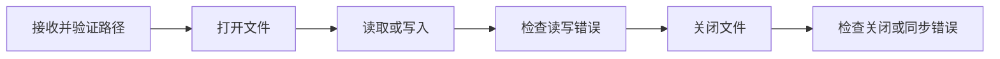

# 集合、字符串与文件处理

## 学习目标

本文建立从内存数据结构到持久文件的完整基础：选择数组、切片、映射、集合或结构体；正确处理 Unicode 文本；按“打开、读写、检查、关闭”的资源生命周期实现文件程序。

## 1. 集合解决什么问题

集合把多个值组织成可查找、可迭代的数据结构。选择集合时要明确：元素是否有顺序、键是否唯一、是否允许重复、元素类型是否固定、查找和更新的规模，以及修改是否会影响共享数据。

### 1.1 JavaScript Array

Array 是按非负整数索引访问、带 `length` 属性的特殊对象。它允许不同类型元素，但业务代码通常保持同质，减少分支。`push`、`pop` 修改原数组；`map`、`filter`、`slice` 返回新数组；`sort` 默认原地修改并按字符串排序，数值排序要提供比较函数。

```js
const amounts = [20, 3, 100];
amounts.sort((a, b) => a - b); // [3, 20, 100]
```

数组赋值复制的是对象引用。`const copied = original` 不会复制元素；`[...original]` 只做一层浅复制，嵌套对象仍然共享。

```js
const a = [{ count: 1 }];
const b = [...a];
b[0].count = 2;
console.log(a[0].count); // 2
```

### 1.2 JavaScript Object、Map 与 Set

普通 Object 适合表示字段固定的记录。自身可枚举属性可通过 `Object.keys`、`Object.values` 或 `Object.entries` 遍历。外部输入可能包含特殊属性名，不应直接当作无约束字典；需要字典语义时优先 Map 或无原型对象。

Map 的键可为任何 ECMAScript 值，按插入顺序迭代，并直接提供 `size`、`has`、`get`、`set` 和 `delete`。Set 保存唯一值，使用 SameValueZero 比较：`NaN` 能匹配自身，`0` 与 `-0` 视为相同；对象是否重复仍按引用身份判断。

| 需求 | JavaScript 结构 | 原因 |
| --- | --- | --- |
| 按位置保存有序条目 | Array | 索引和顺序是核心语义 |
| 表示固定字段实体 | Object | 字段名直接对应业务属性 |
| 任意类型键的动态字典 | Map | 键空间和字典 API 清晰 |
| 去重或快速成员判断 | Set | 唯一性是结构本身的约束 |

平均复杂度不能替代测量；一般实现中 Array 按索引访问是常数级，线性搜索是 O(n)，Map/Set 查找通常接近常数级，但 ECMAScript 只要求实现提供次线性平均访问时间，不规定必须使用哈希表。

## 2. Go 的数组、切片、映射与结构体

Go 集合的元素类型在编译期确定。数组 `[N]T` 的长度属于类型，`[3]int` 与 `[4]int` 是不同类型。数组值赋值会复制全部元素。

切片 `[]T` 是描述符，包含对底层数组的引用、长度和容量。切片赋值复制描述符，不复制底层元素，因此多个切片可能共享存储。

```go
base := []int{10, 20, 30, 40}
left := base[:2]       // len=2, cap=4
left[0] = 99           // base[0] 也变为 99
left = append(left, 50) // 容量足够，覆盖 base[2]
```

`append` 返回更新后的切片，必须接收返回值。容量不足时会分配新底层数组，此后新旧切片不再共享新增存储。若函数不应修改调用者数据，应使用 `slices.Clone` 或 `append([]T(nil), input...)` 做元素浅复制；元素是指针或含引用字段时仍需决定是否深复制。

Go map 的类型是 `map[K]V`，键类型必须可比较。读取不存在的键得到值类型零值，使用双返回值区分“不存在”和“存在但值为零”：

```go
count, ok := counts["go"]
if !ok {
    // 键不存在
}
```

nil map 可读取、可 `len`、可 `range`，但写入会 panic；写入前用 `make` 或字面量初始化。map 的迭代顺序未指定，不能把一次输出顺序写入协议或测试；需要稳定结果时提取键并排序。普通 map 不支持无同步并发读写。

struct 将命名字段组合成值。字段名首字母大写时可被其他包访问。标签是结构体类型的一部分，常由 `encoding/json` 等包解释，但标签本身不会自动执行验证。

```go
type Order struct {
    ID     string `json:"id"`
    Amount int64  `json:"amount_cents"`
}
```

| Go 类型 | 是否含长度于类型 | 零值 | 赋值后的共享行为 |
| --- | --- | --- | --- |
| `[N]T` | 是 | N 个元素零值 | 整体复制，不共享数组存储 |
| `[]T` | 否 | `nil` | 描述符复制，可能共享底层数组 |
| `map[K]V` | 否 | `nil` | 引用同一映射数据 |
| `struct` | 不适用 | 各字段递归为零值 | 字段逐值复制；引用字段仍共享所指数据 |

## 3. 字符串、字节与 Unicode

字符串不可变，但“长度”取决于计量单位：字节、编码单元、Unicode 码点或用户感知字符不是同一概念。

JavaScript String 是 UTF-16 码元序列，`length` 返回码元数，索引也取码元。基本多文种平面之外的码点用代理对表示，因此 `"😀".length === 2`。`for...of` 按码点迭代，但一个用户感知字符仍可能由多个码点组成，例如字母与组合附加符、家庭 emoji 序列。

Go string 是不可变字节序列，不保证内容一定是 UTF-8。`len(s)` 返回字节数；`for range` 解码 UTF-8 并产生每个 rune 的起始字节索引和码点值。`rune` 是 `int32` 的别名，表示 Unicode 码点，不等同于视觉字符。

```go
s := "Go语言😀"
fmt.Println(len(s))                    // 12 个 UTF-8 字节
fmt.Println(utf8.RuneCountInString(s)) // 5 个码点
```

边界规则：

- 文件和网络协议必须明确编码，现代文本通常约定 UTF-8。
- 截取 Go 字符串字节区间可能切断 UTF-8 序列；按码点处理可先转 `[]rune`，但会分配内存。
- JavaScript 的 `slice` 按 UTF-16 码元截取，也可能切断代理对。
- “限制用户名 20 个字符”必须先定义按码点还是扩展字素簇计数。
- 大小写转换与排序可能受语言环境影响，不应用简单转小写代替完整身份规范。

Unicode 规范允许同一抽象文本有不同码点序列，例如预组的 `é` 与 `e` 加组合尖音符。NFC 做规范分解后再规范组合，常用于需要规范等价比较的存储边界。NFKC 会折叠兼容差异，可能改变语义或格式，不能对任意正文盲目使用。

## 4. 文件、路径与资源生命周期

路径是文件系统命名，不是普通字符串拼接。使用语言的路径 API 处理分隔符、清理 `.`/`..` 和平台差异。来自用户的路径若拼到受限根目录下，要在规范化后验证仍位于允许范围内。

文件处理的基本生命周期是：



打开操作要明确用途和权限：只读、覆盖写、追加写或创建新文件。写入重要文件时，单次 `WriteFile` 并不自动提供跨崩溃事务语义；常见策略是同目录临时文件写入、必要时同步、关闭，然后原子重命名替换。是否原子、是否持久到介质以及目录同步要求取决于操作系统和文件系统，必须按目标环境文档验证。

小文件可一次读入内存。大文件、无界输入或持续流应使用缓冲流式处理，并设置大小上限。读取 JSON 时还应拒绝尾随的第二个值，否则只解析首值可能掩盖拼接或污染输入。

文件错误不能只报告“读取失败”。至少附加操作、经过安全处理的路径和底层原因，同时避免在日志泄露敏感完整路径或文件内容。

## 5. 完整案例：读取 JSON 订单并生成稳定报告

### 5.1 输入

创建 `orders.json`：

```json
[
  {"id":"o-2","status":"paid","amount_cents":750},
  {"id":"o-1","status":"paid","amount_cents":1250},
  {"id":"o-3","status":"cancelled","amount_cents":500}
]
```

目标输出按 ID 排序，只包含已支付订单，并增加总额。稳定排序使 Git diff、快照测试和下游消费不依赖 map 迭代顺序。

### 5.2 可运行 Go 程序

```go
package main

import (
    "encoding/json"
    "errors"
    "fmt"
    "io"
    "os"
    "sort"
)

type Order struct {
    ID          string `json:"id"`
    Status      string `json:"status"`
    AmountCents int64  `json:"amount_cents"`
}

type Report struct {
    Paid       []Order `json:"paid"`
    TotalCents int64   `json:"total_cents"`
}

func loadOrders(path string) ([]Order, error) {
    file, err := os.Open(path)
    if err != nil {
        return nil, fmt.Errorf("open %q: %w", path, err)
    }
    defer file.Close()

    decoder := json.NewDecoder(io.LimitReader(file, 1<<20))
    decoder.DisallowUnknownFields()
    var orders []Order
    if err := decoder.Decode(&orders); err != nil {
        return nil, fmt.Errorf("decode %q: %w", path, err)
    }
    var extra any
    if err := decoder.Decode(&extra); !errors.Is(err, io.EOF) {
        if err == nil {
            return nil, fmt.Errorf("decode %q: trailing JSON value", path)
        }
        return nil, fmt.Errorf("decode %q trailer: %w", path, err)
    }
    return orders, nil
}

func buildReport(orders []Order) (Report, error) {
    report := Report{Paid: make([]Order, 0, len(orders))}
    seen := make(map[string]struct{}, len(orders))
    for i, order := range orders {
        if order.ID == "" {
            return Report{}, fmt.Errorf("order[%d]: empty id", i)
        }
        if _, exists := seen[order.ID]; exists {
            return Report{}, fmt.Errorf("order[%d]: duplicate id %q", i, order.ID)
        }
        seen[order.ID] = struct{}{}
        if order.AmountCents < 0 {
            return Report{}, fmt.Errorf("order[%d]: negative amount", i)
        }
        switch order.Status {
        case "paid":
            report.Paid = append(report.Paid, order)
            report.TotalCents += order.AmountCents
        case "cancelled":
        default:
            return Report{}, fmt.Errorf("order[%d]: invalid status %q", i, order.Status)
        }
    }
    sort.Slice(report.Paid, func(i, j int) bool {
        return report.Paid[i].ID < report.Paid[j].ID
    })
    return report, nil
}

func run(inputPath, outputPath string) error {
    orders, err := loadOrders(inputPath)
    if err != nil {
        return err
    }
    report, err := buildReport(orders)
    if err != nil {
        return err
    }
    data, err := json.MarshalIndent(report, "", "  ")
    if err != nil {
        return fmt.Errorf("encode report: %w", err)
    }
    data = append(data, '\n')
    if err := os.WriteFile(outputPath, data, 0o600); err != nil {
        return fmt.Errorf("write %q: %w", outputPath, err)
    }
    return nil
}

func main() {
    if len(os.Args) != 3 {
        fmt.Fprintln(os.Stderr, "usage: report INPUT.json OUTPUT.json")
        os.Exit(2)
    }
    if err := run(os.Args[1], os.Args[2]); err != nil {
        fmt.Fprintln(os.Stderr, "report:", err)
        os.Exit(1)
    }
}
```

### 5.3 步骤、输出与验证

把代码保存为 `main.go` 后执行：

```bash
go run main.go orders.json report.json
cat report.json
```

预期输出：

```json
{
  "paid": [
    {"id":"o-1","status":"paid","amount_cents":1250},
    {"id":"o-2","status":"paid","amount_cents":750}
  ],
  "total_cents": 2000
}
```

`json.MarshalIndent` 实际会展开对象字段的空格和换行，语义应验证为：`paid` 长度为 2、顺序为 `o-1` 后 `o-2`、`total_cents` 为 2000。可再次用 `go run` 生成文件并比较两次 SHA-256，确认相同输入得到稳定字节结果。

### 5.4 失败分支

把第二项 ID 改为 `o-2`，程序在 `buildReport` 返回 `duplicate id "o-2"`，stderr 以 `report:` 开头，退出码为 1，输出文件不应被当作成功结果。

把 JSON 末尾追加 `{}`，第二次 `Decode` 会发现尾随 JSON 值并失败。把未知字段 `amount` 加入对象时，`DisallowUnknownFields` 会拒绝拼写错误。输入超过 1 MiB 时，限制读取可能产生截断后的解析错误；生产实现应把“超过上限”区分为稳定错误码。

当前示例直接覆盖输出文件，适合练习，不适合要求崩溃一致性的关键配置。改进版应在同目录创建临时文件、设置权限、写入并检查关闭错误，再重命名替换；任何一步失败都删除临时文件并保留原文件。

仓库中的[可运行 Report 示例](../../examples/programming-basics/report/)保存了排序、汇总、重复 ID 失败测试。

## 6. 调试检查表

- 数据被连带修改：检查数组、切片、map 和嵌套对象是否共享存储。
- map 输出偶尔变序：提取键排序，不在测试中依赖一次迭代顺序。
- 字符串长度异常：分别记录字节数、码点数和产品要求的字素簇数。
- 文本看起来相同却比较失败：查看码点序列，并在明确边界采用 NFC。
- JSON 字段静默丢失：检查导出字段、标签拼写以及是否启用未知字段拒绝。
- 文件只在大输入失败：检查一次读入、扫描器上限、内存和部分写入处理。
- 文件句柄耗尽：确认循环内每次打开都及时关闭；不要在长循环中无限累计 `defer`。

## 7. 练习

1. 修改案例，使用同目录临时文件和 `os.Rename` 输出报告，并测试写入失败时原文件不变。
2. 写一个 Go 例子证明两个切片共享底层数组，再用 `slices.Clone` 隔离修改。
3. 比较 JavaScript 中 `"😀".length`、`[..."😀"].length` 与 Go 的字节数、rune 数。
4. 对 `é` 的预组形式和组合形式执行 NFC，验证规范化前后字节比较结果。
5. 为报告增加按状态计数的 map，并在 JSON 输出前转为已排序条目数组。

## 来源

- [ECMA-262：Indexed Collections 与 Keyed Collections](https://tc39.es/ecma262/#sec-indexed-collections)（访问日期：2026-07-17）
- [Go 语言规范：Array、Slice、Map 与 String types](https://go.dev/ref/spec#Array_types)（访问日期：2026-07-17）
- [Go 标准库：encoding/json](https://pkg.go.dev/encoding/json)（访问日期：2026-07-17）
- [Go 标准库：os](https://pkg.go.dev/os)（访问日期：2026-07-17）
- [Unicode Standard Annex #15：Unicode Normalization Forms](https://unicode.org/reports/tr15/)（访问日期：2026-07-17）
