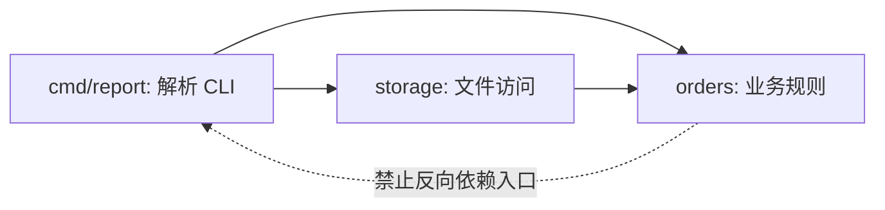

# 模块、依赖、标准 I/O 与命令行程序

## 学习目标

本文说明代码如何通过模块和包形成可维护边界，依赖如何被解析与校验，以及命令行程序如何通过参数、环境、标准流和退出码组成稳定接口。

## 1. 模块与包是什么

模块解决版本、依赖与发布边界，包解决源码组织和名称空间。不同生态对两个词的定义不同，不能仅凭目录名类推。

Go 模块由根目录的 `go.mod` 定义，模块路径与版本共同标识模块；一个模块包含一个或多个包。包由同一目录中声明相同包名的 Go 源文件构成。`main` 包提供可执行程序，入口是无参数、无返回值的 `main` 函数。

```text
example.com/report/
├── go.mod                 模块边界
├── cmd/report/main.go     package main
└── internal/orders/
    ├── order.go           package orders
    └── order_test.go      package orders 或 orders_test
```

JavaScript ECMAScript module 使用 `export` 暴露绑定、使用 `import` 引用。浏览器以 URL 解析模块；Node.js 可用 `.mjs`、`package.json` 的 `"type": "module"` 等显式标记选择 ESM。Node.js 还支持 CommonJS，但两种模块系统的加载和互操作规则不同。

```js
// money.mjs
export function addCents(a, b) { return a + b; }
```

```js
// main.mjs
import { addCents } from "./money.mjs";
console.log(addCents(100, 25));
```

模块边界应围绕稳定职责，而不是机械地“一函数一文件”。好的公共 API 小于内部实现：只导出调用者必须依赖的名称，内部数据结构可在不破坏调用者的情况下改变。

## 2. 导入、导出与初始化

导入路径标识的是模块或包，不只是磁盘文件。Go 导入 `example.com/report/internal/orders` 后，通过包名访问其导出标识符；首字母大写的名称才跨包可见。Go 禁止导入循环，迫使依赖形成有向无环关系。

ESM 的导入是对导出绑定的实时只读视图，不是取值时的普通对象复制。静态 `import` 在模块链接阶段解析，有利于工具分析依赖图；`import()` 返回 Promise，适合条件或延迟加载。

模块初始化会执行顶层代码。顶层连接数据库、读取本地配置或启动后台任务会使导入产生难以控制的副作用。更可测试的方式是导出构造函数或 `run` 函数，由程序入口显式完成装配。



## 3. 依赖与可复现构建

依赖包括直接导入和传递依赖。添加依赖会扩大维护、安全、许可证和供应链范围；选择前确认项目来源、维护状态、API 范围以及是否可用标准库完成。

Go 的 `go.mod` 记录模块路径、Go 版本和依赖要求。`go.sum` 保存下载模块内容与 `go.mod` 文件的密码学校验值，用于验证下载内容；它不是“当前只安装一个精确依赖树”的传统锁文件。两者都应提交版本控制。

```go
module example.com/report

go 1.25

require example.com/parser v1.4.2
```

常用 Go 命令：

| 命令 | 作用 | 审查点 |
| --- | --- | --- |
| `go mod init PATH` | 创建模块 | PATH 应是受控且稳定的模块标识 |
| `go get MODULE@VERSION` | 调整依赖版本 | 查看 `go.mod`/`go.sum` diff |
| `go mod tidy` | 补充需要并删除不需要的要求与校验 | 与源码变更一起审查 |
| `go mod download` | 下载模块到缓存 | 校验失败必须中止 |
| `go list -m all` | 列出构建列表 | 检查实际选择版本 |
| `go mod verify` | 验证缓存模块内容 | 不代替漏洞和行为审查 |

Node.js 项目通过 `package.json` 声明包元数据、脚本和依赖范围，包管理器的锁文件记录解析结果。团队应固定包管理器与版本，使用面向锁文件的安装命令，并审查锁文件变化。版本范围、对等依赖、可选依赖和安装脚本都可能改变结果。

依赖升级应运行格式化、静态检查、测试和构建；对外部协议或持久数据相关库还要验证兼容样本。校验值证明内容与已记录内容一致，不证明代码安全或适合业务。

## 4. 标准输入、输出与错误

命令行程序通常继承三个标准流：stdin 用于输入，stdout 用于正常数据，stderr 用于诊断。POSIX 中文件描述符通常分别是 0、1、2。重定向和管道让程序在不知道对端是终端、文件还是另一个进程时仍能组合。

```bash
producer | report --format=json > result.json 2> error.log
```

如果 stdout 约定输出 JSON，就不要混入进度提示；诊断写 stderr。成功但无结果可以输出空数组或按契约不输出，不能靠人类语言表示结构化空值。

读写流可能只处理部分数据，也可能因下游关闭而失败。库提供的高层复制或编码函数通常会循环处理，但调用者仍必须检查最终错误。持续输入必须设置记录大小、总量或时间限制。

## 5. 参数、选项、环境与配置

命令行由程序名、选项、选项参数和位置操作数组成。POSIX 工具惯例中，`--` 终止选项解析，使以连字符开头的文件名可作为操作数；未知选项或缺少参数应向 stderr 输出诊断并以非零状态结束。

设计规则：

- 选项名表达稳定概念，例如 `--format=json`，不要依赖参数位置猜测类型。
- 布尔选项不接含糊字符串；需要三态时定义明确枚举。
- `--help` 输出用法并成功退出，解析错误输出简短诊断和用法提示。
- 密钥不放命令行，因为进程列表、shell 历史或审计记录可能暴露它。
- 环境变量适合部署注入，但仍需验证类型、范围和缺失情况。
- 约定配置优先级，例如“命令行 > 环境 > 配置文件 > 默认值”，并逐项测试。

退出码是程序接口。常用约定是 0 表示成功，非零表示失败；具体非零值由程序文档定义。不要把所有失败都当成 1 后再让自动化解析错误文本；可区分用法错误、输入数据错误和运行时 I/O 错误，但保持数量有限且稳定。

## 6. 完整案例：统计输入行

### 6.1 接口契约

程序接受 `-input PATH`，缺省或 `-` 时从 stdin 读取；`-min-length N` 只统计 rune 数不少于 N 的非空行；stdout 输出一个 JSON；诊断写 stderr。

成功退出 0，用法或无效参数退出 2，文件与读取错误退出 1。单行最多 1 MiB，避免无界记录占用内存。

### 6.2 可运行 Go 程序

```go
package main

import (
    "bufio"
    "encoding/json"
    "errors"
    "flag"
    "fmt"
    "io"
    "os"
    "unicode/utf8"
)

type config struct {
    input     string
    minLength int
}

type result struct {
    Lines    int `json:"lines"`
    Accepted int `json:"accepted"`
}

func parseArgs(args []string, stderr io.Writer) (config, error) {
    fs := flag.NewFlagSet("linecount", flag.ContinueOnError)
    fs.SetOutput(stderr)
    input := fs.String("input", "-", "input file, or - for stdin")
    min := fs.Int("min-length", 1, "minimum Unicode code point count")
    if err := fs.Parse(args); err != nil {
        return config{}, err
    }
    if fs.NArg() != 0 {
        return config{}, fmt.Errorf("unexpected operands: %v", fs.Args())
    }
    if *min < 0 {
        return config{}, errors.New("-min-length must be non-negative")
    }
    return config{input: *input, minLength: *min}, nil
}

func countLines(reader io.Reader, minLength int) (result, error) {
    scanner := bufio.NewScanner(reader)
    scanner.Buffer(make([]byte, 64*1024), 1024*1024)
    var out result
    for scanner.Scan() {
        out.Lines++
        text := scanner.Text()
        if utf8.RuneCountInString(text) >= minLength {
            out.Accepted++
        }
    }
    if err := scanner.Err(); err != nil {
        return result{}, fmt.Errorf("scan input: %w", err)
    }
    return out, nil
}

func run(args []string, stdin io.Reader, stdout, stderr io.Writer) int {
    cfg, err := parseArgs(args, stderr)
    if err != nil {
        fmt.Fprintln(stderr, "linecount:", err)
        return 2
    }

    reader := stdin
    var file *os.File
    if cfg.input != "-" {
        file, err = os.Open(cfg.input)
        if err != nil {
            fmt.Fprintln(stderr, "linecount: open input:", err)
            return 1
        }
        defer file.Close()
        reader = file
    }

    counted, err := countLines(reader, cfg.minLength)
    if err != nil {
        fmt.Fprintln(stderr, "linecount:", err)
        return 1
    }
    if err := json.NewEncoder(stdout).Encode(counted); err != nil {
        fmt.Fprintln(stderr, "linecount: encode output:", err)
        return 1
    }
    return 0
}

func main() {
    os.Exit(run(os.Args[1:], os.Stdin, os.Stdout, os.Stderr))
}
```

### 6.3 输入、步骤、输出与验证

输入：

```text
Go
数据库

API
```

执行：

```bash
printf 'Go\n数据库\n\nAPI\n' | go run main.go -min-length 3
```

处理步骤为：解析参数；选择 stdin；逐行扫描；按 Unicode 码点计数；累计总行数与通过数；编码 JSON 到 stdout。空行长度 0，`Go` 长度 2，`数据库` 与 `API` 长度 3，因此输出：

```json
{"lines":4,"accepted":2}
```

验证 stdout 可继续交给 JSON 工具解析，stderr 为空，退出码为 0。还应运行文件模式并比较结果：

```bash
go run main.go -input sample.txt -min-length 3 > result.json
```

### 6.4 失败分支

`go run main.go -min-length -1` 在参数验证处向 stderr 输出 `-min-length must be non-negative`，不输出 JSON，退出码为 2。输入路径不存在时，退出码为 1。某行超过 1 MiB 时 `Scanner` 返回错误，程序不会输出看似成功的部分统计。

注意 `go run` 自身可能包装子进程退出状态，测试编译后的二进制才能直接断言程序退出码：

```bash
go build -o linecount main.go
./linecount -min-length=-1
echo "$?"  # 2
```

## 7. 可测试的边界

`run` 接收 `io.Reader`/`io.Writer` 而不是直接在各处访问全局标准流，测试可用 `strings.NewReader` 与 `bytes.Buffer` 注入输入和捕获输出。文件打开仍在 `run`，进一步测试可把“打开路径”抽象为小接口，但不应为一个函数建立庞大框架。

测试应分别断言 stdout、stderr 和退出码。只检查错误文本会漏掉“失败却返回 0”或“结构化 stdout 被日志污染”。

## 8. 调试检查表

- 导入失败：核对模块模式、路径大小写、扩展名、包名和当前模块根目录。
- 依赖版本异常：检查 `go list -m all` 或包管理器锁文件，不只看声明范围。
- 本机成功、CI 失败：核对运行时版本、平台、锁文件安装方式和隐式全局工具。
- 管道没有数据：分别捕获 stdout 与 stderr，并检查上游和下游退出码。
- 进程不结束：确认是否仍等待 stdin EOF、后台任务或未关闭资源。
- 参数被当作选项：在支持的 CLI 中使用 `--` 终止选项解析。
- 中文长度不符：确认按字节、UTF-16 码元、码点还是字素簇计算。

## 9. 练习

1. 为案例加入 `-format text|json`，保证两种格式都不污染 stderr。
2. 用 `bytes.Buffer` 为正常 stdin、非法参数和超长行编写表驱动测试。
3. 创建两个 Go 包并故意形成导入循环，阅读编译错误后重构依赖方向。
4. 创建最小 Node ESM 项目，比较 `.mjs` 与 `package.json` 中 `type` 标记的行为。
5. 为程序定义配置优先级 `flag > LINECOUNT_MIN > default`，覆盖环境值非法的失败测试。

## 来源

- [Go 官方文档：Managing dependencies](https://go.dev/doc/modules/managing-dependencies)（访问日期：2026-07-17）
- [Go Modules Reference](https://go.dev/ref/mod)（访问日期：2026-07-17）
- [Go 语言规范：Packages](https://go.dev/ref/spec#Packages)（访问日期：2026-07-17）
- [Node.js 官方文档：ECMAScript modules](https://nodejs.org/api/esm.html)（访问日期：2026-07-17）
- [POSIX.1-2017：Utility Conventions](https://pubs.opengroup.org/onlinepubs/9699919799/basedefs/V1_chap12.html)（访问日期：2026-07-17）
