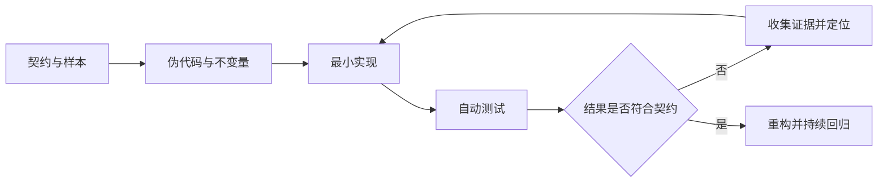

# 伪代码、调试、日志与测试

## 学习目标

本文把“理解问题、定位缺陷、固定正确行为”连接成一套可重复流程。重点是可检查的伪代码、基于证据的调试、结构化日志，以及能独立重放输入与输出的自动化测试。

## 1. 伪代码是什么

伪代码用与具体语言无关但足够精确的步骤描述算法。它不是随意的自然语言摘要，也不要求能被编译。其价值在于先明确数据、分支、循环、不变量和失败条件，再选择语言语法。

一段可评审的伪代码应说明：

- 输入的类型、允许范围和规模上限。
- 输出的结构、排序、单位与空结果语义。
- 前置条件与后置条件。
- 每个分支为什么存在，未知状态怎样处理。
- 循环初始状态、循环不变量、状态推进和终止条件。
- 外部读写、错误传播和资源释放。
- 预期时间与空间复杂度。

例如“汇总每个客户的已支付金额”不能只写“遍历订单并累加”。更完整的伪代码是：

```text
输入 orders：最多 100000 项
每项含 customer_id、status、amount_cents
要求 amount_cents 为非负 64 位整数

建立 totals：customer_id -> total_cents 的空映射
对 orders 中每个 order：
    若 customer_id 为空：返回带索引的验证错误
    若 status 不是 paid 或 cancelled：返回未知状态错误
    若 amount_cents 非法：返回金额错误
    若 status 为 cancelled：继续下一项
    若 totals[customer_id] + amount_cents 溢出：返回溢出错误
    累加 totals[customer_id]
提取 customer_id，按字节升序排序
按排序后的 ID 生成结果数组
返回结果

后置条件：每个 customer_id 只出现一次；总额等于其所有 paid 订单金额之和
复杂度：累计 O(n)，排序 O(k log k)，额外空间 O(k)
```

循环不变量是在每轮开始或结束都成立的事实。本例在处理完前 `i` 项后，`totals` 精确包含前 `i` 项中合法 paid 订单的总额。这个陈述可用于检查漏算、重复计算和提前更新造成的部分结果。

## 2. 从需求到可验证实现

实现前先写三个具体样本：正常输入、边界输入、失败输入。样本迫使“空数组是否成功”“重复 ID 是否允许”“金额单位是什么”等隐含选择变成接口契约。



不要让测试只重复实现。例如实现与测试都使用同一个错误公式，会共同通过。测试预期应来自需求样本、独立计算、权威协议样本或已确认的基准数据。

## 3. 调试是什么

调试是缩小“预期行为与实际行为差异”的原因范围。核心不是随机修改代码，而是提出可证伪假设并采集最小证据。

可重复流程：

1. 精确记录实际输出、错误、退出码、运行版本和输入。
2. 构造最小复现，移除与失败无关的网络、并发或数据。
3. 确定最后一个正确状态和第一个错误状态。
4. 提出单个假设，例如“循环跳过最后一项”。
5. 用断点、日志、测试或检查器采证，避免同时改多个变量。
6. 在根因位置修复，而不是在输出处掩盖症状。
7. 添加修复前失败、修复后通过的回归测试。
8. 删除临时敏感日志并运行完整相关测试。

调试要区分相关与因果。某变量在失败时为零，不等于赋值语句就是根因；还要检查数据是否未到达、分支是否绕过、错误是否被覆盖。

## 4. 断点、调用栈与变量观察

断点让程序在特定源码位置暂停。条件断点只在表达式成立时暂停，适合大量循环中定位一个 ID。数据断点或 watchpoint 在支持的调试器中可在内存被修改时暂停。日志点可以记录而不改变源码。

调用栈展示当前函数及其调用者。调试错误值时，从失败位置向上检查每层参数和返回值，找出契约第一次被破坏的位置。并发程序还要确认当前 goroutine 或任务，单一调用栈不能代表全局状态。

观察表达式不应调用有副作用的函数，否则调试本身会改变程序。优化构建可能内联函数或移除变量；需要源码级调试时使用适合的非优化构建配置。

## 5. 日志的职责和结构

日志记录离散事件，帮助回答何时、在哪里、对哪个请求、发生了什么结果。日志不是数据库副本，也不应记录密钥、认证头、完整令牌或不必要的个人数据。

结构化日志把字段与消息分离：

```json
{
  "severity":"ERROR",
  "event":"order_import_failed",
  "request_id":"r-42",
  "file":"orders.json",
  "error_type":"invalid_amount",
  "order_index":7
}
```

稳定字段便于过滤和聚合。错误对象应保留因果链；面向用户的安全消息与内部诊断可不同。请求标识用于关联同一请求事件，但不能把可预测请求 ID 当作授权凭据。

常用严重性：DEBUG 是开发细节；INFO 是正常关键状态；WARN 是已处理但值得注意的异常；ERROR 是当前操作失败。具体级别由日志系统定义，团队应形成一致规则。不要在每层对同一错误重复记录，否则一次失败会产生多条无新增证据的告警。

日志有成本与失败模式：格式化、序列化、磁盘或网络写入可能阻塞；无界高基数字段会增加索引成本；敏感值会长期留存。采样、限速和保留策略属于设计的一部分。

## 6. 测试的层次与边界

测试把输入、执行动作和可观察结果固定下来。单元测试隔离小范围纯逻辑；集成测试验证多个组件或真实依赖的协作；端到端测试从外部接口覆盖完整链路。层次名称不是质量保证，关键是风险是否被对应测试覆盖。

一个测试至少包含 Arrange、Act、Assert：准备输入，执行目标，断言输出或错误。每个测试应能独立运行，不依赖执行顺序、共享可变全局或真实当前时间。

测试替身的选择：

| 类型 | 用途 | 风险 |
| --- | --- | --- |
| Stub | 为调用提供预设返回 | 可能遗漏真实协议行为 |
| Fake | 简化但可工作的实现，如内存仓库 | 与生产实现语义漂移 |
| Mock | 验证特定交互 | 过度绑定内部调用顺序 |
| Spy | 记录调用供断言 | 仍可能使测试关注实现而非结果 |

优先测试可观察契约。只有调用本身就是契约，例如必须提交事务或发送审计事件时，才验证交互。

## 7. 测试用例设计

等价类把行为相同的输入归组，每组取代表；边界值关注刚好合法、刚好非法和极值。常见用例包括：空集合、单项、重复项、最大长度、零值、负数、Unicode、无效编码、I/O 部分失败、超时与取消。

表驱动测试把名称、输入、预期输出和预期错误组成数据表，适合相同过程的多组边界。失败时测试名必须指出具体情形。

属性测试不枚举所有答案，而验证对大量生成输入成立的性质，例如“排序后仍包含相同多重集合”“编码后再解码得到等价值”。模糊测试输入随机或变异字节，适合解析器边界；发现失败后应保存最小触发样本。

覆盖率只能说明代码被执行，不说明断言正确。100% 行覆盖仍可能缺少边界、并发顺序和错误语义。将覆盖报告作为未测试区域线索，而不是完成标准。

## 8. 完整案例：定位并修复区间求和缺陷

### 8.1 契约与错误实现

函数接收整数切片与半开区间 `[start, end)`，返回区间和。要求 `0 <= start <= end <= len(values)`；非法边界返回错误，不产生部分结果。

```go
func SumRange(values []int, start, end int) (int, error) {
    if start < 0 || end > len(values) || start > end {
        return 0, fmt.Errorf("invalid range [%d,%d) for length %d", start, end, len(values))
    }
    total := 0
    for i := start; i <= end; i++ { // 缺陷：把 end 当作闭区间
        total += values[i]
    }
    return total, nil
}
```

输入 `values=[4, 7, 2]`、`start=0`、`end=3`，预期 13，实际在 `values[3]` panic。输入 `start=0`、`end=2` 预期 11，错误实现返回 13，因此即使不越界也会静默算错。

### 8.2 伪代码与不变量

```text
验证 0 <= start <= end <= values.length
令 total = 0
令 i = start
当 i < end：
    total = total + values[i]
    i = i + 1
返回 total
```

循环每轮开始时，不变量为：`total` 等于 `values[start:i]` 之和，且 `start <= i <= end`。终止时 `i == end`，所以 total 正好是 `[start,end)` 的和。

### 8.3 最小复现与假设

最小复现使用一个元素：`SumRange([]int{4}, 0, 1)` 应返回 4，却访问索引 1。最后正确状态是 `i=0,total=4`，第一个错误状态是循环条件在 `i=1` 仍为真。假设是条件使用 `<=` 导致多执行一次。

修复：

```go
func SumRange(values []int, start, end int) (int, error) {
    if start < 0 || end > len(values) || start > end {
        return 0, fmt.Errorf("invalid range [%d,%d) for length %d", start, end, len(values))
    }
    total := 0
    for i := start; i < end; i++ {
        total += values[i]
    }
    return total, nil
}
```

### 8.4 表驱动回归测试

```go
func TestSumRange(t *testing.T) {
    tests := []struct {
        name       string
        values     []int
        start, end int
        want       int
        wantErr    bool
    }{
        {"whole", []int{4, 7, 2}, 0, 3, 13, false},
        {"prefix", []int{4, 7, 2}, 0, 2, 11, false},
        {"empty middle", []int{4, 7}, 1, 1, 0, false},
        {"empty input", nil, 0, 0, 0, false},
        {"negative start", []int{4}, -1, 1, 0, true},
        {"end too large", []int{4}, 0, 2, 0, true},
        {"reversed", []int{4}, 1, 0, 0, true},
    }

    for _, tc := range tests {
        t.Run(tc.name, func(t *testing.T) {
            got, err := SumRange(tc.values, tc.start, tc.end)
            if (err != nil) != tc.wantErr {
                t.Fatalf("error = %v, wantErr = %v", err, tc.wantErr)
            }
            if !tc.wantErr && got != tc.want {
                t.Fatalf("sum = %d, want %d", got, tc.want)
            }
        })
    }
}
```

运行 `go test ./...`。修复前 `whole` 会 panic、`prefix` 会得到错误值；修复后全部通过。失败分支同时验证负起点、结束越界和反向区间，空半开区间合法返回 0。

仓库中的[可运行 SumRange 示例](../../examples/programming-basics/sumrange/)保存了修复实现与表驱动回归测试。

### 8.5 为什么不能只恢复 panic

在函数外加 `recover` 只能把越界崩溃转换成错误，不能修复 `prefix` 的静默多算。根因在循环边界，回归测试必须覆盖“不会 panic 但结果错误”的输入。

## 9. 测试失败的诊断顺序

1. 先确认失败可重复，记录精确命令与单测名称。
2. 比较期望和实际的结构差异，不只看顶层错误。
3. 单独运行失败测试，关闭无关并行和外部波动。
4. 检查测试输入是否被前一用例修改。
5. 检查时间、随机数、环境变量、工作目录和时区依赖。
6. 对并发问题运行竞态检测，并多次重复，不用增加 sleep 掩盖顺序。
7. 修复后运行包测试、相关集成测试和完整测试集。

## 10. 调试与测试中的常见错误

- 一次修改多个可能原因，导致无法知道哪项有效。
- 只记录错误消息，丢失原错误类型和因果链。
- 用生产真实数据直接调试并把敏感字段写入日志。
- 测试只断言“没有错误”，不检查业务输出。
- 共享切片、map 或临时目录使测试顺序相关。
- 用固定延时测试异步完成，造成快慢机器上的不稳定。
- 为了测试私有实现而暴露本不需要的公共 API。
- 发现缺陷只修代码，没有添加能重现它的测试。

## 11. 练习

1. 为 `SumRange` 增加整数溢出策略，并设计能验证策略的输入。
2. 把汇总订单伪代码实现为 Go 函数，写出循环不变量和表驱动测试。
3. 为 JSON 解析器设计空输入、未知字段、第二个 JSON 值和超大输入测试。
4. 选择一个失败日志，删除敏感值并补充稳定事件名、请求 ID 与错误类型字段。
5. 写一个属性测试：任意合法区间的结果等于前缀和之差，并说明如何生成合法边界。

## 来源

- [Go 官方文档：testing package](https://pkg.go.dev/testing)（访问日期：2026-07-17）
- [Go 官方文档：Add a test](https://go.dev/doc/tutorial/add-a-test)（访问日期：2026-07-17）
- [Go 官方文档：Fuzzing](https://go.dev/doc/security/fuzz/)（访问日期：2026-07-17）
- [Go 官方文档：Debugging Go Code with GDB](https://go.dev/doc/gdb)（访问日期：2026-07-17）
- [OpenTelemetry：Logs Data Model](https://opentelemetry.io/docs/specs/otel/logs/data-model/)（访问日期：2026-07-17）
