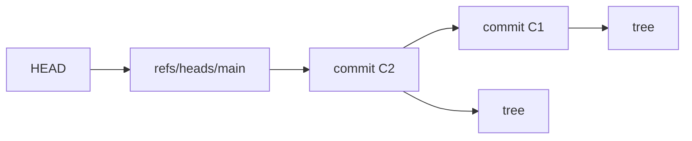

# 终端、Shell 与 Git 基础

## 学习目标

本文解释终端和 Shell 的职责、Shell 如何把文本转换为参数与管道、Git 如何用对象和引用记录历史，并给出从创建分支到安全同步远端的完整实验。

## 1. 终端与 Shell 不是同一层

终端模拟器提供字符输入输出界面，管理窗口、字体和键盘事件。Shell 是运行在终端中的程序，读取命令语言，执行展开与重定向，启动外部程序并管理作业。`zsh`、`bash`、`dash` 是不同 Shell，语法扩展并不完全兼容。

命令行工具接收的是参数数组，不是带空格的一整行。Shell 先把源码经过引用、参数展开、命令替换、字段分割、路径名展开和重定向等步骤，最终形成命令名与参数。具体顺序和扩展受 Shell 语言规则约束。

```sh
printf '<%s>\n' "a b" '*.go'
```

这里双引号保留 `a b` 为一个参数，单引号阻止 `*.go` 被路径名展开。输出为两行 `<a b>` 与 `<*.go>`。

## 2. 引号、变量与展开

不加引号的变量展开可能经历字段分割和路径名展开。处理路径、用户输入和可能为空的值时，通常写 `"$value"`。单引号关闭其中所有普通 Shell 展开；双引号允许 `$parameter`、`$(command)` 等特定展开但抑制字段分割和 glob。

```sh
file='report final.txt'
rm -- "$file"
```

`--` 告诉支持该约定的工具停止解析选项，防止名称 `-rf` 被当作选项。仍需查具体命令文档，因为并非所有非 POSIX 扩展工具行为相同。

命令替换 `$(...)` 把子命令 stdout 放入命令文本，并移除尾随换行。它不适合保存任意二进制数据，Shell 变量也不能安全表示 NUL 字节。

永远不要把不可信字符串拼成 Shell 源码再交给 `eval` 或 `sh -c`。从 Go 启动命令时使用 `exec.Command(name, arg...)` 分离程序名和参数，并控制环境；只有确实需要 Shell 语法时才显式调用 Shell，并把数据作为位置参数传入。

## 3. 重定向、管道与退出状态

标准输入、标准输出、标准错误通常对应文件描述符 0、1、2。重定向由 Shell 在程序启动前设置：

```sh
command < input.txt > output.txt 2> error.log
```

`>` 通常创建或截断文件，`>>` 追加。重定向顺序有意义：`cmd >all.log 2>&1` 让 stderr 指向已经重定向的 stdout；`cmd 2>&1 >out.log` 先让 stderr 指向原 stdout，随后只改变 stdout，两者结果不同。

管道 `a | b` 把 a 的 stdout 连接到 b 的 stdin。stderr 默认仍到终端。下游提前关闭时，上游写入可能收到 SIGPIPE 或错误。脚本必须决定整个管道的成功语义；某些 Shell 默认只返回最后命令状态，`pipefail` 是常见但不属于所有 Shell 的同一默认行为。

退出状态 0 表示成功，非零表示失败。`a && b` 只在 a 成功时执行 b；`a || b` 只在 a 失败时执行 b。不要用 `;` 表达“前一步成功才继续”。

```sh
if git diff --quiet; then
  printf '%s\n' 'worktree unchanged'
else
  status=$?
  printf 'git diff status=%d\n' "$status" >&2
fi
```

不同命令可能用特定非零状态表示“有差异”而非运行故障，脚本应按该命令文档解释，不能把所有非零统一描述成崩溃。

## 4. Shell 脚本的可靠边界

脚本开头的解释器行决定直接执行时使用的解释器，例如 `#!/bin/sh`。若使用 Bash/Zsh 扩展，应明确指定并在目标环境提供相应版本。

常见的 `set -e`、`set -u` 与 `pipefail` 能捕获部分错误，但都有语法上下文相关边界，不能代替显式错误处理。关键步骤仍应检查状态、输出清晰诊断并执行必要清理。

临时文件使用 `mktemp` 等安全创建机制，设置清理 trap，并避免可预测名称。对多个文件的批处理不要解析 `ls` 输出；使用 Shell 的路径名展开、`find` 的安全分隔形式或语言级目录 API。

日志不能回显密钥。启用 `set -x` 会打印展开后的命令，认证令牌可能因此泄漏到 CI 日志。

## 5. Git 的数据模型

Git 是内容寻址对象数据库加引用。核心对象：

- blob 保存文件内容，不保存文件名。
- tree 保存名称到 blob 或子 tree 的映射以及模式。
- commit 指向一个根 tree、零个或多个父 commit，并保存作者、提交者和消息等元数据。
- annotated tag 对象为另一个对象附加名称、消息和签名等信息。

对象 ID 是对象类型、长度和内容的散列标识。修改文件内容会产生新 blob，继而产生新 tree 和 commit。不同 Git 仓库可能使用不同对象格式配置，不应在应用协议中硬编码对象 ID 长度。

分支是 `refs/heads/...` 下指向提交的可移动引用；远端跟踪分支如 `refs/remotes/origin/main` 记录最近 fetch 得到的远端状态。`HEAD` 通常是指向当前分支的符号引用，也可直接指向提交形成 detached HEAD。



## 6. 工作区、暂存区与提交

工作区是检出的文件；索引又称暂存区，保存下一次提交要写入的 tree 内容；HEAD 指向当前提交。`git status` 比较这三者。

`git add path` 把该路径当前内容写入索引，不是“以后自动跟踪所有修改”。继续编辑后，工作区和索引可包含不同版本。`git diff` 默认比较工作区与索引；`git diff --staged` 比较索引与 HEAD。

```sh
git status --short
git diff -- src/parser.go
git diff --staged -- src/parser.go
git add src/parser.go
git commit -m 'feat: reject malformed records'
```

提交应构建一个可解释的状态，消息说明行为与原因。拆分无关格式化和功能变化能降低审查与回滚成本。不要通过 `git add .` 无审查地纳入密钥、构建产物或用户文件。

`.gitignore` 只影响未跟踪路径的默认发现，不会停止跟踪已在索引中的文件，也不构成安全边界。敏感值一旦提交，即使之后删除文件，旧对象和远端副本仍可能保留；必须立即轮换密钥并按组织流程清理历史。

## 7. 分支、合并、变基与冲突

`git switch -c feat/parser` 创建并切换分支。不同分支提交后，可以 merge 或 rebase 整合。

merge 创建或快进到包含双方历史的结果；非快进合并通常产生有两个父提交的 merge commit。rebase 选择一组提交，在新基点上重放并创建新提交，因此对象 ID 改变。

已共享分支变基会让其他人的引用仍指向旧历史，推送可能需要强制更新并造成协作混乱。只重写自己控制、尚未共享的提交；确需更新共享历史时先协调并使用带租约的保护方式。

冲突表示 Git 无法自动决定合并结果，不等于文件一定语法损坏。处理步骤是：阅读双方意图和冲突标记；编辑为正确完整结果；运行格式化与测试；`git add` 标记已解决；继续 merge/rebase。不要只删除冲突标记而不验证业务语义。

## 8. 远端、fetch、pull 与 push

远端是仓库 URL 与 refspec 配置的简称。`git fetch origin` 下载对象并按配置更新远端跟踪引用，通常不修改当前分支工作区。可以先检查 `git log HEAD..origin/main` 再决定合并或变基。

`git pull` 大体执行 fetch 后再按配置 merge 或 rebase；由于第二步会改变当前分支，维护流程中常拆为 fetch 与显式整合，便于审查。

`git push origin main` 请求远端更新引用。远端会检查权限、引用是否允许更新、服务端钩子和分支保护。非快进更新默认被拒绝是为了避免丢失远端可达历史。

`--force-with-lease` 仅在远端仍是本地预期旧值时强制更新，比无条件 `--force` 多一层并发保护，但仍会重写远端历史；它不是无需协调的许可。

## 9. 完整实验：创建、分叉、冲突与同步

### 9.1 初始化与第一次提交

在临时目录执行：

```sh
mkdir git-lab && cd git-lab
git init
git config user.name 'Lili Lab'
git config user.email 'lab@example.invalid'
printf 'mode=development\n' > app.conf
git add app.conf
git commit -m 'chore: add application config'
git log --oneline --decorate --graph --all
```

输入是含一行配置的工作区。`git add` 把内容放入索引，`git commit` 创建 blob、tree、commit 并移动当前分支引用。验证 `git status --short` 无输出，表示工作区与索引相对 HEAD 无变化。

### 9.2 创建两个不同修改

```sh
git switch -c feat/production-mode
printf 'mode=production\n' > app.conf
git add app.conf
git commit -m 'feat: use production mode'

git switch -
printf 'mode=staging\n' > app.conf
git add app.conf
git commit -m 'feat: use staging mode'
```

两个分支从同一父提交修改同一行。执行 `git merge feat/production-mode` 会产生内容冲突并返回非零。`git status` 显示未合并路径，文件含 ours/theirs 标记。

### 9.3 解决并验证

决定配置支持显式环境覆盖，写成：

```text
mode=${APP_MODE:-staging}
```

然后执行：

```sh
git add app.conf
git commit -m 'merge: resolve configurable application mode'
git log --oneline --decorate --graph --all
git cat-file -p HEAD
git ls-tree HEAD
```

`cat-file` 输出当前 commit 的 tree 与两个 parent，证明这是合并提交；`ls-tree` 展示 `app.conf` 对应 blob。`git show HEAD:app.conf` 应输出解决后的精确内容。

注意这里的 `${APP_MODE:-staging}` 只是文件内容，Git 不会展开。是否被应用解释为 Shell 语法取决于消费者；若应用只接受字面配置，这个“解决方案”并不正确，必须由真实测试验证。

### 9.4 模拟远端 fetch/push

```sh
cd ..
git clone --bare git-lab remote.git
cd git-lab
git remote add origin ../remote.git
git fetch origin
git push -u origin HEAD
git branch -vv
```

bare 仓库用作本地远端。fetch 下载并更新远端跟踪引用；push 更新远端分支。用 `git ls-remote origin` 验证远端 ref 指向本地 HEAD 对象 ID。

### 9.5 失败分支

在第二个 clone 中向同一远端分支推送新提交，再在第一个仓库从旧尖端产生不同提交并 push，远端应拒绝非快进。正确处理是 fetch，检查分叉，merge/rebase 解决后再推送；不使用无条件 force 覆盖未知远端提交。

## 10. 诊断清单

- 参数被拆开：用 `printf '<%s>\n' "$@"` 检查最终参数，修正引用。
- 通配符意外展开：引用包含 `*?[]` 的字面值，或关闭特定 glob 行为。
- 管道静默成功：检查各段状态与目标 Shell 的 pipefail 支持。
- `git add` 后又有 diff：区分工作区 diff 与 `--staged` diff。
- fetch 后当前文件没变：这是正常的；查看远端跟踪引用再显式整合。
- push 被拒绝：先 fetch 和画提交图，确认是否非快进、权限或保护规则。
- 冲突反复出现：比较共同祖先与双方真实意图，不机械选择 ours/theirs。
- 文件被 ignore 仍在提交：它已被跟踪，`.gitignore` 不会自动移出索引。

## 11. 练习

1. 写脚本接收含空格和 `*` 的文件名，验证引用前后的参数数量差异。
2. 实验 `>file 2>&1` 和 `2>&1 >file`，分别记录 stdout 与 stderr 去向。
3. 用 `git hash-object`、`git cat-file` 和 `git ls-tree` 追踪一个文件从 blob 到 commit。
4. 构造非快进 push 失败，不用 force，通过 fetch 与 merge 恢复。
5. 把已暂存文件再编辑，分别解释三列 `git status --short` 的状态。

## 来源

- [POSIX.1-2024：Shell Command Language](https://pubs.opengroup.org/onlinepubs/9799919799/utilities/V3_chap02.html)（访问日期：2026-07-17）
- [Git 官方文档：git](https://git-scm.com/docs/git)（访问日期：2026-07-17）
- [Git 官方文档：git-fetch](https://git-scm.com/docs/git-fetch)（访问日期：2026-07-17）
- [Git 官方文档：Git Objects](https://git-scm.com/book/en/v2/Git-Internals-Git-Objects)（访问日期：2026-07-17）
- [Git 官方文档：Git References](https://git-scm.com/book/en/v2/Git-Internals-Git-References)（访问日期：2026-07-17）
