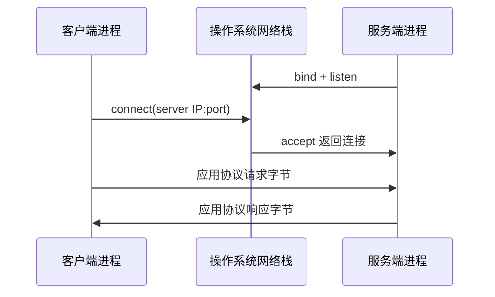

# 客户端、服务器、进程、端口、域名与 DNS

## 学习目标

本文从一次网络访问出发，解释客户端与服务器角色、套接字地址、监听端口、域名层次和 DNS 解析，并用本地 TCP/HTTP 实验逐层区分“解析成功、连接成功、协议成功”。

## 1. 客户端和服务器是角色

客户端主动发起特定协议的请求，服务器接受请求并返回响应。角色属于一次通信，不属于机器的永久身份：同一后端进程对浏览器是服务器，对数据库或支付服务又是客户端。

HTTP 客户端与服务器之间可能存在代理、负载均衡器、网关和缓存。应用看到的直接连接对端不一定是最终用户，原始地址字段要由受信代理协议传递并按信任边界解析。

服务器程序运行在进程中。进程监听一个或多个套接字，操作系统把到达相应地址的连接交给进程。进程退出后监听消失；多个实例可由不同地址、端口、网络命名空间或负载均衡组合。

## 2. IP 地址与网络接口

IP 地址标识 IP 层端点。IPv4 地址如 `192.0.2.10`，IPv6 地址如 `2001:db8::10`。一个主机可有多个接口和地址，容器或虚拟网络还可能使用独立网络命名空间。

环回地址用于本机通信：IPv4 `127.0.0.0/8`，常用 `127.0.0.1`；IPv6 `::1`。监听环回通常只允许同一网络命名空间内客户端访问。

`0.0.0.0` 作为服务端绑定地址表示所有本地 IPv4 接口，`::` 对 IPv6 有相应未指定地址语义。它们不是远程客户端应该连接的目标地址。绑定所有接口可能把开发服务暴露到局域网或公网，必须配合防火墙、认证与部署审查。

IPv6 字面地址放入 URL 时要加方括号：`http://[::1]:8080/`，避免与端口冒号混淆。

## 3. 端口与套接字地址

端口是传输层的 16 位编号，范围 0–65535。TCP 端口与 UDP 端口属于不同协议空间；“8080 端口”必须连同传输协议、地址和网络命名空间才完整。

监听端点常写为 `(transport, local IP, local port)`。已建立 TCP 连接由源地址/端口和目的地址/端口等标识，因此服务器一个监听端口可同时服务很多客户端连接。

IANA 服务名与端口注册表记录标准、用户和动态范围及登记服务。但端口号只提示预期服务，不验证实际协议。8080 上可以运行任意程序；443 上也不自动保证 TLS 正确。

客户端未固定本地端口时，操作系统选择临时端口。大量短连接可能耗尽临时端口或产生大量连接状态，连接复用和客户端连接池因此重要。

## 4. bind、listen、accept 与 connect

TCP 服务端大致执行：创建 socket；bind 本地地址；listen 建立等待队列；accept 取得已建立连接；在连接上读写；关闭。客户端用 connect 发起连接。



连接被拒绝通常表示目标主机明确返回该端口无监听等情况；超时可能来自丢包、防火墙、路由或远端无响应。两者都不能只从错误文本推断唯一根因，要结合地址、抓包和目标监听状态。

服务启动时 bind 失败可能因为地址不可用、权限不足或端口已占用。不能通过不断更换随机端口掩盖生产配置错误。

## 5. 域名与 DNS 名称空间

DNS 使用层次名称空间。完整域名由从具体到根的标签组成，文本通常用点分隔；末尾点显式表示根，例如 `api.example.com.`。日常省略末尾根点。

域名不是 URL。URL `https://api.example.com:8443/v1/orders` 还包含 scheme、端口和路径；DNS 通常只负责名称相关资源记录，不决定 HTTP 路径。

常见资源记录：

| 类型 | 主要数据 | 注意 |
| --- | --- | --- |
| A | IPv4 地址 | 一个名称可有多条 |
| AAAA | IPv6 地址 | 客户端可能优先或并行尝试 |
| CNAME | 别名指向规范名称 | 有记录共存约束，查具体 DNS 规范 |
| NS | 区域的权威名称服务器 | 表示委派与权威信息 |
| MX | 邮件交换器与优先级 | 不是普通 HTTP 服务发现 |
| TXT | 文本片段 | 常承载验证/策略，需按上层格式解释 |
| PTR | 反向映射名称 | 不能单独作为身份认证 |

## 6. 解析器、权威服务器、缓存与 TTL

应用通常调用系统 resolver，不自己从根服务器逐级查询。递归解析器可能从缓存回答，或根据委派查询权威服务器。权威服务器负责特定 zone 数据。

TTL 是记录可缓存时间的上限信息之一，不表示记录会在所有客户端同一时刻切换。不同递归缓存、应用缓存、操作系统缓存和已建立连接会延长观察差异；负面回答也可缓存。

DNS 返回多地址时，客户端选择与尝试策略影响可用性。把第一个地址硬编码到长期配置会绕过后续 DNS 变化。解析成功只得到记录，不证明地址可路由、端口监听、TLS 证书匹配或 HTTP 健康。

本机 hosts 文件、VPN、企业 DNS、容器 DNS 和 split-horizon 配置可能让同一名称在不同环境解析不同。诊断必须在实际失败环境查询。

## 7. 从域名到 HTTP 的分层故障

一次 `https://api.example.com/orders` 至少涉及：解析名称；选择 IP；建立 TCP 或其他传输连接；完成 TLS；发送 HTTP；应用鉴权和业务处理。

| 观察 | 已证明 | 尚未证明 |
| --- | --- | --- |
| DNS 返回 A/AAAA | resolver 得到地址 | 地址可达、端口开放 |
| TCP connect 成功 | 传输端点接受连接 | TLS 或 HTTP 正确 |
| TLS 成功 | 密码套件与证书校验通过 | HTTP 资源成功 |
| HTTP 200 | HTTP 层报告成功 | 响应业务字段正确 |

诊断从最接近错误的层开始，但保留前后层证据。不要因 DNS 命令成功就跳过应用实际使用的 resolver 和地址族。

## 8. Go 服务端地址与超时

`net.Listen("tcp", "127.0.0.1:0")` 让操作系统选择可用端口，适合测试，避免固定端口冲突。生产配置使用明确地址并记录最终监听端点。

Go `http.Server` 的 `ReadHeaderTimeout` 限制读取请求头时间，`ReadTimeout`、`WriteTimeout`、`IdleTimeout` 控制不同阶段。它们不是处理器业务截止时间的完整替代；处理器还要使用请求 context 与下游超时。

```go
server := &http.Server{
    Addr:              "127.0.0.1:8080",
    Handler:           handler,
    ReadHeaderTimeout: 5 * time.Second,
    IdleTimeout:       60 * time.Second,
}
```

客户端也必须设置超时。默认无限等待会让故障连接占用 goroutine 和连接池。连接超时、TLS 超时、响应头超时和整个请求 deadline 是不同限制。

## 9. 完整案例：启动临时本地服务并请求

### 9.1 可运行程序

```go
package localservice

import (
    "context"
    "fmt"
    "io"
    "net"
    "net/http"
    "time"
)

func Start() (baseURL string, stop func(context.Context) error, err error) {
    listener, err := net.Listen("tcp", "127.0.0.1:0")
    if err != nil {
        return "", nil, fmt.Errorf("listen: %w", err)
    }
    mux := http.NewServeMux()
    mux.HandleFunc("GET /health", func(w http.ResponseWriter, r *http.Request) {
        w.Header().Set("Content-Type", "text/plain; charset=utf-8")
        w.WriteHeader(http.StatusOK)
        _, _ = io.WriteString(w, "ok\n")
    })
    server := &http.Server{
        Handler:           mux,
        ReadHeaderTimeout: 2 * time.Second,
        IdleTimeout:       10 * time.Second,
    }
    go func() {
        _ = server.Serve(listener)
    }()
    return "http://" + listener.Addr().String(), server.Shutdown, nil
}
```

### 9.2 输入、步骤与输出

测试启动服务，得到例如 `http://127.0.0.1:53142`。端口每次可不同，因此从 listener 的实际地址读取，不猜测。

```go
func TestStart(t *testing.T) {
    baseURL, stop, err := Start()
    if err != nil { t.Fatal(err) }
    t.Cleanup(func() {
        ctx, cancel := context.WithTimeout(context.Background(), time.Second)
        defer cancel()
        if err := stop(ctx); err != nil { t.Errorf("shutdown: %v", err) }
    })

    client := &http.Client{Timeout: time.Second}
    response, err := client.Get(baseURL + "/health")
    if err != nil { t.Fatal(err) }
    defer response.Body.Close()
    body, err := io.ReadAll(response.Body)
    if err != nil { t.Fatal(err) }
    if response.StatusCode != 200 || string(body) != "ok\n" {
        t.Fatalf("status=%d body=%q", response.StatusCode, body)
    }
}
```

步骤：绑定环回与临时端口；启动 HTTP accept 循环；客户端直接连接 IP，不需要 DNS；发送 GET `/health`；验证状态、媒体类型和精确正文；用有截止时间的 Shutdown 停止。

### 9.3 失败分支

停止服务后再次 GET，连接应失败；错误证明当前端点不可连接，不应断言跨平台错误字符串。请求 `/missing` 连接成功但返回 404，清楚区分传输成功与资源不存在。

把 listener 改为固定且已占用端口，Start 在 bind 阶段失败。把客户端 URL 主机改成不存在的测试域名，会在解析层失败；不要用真实随机域名，避免查询泄露或偶然注册。

仓库中的[可运行 Local Service 示例](../../examples/service-data-basics/localservice/)保存了临时端口、请求和限时关闭测试。

### 9.4 `localhost` 与字面地址

测试使用 `127.0.0.1` 保证与监听地址族一致。`localhost` 可能解析 `::1` 与 `127.0.0.1`；只监听 IPv4 而客户端先连接 IPv6 时可能失败。生产中应同时设计地址族支持，不把测试选择写成网络通则。

## 10. 诊断命令

```sh
dig A example.com
dig AAAA example.com
curl --verbose --connect-timeout 2 http://127.0.0.1:8080/health
lsof -nP -iTCP:8080 -sTCP:LISTEN
```

命令可用性与参数依平台。`dig` 看到的是指定 resolver 路径；应用可能使用不同解析配置。`lsof` 展示本机进程监听，不证明防火墙外可达。

## 11. 调试清单

- 名称失败：记录查询名称、记录类型、resolver、响应码与是否命中 hosts/VPN。
- 一部分客户端失败：比较 IPv4/IPv6、缓存、地区 DNS 和连接选择。
- connection refused：验证目标 IP/端口与服务实际监听，检查地址族。
- timeout：逐层检查路由、防火墙、监听队列、服务饱和和截止时间。
- 本机成功容器失败：`127.0.0.1` 指向各自网络命名空间，不是宿主机。
- 监听 0.0.0.0 却无法 curl 它：它是绑定通配地址，客户端使用具体可达地址。
- DNS 切换不生效：检查所有缓存层、TTL、负缓存和现存长连接。

## 12. 练习

1. 运行案例，记录实际临时端口，用 `/missing` 验证 404 与连接失败差异。
2. 分别监听 `127.0.0.1`、`::1`、`0.0.0.0`，从允许环境验证可达范围。
3. 查询一个域名的 A、AAAA、CNAME、NS，逐项解释记录而不推断健康。
4. 为客户端增加 50ms 超时和慢处理器，断言 context deadline 而非错误文本。
5. 在容器内外比较 `localhost`，画出两个网络命名空间的环回接口。

## 来源

- [RFC 1034：Domain Names—Concepts and Facilities](https://www.rfc-editor.org/rfc/rfc1034)（访问日期：2026-07-17）
- [RFC 1035：Domain Names—Implementation and Specification](https://www.rfc-editor.org/rfc/rfc1035)（访问日期：2026-07-17）
- [IANA：Service Name and Transport Protocol Port Number Registry](https://www.iana.org/assignments/service-names-port-numbers/)（访问日期：2026-07-17）
- [Go 标准库：net](https://pkg.go.dev/net)（访问日期：2026-07-17）
- [Go 标准库：net/http Server](https://pkg.go.dev/net/http#Server)（访问日期：2026-07-17）
