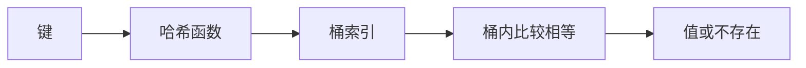

# 哈希表、哈希函数、冲突、负载因子与扩容

## 学习目标

本文解释哈希表从键到桶的完整机制、相等与哈希的契约、两类冲突处理、删除和扩容，并实现一个教学用链地址字符串计数表。

## 1. 哈希表解决什么问题

哈希表维护键到值的映射，典型平均/期望查找、插入、删除接近 O(1)，空间 O(n)。它适合计数、去重、索引、缓存和关联记录，不保持键的排序，范围查询通常不合适。

操作包含三步：计算键的哈希值；把哈希映射到桶索引；在桶内用相等关系找到键。两个不同键得到同一桶是冲突，任何有限桶表都必须处理。



## 2. 哈希函数与相等契约

哈希函数把大键空间映射为固定宽度整数。用于哈希表时需要：相等键必须产生相同哈希；不同键最好分布均匀，但允许相同哈希。

若键可变且参与相等/哈希的字段插入后改变，后续可能无法在原桶找到。键应不可变，或插入时复制稳定表示。

通用非密码学哈希追求速度与分布；密码学哈希还追求抗碰撞、原像等安全性质，成本和目标不同。不能因使用 SHA-256 就自动得到安全哈希表，也不能用普通哈希存密码。

攻击者可控制键时，构造大量冲突可能把操作退化 O(n)。运行时可使用随机种子、稳健实现和输入限制缓解；具体 Go map 实现细节不属于语言保证。

## 3. 桶索引

常见映射是 `hash % bucketCount`，bucketCount 必须正。某些实现使用 2 的幂与位掩码，需要哈希低位有良好分布。

不能直接用可能为负的有符号哈希取模作为数组索引。教学实现可使用 uint64。扩容改变 bucketCount 后，旧索引通常改变，所有条目要重新放置。

## 4. 链地址法

链地址让每个桶保存零个或多个条目，冲突条目放同一链或小容器。查找计算桶后线性比较该桶。

若哈希均匀、负载因子 α=n/m（元素数/桶数）受控，平均桶长度约 α。最坏所有键同桶，查找 O(n)。删除从桶链中移除节点，通常不需要墓碑。

链地址易实现但每个节点有指针/分配成本，局部性较弱。实际实现可能用紧凑数组或混合结构，不必真用链表。

## 5. 开放寻址

开放寻址把所有条目放在桶数组中。冲突时按探测序列寻找下一位置：线性探测、二次探测、双重哈希等。

查找必须使用与插入相同的探测规则，遇到真正空槽才能确认不存在。删除不能简单改为空，否则会截断其他键的探测链；常用 tombstone，后续扩容/整理清除墓碑。

开放寻址局部性好但对负载因子敏感，接近满表时探测急剧增长。插入前必须保证有空槽，并区分 EMPTY、OCCUPIED、DELETED 状态。

## 6. 负载因子与扩容

负载因子反映元素与桶容量比例，但链地址可超过 1，开放寻址必须小于 1。阈值是实现选择，不存在所有哈希表通用的 0.75 定律。

达到阈值时分配更大桶数组并 rehash 所有条目，单次 O(n)。若容量按几何倍数增长，连续插入的摊还成本可保持常数级。

容量提示 `make(map[K]V, n)` 告诉 Go runtime 预计元素数，不是固定容量，也不保证精确分配与阈值。预分配可能降低增长成本，也可能浪费内存，按已知规模和 benchmark 选择。

## 7. Go map 的语言语义

Go map 类型是 `map[K]V`，K 必须 comparable。布尔、数字、字符串、指针、channel、接口和由可比较字段组成的数组/struct 可作键；slice、map、function 不可比较，不能作键。

读取返回值零值；双返回区分不存在：

```go
count, exists := counts["go"]
delete(counts, "go") // 不存在也不报错
```

nil map 可读取、len、range、delete，写入会 panic。`make` 或字面量初始化后写。

迭代顺序未指定，不能依赖一次顺序，也不能假设随机均匀。稳定输出提取键后排序。普通 map 并发读写不安全；使用锁、单 goroutine 所有权或适合语义的并发结构。

map 赋值复制引用到同一映射数据，修改一方可见于另一方。要复制需遍历键值；值含引用时决定深度。

## 8. 集合、计数器和多值映射

Go 没有内建 set，可用 `map[T]struct{}` 表示，struct{} 通常不携带数据。计数器用 `map[T]int`，不存在读为 0 使 `counts[key]++` 简洁，但若 0 与缺失语义不同仍需 ok。

多值映射 `map[K][]V` 要注意 append 后切片共享。反向索引删除时也要维护空切片是否删除的约定。

缓存不仅是 map，还要容量、淘汰、过期、并发和一致性。无界 map 作为缓存会成为内存泄漏来源。

## 9. 完整案例：链地址字符串计数表

### 9.1 数据结构

```go
package stringtable

import "hash/fnv"

type entry struct {
    key   string
    value int
    next  *entry
}

type Table struct {
    buckets []*entry
    size    int
}

func New(bucketCount int) *Table {
    if bucketCount < 1 { bucketCount = 8 }
    return &Table{buckets: make([]*entry, bucketCount)}
}

func hashKey(key string) uint64 {
    h := fnv.New64a()
    _, _ = h.Write([]byte(key))
    return h.Sum64()
}

func (t *Table) index(key string) int {
    return int(hashKey(key) % uint64(len(t.buckets)))
}
```

FNV 是确定的非密码学哈希，适合教学，不用于抵抗恶意碰撞。生产优先使用内建 map。

### 9.2 Get、Set 与 Delete

```go
func (t *Table) Get(key string) (int, bool) {
    for item := t.buckets[t.index(key)]; item != nil; item = item.next {
        if item.key == key { return item.value, true }
    }
    return 0, false
}

func (t *Table) Set(key string, value int) {
    index := t.index(key)
    for item := t.buckets[index]; item != nil; item = item.next {
        if item.key == key { item.value = value; return }
    }
    t.buckets[index] = &entry{key: key, value: value, next: t.buckets[index]}
    t.size++
    if t.size > len(t.buckets)*2 { t.resize(len(t.buckets) * 2) }
}

func (t *Table) Delete(key string) bool {
    index := t.index(key)
    var previous *entry
    for item := t.buckets[index]; item != nil; item = item.next {
        if item.key == key {
            if previous == nil { t.buckets[index] = item.next } else { previous.next = item.next }
            t.size--
            return true
        }
        previous = item
    }
    return false
}

func (t *Table) resize(bucketCount int) {
    old := t.buckets
    t.buckets = make([]*entry, bucketCount)
    for _, head := range old {
        for item := head; item != nil; {
            next := item.next
            index := t.index(item.key)
            item.next = t.buckets[index]
            t.buckets[index] = item
            item = next
        }
    }
}
```

resize 不能调用 Set，否则会重复增加 size 并可能递归扩容。它保存 `next` 后重连节点，size 保持不变。

### 9.3 输入、步骤与输出

输入词 `go,http,go,sql,go`。每词读取当前计数，不存在视为 0，再 Set+1。输出按键排序应为 `go=3,http=1,sql=1`。

```go
table := New(2)
for _, word := range []string{"go", "http", "go", "sql", "go"} {
    count, _ := table.Get(word)
    table.Set(word, count+1)
}
```

初始 2 桶，size 超过 4 时才扩容；该输入 3 个键不会触发。测试扩容要插至少 5 个不同键，然后验证每个仍可达。

### 9.4 冲突测试

为可控测试可给 Table 注入 hash 函数，使所有键返回 0。插入 a、b、c 后同桶链长度 3，Get 必须逐项相等比较，Delete b 后 a/c 仍可达。

不要通过寻找 FNV 的真实碰撞让测试不稳定。可测试性设计应让哈希策略可注入，而生产构造使用默认。

### 9.5 失败与边界

空字符串是合法键，与不存在用 bool 区分。Set 同键覆盖不增加 size。Delete 不存在返回 false。当前 Table 不是并发安全、不会缩容、没有随机种子；只用于机制学习。

## 10. 复杂度分析

令 n 为条目数、m 为桶数、α=n/m。均匀分布下 Get/Set/Delete 期望 O(1+α)；阈值限制 α 后为 O(1)。最坏单桶 n 条为 O(n)。resize O(n)，几何扩容使连续插入摊还 O(1)。空间为 O(n+m)。

输出排序不是哈希表操作：提取 k 个键 O(k)，比较排序 O(k log k)，额外空间取决于实现。

## 11. 调试清单

- 扩容后键丢失：检查是否按新桶数重算索引，遍历时是否先保存 next。
- 删除后后续键找不到：开放寻址是否错误清空，链地址是否接错前驱。
- size 越来越大：同键覆盖是否误计新增，rehash 是否重复计数。
- 输出测试偶发失败：是否依赖 map range 顺序。
- 并发崩溃/race：所有 map 访问是否在统一同步策略内。
- 内存持续增长：检查无界缓存、过期清理和键值引用。
- 恶意输入变慢：记录桶/探测分布，使用运行时实现和输入限制。

## 12. 练习

1. 给 Table 注入哈希函数并完成强制冲突测试。
2. 添加 Len 与 LoadFactor，验证同键覆盖、删除后的值。
3. 实现缩容，但避免在阈值附近反复扩缩，说明滞回策略。
4. 用 Go map 和 Table 做计数 benchmark，分析分配而非宣称教学实现更快。
5. 设计 LRU 缓存的 map+链表不变量，并限制条数与总字节。

## 来源

- [Go 语言规范：Map types](https://go.dev/ref/spec#Map_types)（访问日期：2026-07-17）
- [Go 语言规范：Properties of types and values—Comparability](https://go.dev/ref/spec#Comparison_operators)（访问日期：2026-07-17）
- [Go 标准库：hash/fnv](https://pkg.go.dev/hash/fnv)（访问日期：2026-07-17）
- [Open Data Structures：Hash Tables](https://opendatastructures.org/ods-java/5_Hash_Tables.html)（访问日期：2026-07-17）
