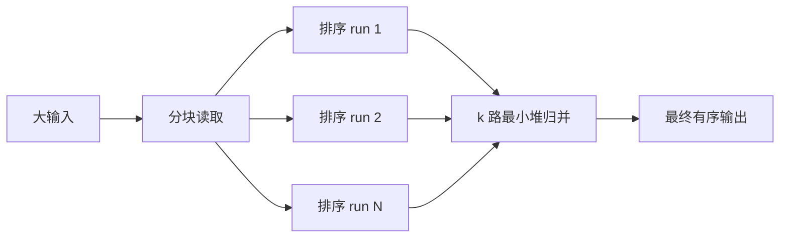

# 二分查找、比较排序、稳定性与外部排序

## 学习目标

本文解释二分谓词单调性、比较器契约、快速/归并/堆排序的机制与边界，以及数据超过内存时生成有序段并 k 路归并的外部排序流程。

## 1. 线性查找与二分查找

无序序列找目标通常线性扫描 O(n)。二分每次排除一半范围，为 O(log n)，但前提是搜索空间上谓词从 false 单调变为 true，或数据按与比较器一致的顺序排序。

二分最通用形式是找第一个满足 `P(i)` 的索引：范围 `[0,n)` 中 P 前段 false、后段 true。若全 false 返回 n。

```go
index := sort.Search(len(values), func(i int) bool {
    return values[i] >= target
})
found := index < len(values) && values[index] == target
```

这得到 lower_bound，即首个 >= target。upper_bound 用 `values[i] > target`。重复值范围为 `[lower,upper)`，数量 upper-lower。

若谓词不是单调，sort.Search 结果无意义。例如未排序数组 `[1,9,2,10]` 上 `>=5` 为 false,true,false,true。

## 2. 手写二分的不变量

半开区间版本保持答案位于 `[low,high]` 边界，初始 low=0, high=n；循环 low<high，中点 `low+(high-low)/2` 避免加法溢出。

```go
func LowerBound(values []int, target int) int {
    low, high := 0, len(values)
    for low < high {
        middle := low + (high-low)/2
        if values[middle] < target { low = middle + 1 } else { high = middle }
    }
    return low
}
```

终止时 low==high，是首个可能 >= target 的位置。每轮区间严格缩短。空数组返回 0；target 大于全部值返回 len。

常见错误是闭区间/半开区间混用、middle 不推进、找到任一重复值却声称首个、以及忽略未找到的插入位置。

## 3. 排序的契约

排序按比较关系重新排列元素。比较器必须建立一致有序关系：不可同时 a<b 和 b<a；传递；相等关系一致。Go `sort.Interface.Less` 需要严格弱序。

浮点 NaN 破坏普通 `<` 的直觉，标准库为浮点切片定义特定处理；自定义比较器必须明确 NaN 排位。字符串按字节/码点、Unicode collation、locale 排序结果不同，协议必须固定算法。

稳定排序保持比较相等元素的原相对顺序。若先按时间稳定排序，再按部门稳定排序，可实现多键效果，但更清楚的是一次比较显式写部门、时间、唯一 ID。

稳定不等于确定：若输入来源顺序本身不稳定，相等项结果仍不稳定。对 API 输出加入唯一 tie-breaker。

## 4. 快速排序

快排选择 pivot，把元素分成小于、等于、大于区域，再递归子区间。平均 O(n log n)，最坏 O(n²)，额外空间取决于实现；通常不稳定。

最坏输入与 pivot 策略相关，随机化、三数取中、三路分区和 introsort 可缓解。标准库实现可能随版本改变，不应声称 Go 当前排序就是某个固定教科书快排。

原地分区减少辅助数组，但交换破坏相等项顺序。手写快排容易在重复元素、空区间和栈深上出错，生产使用 `slices.Sort`/`SortFunc` 等标准库。

## 5. 归并排序

归并排序把序列分半排序，再线性合并两个有序序列。时间 O(n log n)，数组实现通常额外 O(n)，容易保持稳定。

合并时相等元素先取左半，保持原顺序。若比较器相等时取右半会破坏稳定性。

链表归并可通过指针重连降低数组式复制；外部排序利用顺序读写合并有序文件。并行归并要考虑内存带宽和任务粒度。

## 6. 堆排序与选择

堆排序先 O(n) 建堆，反复弹最值 O(n log n)，原地版本额外空间小，通常不稳定，缓存行为可能不如连续分区算法。

只需 Top-K 时无需排全部 n：容量 k 堆 O(n log k)。只需第 k 项可用 quickselect 平均 O(n)，最坏条件取决于 pivot；标准库/需求优先。

## 7. Go 排序 API

现代 Go 可用泛型 `slices.Sort` 对 ordered 类型升序，`slices.SortFunc` 自定义三路比较，`slices.SortStableFunc` 稳定排序。旧 `sort.Slice` 接受 less 闭包，编译期类型保障较弱。

```go
slices.SortFunc(users, func(a, b User) int {
    if result := cmp.Compare(b.Score, a.Score); result != 0 { return result }
    return cmp.Compare(a.ID, b.ID)
})
```

此比较为分数降序、ID 升序。不要写 `return int(a.Score-b.Score)`，减法可能溢出，浮点/宽度转换也会丢信息。

排序原地修改切片。调用者不允许改变输入时先 clone；元素内部引用仍共享。

## 8. 外部排序

当数据大于可用内存，外部排序分两阶段：

1. 读一个内存预算块，解析记录，内存排序，写为有序 run。
2. 同时打开多个 run，用最小堆保存每个 run 当前最小记录，弹出写结果并从对应 run 读下一条。



若 run 数超过文件描述符或内存上限，分多轮归并。扇入 k 权衡打开文件数、堆 O(log k) 与归并轮数。

必须预算输入、临时 run 和最终输出同时存在的磁盘空间，通常需要大于输入数倍。失败清理临时文件，但不能误删最终旧输出；写临时目标完成后原子替换。

## 9. 外部排序记录格式

按行文本实现要限制单行长度，明确 UTF-8 和换行。二进制记录需长度 framing 和校验。比较键解析必须在 run 生成与 merge 完全一致。

稳定外部排序可给每条记录附原始序号，比较 `(key,originalIndex)`；仅保证每个 run 内稳定不足以跨 run 保持全局顺序。

损坏 run、磁盘满、部分写、进程崩溃和重复启动都要处理。run 文件包含任务 ID，启动清理只删除确认属于过期任务的文件。

## 10. 完整案例：有序事件的 k 路归并

### 10.1 输入契约

每个 run 已按 `(Timestamp,ID)` 升序，Timestamp 为 int64 Unix 纳秒，ID 非空。把内存切片模拟 run，输出全局有序。生产文件版本把 `next` 换成流式 decoder。

```go
package merge

import (
    "container/heap"
    "errors"
)

type Event struct { Timestamp int64; ID string }
type cursor struct { event Event; run, index int }
type cursorHeap []cursor

func lessEvent(a,b Event) bool {
    return a.Timestamp < b.Timestamp || (a.Timestamp == b.Timestamp && a.ID < b.ID)
}
func (h cursorHeap) Len() int { return len(h) }
func (h cursorHeap) Less(i,j int) bool { return lessEvent(h[i].event,h[j].event) }
func (h cursorHeap) Swap(i,j int) { h[i],h[j]=h[j],h[i] }
func (h *cursorHeap) Push(x any) { *h=append(*h,x.(cursor)) }
func (h *cursorHeap) Pop() any { old:=*h; x:=old[len(old)-1]; *h=old[:len(old)-1]; return x }

func Merge(runs [][]Event) ([]Event,error) {
    for _, run := range runs {
        for i, event := range run {
            if event.ID == "" { return nil, errors.New("event id is empty") }
            if i>0 && lessEvent(event,run[i-1]) { return nil,errors.New("run is not sorted") }
        }
    }
    h:=&cursorHeap{}
    heap.Init(h)
    total:=0
    for run,events:=range runs {
        total+=len(events)
        if len(events)>0 { heap.Push(h,cursor{events[0],run,0}) }
    }
    output:=make([]Event,0,total)
    for h.Len()>0 {
        current:=heap.Pop(h).(cursor)
        output=append(output,current.event)
        next:=current.index+1
        if next<len(runs[current.run]) {
            heap.Push(h,cursor{runs[current.run][next],current.run,next})
        }
    }
    return output,nil
}
```

### 10.2 输入、步骤与输出

run0=`[(1,a),(4,d)]`，run1=`[(1,b),(3,c)]`，run2=空。堆初始 (1,a),(1,b)，依次输出 a、b；从 run1 补 (3,c)，再输出 c；从 run0 补/输出 d。结果 `(1,a),(1,b),(3,c),(4,d)`。

令总记录 n、run 数 k，初始化 O(k)，每条记录一次 Pop 与最多一次 Push，O(n log k)，堆 O(k)，输出模拟占 O(n)。流式文件版额外内存 O(k+buffers)，不计输出流。

### 10.3 失败分支

若 run 内 `(4,d),(1,a)`，函数在归并前返回 unsorted，避免静默错误。空 ID 失败。重复完全相同键当前允许，堆对完全相等 cursor 的次序未定义；需要稳定时加入 original sequence 或 run/index tie-breaker。

真实 reader 读一半失败时不得发布部分最终文件；错误包含 run ID 与偏移，关闭全部文件并保留/清理临时文件按恢复策略。

## 11. 二分与排序测试

LowerBound 对空、单项、目标小于全部、大于全部、重复值、刚好命中测试。属性：返回 i 前所有值 < target，从 i 起所有值 >= target。

排序属性：输出长度相同；是输入多重集合的排列；相邻元素不逆序；稳定排序的相等键原序号递增。随机小输入可与标准库结果对照。

## 12. 调试清单

- 二分死循环：每轮 low/high 是否严格推进，区间定义是否一致。
- 重复值位置错误：明确 lower/upper/任一命中。
- 排序偶发乱：比较器是否传递、是否处理相等与 NaN。
- 多键顺序错：逐字段明确升降序和唯一 tie-breaker。
- 外排磁盘满：计算临时峰值、轮数并监控容量。
- 归并丢记录：每次 Pop 是否只从对应 run 前进一次。
- 文件句柄耗尽：限制 fan-in，多轮归并并及时关闭。

## 13. 练习

1. 实现 UpperBound，验证重复区间数量。
2. 用属性测试比较 LowerBound 与线性首个满足位置。
3. 对含 NaN float 排序定义明确总序并测试。
4. 给 Merge 加 run/index tie-breaker，保证完全相等键稳定。
5. 设计文件版两轮外排，计算 100GB 输入、512MB 内存的 run 数与临时空间。

## 来源

- [Go 标准库：sort](https://pkg.go.dev/sort)（访问日期：2026-07-17）
- [Go 标准库：slices](https://pkg.go.dev/slices)（访问日期：2026-07-17）
- [Go 标准库：cmp](https://pkg.go.dev/cmp)（访问日期：2026-07-17）
- [Open Data Structures：Sorting Algorithms](https://opendatastructures.org/ods-java/11_Sorting_Algorithms.html)（访问日期：2026-07-17）
- [PostgreSQL 18 文档：Resource Consumption—work_mem](https://www.postgresql.org/docs/18/runtime-config-resource.html)（访问日期：2026-07-17）
