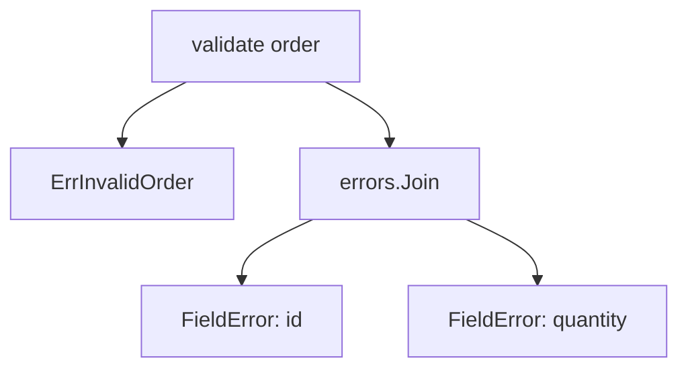

# Go 错误模型：包装、分类、匹配与重试决策

Go 把失败表示为普通返回值。调用方可以检查、包装、记录或转换错误，而不需要一套独立的异常控制流。

## `error` 的准确含义

预声明接口 `error` 只有一个方法：

```go
type error interface {
	Error() string
}
```

任何实现 `Error() string` 的类型都可以作为错误返回。惯用签名把错误放在最后：

```go
func LoadOrder(id string) (Order, error)
```

`err == nil` 表示操作成功；非 `nil` 表示调用方不能按成功路径使用结果。错误字符串供人阅读，程序需要用错误值、错误类型或明确接口做分支。

接口值由动态类型和动态值组成。一个装有 nil 指针的 `error` 接口并不等于 nil：

```go
type ParseError struct{ Input string }

func (e *ParseError) Error() string { return "invalid input: " + e.Input }

func bad() error {
	var e *ParseError
	return e // 返回的接口包含 *ParseError 类型，因此 err != nil
}
```

返回前应直接返回 `nil`，不要把带类型的 nil 指针装进接口。

## 三种可处理的错误形态

### Sentinel error：稳定类别

包级错误变量代表调用方需要匹配的稳定类别：

```go
var ErrOrderNotFound = errors.New("order not found")
```

每次 `errors.New` 都产生不同的错误值，即使字符串相同也不相等。因此 sentinel 必须声明一次并复用。公开 sentinel 会成为包的兼容承诺；只有调用方确实需要根据该类别恢复时才公开。

### 自定义错误类型：携带结构化详情

错误类型适合携带字段名、错误位置、状态码或重试时间：

```go
type FieldError struct {
	Field string
	Value string
	Rule  string
}

func (e *FieldError) Error() string {
	return fmt.Sprintf("field %s with value %q: %s", e.Field, e.Value, e.Rule)
}
```

`Error` 文本用于日志；`Field`、`Value`、`Rule` 用于程序判断和生成响应。错误类型通常使用指针接收者，避免复制并保持匹配方式一致。

### 临时上下文错误：只补充操作语义

如果调用方只需要知道“哪一步失败”，用 `fmt.Errorf` 添加上下文：

```go
if err := repository.Load(id); err != nil {
	return fmt.Errorf("load order %q: %w", id, err)
}
```

错误字符串最终可能变成 `load order "A-17": order not found`。每一层只补充本层操作和必要的非敏感标识，不重复“failed”或底层已有信息。

## 包装形成错误树

`fmt.Errorf` 的 `%w` 会保留被包装错误。实现 `Unwrap() error` 的错误形成单子树；`errors.Join` 或实现 `Unwrap() []error` 的错误形成多子树。



Go 1.26 的 `fmt.Errorf` 可以包含多个 `%w`，返回值会包装所有相应操作数。`errors.Join(errs...)` 会丢弃 nil；全部参数为 nil 时返回 nil；非 nil 错误的文本以换行连接。

```go
func ValidateOrder(id string, quantity int) error {
	var errs []error
	if id == "" {
		errs = append(errs, &FieldError{
			Field: "id", Value: id, Rule: "must not be empty",
		})
	}
	if quantity < 1 {
		errs = append(errs, &FieldError{
			Field: "quantity", Value: fmt.Sprint(quantity), Rule: "must be positive",
		})
	}
	if len(errs) == 0 {
		return nil
	}
	return fmt.Errorf("%w: %w", ErrInvalidOrder, errors.Join(errs...))
}
```

`errors.Unwrap` 只调用 `Unwrap() error`，不会展开 `Unwrap() []error`。处理通用错误树应使用 `errors.Is`、`errors.As` 或 Go 1.26 的 `errors.AsType`。

## `errors.Is`：按语义匹配错误

```go
if errors.Is(err, ErrOrderNotFound) {
	// 返回 404 或进入创建流程
}
```

`Is` 对错误树做深度优先、先序遍历。对每个节点，它先比较当前错误与 target；如果当前错误实现 `Is(error) bool`，再调用该方法；随后遍历子错误。因此包装多少层都不需要字符串匹配。

自定义 `Is` 只能做浅比较，不能在方法里递归调用 `Unwrap`：

```go
type StatusError struct{ Code int }

func (e *StatusError) Error() string { return fmt.Sprintf("status %d", e.Code) }

func (e *StatusError) Is(target error) bool {
	t, ok := target.(*StatusError)
	return ok && (t.Code == 0 || e.Code == t.Code)
}
```

这允许 `errors.Is(err, &StatusError{Code: 503})` 做语义匹配。不要让 `Is` 执行 I/O 或复杂计算。

## `errors.As` 与 `errors.AsType`：提取类型

Go 1.26 可用泛型 `errors.AsType` 返回错误树中第一个匹配值：

```go
fieldErr, ok := errors.AsType[*FieldError](err)
if ok {
	fmt.Printf("field=%s rule=%s\n", fieldErr.Field, fieldErr.Rule)
}
```

传统 `errors.As` 把结果写入 target 指向的位置：

```go
var fieldErr *FieldError
if errors.As(err, &fieldErr) {
	fmt.Println(fieldErr.Field)
}
```

`errors.As` 的 target 必须是非 nil 指针，且其所指类型是接口或实现 `error`，否则会 panic。`errors.AsType[E]` 让类型参数承担这个约束，减少双指针和错误 target。两者都只返回遍历顺序中的第一个匹配项；若要收集 `errors.Join` 中所有字段错误，需要显式遍历 `Unwrap() []error`。

## 业务错误、系统错误与程序错误

分类依据是调用方能采取的动作，不是错误消息的措辞。

| 类别 | 例子 | 边界动作 | 原样重试 |
| --- | --- | --- | --- |
| 输入/业务规则 | 数量为零、库存不足、状态冲突 | 4xx 或领域错误码，提示可修正字段 | 通常无效 |
| 资源不存在 | 订单 ID 不存在 | 404、返回空结果或创建 | 取决于一致性模型 |
| 短暂系统失败 | 连接重置、上游 503、限流 | 记录依赖与耗时，按预算退避 | 可能有效 |
| 永久系统失败 | 配置缺失、权限拒绝、协议不兼容 | 告警并停止该路径 | 通常无效 |
| 取消/截止时间 | `context.Canceled`、`context.DeadlineExceeded` | 停止工作，保留 cause | 不应绕过上游取消 |
| 程序错误 | 越界、破坏不变量、nil 解引用 | 修复代码，必要时恢复进程边界 | 不靠业务重试 |

“可重试”不是 error 类型自身的永久属性。它同时取决于操作是否幂等、错误是否短暂、上下文剩余时间、尝试次数和下游配额。支付扣款即使收到网络超时，也不能在没有幂等键或查询状态的情况下盲目重试。

## API 边界的错误转换

内部错误不应原样暴露给客户端。边界层把内部类别映射成稳定协议：

```go
type Problem struct {
	Code    string `json:"code"`
	Message string `json:"message"`
}

func toProblem(err error) (int, Problem) {
	switch {
	case errors.Is(err, context.Canceled):
		return 499, Problem{Code: "request_canceled", Message: "request canceled"}
	case errors.Is(err, context.DeadlineExceeded):
		return 504, Problem{Code: "deadline_exceeded", Message: "request timed out"}
	case errors.Is(err, ErrOrderNotFound):
		return 404, Problem{Code: "order_not_found", Message: "order does not exist"}
	case errors.Is(err, ErrInvalidOrder):
		return 422, Problem{Code: "invalid_order", Message: "order fields are invalid"}
	default:
		return 500, Problem{Code: "internal", Message: "internal error"}
	}
}
```

SQL 文本、文件路径、主机名、凭据和堆栈只进入受控日志，不能进入公共响应。日志应在请求边界记录一次完整错误；每层都记录同一错误会产生重复告警。

## 重试的完整决策

重试循环必须有总预算、退避、抖动和取消：

```go
func Retry(ctx context.Context, max int, operation func() error) error {
	var last error
	for attempt := 1; attempt <= max; attempt++ {
		if err := operation(); err != nil {
			last = err
			if !isTransient(err) || attempt == max {
				return err
			}
		} else {
			return nil
		}

		delay := time.Duration(1<<(attempt-1)) * 50 * time.Millisecond
		timer := time.NewTimer(delay)
		select {
		case <-timer.C:
		case <-ctx.Done():
			if !timer.Stop() {
				<-timer.C
			}
			return fmt.Errorf("retry stopped: %w", context.Cause(ctx))
		}
	}
	return last
}
```

生产代码还应加入随机抖动，避免许多实例同时重试。服务端给出 `Retry-After` 时应在总预算内尊重它。一次调用的所有尝试必须沿用同一幂等键和追踪 ID。

## 完整案例：订单校验与错误映射

输入是订单 `id=""`、`quantity=0`。

1. `ValidateOrder` 分别生成 `id` 与 `quantity` 的 `FieldError`。
2. `errors.Join` 保留两个字段错误。
3. 外层同时包装 `ErrInvalidOrder`，让边界按类别映射。
4. `errors.Is(err, ErrInvalidOrder)` 返回 true。
5. `errors.AsType[*FieldError](err)` 返回遍历到的第一个字段错误。
6. HTTP 层输出 422 和稳定码 `invalid_order`，日志保留完整字段上下文。

可运行实现位于 [`../../examples/go/errors.go`](../../examples/go/errors.go)，测试位于 [`../../examples/go/examples_test.go`](../../examples/go/examples_test.go)。

```sh
cd 05-backend-data/examples/go
go test -run TestValidateOrder -v
```

预期可观察结果是测试通过；断言同时验证类别匹配和结构化字段提取。失败分支包括：把 `%w` 改成 `%v` 后错误链被截断，`errors.Is` 失败；重新调用 `errors.New("invalid order")` 比较也会失败；只检查字符串会把日志文案变成程序协议。

## 常见错误与修正

- **返回结果和非 nil error 后仍使用结果**：除非函数文档明确允许部分结果，否则立即处理错误。
- **把 panic 当输入校验**：可预期的外部输入失败返回 error；panic 留给无法继续的程序不变量。
- **所有层都包装公开实现细节**：包装会让 `Is/As` 可见底层错误，公共 API 应只暴露愿意长期支持的类别。
- **忽略清理错误**：写文件后 `Close` 可能报告刷新失败；需要与主错误合并时使用 `errors.Join`。
- **用 `err == sentinel` 匹配包装错误**：改用 `errors.Is`。
- **用类型断言提取包装错误**：改用 `errors.AsType` 或 `errors.As`。
- **把取消当 500**：先匹配 context 错误，再映射默认内部错误。

## 验证清单

1. 正常路径明确返回 nil。
2. 每个可恢复类别都有稳定的 sentinel、类型或接口。
3. 包装使用 `%w`，并通过 `errors.Is/AsType` 测试。
4. 错误日志没有密码、Token、完整请求体等敏感值。
5. 重试操作具备幂等性或去重机制，并受 context 总预算限制。
6. API 响应使用稳定错误码，不泄漏内部实现。

## 练习

为批量导入实现 `ValidateRows`：每行可能有多个 `FieldError`，最终用 `errors.Join` 返回全部错误。完成标准：空输入返回 nil；三个错误都可被遍历；`errors.Is` 能识别 `ErrInvalidOrder`；API 层只返回字段名和规则，不返回原始敏感值；测试覆盖 `%w` 被误改为 `%v` 时会失败。

## 来源

- [Go：errors package](https://pkg.go.dev/errors)（访问日期：2026-07-17）
- [Go：fmt package](https://pkg.go.dev/fmt)（访问日期：2026-07-17）
- [Go Blog：Working with Errors in Go 1.13](https://go.dev/blog/go1.13-errors)（访问日期：2026-07-17）
- [Go 语言规范：Errors](https://go.dev/ref/spec#Errors)（访问日期：2026-07-17）
