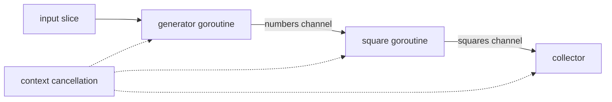

# Go 并发基础：Goroutine、Channel、Select 与 Context

Goroutine 是由 Go runtime 调度的并发执行单元；channel 在 goroutine 之间传递类型化值并建立同步；`select` 等待多个 channel 操作；`context` 把取消、截止时间和请求范围元数据沿调用链传播。

## 并发不是并行

并发描述多个任务的生命周期可以重叠；并行描述多个任务在同一时刻由不同执行资源运行。程序即使只有一个逻辑处理器也能并发。`GOMAXPROCS` 控制可同时执行 Go 代码的操作系统线程数量上限，不是 goroutine 数量限制。

```go
go process(orderID)
```

`go` 语句求值函数和参数，然后在新的 goroutine 中调用函数。调用方拿不到隐式返回值、错误或完成通知。因此每个启动点必须明确：谁等待它、谁能取消它、结果送到哪里、最晚何时退出。进程结束不会等待未完成 goroutine。

## Channel 的类型和状态

`chan T` 可发送也可接收；`chan<- T` 只发送；`<-chan T` 只接收。方向写在函数签名里能表达所有权：

```go
func produce(ctx context.Context, out chan<- int)
func consume(ctx context.Context, in <-chan int)
```

channel 有三种重要状态：

| 状态 | 发送 | 接收 | 关闭 |
| --- | --- | --- | --- |
| nil | 永久阻塞 | 永久阻塞 | panic |
| 已打开 | 等待接收方或缓冲空间 | 等待发送方或缓冲值 | 成功一次 |
| 已关闭 | panic | 先取完缓冲，再立即得到零值与 `ok=false` | 再次关闭会 panic |

nil channel 在 `select` 中对应分支永远不会就绪，可用于动态启用或禁用分支；在普通收发语句中通常造成泄漏或死锁。

## 无缓冲与有缓冲 Channel

```go
unbuffered := make(chan Job)
buffered := make(chan Job, 16)
```

无缓冲 channel 的发送必须与一次接收配对；发送完成发生在对应接收完成之前。有缓冲 channel 在缓冲未满时可完成发送，容量为 C 的 channel 上第 k 次接收发生在第 k+C 次发送完成之前。

缓冲表达有限的积压预算，不是持久消息队列。容量变大只能推迟背压，不能修复消费者永久停止、错误未传播或无限生产。进程崩溃时缓冲内容会丢失。

## 关闭的所有权

关闭表示“以后不会再有值”，不是销毁 channel，也不是向每个接收方发送一个值。通常由唯一发送方关闭：

```go
func generate(ctx context.Context, input []int) <-chan int {
	out := make(chan int)
	go func() {
		defer close(out)
		for _, value := range input {
			select {
			case out <- value:
			case <-ctx.Done():
				return
			}
		}
	}()
	return out
}
```

接收方不能根据“现在暂时没值”判断以后也不会有值，因此不应关闭输入 channel。多个发送方需要一个协调者：发送方只调用 `Done`，协调者在全部发送方退出后关闭结果 channel。

接收时应区分零值和关闭：

```go
value, ok := <-ch
if !ok {
	// channel 已关闭且缓冲已取空
}
```

`for value := range ch` 会一直接收到关闭且取空，适合只需消费全部值的路径。

## `select` 的行为

```go
select {
case job := <-jobs:
	handle(job)
case <-ctx.Done():
	return context.Cause(ctx)
}
```

`select` 先求值所有 case 的 channel 操作数和发送右值。若一个或多个通信可进行，它以均匀伪随机方式选择一个；若都不可进行且有 `default`，执行 `default`；否则阻塞。case 书写顺序不是优先级。

非阻塞尝试可用 `default`：

```go
select {
case queue <- job:
	return nil
default:
	return ErrQueueFull
}
```

循环里的空 `default` 会持续占用 CPU。需要等待时应阻塞在 channel、timer 或 context 上。超时用可复用的 timer 或 `context.WithTimeout`；高频循环反复调用 `time.After` 会创建许多 timer。

## Context 的责任边界

`context.Context` 提供四类能力：

- `Deadline()`：返回截止时间和是否存在。
- `Done()`：取消时关闭的 channel；永不取消的 context 返回 nil。
- `Err()`：取消后返回 `Canceled` 或 `DeadlineExceeded`。
- `Value(key)`：读取请求范围元数据。

规范用法是把 `ctx` 作为函数首参数并显式传递：

```go
func LoadOrder(ctx context.Context, id string) (Order, error)
```

不要存入 struct，不要传 nil，不要把业务可选参数塞进 `Value`。根调用使用 `context.Background()`；测试可使用 `t.Context()`；不确定来源时也应传有效 context。

### 派生与取消

```go
ctx, cancel := context.WithTimeout(parent, 2*time.Second)
defer cancel()
```

派生 context 形成树。父 context 取消会取消所有后代；子 context 取消不会取消父级或兄弟。调用 cancel 会释放关联资源，即使任务提前成功也应 `defer cancel()`。

Go 还提供：

- `WithCancelCause` / `Cause`：记录明确取消原因；`ctx.Err()` 仍返回通用类别，`context.Cause(ctx)` 返回具体 cause。
- `WithDeadlineCause` / `WithTimeoutCause`：截止时提供 cause；返回的 `CancelFunc` 本身不会设置该 cause。
- `AfterFunc`：context 完成后在独立 goroutine 调用函数，返回停止函数；停止与回调可能竞争，回调必须可并发处理。
- `WithoutCancel`：派生一个不继承取消、截止或 cause 的 context；其 `Done` 为 nil，适合明确独立于请求生命周期的收尾，但不能用来隐藏本应传播的取消。

### Value 的键

键必须可比较，包应定义未导出类型以避免冲突：

```go
type traceIDKey struct{}

func WithTraceID(ctx context.Context, id string) context.Context {
	return context.WithValue(ctx, traceIDKey{}, id)
}
```

Value 适合跨 API 边界的追踪 ID、认证主体等请求范围数据，不适合超时、重试次数或函数配置。

## Pipeline 的数据流和取消

下图展示平方流水线。每个发送点都同时监听取消，因此下游提前返回时上游不会永久堵塞：



```go
func SquarePipeline(ctx context.Context, input []int) ([]int, error) {
	numbers := make(chan int)
	squares := make(chan int)

	go func() {
		defer close(numbers)
		for _, n := range input {
			select {
			case numbers <- n:
			case <-ctx.Done():
				return
			}
		}
	}()

	go func() {
		defer close(squares)
		for n := range numbers {
			select {
			case squares <- n * n:
			case <-ctx.Done():
				return
			}
		}
	}()

	var result []int
	for {
		select {
		case value, ok := <-squares:
			if !ok {
				if err := context.Cause(ctx); err != nil {
					return nil, err
				}
				return result, nil
			}
			result = append(result, value)
		case <-ctx.Done():
			return nil, context.Cause(ctx)
		}
	}
}
```

完整实现位于 [`../../examples/go/concurrency.go`](../../examples/go/concurrency.go)。

## 完整案例：正常完成与取消

输入 `[]int{2, 3, 4}`，处理顺序如下：

1. generator 把 2、3、4 依次发送到 `numbers`。
2. square stage 接收并发送 4、9、16。
3. generator 关闭 `numbers`；square 的 range 结束并关闭 `squares`。
4. collector 观察到 `ok=false`，输出 `[4 9 16]`。
5. 测试比较完整切片，验证没有少值、重复或重排。

```sh
cd 05-backend-data/examples/go
go test -run TestSquarePipeline -v
go test -race -run TestSquarePipeline
```

失败分支：collector 在收到第一个值后取消。如果两个发送 goroutine 没有在发送时选择 `ctx.Done()`，它们可能永久阻塞；当前实现会沿每个阻塞边界观察取消并退出。取消和最终 channel 值同时就绪时 `select` 可任选其一，所以 API 若要求“取消后绝不接收新结果”，还需在处理结果前再次检查 context 并定义明确语义。

## Channel 与共享内存的边界

channel 收发建立特定 happens-before 关系，但不会让所有共享变量自动安全。发送指针后，发送方若继续修改其指向数据，接收方并发读取仍可能数据竞争。安全做法是转移唯一所有权、发送不可变副本，或继续用锁/atomic 协调。

同理，关闭 channel 之前的写入对观察到关闭的接收方可见；这不代表无关 goroutine 的任意访问有序。具体同步规则应以 Go Memory Model 为准。

## 常见失败

- **fire-and-forget goroutine**：没有等待、取消和错误出口；改为返回结果 channel、使用任务组或让服务生命周期持有它。
- **发送方泄漏**：下游提前退出但上游仍向无缓冲 channel 发送；所有潜在阻塞发送都选择取消。
- **接收方关闭 channel**：并发发送会 panic；关闭权交给唯一发送者或协调者。
- **把缓冲当无限队列**：流量持续大于消费能力后仍会填满；定义容量、拒绝和监控。
- **依赖 select 顺序**：多个 case 同时就绪时没有优先级；把强优先级写成显式的两阶段检查。
- **忘记调用 cancel**：timer 和父子关系保留到截止；创建后立即安排 `defer cancel()`。
- **用 context 传业务参数**：依赖不可见且无法静态检查；改成函数参数或配置结构体。
- **循环捕获可变状态**：确认 goroutine 参数在启动时固定；Go 1.22 后 range 变量按迭代创建，但外部共享对象仍需同步。

## 调试与验证

1. `go test -race ./...` 检测已执行路径上的数据竞争。
2. 测试为每个阻塞点设置超时，失败时打印 goroutine dump。
3. 对发送数、接收数、关闭责任和退出数建立断言。
4. 用 `runtime/pprof` goroutine profile 查看长期阻塞栈。
5. 用 `go tool trace` 分析调度、阻塞和系统调用时间线。
6. 测试正常、空输入、下游失败、父级取消、截止超时和满缓冲。

## 练习

实现一个三阶段文本流水线：读取字符串、解析正整数、计算平方。输入 `[]string{"2", "bad", "4"}` 时，第一个解析错误应通过 `WithCancelCause` 取消其他 stage。完成标准：正常输入保持顺序；错误可用 `errors.AsType[*strconv.NumError]` 识别；所有 goroutine 在测试结束前退出；关闭权唯一；`go test -race` 通过；测试覆盖空输入和预先取消。

## 来源

- [Go 语言规范：Go statements 与 Select statements](https://go.dev/ref/spec#Go_statements)（访问日期：2026-07-17）
- [Go：context package](https://pkg.go.dev/context)（访问日期：2026-07-17）
- [Go Blog：Pipelines and cancellation](https://go.dev/blog/pipelines)（访问日期：2026-07-17）
- [Go Memory Model](https://go.dev/ref/mem)（访问日期：2026-07-17）
