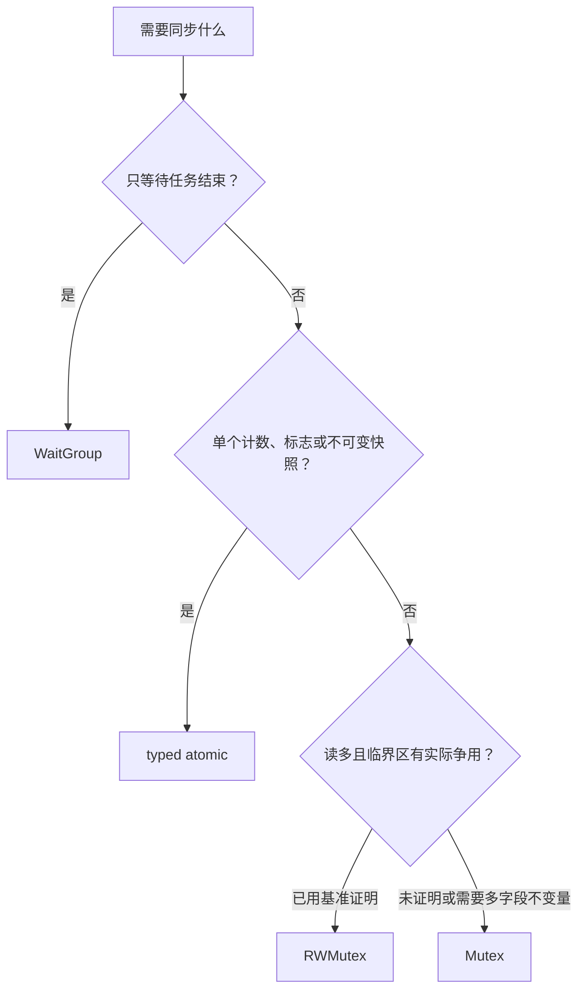

# Go 同步：Mutex、RWMutex、WaitGroup 与 Atomic

多个 goroutine 访问同一份可变状态且至少一个访问是写时，程序必须建立同步。`Mutex` 和 `RWMutex` 保护跨多个操作的不变量，`WaitGroup` 表示一组任务的完成，`sync/atomic` 为单个原子状态提供读改写与内存同步。

## 数据竞争与业务竞争

数据竞争是两个 goroutine 并发访问同一内存位置、至少一个为写，并且没有 happens-before 顺序。它使程序行为不可靠，Race Detector 可以在执行到相关路径时报告。

业务竞争即使没有数据竞争也可能出错：

```go
if balance >= amount { // 单独读取是安全的
	balance -= amount    // 单独写入也是安全的
}
```

如果读和扣减分别加锁，两个请求都可能通过检查。锁必须保护“余额不能小于零”这个不变量，把检查与更新放在同一临界区。

## `sync.Mutex`

`Mutex` 的零值可直接使用。`Lock` 获得锁；锁已被其他 goroutine 持有时阻塞；`Unlock` 释放锁。解锁未加锁的 mutex 是不可恢复的运行时错误。mutex 不关联 goroutine，也不支持重入。

```go
type Ledger struct {
	mu       sync.Mutex
	balances map[string]int64
}

func (l *Ledger) Transfer(from, to string, amount int64) error {
	l.mu.Lock()
	defer l.mu.Unlock()
	if amount <= 0 {
		return errors.New("amount must be positive")
	}
	if l.balances[from] < amount {
		return errors.New("insufficient balance")
	}
	l.balances[from] -= amount
	l.balances[to] += amount
	return nil
}
```

一次 `Unlock` synchronizes-before 后续某次 `Lock` 返回，因此后来的持锁者能观察到此前临界区的写入。

### 临界区设计

- 为锁写明保护的字段和不变量，例如 `mu protects balances and their total`。
- 所有访问都遵循同一协议；只有写加锁而读不加锁仍会竞争。
- 在锁内完成必须原子观察的检查和更新。
- 不在持锁时调用未知回调、发送到可能阻塞的 channel、网络请求或磁盘 I/O。
- 多把锁需要固定获取顺序，避免循环等待。
- 含锁类型通常用指针接收者，首次使用后不得复制。

`TryLock` 只适合确实能在失败时做有价值替代工作的少数场景。用它循环轮询通常更慢、更复杂，也可能造成饥饿。

## `sync.RWMutex`

`RLock/RUnlock` 允许多个读者并存；`Lock/Unlock` 排斥所有读写者。写者等待期间，新的 `RLock` 会阻塞，使写者最终获得机会。因此不能递归读锁，也不能把读锁升级成写锁或把写锁降级成读锁。

```go
type Cache struct {
	mu    sync.RWMutex
	items map[string]Item
}

func (c *Cache) Get(key string) (Item, bool) {
	c.mu.RLock()
	defer c.mu.RUnlock()
	item, ok := c.items[key]
	return item, ok
}
```

返回 map、slice、指针时要防止锁外修改内部状态。可以返回不可变对象、深拷贝，或把访问封装成持锁回调。`RWMutex` 只有在读取明显多、读临界区足够长且存在真实争用时才可能优于 `Mutex`；必须用代表性基准验证。

## `sync.WaitGroup`

`WaitGroup` 是任务计数器。计数为零时 `Wait` 返回；计数不能变成负数。Go 1.25 起提供 `WaitGroup.Go`，Go 1.26 可直接使用：

```go
var wg sync.WaitGroup
for _, job := range jobs {
	job := job
	wg.Go(func() {
		process(job)
	})
}
wg.Wait()
```

`Go(f)` 在新 goroutine 中调用 f，并在返回时从计数中移除任务。文档要求 f 不得 panic。若 WaitGroup 为空，`Go` 必须发生在 `Wait` 前；非空时任务可从其他任务继续调用 `Go`。

传统写法仍适用于需要自定义启动过程的代码：

```go
wg.Add(1) // 必须在启动前
go func() {
	defer wg.Done()
	process(job)
}()
```

若 `Add(1)` 放进 goroutine，`Wait` 可能在计数增加前返回。Go 1.25 的 `go vet` 会报告常见的 `WaitGroup.Add` 放在 goroutine 内的问题。`WaitGroup` 只等待完成，不传错误、不取消其他任务；需要这些能力时应使用带 context 的任务组或自行建结果通道。

同一个 WaitGroup 可以在上一轮 `Wait` 返回后复用，但新一轮 `Add/Go` 必须在上一轮所有 `Wait` 完成后开始。

## `sync/atomic` 的操作表面

优先使用类型化原子类型：`atomic.Bool`、`Int32`、`Int64`、`Uint32`、`Uint64`、`Uintptr` 和 `Pointer[T]`。主要方法包括：

| 方法 | 行为 | 典型用途 |
| --- | --- | --- |
| `Load` | 原子读取 | 读取计数、标志或已发布指针 |
| `Store` | 原子写入 | 发布新状态 |
| `Add` | 原子加并返回新值 | 单调计数器 |
| `Swap` | 写入新值并返回旧值 | 状态交换 |
| `CompareAndSwap` | 当前值等于 old 时写 new | 简单状态机 |
| `And` / `Or` | 原子位运算 | 标志位集合 |

Go 的原子操作具有顺序一致语义：若原子操作 A 的效果被原子操作 B 观察到，A synchronizes-before B；所有原子操作表现得像处在一个一致的全局顺序中。它不是放松内存序 API。

```go
type Registry struct {
	requests atomic.Uint64
	snapshot atomic.Pointer[Snapshot]
}

func (r *Registry) RecordRequest() {
	r.requests.Add(1)
}

func (r *Registry) Publish(routes []string) {
	copyOfRoutes := slices.Clone(routes)
	r.snapshot.Store(&Snapshot{RouteNames: copyOfRoutes})
}
```

指针发布前必须完成对象初始化；发布后把对象当不可变值。若其他 goroutine 继续修改 `RouteNames` 的底层数组，atomic pointer 不能保护数组内部。示例在发布和返回时都复制 slice。

### CAS 循环

```go
func IncrementUntil(counter *atomic.Uint64, limit uint64) bool {
	for {
		old := counter.Load()
		if old >= limit {
			return false
		}
		if counter.CompareAndSwap(old, old+1) {
			return true
		}
	}
}
```

CAS 失败意味着状态已变化，必须重新读取并重新验证不变量。复杂结构、多字段事务或需要等待条件时，mutex 通常更清晰。无锁不等于无等待：高争用 CAS 循环可能不断重试。

## 如何选择



channel 用于所有权转移和事件流；mutex 用于共享状态。两者都能同步，但选择应匹配数据模型，而不是“channel 永远更 Go”。

## 完整案例：并发转账保持总额

输入是账户 A=1000、B=1000，以及 100 个并发任务；每个任务先 A→B 转 1，再 B→A 转 1。

1. `WaitGroup.Go` 启动并跟踪任务。
2. 每次 `Transfer` 在一把 mutex 下检查金额和余额，再更新两个账户。
3. `Wait` 返回后所有转账完成。
4. `Total` 在同一锁协议下求和，输出 2000。
5. `go test -race` 验证已执行路径没有未同步访问。

实现位于 [`../../examples/go/concurrency.go`](../../examples/go/concurrency.go)，atomic 快照位于 [`../../examples/go/metrics.go`](../../examples/go/metrics.go)。

```sh
cd 05-backend-data/examples/go
go test -run 'TestLedger|TestRegistry' -v
go test -race -run 'TestLedger|TestRegistry'
```

失败分支一：移除 `Transfer` 的锁，map 和余额发生数据竞争，Race Detector 会报告冲突访问，最终总额也可能错误。失败分支二：只分别锁住两次余额更新，其他读者可能观察到中间总额 1999。失败分支三：atomic 发布 slice 后继续修改它，会绕过 pointer 的同步保证并造成竞态。

## 死锁与锁争用

死锁常见必要条件是互斥、持有并等待、不可抢占和循环等待。代码中最直接的预防方式是统一锁顺序：

```go
// 所有路径始终按 account ID 升序获取账户锁。
first, second := orderByID(a, b)
first.mu.Lock()
defer first.mu.Unlock()
second.mu.Lock()
defer second.mu.Unlock()
```

持锁网络调用会扩大临界区并把下游延迟转成全局锁等待。可以先在锁内复制必要状态，解锁后做 I/O，再重新加锁验证版本并提交。若必须跨远程调用保持业务原子性，需要数据库事务、幂等和补偿，而不是进程 mutex。

`runtime.SetMutexProfileFraction` 或测试参数 `-mutexprofile` 可采集锁争用；`-blockprofile` 记录同步原语阻塞。先确认真实瓶颈再拆锁，否则会增加不变量复杂度。

## 常见错误与修正

- 复制已使用的 Mutex、RWMutex、WaitGroup 或 atomic：使用指针接收者；运行 `go vet -copylocks`。
- 读路径未加锁：所有共享访问必须遵循协议，或发布不可变副本。
- 在 goroutine 内 `wg.Add`：改用 `wg.Go`，或在启动前 `Add`。
- 在 `Wait` 与首个 `Go/Add` 之间竞争：空组的任务注册必须先于等待。
- 把 WaitGroup 当错误组：建立结果 channel/context，或使用合适任务组。
- 用 atomic 维护余额和版本两个字段：单独原子操作不能保证组合不变量，改用锁。
- 无依据换成 RWMutex：用同负载基准比较吞吐和尾延迟。
- defer 解锁出现在超大函数：缩小到辅助函数，让临界区边界清晰。

## 验证步骤

1. 为每把锁写出保护字段、不变量和锁顺序。
2. `go vet ./...` 检查复制锁和 WaitGroup 误用。
3. `go test -race ./...` 覆盖并发读写、取消和错误路径。
4. 用高并发重复测试不变量，而不只断言没有 panic。
5. 怀疑争用时生成 mutex/block profile，并记录负载、Go 版本和 `GOMAXPROCS`。
6. 对 atomic 快照测试发布后不再被外部引用修改。

## 练习

实现库存表：`Reserve` 必须让库存不为负，`Snapshot` 返回不能修改内部 map 的副本，`requests` 用 `atomic.Uint64` 计数。完成标准：1000 个并发预留后库存与成功数一致；失败预留不改变库存；`go test -race` 通过；故意移除锁时竞态测试可发现问题；基准比较 `Mutex` 和 `RWMutex`，结论同时报告读写比例和 `GOMAXPROCS`。

## 来源

- [Go：sync package](https://pkg.go.dev/sync)（访问日期：2026-07-17）
- [Go：sync/atomic package](https://pkg.go.dev/sync/atomic)（访问日期：2026-07-17）
- [Go Memory Model](https://go.dev/ref/mem)（访问日期：2026-07-17）
- [Go 1.25 Release Notes：WaitGroup.Go 与 vet](https://go.dev/doc/go1.25)（访问日期：2026-07-17）
