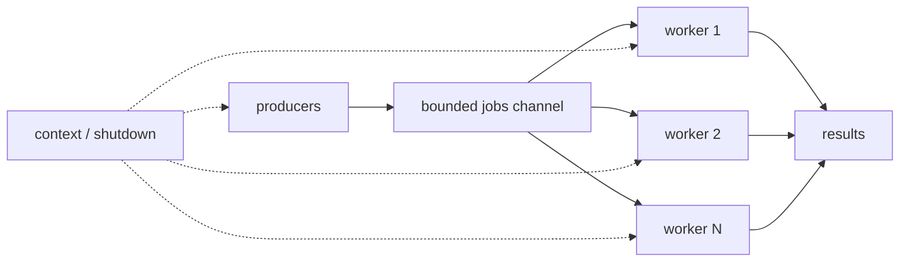
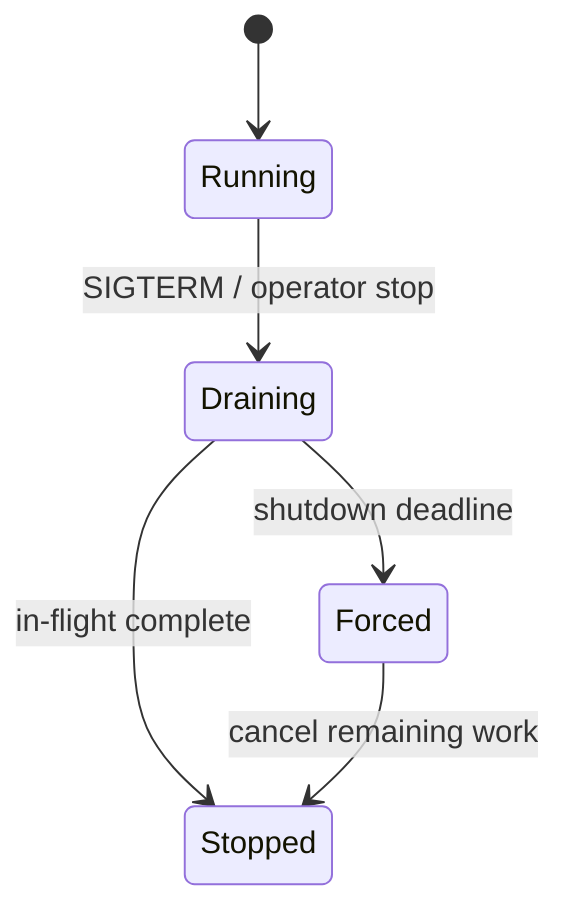

# Go Worker Pool：并发限制、背压与优雅停止

Worker Pool 用固定数量的长期 worker 消费任务。它把“任务数量”与“同时执行数量”分开，从而约束 CPU、内存、文件描述符、数据库连接和下游并发配额。

## 何时需要 Worker Pool

以下条件同时出现时适合进程内池：任务相互独立；处理逻辑相同；任务允许在内存中短暂排队；进程崩溃后可以丢失或由上游重放；需要明确并发上限。

不适合的情况包括：必须跨重启保留任务、需要多实例协调消费、需要延迟投递或严格重试审计。此时应使用持久队列或数据库任务表，进程内 worker 只负责执行已领取的任务。

## 四个组成部分



- **生产者**：创建任务，并对满载时的行为负责。
- **有限队列**：吸收短时突发并形成背压；容量是资源预算。
- **worker**：循环接收任务，每次处理一个，并观察取消。
- **协调者**：等待所有 worker，最后关闭结果 channel；关闭权唯一。

## 容量不是任务数

worker 数量应由瓶颈资源决定：

- CPU 密集任务从 `GOMAXPROCS` 附近开始测量，过多 goroutine 增加调度和缓存压力。
- I/O 密集任务可高于 CPU 数，但必须低于连接池、文件描述符和上游限额。
- 数据库任务的并发若高于连接池，只会把等待从池队列搬到连接池队列。
- 下游允许每实例 20 个在途请求时，本地并发必须把健康检查、重试和其他调用也计入预算。

容量需要通过吞吐、p95/p99 延迟、错误率、队列深度和资源占用共同验证，不能只追求吞吐最大。

## 有限队列与满载策略

```go
jobs := make(chan Job, queueCapacity)
```

满载时必须选择一种对调用方可见的策略：

| 策略 | 行为 | 适用条件 | 风险 |
| --- | --- | --- | --- |
| 阻塞 | 等到有空间或 context 取消 | 上游能承受背压 | 占用请求连接，可能级联超时 |
| 立即拒绝 | 返回 `ErrQueueFull` | 在线接口可让客户端重试 | 必须有稳定错误码和抖动 |
| 限时等待 | timer/context 到期后拒绝 | 有明确排队预算 | 总预算要包含执行时间 |
| 丢弃 | 记录指标后丢弃 | 可损失遥测或重复刷新 | 不适合业务交易 |
| 持久化 | 写入外部队列后确认 | 任务不能丢 | 增加基础设施和投递语义 |

队列无限增长会把过载转成内存耗尽。Little's Law 给出稳定系统中平均在途数量 `L = λW`；到达率持续高于服务率时不存在足够大的有限内存队列。

## 可运行的工作池

```go
func RunPool(ctx context.Context, workers int, jobs []Job) ([]Result, error) {
	if workers < 1 {
		return nil, errors.New("workers must be positive")
	}
	jobCh := make(chan Job)
	resultCh := make(chan Result)
	var wg sync.WaitGroup

	for range workers {
		wg.Go(func() {
			for {
				select {
				case <-ctx.Done():
					return
				case job, ok := <-jobCh:
					if !ok {
						return
					}
					select {
					case resultCh <- Result{JobID: job.ID, Value: job.Value * job.Value}:
					case <-ctx.Done():
						return
					}
				}
			}
		})
	}

	go func() {
		defer close(jobCh)
		for _, job := range jobs {
			select {
			case jobCh <- job:
			case <-ctx.Done():
				return
			}
		}
	}()
	go func() {
		wg.Wait()
		close(resultCh)
	}()

	results := make([]Result, 0, len(jobs))
	for result := range resultCh {
		results = append(results, result)
	}
	if err := context.Cause(ctx); err != nil {
		return nil, err
	}
	return results, nil
}
```

只有生产 goroutine 关闭 `jobCh`；只有等待所有 worker 的协调 goroutine 关闭 `resultCh`。worker 不关闭共享 channel。每个潜在阻塞发送都同时监听取消，避免收集者退出后 worker 泄漏。

完整实现位于 [`../../examples/go/concurrency.go`](../../examples/go/concurrency.go)。

## 任务错误的三种语义

工作池必须明确错误是否终止整批：

1. **fail-fast**：首个错误取消其他任务，适合结果必须全部成功的批处理。
2. **collect-all**：每个结果携带 error，处理完后用 `errors.Join` 汇总，适合独立导入。
3. **retry-later**：把可重试任务连同尝试次数和幂等键重新持久化，不在内存里无限重试。

```go
type Result struct {
	JobID string
	Value Output
	Err   error
}
```

结果 channel 必须有持续消费者。若调用方看到首个错误就返回，剩余 worker 可能阻塞发送；fail-fast 路径要先取消，然后继续排空结果或保证 worker 的发送可选择取消。

## 每任务超时与整批超时

整批 context 控制整个池生命周期；任务级 context 限制单项处理：

```go
taskCtx, cancel := context.WithTimeout(ctx, 500*time.Millisecond)
err := handle(taskCtx, job)
cancel()
```

不要在长循环中 `defer cancel()`，因为 defer 要到 worker 函数返回才执行；用辅助函数或立即调用。下游 API 若不能响应 context，超时只会让调用方返回，底层 goroutine 或连接可能仍占资源。

## 优雅停止的状态机



推荐顺序：

1. 收到 SIGTERM/SIGINT，根 context 进入停止状态。
2. 先让健康检查/就绪检查返回“不接收流量”，停止入口创建新任务。
3. 停止生产者；由唯一所有者关闭 jobs，或取消领取循环。
4. 给在途请求和 worker 一个有上限的排空窗口。
5. 截止时间到后取消剩余任务。
6. 最后刷新日志、指标和追踪并关闭依赖连接。

`signal.NotifyContext` 把信号转换成 context：

```go
root, stop := signal.NotifyContext(context.Background(), os.Interrupt, syscall.SIGTERM)
defer stop()

<-root.Done()
shutdownCtx, cancel := context.WithTimeout(context.Background(), 15*time.Second)
defer cancel()
if err := server.Shutdown(shutdownCtx); err != nil {
	_ = server.Close()
}
```

`http.Server.Shutdown` 先关闭监听器和空闲连接，再等待活跃连接变空闲；它不会等待或关闭 hijacked 连接，例如部分 WebSocket。应用需用 `RegisterOnShutdown` 通知这些连接自行停止。传入 context 到期时 Shutdown 返回 context 错误，服务端仍应决定是否调用 `Close` 强制结束。

## 完整案例：三任务、两 Worker

输入是 `{1,2}`、`{2,3}`、`{3,4}` 三个任务，worker 数为 2。

1. 两个 worker 开始等待 `jobCh`。
2. 生产者逐项发送并最终关闭 jobs。
3. 两个 worker 最多同时处理两个任务，分别产生 4、9、16。
4. worker 全部退出后协调者关闭 results。
5. 收集者 range 结束，输出三个结果；并发完成顺序不作为契约。
6. 测试验证结果数量，Race Detector 验证执行路径没有竞争。

```sh
cd 05-backend-data/examples/go
go test -run 'TestRunPool' -v
go test -race -run 'TestRunPool'
```

取消失败分支使用 `context.WithCancelCause` 预先设置 `deployment stopped`。生产者和 worker 都观察取消，结果通道在 Wait 后关闭，函数返回该 cause。若删掉 worker 发送结果时的取消分支，预先取消或收集者提前退出可能使 worker 永久阻塞。

## 过载、重试与幂等

过载时内部重试会放大流量。重试必须满足：操作可安全重复；错误被识别为短暂；总 context 尚有预算；有最大次数；指数退避带抖动；每次重试沿用幂等键。

持久队列常提供“至少一次”投递，消费者可能在完成副作用后、确认消息前崩溃。因此处理器要用业务幂等键、唯一约束或事务收件箱去重。单纯把 worker 数设为 1 不能跨进程重启提供 exactly-once。

## 观测指标

- `queue_depth`：当前排队数；同时记录容量才能解释比例。
- `enqueue_wait_seconds`：进入队列等待时间。
- `active_workers`：正在处理数，长期等于上限说明饱和。
- `job_duration_seconds`：按任务类型和结果聚合，避免高基数 ID 标签。
- `rejected_total`：按拒绝原因计数。
- `completed_total` / `failed_total` / `canceled_total`：区分终态。
- `shutdown_duration_seconds`：排空耗时与强制终止数。

只有队列长度没有到达率和处理耗时，不能区分短时突发与持续过载。

## 常见错误与修正

- 每个任务启动一个 goroutine：增加固定 worker 或 semaphore 上限。
- 多个生产者各自关闭 jobs：建立单一协调者。
- 无缓冲错误通道没人读取：让结果携带错误并保证持续消费。
- 队列无限：设置容量并公开满载策略。
- worker 遇到错误直接退出但 jobs 继续写：传播取消并让生产者观察它。
- 关机只调用 `os.Exit`：它不会运行 defer；先排空，超时后由主流程决定退出。
- 用请求 context 承载必须完成的持久任务：先持久化并确认，再由独立消费者处理。
- 任务超时后底层仍运行：使用真正支持 context 的客户端并测试取消路径。

## 验证步骤

1. 用原子计数记录同时执行数，断言峰值不超过 worker 数。
2. 测试空任务、单任务、任务多于容量、处理错误、预先取消和处理中取消。
3. 让结果消费者提前停止，确认 worker 仍可退出。
4. `go test -race` 覆盖提交、关闭和取消竞争。
5. 发送 SIGTERM，验证入口停止、在途完成和超时强制分支。
6. 压测时同时观察吞吐、尾延迟、队列和下游饱和度。

## 练习

实现一个有限图片处理池：4 个 worker、队列容量 20、入队最多等待 100ms、单任务最多 2s。完成标准：峰值并发不超过 4；队列满返回可匹配的 `ErrQueueFull`；任务结果保留输入 ID；SIGTERM 后不接收新任务；10s 内排空，否则取消；`go test -race` 通过；测试证明消费者提前退出不会泄漏 goroutine。

## 来源

- [Go：sync package](https://pkg.go.dev/sync)（访问日期：2026-07-17）
- [Go：os/signal package](https://pkg.go.dev/os/signal)（访问日期：2026-07-17）
- [Go：net/http Server.Shutdown](https://pkg.go.dev/net/http#Server.Shutdown)（访问日期：2026-07-17）
- [Go Blog：Pipelines and cancellation](https://go.dev/blog/pipelines)（访问日期：2026-07-17）
