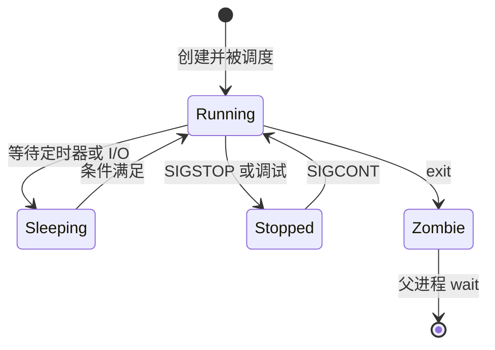

# 文件、权限、用户、进程、Signal、Pipe、Socket 与 systemd

Linux 服务能否启动、访问资源、相互通信并安全退出，取决于内核对象、进程凭据与服务管理器共同形成的边界。

## 1. 文件系统对象与路径

Linux 用统一的文件描述符接口访问普通文件、目录、设备、管道和 socket，但“万物皆文件”不表示所有对象支持完全相同的操作。普通文件保存字节；目录保存名称到 inode 的映射；字符与块设备把操作交给驱动；`/proc`、`/sys` 等虚拟文件系统暴露内核状态。

`stat` 展示对象类型、inode、权限、所有者和时间戳：

```sh
stat -- /srv/app/config.yaml
namei -l -- /srv/app/config.yaml
```

`namei -l` 会逐层显示路径组件权限。读取文件不仅要求文件本身可读，还要求调用进程对路径中每级目录都有搜索权限。

## 2. 权限位、所有权与 umask

每个 inode 有 owner、group 和 mode。内核先确定调用进程属于哪一类，再只使用对应的那组三位权限，不把三组权限叠加。

| 位 | 普通文件 | 目录 |
|---|---|---|
| `r` | 读取字节 | 列出目录项名称 |
| `w` | 修改文件内容 | 创建、删除或重命名目录项，通常还需 `x` |
| `x` | 作为程序执行 | 搜索/穿过目录并访问已知名称 |

数值模式中 `r=4`、`w=2`、`x=1`。`0640` 表示 owner 可读写、group 只读、other 无权限。优先使用符号模式表达意图：

```sh
chmod u=rw,g=r,o= -- /srv/app/config.yaml
chown app:app -- /srv/app/config.yaml
```

不要用 `chmod 777` 修复部署问题。它会把修改和执行权交给所有本机用户，且没有解决进程身份、父目录或 SELinux/AppArmor 策略问题。

新对象的基础模式会减去 `umask` 禁止的位。程序请求创建普通文件 `0666`，在 `umask 0027` 下通常得到 `0640`；目录从 `0777` 得到 `0750`。`umask` 不会给文件自动增加执行位。

```sh
( umask 0027; touch /tmp/lili-permission-demo; stat -c '%a %U %G' /tmp/lili-permission-demo; rm -- /tmp/lili-permission-demo )
```

括号创建子 shell，避免改变当前 shell 的 umask。macOS 的 `stat` 参数不同，可用 `stat -f '%Lp %Su %Sg' PATH`；`namei` 通常未预装。

### 特殊权限与 ACL

- setuid/setgid 在可执行文件上可改变有效 UID/GID，增加攻击面，不应用于普通服务部署。
- 目录 setgid 使新对象继承目录 group，适合受控共享目录。
- sticky bit 使可写共享目录中的文件通常只能被文件所有者、目录所有者或特权进程删除，`/tmp` 常为 `1777`。
- POSIX ACL 可为特定用户或组增加条目；有效权限还受 ACL mask 限制。Linux 用 `getfacl`/`setfacl` 查看和设置。
- Linux capabilities 把传统 root 权限拆分，例如绑定低端口可只授予 `CAP_NET_BIND_SERVICE`。不要授予范围过大的 `CAP_SYS_ADMIN`。

## 3. 用户、组与进程凭据

进程凭据至少包含 real/effective/saved UID 和 GID、补充组、capabilities。文件访问通常以有效身份进行。用户名只是 `/etc/passwd`、目录服务等提供的人类可读映射，内核权限判断使用数值 ID。

```sh
id
id app
ps -o pid,ppid,user,group,euid,egid,stat,cmd -p "$PID"
grep -E '^(Uid|Gid|Groups|Cap)' "/proc/$PID/status"
```

读取其他进程的 `/proc` 信息可能受 UID、ptrace 策略或容器边界限制。脚本应先验证 `PID` 是仅含数字且确属目标服务，避免观察错误进程。

服务账号应当不可交互登录、只拥有必需文件、使用独立工作目录。密码、私钥不应放入命令行参数，因为参数可能被 `ps` 或 `/proc` 观察。

## 4. 进程生命周期

进程拥有 PID、虚拟地址空间、凭据、打开文件描述符和至少一个线程。父进程创建子进程，子进程退出后保留少量退出信息，直到父进程 `wait`；未回收的已退出子进程是 zombie。孤儿会被 init/subreaper 接管。



PID 会复用。长期控制目标进程不能只保存一个旧 PID；服务管理器通过进程关系、cgroup 或 pidfd 等机制降低误杀风险。

## 5. Signal：通知而不是消息队列

signal 是内核向进程或线程投递的异步通知。默认动作可能是终止、生成 core、停止、继续或忽略。普通 signal 不为每次发送排队；相同 signal 在阻塞期间可能合并。实时 signal 具有排队和附加值语义。

| Signal | 常见用途 | 关键边界 |
|---|---|---|
| `SIGTERM` | 请求有序退出 | 可捕获、阻塞或忽略；服务应停止接流量并限时清理 |
| `SIGINT` | 终端中断 | 通常由 Ctrl-C 产生，可捕获 |
| `SIGHUP` | 终端挂断；服务常约定重载 | 重载只是程序约定，不是内核保证 |
| `SIGKILL` | 强制终止 | 不能捕获、阻塞或忽略；不会运行应用清理代码 |
| `SIGSTOP`/`SIGCONT` | 强制停止/继续 | `SIGSTOP` 不能捕获 |
| `SIGCHLD` | 子进程状态改变 | 父进程仍需 `wait` 回收 |
| `SIGPIPE` | 向已关闭 pipe/socket 写入 | 默认终止；网络程序常忽略并处理 `EPIPE` |

安全发送前先确认身份：

```sh
test -r "/proc/$PID/cmdline" || exit 1
tr '\0' ' ' < "/proc/$PID/cmdline"
kill -TERM "$PID"
```

不要把 `kill -9` 当第一步；它可能留下半写文件、未确认队列任务或需上层超时才能释放的租约。

## 6. Pipe 与 Unix domain socket

匿名 pipe 是单向字节流，常由有亲缘关系的进程继承两端；named pipe/FIFO 通过文件系统名称让无亲缘进程打开。pipe 没有消息边界，一次 `write` 不必对应一次 `read`。小于等于 `PIPE_BUF` 的单次写在多个写者间具有原子性保证，但容量与调度仍有限，写满会阻塞或返回 `EAGAIN`。

```sh
mkfifo /tmp/lili-demo.fifo
( printf '%s\n' 'ready' > /tmp/lili-demo.fifo ) &
IFS= read -r message < /tmp/lili-demo.fifo
printf 'received=%s\n' "$message"
rm -- /tmp/lili-demo.fifo
```

Unix domain socket 支持 `SOCK_STREAM`、`SOCK_DGRAM`、`SOCK_SEQPACKET` 等类型，可双向通信并传递凭据或文件描述符。pathname socket 的连接权限受到目录与 socket 节点权限影响；Linux abstract namespace socket 不存在文件系统节点，不能依赖文件 mode 控制访问。

## 7. systemd service unit

systemd 的 service unit 描述如何启动、停止、重启和隔离服务。下面是系统级 unit 的完整骨架；安装通常需要管理员权限，因此先在临时文件审阅，不直接覆盖生产配置。

```ini
[Unit]
Description=Lili API
After=network-online.target
Wants=network-online.target

[Service]
Type=exec
User=lili-api
Group=lili-api
WorkingDirectory=/srv/lili
ExecStart=/srv/lili/bin/server --config /etc/lili/config.yaml
Restart=on-failure
RestartSec=3s
TimeoutStopSec=20s
KillSignal=SIGTERM
NoNewPrivileges=yes
PrivateTmp=yes
ProtectSystem=strict
ProtectHome=yes
ReadWritePaths=/var/lib/lili

[Install]
WantedBy=multi-user.target
```

- `Type=exec` 等到 `execve` 成功才认为启动动作完成，但不表示应用已就绪；就绪可使用 `Type=notify` 与 `sd_notify`。
- `ExecStart` 不是通用 shell 命令行；管道、重定向等不会自动由 shell 解释。
- `User`/`Group` 设置运行身份。
- `Restart=on-failure` 对非零退出、signal、超时等失败重启；正常停止不重启。
- `TimeoutStopSec` 为停止动作和最终强制终止设上限。
- `NoNewPrivileges` 阻止进程及子进程通过 exec 获得新特权。
- 沙箱选项必须结合写目录、设备和网络需求测试，不能机械复制。

修改 unit 后的验证顺序：

```sh
systemd-analyze verify ./lili-api.service
sudo install -o root -g root -m 0644 ./lili-api.service /etc/systemd/system/lili-api.service
sudo systemctl daemon-reload
sudo systemctl enable --now lili-api.service
systemctl status --no-pager lili-api.service
journalctl -u lili-api.service --since '-5 min' --no-pager
```

`daemon-reload` 重新加载 unit 定义；它不会自动重启已运行服务。macOS 默认使用 `launchd` 与 plist，不提供 systemd、`systemctl` 或 Linux `/proc`。

## 8. 完整案例：服务无法读取配置且停止超时

### 输入

- unit 使用 `User=lili-api`。
- 日志显示 `permission denied`，服务反复重启。
- 运维人员把文件改成 `0644` 后能启动，但安全审查不允许 other 可读。
- 停止服务时 20 秒后被 `SIGKILL`。

### 步骤

1. 用 `systemctl show -p User,Group,ExecMainPID,SubState lili-api` 确认实际身份与 PID。
2. 用 `namei -l /etc/lili/config.yaml` 检查每级目录搜索权限。
3. 用 `stat -c '%A %U %G %n'` 确认文件为 `root:lili-api 0640`，目录为 `root:lili-api 0750`。
4. 用 `sudo -u lili-api test -r /etc/lili/config.yaml` 验证目标身份可读，不打印密钥内容。
5. 查看 `journalctl -u`，确认权限错误消失。
6. 发送 `systemctl stop`，观察程序是否在收到 `SIGTERM` 后停止接收、等待在途请求并退出。
7. 若超时，用 `systemctl show -p Result,ExecMainStatus` 和应用关闭日志定位卡住的资源。

### 输出

配置只对 root 和服务组可读；服务稳定进入 `active (running)`；停止在 20 秒内完成，退出状态为 0。

### 验证

```sh
sudo -u lili-api test -r /etc/lili/config.yaml
! sudo -u nobody test -r /etc/lili/config.yaml
systemctl is-active --quiet lili-api.service
systemctl show -p Result,ExecMainStatus lili-api.service
```

### 失败分支

若 Unix mode 正确仍返回 `EACCES`，检查 ACL、父目录、SELinux/AppArmor 审计记录、只读挂载和容器 UID 映射；不要继续放宽到 `0777`。若进程忽略 `SIGTERM`，修复应用 signal 处理与有界关闭流程；仅增大 `TimeoutStopSec` 会延后故障而不解决死锁或无界等待。

## 9. 常见错误与检查表

- 删除仍被进程打开的日志只移除目录项，空间要到最后一个引用关闭后才释放；用 `lsof +L1` 查找。
- 改用户名而不检查数值 UID，在共享卷或容器中可能改变实际所有权映射。
- 把 socket 文件可见误认为可连接；仍需检查目录搜索权限、服务监听和安全模块。
- 在 signal handler 中调用非 async-signal-safe 操作可能死锁；多数语言运行时提供更安全的 signal 通道或回调机制。
- 把 readiness 当进程存活；监听端口存在不表示依赖可用。

## 10. 练习与完成标准

1. 在临时目录创建 group 可读配置，证明同组账号可读、other 不可读，并解释每级目录的 `x`。
2. 编写一个前台程序，收到 `SIGTERM` 后停止接收并在 5 秒内退出；验证正常退出和超时强制终止两个分支。
3. 创建用户级 systemd unit 或在测试虚拟机验证示例 unit。完成标准是 `systemd-analyze verify` 无错误，运行身份、写目录、重启策略和关闭结果都可观察。

## 来源

- [Linux man-pages：inode(7)、path_resolution(7)](https://man7.org/linux/man-pages/man7/path_resolution.7.html)（访问日期：2026-07-17）
- [Linux man-pages：credentials(7)、capabilities(7)](https://man7.org/linux/man-pages/man7/credentials.7.html)（访问日期：2026-07-17）
- [Linux man-pages：signal(7)、pipe(7)、unix(7)](https://man7.org/linux/man-pages/man7/signal.7.html)（访问日期：2026-07-17）
- [systemd.service](https://www.freedesktop.org/software/systemd/man/latest/systemd.service.html)（访问日期：2026-07-17）
- [systemd.exec](https://www.freedesktop.org/software/systemd/man/latest/systemd.exec.html)（访问日期：2026-07-17）
