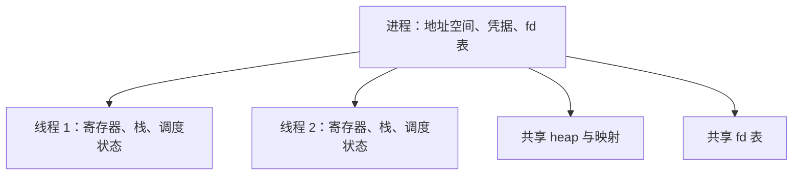
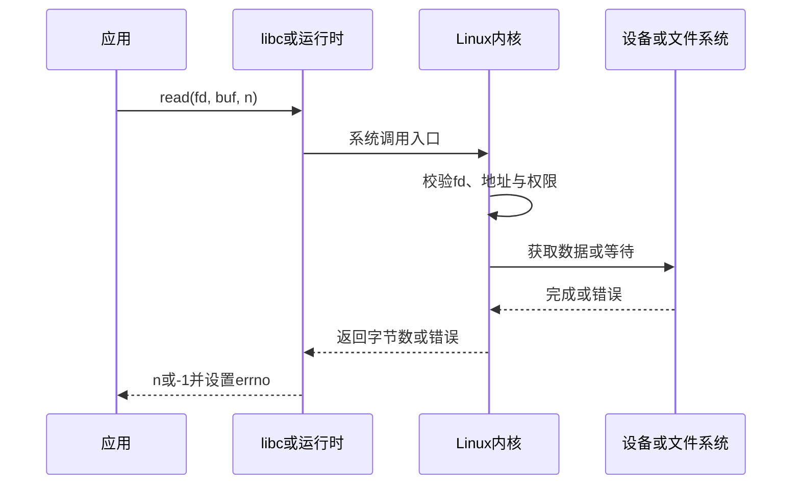

# 进程、线程、用户态、内核态与系统调用

进程定义资源与隔离边界，线程定义可被调度的执行流，系统调用是用户程序请求内核服务的受控入口。

## 1. 进程与线程

进程有虚拟地址空间、凭据、文件描述符表、signal 状态和其他资源。一个进程包含至少一个线程。同进程线程共享代码、heap、全局数据和文件描述符表，但各自拥有线程 ID、寄存器、用户栈、signal mask 和调度状态。



进程隔离能限制普通内存破坏，但不是完整安全沙箱；同 UID、ptrace 权限、共享文件、IPC 和内核漏洞仍可能跨边界。线程通信便宜但共享数据需同步，一个线程触发的致命 signal 通常终止整个进程。

## 2. 创建、执行与回收

Unix 进程创建常涉及 `fork`/`clone`，随后 `execve` 用新程序替换当前进程映像。`execve` 成功不会返回；PID 保持，地址空间和许多属性被替换，未标记 close-on-exec 的 fd 可能泄漏到新程序。

父进程用 `wait`/`waitpid` 取得退出状态并回收 zombie。退出码是进程间协议；被 signal 终止与正常非零退出应分开记录。shell 中 `$?` 只保存最近前台 pipeline 的状态。

`fork` 后多线程子进程在 exec 前只能安全调用有限的 async-signal-safe 函数。现代应用通常使用语言运行时提供的进程启动 API，仍需明确环境变量、工作目录、继承 fd 和取消行为。

## 3. 用户态、内核态与权限级别

用户态代码不能直接修改页表、配置设备或任意访问物理内存。系统调用、异常和中断进入内核态；内核验证指针、权限与状态，执行操作后返回。用户态/内核态是 CPU 权限与执行上下文，不等同于普通用户/root：root 进程大部分时间仍在用户态执行。



一次 `read` syscall 不等于一次物理磁盘 I/O：数据可能来自 page cache、pipe 或 socket；也可能只返回部分数据。进入内核有成本，但不能据此盲目减少 syscall；正确批量和缓冲需由 profile/基准验证。

## 4. 系统调用返回、errno 与部分结果

Linux 内核接口通常以负错误号表示失败；C 库包装常返回 `-1` 并设置线程局部 `errno`。只在调用指示失败后读取 errno。

| errno | 含义 | 处理边界 |
|---|---|---|
| `EINTR` | 被 signal 中断 | 某些调用可重试；先确认是否已有部分进展和截止时间 |
| `EAGAIN/EWOULDBLOCK` | 现在不能完成 | 非阻塞 I/O 等待就绪；不是永久故障 |
| `EBADF` | fd 无效或模式不符 | 常是生命周期/并发 bug，不能重试修复 |
| `EACCES/EPERM` | 权限或操作被拒绝 | 检查凭据、mode、capability、安全模块 |
| `ENOMEM` | 无法满足内存请求 | 受虚拟内存、限制和内核资源影响 |

读写允许短结果：请求 4096 字节可能只处理 300 字节。调用者必须循环，并处理 EOF、错误、取消和总上限。写入非幂等设备或协议时，部分写后无条件从头重试会重复数据。

## 5. 调度状态与阻塞

可运行线程进入运行队列，由调度器选择在 CPU 上执行。线程可因等待 I/O、futex、定时器、page fault 等睡眠。自愿上下文切换通常来自阻塞；非自愿切换常来自时间片、优先级或被抢占。

| Linux 状态 | 含义 | 诊断方向 |
|---|---|---|
| `R` | 正在运行或可运行 | 持续大量 R 结合 quota 看 CPU 饱和 |
| `S` | 可中断睡眠 | 网络、定时器、锁等待都可能出现 |
| `D` | 不可中断睡眠 | 查看 wchan、内核栈、设备/文件系统证据 |
| `T/t` | job control 停止或被跟踪 | 检查 signal、调试器 |
| `Z` | 已退出未被父进程回收 | 修复父进程 wait 逻辑 |

`D` 状态下即使 `SIGKILL` 已挂起，也要等内核路径返回。不能把所有 D 状态都叫“磁盘坏”。

## 6. 上下文切换的成本

切换需保存/恢复寄存器和调度状态；进程切换可能改变地址空间，工作集竞争还会造成 CPU cache/TLB 效果。成本取决于架构、工作集和安全缓解，不能用一个固定纳秒值代表所有机器。

切换数量必须与吞吐、延迟、CPU 和并发量共同解释。I/O 服务在高吞吐下有大量自愿切换可以正常；无用锁竞争、过多 runnable 线程或极短任务会增加调度开销。

## 7. 观测进程、线程和 syscall

```sh
cat "/proc/$PID/status"
ls "/proc/$PID/task"
ps -L -p "$PID" -o pid,tid,psr,stat,%cpu,nvcswch,nivcswch,wchan:24,comm
```

`/proc/PID/status` 的 `Threads` 和切换计数是累计值，要按时间取差。读取其他进程受 ptrace 与挂载策略限制。Linux 主线程 TID 等于 PID，但工作线程 TID 不等于进程 PID。

`strace` 跟踪 syscall：

```sh
timeout 10s strace -f -tt -T -yy -p "$PID" -o /tmp/lili-strace.txt
```

- `-f` 跟随新线程/子进程，输出量会增加。
- `-tt` 记录时间，`-T` 记录 syscall 内经过时间；该时间可能包含调度等待，不是纯 CPU。
- `-yy` 解码 fd 目标，可能暴露路径、地址和敏感对象。
- 附加需要 ptrace 权限，会暂停目标线程并增加开销；高吞吐生产服务只做短、窄、获授权采样。

汇总模式 `strace -c` 能显示调用次数、错误数和耗时比例，却丢失请求时序。先在测试环境复现，现场采样要设 `timeout`。macOS 使用 Instruments、`sample` 或受限制的 `dtruss`，没有 Linux `/proc`/`strace` 完全等价接口。

## 8. 语言运行时与 OS 线程

goroutine、Java virtual thread、协程不是 OS 线程。以 Go 为例，运行时把 goroutine 调度到一组 OS 线程；网络 poller 让等待非阻塞 socket 的 goroutine 休眠。阻塞 syscall、cgo、`LockOSThread` 仍会影响线程使用。诊断必须同时看语言运行时 profile/trace 与内核线程状态。

线程数量也不是并行度：并行执行受 CPU 数、cpuset、quota、调度和运行时设置限制。增加线程能覆盖等待，但对 CPU 饱和工作可能增加切换和 cache 失效。

## 9. 完整案例：system CPU 高且吞吐下降

### 输入

- API user CPU 25%、system CPU 55%，吞吐下降 40%。
- 进程有 120 个线程，无 OOM 或磁盘错误。
- 最近把日志从缓冲批量改为每行同步写。

### 步骤

1. 固定 30 秒时间窗记录吞吐、user/system CPU 和上下文切换差值。
2. `pidstat -w -p PID 1 10` 确认切换率上升。
3. 在预生产同负载运行 `strace -f -c -p PID` 10 秒，发现 `write`/`fdatasync` 次数与请求数成倍增长。
4. 应用 profile 未显示计算热点；磁盘 await 同时上升。
5. 恢复有界日志缓冲和批量刷写，并保留严重审计事件同步策略。

### 输出与验证

相同负载下 write syscall 数下降，system CPU 恢复 12%，吞吐和 p99 恢复。用故障注入验证进程崩溃时最多丢失的日志窗口符合约定。

### 失败分支

若 syscall 计数不高但 system CPU 高，继续检查网络 softirq、page fault、锁/futex 和容器节流；`strace` 会改变时序，不能作为唯一证据。若同步写是审计不丢失要求，不可直接缓冲，应采用专用审计通道、批量持久化协议和故障验收。

## 10. 常见错误

- 把进程等同程序文件：同一可执行文件可有多个进程，exec 后 PID 仍可不变。
- 把 thread ID 当全局稳定业务标识：TID 会复用。
- 把 syscall 时间全算作内核 CPU：其中可包含睡眠和调度。
- 对任何 `EINTR` 无条件重试：可能违反截止时间或重复非幂等步骤。
- 认为 root 等于内核态，或认为容器内 root 自动拥有宿主全部能力。
- 看到大量线程就直接降低线程数，没有验证 runnable、等待原因和吞吐。

## 11. 练习与完成标准

1. 写一个父进程启动子进程并回收退出状态的程序，验证正常退出与 signal 终止。
2. 对本地程序做 5 秒 syscall 汇总，解释前三类 syscall 的输入、返回和失败。
3. 比较一次阻塞读取前后的线程状态和自愿切换计数。
4. 完成标准：能区分资源边界与执行流、用户/root 与用户态/内核态、syscall 耗时与 CPU 时间，并给出安全观测限制。

## 来源

- [Linux man-pages：syscalls(2)](https://man7.org/linux/man-pages/man2/syscalls.2.html)（访问日期：2026-07-17）
- [Linux man-pages：pthreads(7)、clone(2)](https://man7.org/linux/man-pages/man7/pthreads.7.html)（访问日期：2026-07-17）
- [Linux man-pages：proc_pid_status(5)](https://man7.org/linux/man-pages/man5/proc_pid_status.5.html)（访问日期：2026-07-17）
- [strace manual](https://man7.org/linux/man-pages/man1/strace.1.html)（访问日期：2026-07-17）
- [Go runtime scheduler source](https://go.dev/src/runtime/proc.go)（访问日期：2026-07-17）
