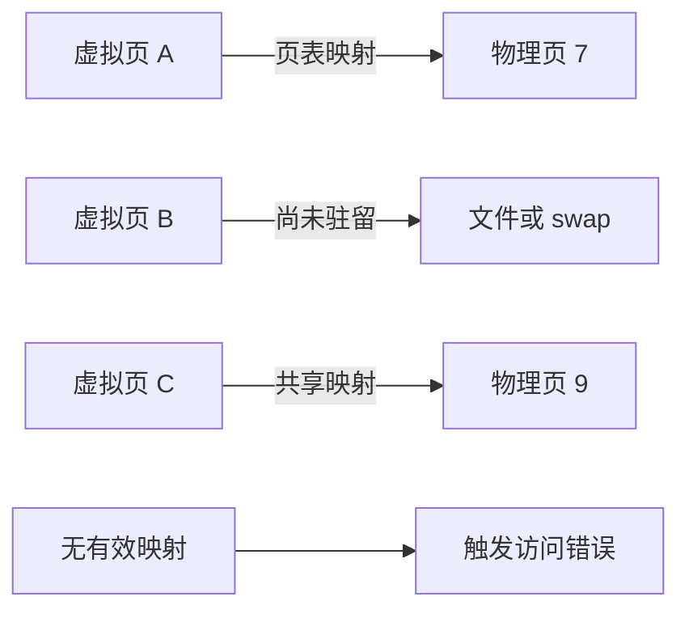

# 虚拟内存、Page、Stack、Heap 与上下文切换

虚拟内存把进程使用的地址与物理存储解耦；page 是映射、保护和回收的基本粒度；stack 与 heap 是地址空间中的不同用途区域；上下文切换让有限 CPU 执行多个任务。

## 1. 虚拟地址空间

程序读写的是虚拟地址。CPU 的内存管理单元根据页表把虚拟页转换为物理页，并检查读、写、执行和用户/内核权限。每个进程通常看到独立地址空间，同一个虚拟地址在不同进程中可映射到不同物理页。



地址空间可包含程序代码、只读数据、动态链接库、匿名映射、文件映射、heap、各线程 stack 和内核保留区域。布局受架构、加载器、ASLR、运行时与配置影响，不应依赖固定地址。

虚拟空间大不表示物理占用大。程序可保留地址范围而暂未提交物理页；共享库也可被多个进程映射到相同物理页。

## 2. Page、页表与 TLB

page size 是系统属性，常见基础页为 4 KiB，但不能硬编码。Linux 查询方式：

```sh
getconf PAGESIZE
getconf PAGE_SIZE
```

页表按页保存映射和权限。每次都遍历多级页表成本高，CPU 用 TLB 缓存近期地址转换。切换地址空间、映射变化或工作集超过 TLB 容量会增加转换开销；具体是否刷新、是否保留条目依赖架构和 PCID/ASID 等机制。

大页可降低页表与 TLB 压力，但会增加内部碎片、分配和回收复杂度。HugeTLB 是显式预留的大页机制；Transparent Huge Pages 由内核尝试合并/拆分。是否启用应由真实延迟、内存和 workload 测试决定。

## 3. Page fault 与 demand paging

CPU 访问无当前有效转换或权限不匹配的地址时触发 page fault。内核可能：建立已有页的映射、分配零页、从文件读取、执行 copy-on-write，或向进程发送 `SIGSEGV`/`SIGBUS`。

- minor fault 不需从存储读取目标页，例如首次匿名分配或页已在 page cache。
- major fault 需要可能阻塞的存储 I/O，通常成本更高。
- copy-on-write fault 在写共享只读页时复制物理页，常出现在 fork 后。

“fault”不自动表示程序错误；demand paging 正常依赖 fault。诊断要看速率、major/minor 分类、延迟与业务阶段。

```sh
ps -o pid,min_flt,maj_flt,rss,vsz,cmd -p "$PID"
/usr/bin/time -v ./program
```

procps 字段和 GNU time 在 macOS 上不兼容。macOS 可用 `vm_stat`、Activity Monitor/Instruments 和系统自带 `/usr/bin/time -l`。

## 4. 匿名内存、文件映射与 page cache

匿名映射没有直接后备文件，常承载 heap、stack 和运行时对象；内存压力下可留在 RAM 或写入 swap。文件映射把文件区间映射到地址空间，读写通过 page cache 与文件系统协调。

page cache 保存文件页以减少重复存储 I/O。脏页是内存中已修改但尚未持久化的文件页，最终由回写或显式同步处理。`write` 返回只表示数据交给内核，不必然已到稳定存储；持久化协议需正确使用 `fsync`/`fdatasync`，并考虑目录项和存储设备保证。

共享映射 `MAP_SHARED` 的修改可对其他映射者可见并回写文件；私有映射 `MAP_PRIVATE` 的写入通常通过 copy-on-write 保持进程私有。映射可见性不等于线程同步，仍需内存顺序和应用协议。

## 5. Stack

每个线程通常有自己的用户 stack，保存调用帧、返回地址、保存的寄存器和部分局部变量。编译器可把变量放寄存器、stack 或 heap，源码声明位置不决定最终存储。

stack 常有有限保留范围和 guard page。无限递归、过大栈上对象或线程过多可导致 stack overflow 或地址空间/物理内存压力。`ulimit -s` 显示 shell 为新进程设置的栈资源限制，但语言运行时可使用动态增长栈或自管策略。

```sh
ulimit -s
grep -E '^Threads|^Vm(Stk|Data|RSS|Size)' "/proc/$PID/status"
```

多个线程的栈不能只看进程 `VmStk` 就准确求和；需要结合 `/proc/PID/task/TID/maps`、运行时指标和实际 RSS。

## 6. Heap 与分配器

heap 是动态分配对象使用的区域概念，不一定是单一连续区间。C 分配器可通过 `brk` 与 `mmap` 从内核取得较大区域，再在用户态切分；Go、Java 等运行时有自己的 arena、size class 和垃圾回收。

应用“释放对象”不保证 RSS 立即下降：分配器可能保留页供复用；页可能尚未归还内核；碎片让已释放空间夹在活对象之间。内存泄漏应定义为不可再需要却仍被引用或资源未释放，不能只凭 RSS 上升断言。

内存指标边界：

| 指标 | 表示 | 常见误读 |
|---|---|---|
| VSZ/VmSize | 虚拟地址范围 | 当成实际 RAM |
| RSS/VmRSS | 当前驻留页近似量 | 当成独占内存或活对象总量 |
| PSS | 共享页按映射者分摊 | 当成内核精确计费 |
| anonymous | 非文件后备页 | 全部当成业务 heap |
| swap | 被换出的页 | 只要非零就认定正在抖动 |

## 7. 查看进程映射

```sh
sed -n '1,40p' "/proc/$PID/maps"
cat "/proc/$PID/smaps_rollup"
pmap -x "$PID" | tail -n 20
```

`maps` 显示地址区间、权限、文件偏移、设备、inode 和路径；`rwxp` 中 `p` 表示私有、`s` 表示共享。`[heap]`、`[stack]` 只是内核标注的一部分，现代分配器的大块匿名 mmap 不一定都标作 `[heap]`。

`smaps` 逐映射统计，读取大进程会有成本；`smaps_rollup` 给聚合值。`Pss`、`Private_Dirty`、`Shared_Clean` 等有助区分共享库与私有脏内存，但采样时状态仍会变化。

## 8. 上下文切换

调度器切出一个线程时保存其执行上下文，切入另一个线程时恢复。进程间切换还涉及不同地址空间；线程切换即使共享地址空间，也会改变寄存器、栈和工作集。

```sh
grep -E 'ctxt|processes|procs_running|procs_blocked' /proc/stat
pidstat -w -p "$PID" 1 5
```

`cswch/s` 是自愿切换，常由等待；`nvcswch/s` 是非自愿切换，常由抢占。数量必须除以吞吐或工作量并与基线比较。减少切换不是独立目标；忙等能让切换下降却浪费 CPU。

## 9. cgroup 与容器内存视角

容器进程仍使用宿主内核，但 cgroup 可限制可用内存。宿主 `MemAvailable` 很高时，容器也可因 `memory.max` 被 OOM kill。使用 cgroup v2 时：

```sh
cat /sys/fs/cgroup/memory.current
cat /sys/fs/cgroup/memory.stat
cat /sys/fs/cgroup/memory.events
cat /sys/fs/cgroup/memory.max
```

`memory.current` 是该 cgroup 及后代当前总内存；`memory.stat` 分类 anon、file、kernel 等；`memory.events` 的 `high`、`max`、`oom`、`oom_kill` 是累计事件。路径可能因容器运行时和 cgroup 层级不同，不能假设进程总在根路径。

## 10. 完整案例：容器周期性被 OOM kill

### 输入

- 宿主有 32 GiB RAM 且 available 充足。
- API 容器限制 512 MiB，每小时重启一次。
- 重启前 RSS 从 250 MiB 升到约 480 MiB；请求量同期增长。

### 步骤

1. 读取 `memory.max` 确认 512 MiB，而不是依据宿主 free。
2. 对 `memory.events` 前后取差，确认 `oom_kill` 增加。
3. 查看 `memory.stat`，发现 anon 增长，file 稳定，排除 page cache 为主的假设。
4. 采集语言运行时 heap profile，按对象类型发现无界请求结果缓存。
5. 以固定 1000 个不同 key 重放，缓存条目与 heap 可稳定复现线性增长。
6. 改为带容量和过期的缓存，并给队列设置上限；限制保留安全余量。

### 输出与验证

相同重放下缓存达到上限后内存进入平台期，`memory.events` 不再新增 `oom`/`oom_kill`，p99 和命中率符合目标。连续运行超过旧故障周期并比较 PSS、运行时 heap 与 cgroup current。

### 失败分支

若 cgroup current 增长但运行时 heap 稳定，检查 mmap、线程 stack、native/cgo、文件页和内核内存；不要仅增大 GC 频率。若只有 `high` 增加而没有 kill，说明发生节流/回收压力，仍需结合延迟。提高 limit 只能作为有容量验证的缓解，不能替代有界设计。

## 11. 常见错误

- 把 VSZ 直接当内存泄漏。
- 把所有 page fault 当异常，或把 minor 和 major 成本混为一谈。
- 认为变量写在函数里就必然位于 stack。
- 认为 `free()`/GC 后 RSS 必须立刻下降。
- 只看宿主内存，不看 cgroup 限制和事件。
- 为降低上下文切换改成忙等，却不检查 CPU 与延迟。

## 12. 练习与完成标准

1. 查询本机 page size，比较 `/proc/PID/maps`、`smaps_rollup` 与运行时 heap 指标。
2. 运行一个逐页触碰匿名内存的测试，记录触碰前后 minor fault 与 RSS；限制最大分配，不能逼近系统容量。
3. 比较 sleep 循环和 busy loop 的 CPU、切换与吞吐。
4. 完成标准：能区分虚拟/驻留、匿名/文件、stack/heap、fault/非法访问，并用两类指标定位容器 OOM。

## 来源

- [Linux Kernel：Memory Management Concepts](https://docs.kernel.org/admin-guide/mm/concepts.html)（访问日期：2026-07-17）
- [Linux Kernel：Process Addresses](https://docs.kernel.org/mm/process_addrs.html)（访问日期：2026-07-17）
- [Linux man-pages：proc_pid_maps(5)、proc_pid_smaps(5)](https://man7.org/linux/man-pages/man5/proc_pid_smaps.5.html)（访问日期：2026-07-17）
- [Linux man-pages：mmap(2)、madvise(2)](https://man7.org/linux/man-pages/man2/mmap.2.html)（访问日期：2026-07-17）
- [Linux Kernel：cgroup v2 memory controller](https://docs.kernel.org/admin-guide/cgroup-v2.html#memory)（访问日期：2026-07-17）
