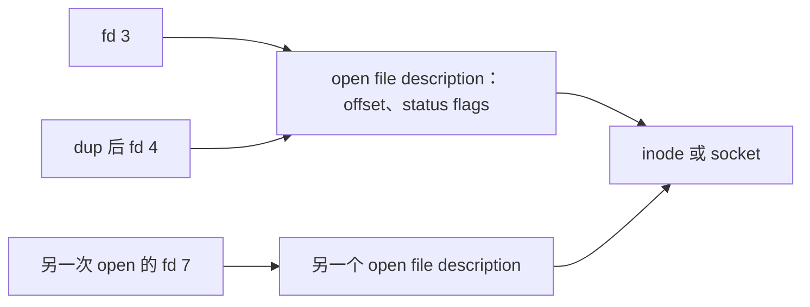
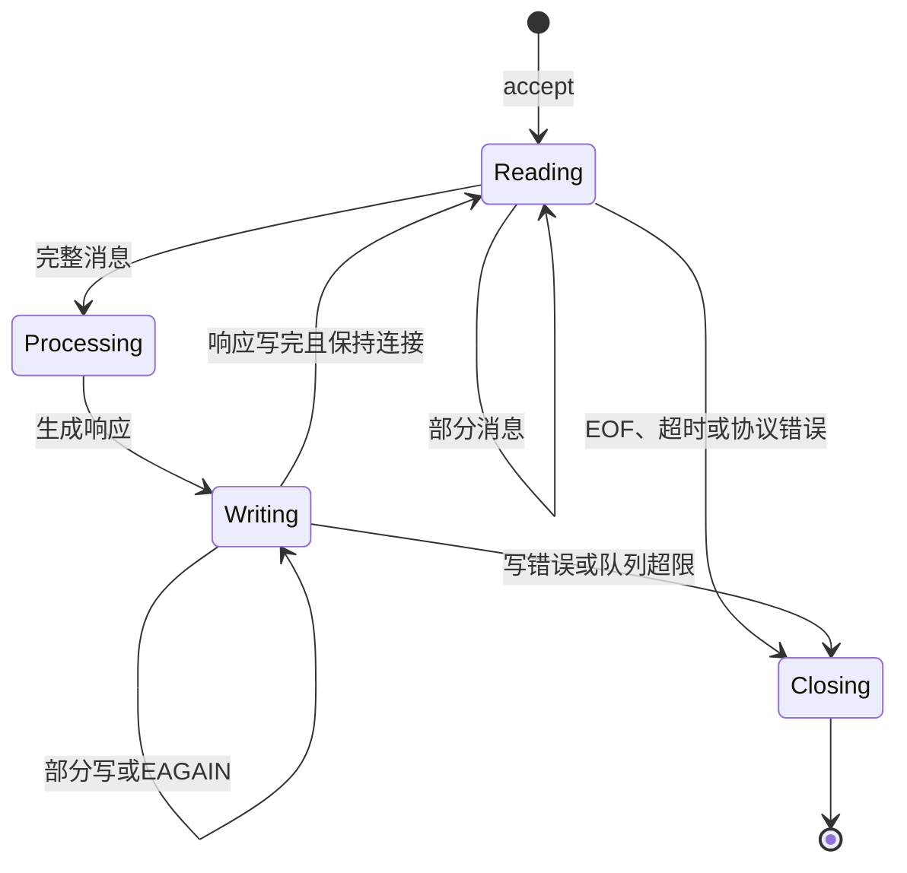

# File Descriptor、阻塞/非阻塞、I/O Multiplexing 与 epoll

文件描述符把进程中的小整数连接到内核打开对象；非阻塞 I/O 与 epoll 让一个执行线程在大量连接之间只处理当前可推进的工作。

## 1. fd、fd 表与 open file description

fd 是进程文件描述符表的索引，不是文件本身。表项指向内核的 open file description，后者保存当前文件偏移、状态标志等；open file description 再引用 inode、socket 等对象。



`dup` 产生的新 fd 共享文件偏移和 `O_NONBLOCK` 等 file status flags，但每个 fd 自己有 `FD_CLOEXEC`。另一次 `open` 通常创建独立 open file description，即使路径相同也可有独立偏移。

fd 数字会复用。线程 A close fd 8 后，线程 B 新 open 可能立即得到 8；保存裸整数跨并发生命周期会把操作发给错误对象。所有权设计应明确谁关闭、何时不再使用。

## 2. 创建、继承与关闭

`open`、`socket`、`accept`、`pipe` 等返回新 fd。fork 后子进程继承指向相同 open file description 的表项；exec 默认保留 fd，除非设置 close-on-exec。

优先在创建时原子设置：`open(..., O_CLOEXEC)`、`socket(..., SOCK_CLOEXEC)`、`accept4(..., SOCK_CLOEXEC|SOCK_NONBLOCK)`。先创建再 `fcntl` 的两步在多线程 fork/exec 间可能竞态泄漏。

`close` 释放当前 fd 引用，但内核对象会在最后一个引用关闭后销毁。close 的错误处理有平台差异；Linux 上即使 close 报错，fd 通常已释放，盲目重试可能关闭已复用的新 fd。需要持久化保证时，在 close 前显式 `fsync` 并处理错误。

## 3. 限制与泄漏

进程受 `RLIMIT_NOFILE` 软/硬限制，系统还有全局文件表限制。耗尽时 open/accept 可能返回 `EMFILE`（进程限制）或 `ENFILE`（系统限制）。

```sh
ulimit -Sn
ulimit -Hn
grep -E 'open files' "/proc/$PID/limits"
find "/proc/$PID/fd" -mindepth 1 -maxdepth 1 -printf '.' | wc -c
cat /proc/sys/fs/file-nr
```

不要在生产直接提高到极大值；每个连接还消耗内核内存、应用缓冲和下游资源。先按类型统计 fd，找出未关闭响应体、文件、pipe 或连接。

`/proc/PID/fd` 的符号链接目标可含敏感路径；并发关闭会让遍历结果变化。macOS 使用 `launchctl limit maxfiles`、`ulimit` 与 `lsof`，没有 Linux `/proc`。

## 4. 阻塞 I/O

阻塞 fd 上的 `read` 在没有数据时可让调用线程睡眠；有数据时也允许短读。普通磁盘文件即使设置 `O_NONBLOCK`，通常仍可在 page fault 或存储路径阻塞，因为该标志主要对 pipe、FIFO、socket、设备等有意义。

阻塞简单且适合少量连接或线程/协程模型，但必须有超时与取消。socket 的读超时、请求 deadline 和业务 deadline 各自边界不同；只设置 connect timeout 不能限制响应读取。

## 5. 非阻塞 I/O

设置 `O_NONBLOCK` 后，当前无法推进的调用返回 `EAGAIN`/`EWOULDBLOCK`，调用者保留状态并等待下次就绪。它不保证操作永不耗时，也不把多步协议自动变成异步。

```c
int flags = fcntl(fd, F_GETFL, 0);
if (flags == -1 || fcntl(fd, F_SETFL, flags | O_NONBLOCK) == -1) {
    /* 记录 errno 并关闭 fd */
}
```

不能直接用 `F_SETFL, O_NONBLOCK` 覆盖原 flags，否则可能清除 `O_APPEND` 等状态。多个引用同一 open file description 时，`O_NONBLOCK` 的变化可影响共享者。

非阻塞 read 的分支：`n>0` 消费字节；`n==0` 表示流式对端有序 EOF；`-1/EAGAIN` 表示暂时无数据；其他错误进入关闭/恢复。write 也可能部分成功，未写部分必须排队，并设置每连接上限实现背压。

## 6. I/O multiplexing

`select`、`poll`、epoll 都等待多个 fd 的就绪状态。“就绪”表示某操作现在可能不阻塞，不表示完整应用消息已经到达，也不表示后续调用必然成功；在通知与操作间状态可改变。

| 接口 | 模型 | 主要边界 |
|---|---|---|
| `select` | 每次传入位集合 | fd 编号受 `FD_SETSIZE`，每次复制和扫描 |
| `poll` | 每次传入 fd 数组 | 无 select 编号上限，但每轮线性扫描 |
| `epoll` | 内核维护 interest list，返回 ready list | Linux 专用；需正确处理生命周期和触发模式 |

macOS/BSD 使用 kqueue；Windows 有 IOCP。业务代码应优先使用成熟运行时/框架的事件循环，不为“性能”手写一个缺少取消、背压和测试的 poller。

## 7. epoll 的对象与操作

`epoll_create1(EPOLL_CLOEXEC)` 创建 epoll fd；`epoll_ctl` ADD/MOD/DEL 管理 interest list；`epoll_wait` 返回 ready events。被监视对象由 fd 与其 open file description 组合识别，dup 和 close 的行为需要谨慎。

常见 event：

- `EPOLLIN`：可读、监听 socket 可 accept、或对端关闭导致读到 EOF。
- `EPOLLOUT`：可写；连接非阻塞建立完成也会通知，必须用 `SO_ERROR` 检查成功与失败。
- `EPOLLERR`/`EPOLLHUP`：错误/挂起，即使未显式请求也可能报告；仍应读取错误或 drain 数据。
- `EPOLLRDHUP`：stream 对端关闭写半边，适合检测 half-close。
- `EPOLLET`：edge-triggered；只在状态边缘通知。
- `EPOLLONESHOT`：一次通知后禁用，处理完成需 MOD rearm。

## 8. level-triggered 与 edge-triggered

level-triggered 是默认：只要 fd 仍可读，后续 wait 继续报告。代码较易正确，但未消费事件可能反复唤醒。

edge-triggered 只在状态变化时通知。fd 必须非阻塞，并在收到通知后循环 accept/read/write，直到 `EAGAIN`；否则缓冲区仍有数据但没有新边缘，连接会停滞。

```text
on EPOLLIN:
  loop:
    n = read(fd)
    if n > 0: append_to_frame_buffer(n bytes); continue
    if n == 0: close_connection(); break
    if errno == EAGAIN: break
    if errno == EINTR: continue_with_deadline_check
    close_with_error(); break
```

这段是算法，不放入 C 围栏。完整实现还需解析消息 framing、限制 buffer、处理取消和保证 fd 不在回调期间被复用。

## 9. 监听与连接状态机

非阻塞服务器的核心循环：监听 fd 可读时反复 accept 到 EAGAIN；为每个连接创建输入/输出缓冲；可读时解析零到多个完整消息；有待发送数据才订阅 `EPOLLOUT`，发送完取消写关注，避免持续可写造成 busy loop。



TCP 是字节流，epoll 不提供消息边界。长度前缀必须限制最大长度；分隔符协议要限制未遇到分隔符时的累计字节；HTTP 需要成熟 parser 防止请求走私和资源耗尽。

## 10. race、惊群和生命周期

多个线程等待同一 epoll/监听 fd 时可能同时被唤醒；`EPOLLEXCLUSIVE` 可在特定场景减少惊群，但并不替代负载分配设计。`EPOLLONESHOT` 可把一个连接一次交给一个 worker，处理后 rearm。

关闭前应从事件循环中移除/标记连接，让晚到事件通过 generation token 或对象身份验证。把 fd 数字直接放到异步队列，稍后处理时可能已指向新连接。

## 11. 完整案例：连接数增长后请求停滞

### 输入

- edge-triggered epoll 服务在 5000 连接后部分连接永远无响应。
- CPU 低、fd 未耗尽；客户端发 64 KiB 消息。
- 服务每次 EPOLLIN 只调用一次 `read(fd, buf, 4096)`。

### 步骤

1. 用固定测试消息和连接数复现，记录每连接已收字节。
2. `ss -tin` 显示服务接收队列仍有数据，但应用不再 read。
3. 检查事件逻辑确认使用 EPOLLET，单次只读取 4096 字节。
4. 改为非阻塞循环 read 直到 EAGAIN，同时保留 EOF、EINTR 和硬错误分支。
5. 加入最大消息 1 MiB、每连接输出 2 MiB 和空闲 deadline，防止无界内存。
6. 对部分写应用同样的游标逻辑，仅在队列非空订阅 EPOLLOUT。

### 输出与验证

64 KiB 消息全部解析并响应；1、4095、4096、4097、65536 字节分片测试通过；连接数增长时无 busy loop，fd 数回到基线。故意发送超过 1 MiB 输入得到明确协议错误并关闭连接。

### 失败分支

若已 drain 到 EAGAIN 仍停滞，检查事件 rearm、fd 复用、应用 framing、输出队列和对端半关闭。若 `EMFILE`，先定位泄漏并实施 accept 失败策略；仅调高 limit 会把故障推迟并增加内存风险。

## 12. 常见错误

- 把 fd 当全局唯一、不复用的资源 ID。
- 忘记 `CLOEXEC`，让子进程意外持有监听或 pipe，导致无法 EOF/重启。
- 认为一次可读代表完整消息，或一次 write 能发送全部缓冲。
- edge-triggered 没有 drain 到 EAGAIN。
- 永久订阅 EPOLLOUT，因 socket 通常可写而忙循环。
- close 后重试 close，误伤复用 fd。
- 只提高 nofile，不计算连接的内存与下游预算。

## 13. 练习与完成标准

1. 用 pipe 或 socketpair 验证非阻塞读的四个分支：数据、EAGAIN、EOF、错误。
2. 画出一个长度前缀协议的部分读/部分写状态机，设置输入和输出上限。
3. 比较 level 与 edge 模式下只读一次的行为，说明 edge 为什么停滞。
4. 完成标准：测试包含 fd 复用、连接 half-close、超限、空闲超时与 4096 边界；没有 busy loop 或泄漏。

## 来源

- [Linux man-pages：open(2)、fcntl(2)、close(2)](https://man7.org/linux/man-pages/man2/open.2.html)（访问日期：2026-07-17）
- [Linux man-pages：epoll(7)](https://man7.org/linux/man-pages/man7/epoll.7.html)（访问日期：2026-07-17）
- [Linux man-pages：epoll_ctl(2)、epoll_wait(2)](https://man7.org/linux/man-pages/man2/epoll_ctl.2.html)（访问日期：2026-07-17）
- [Linux man-pages：select(2)、poll(2)](https://man7.org/linux/man-pages/man2/poll.2.html)（访问日期：2026-07-17）
- [Linux man-pages：proc_pid_fd(5)、getrlimit(2)](https://man7.org/linux/man-pages/man5/proc_pid_fd.5.html)（访问日期：2026-07-17）
