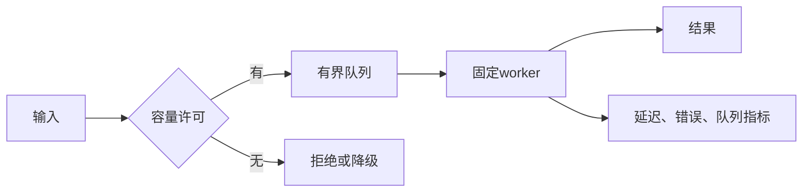

# Lock、Deadlock、OOM、CPU 密集与 I/O 密集

锁约束共享状态的并发访问；死锁描述系统无法推进的等待环；OOM 是内存分配无法在当前资源边界内完成；CPU/I/O 密集分类帮助选择并发上限，而不是给任务贴永久标签。

## 1. 共享状态与临界区

多个执行流并发读写同一状态时，正确结果取决于操作是否原子、内存可见性和允许的交错。`counter++` 通常是读—改—写复合操作，不因语句短就原子。

锁建立 mutual exclusion，并通过语言/平台定义的同步关系让写入对后续持锁者可见。锁保护的是不变量，不是变量名字。应写明“余额与流水总额在 `account.mu` 下共同变化”，而不是泛称“这个 map 有锁”。


整个序列必须在同一同步协议下完成；只给单字段 getter 加锁不能保护跨字段业务约束。

## 2. Mutex、RW lock、atomic 与 channel

| 机制 | 适用 | 边界 |
|---|---|---|
| mutex | 短临界区和复合不变量 | 持锁阻塞会传播；不能跨进程 |
| RW lock | 读多、写少且临界区足够有成本 | 读者管理有开销；写者公平依实现，需基准 |
| atomic | 计数、指针或明确无锁算法 | 单字段原子不自动保护复合不变量；内存顺序需理解 |
| channel/队列 | 转移数据所有权、协调任务 | 队列也需容量、取消与关闭协议 |
| 数据库事务 | 持久数据的原子性和隔离 | 不是分布式外部副作用事务；有锁与冲突成本 |

选择最简单能证明正确的方案。不要因为“读多”默认使用 RW lock，也不要把所有共享状态改成 atomics 后宣称无锁正确。

## 3. 锁的使用规则

1. 固定每个不变量由哪个锁保护，并在代码附近记录。
2. 临界区只做必要内存操作；不持锁执行无截止时间的网络、磁盘、channel send 或未知回调。
3. 所有返回和 panic/异常路径都释放锁；使用语言的结构化清理。
4. 若需多个锁，建立全局锁顺序，并通过封装减少调用者自行组合。
5. 复制快照后解锁执行慢操作；提交时用版本号重新验证，避免基于过期状态覆盖。

锁超时不是自动安全恢复。若线程获取 A、修改一半后等待 B 超时，释放 A 之前仍必须恢复不变量。

## 4. Deadlock

经典死锁通常同时满足互斥、持有并等待、不可抢占、循环等待。破坏其中一个可避免该类死锁，常见方法是固定锁顺序、一次申请所需资源、消息传递或 try-lock 后完整回滚。


没有 mutex 也会死锁：无缓冲 channel 互等、wait group 计数永不归零、线程池任务等待同池中的子任务、pipe 两端互等都可能无法推进。

活锁是任务持续改变状态却无进展；饥饿是某任务长期得不到资源。它们与“所有参与者静止”的典型死锁不同，指标与修复也不同。

## 5. 诊断锁与死锁

症状是吞吐归零或部分请求长期等待，CPU 可能很低。先采集语言运行时 stack、mutex/block profile 和 trace，再看内核 futex/wchan。

Go 常用：

```sh
go test -race ./...
go test -run TestTransfer -count=1000 ./...
go tool pprof -top mutex.pprof
go tool pprof -top block.pprof
```

race detector 发现运行时发生的数据竞争，不证明不存在 race，也不专门证明死锁。mutex profile 采样锁竞争，block profile 包含 channel、select 等阻塞；采样有开销，生产开启比例需评估。goroutine dump 可能包含参数和用户数据，应限制访问。

## 6. OOM 的不同边界

应用分配失败、进程地址空间限制、cgroup OOM 和全系统 OOM 是不同事件。Linux 可 overcommit 虚拟内存，`malloc` 成功不保证未来触碰每页都能满足物理资源。

内存紧张时内核回收 page cache、写回脏页、swap 匿名页；无法在允许边界内满足分配时可能触发 OOM。全局 OOM killer 根据 badness 等因素选择任务；cgroup OOM 通常限制在该 cgroup 层级。

```sh
journalctl -k --since '-1 hour' --no-pager | grep -Ei -- 'out of memory|oom-kill|killed process'
cat /sys/fs/cgroup/memory.current
cat /sys/fs/cgroup/memory.max
cat /sys/fs/cgroup/memory.events
cat "/proc/$PID/oom_score"
cat "/proc/$PID/oom_score_adj"
```

`oom_score_adj` 范围 -1000 到 1000，降低需要权限。不要随意把业务进程设为 -1000；系统仍需一个可终止对象，保护所有服务会把故障扩大。systemd 的 `OOMScoreAdjust` 和 `ManagedOOM*` 也应结合系统策略设计。

## 7. 防止内存耗尽

- 所有队列、缓存、批次、并发请求和单请求 body 都设置上限。
- 在入口拒绝超限输入，不在读完后才判断。
- 以 workload 测出每并发内存，给运行时、内核、sidecar 和峰值留余量。
- 暴露队列深度、拒绝数、heap/GC、cgroup current/events，而非只看 RSS。
- 过载时做有界降级、背压或快速失败，不能无限排队。
- 内存增长先按 anon/file/kernel 和运行时/native 分类，再决定修复。

提高内存限制可能是紧急缓解，但必须确认节点容量和其他 workload；它不能修复无界增长。

## 8. CPU 密集与 I/O 密集

CPU 密集任务的大部分壁钟时间在计算，如压缩、图像处理、加密、复杂解析。I/O 密集任务大部分时间等待网络、磁盘或外部服务。一个请求可在不同阶段切换分类，例如先下载、再解压、再写库。

CPU 工作的有效并行度受可用核、cpuset、CPU quota、算法和内存带宽限制。超过可用并行度的 worker 通常只增加排队与切换。I/O 工作可用更多并发覆盖等待，但上限由 fd、连接池、内存、下游容量和 deadline 决定。

Little's Law 在稳定系统中给出平均并发 `L = λW`。每秒 100 请求、平均在途 0.2 秒，平均并发约 20；它不直接给 p99 或安全池大小，突发、分布和下游限制仍需压测。

## 9. Worker pool 与背压

有界 worker pool 应明确：队列容量、worker 数、入队超时、任务 deadline、取消传播、panic/错误处理、关闭时 drain/abort 语义和指标。



无限 goroutine/线程不是弹性；只是把过载转成内存、调度和下游连接故障。队列延长等待，若 deadline 在队列中已耗尽，worker 应在执行前检查取消。

## 10. 完整案例：转账锁死并引发队列 OOM

### 输入

- `Transfer(a,b)` 先锁 a 再锁 b；并发反向转账可能反序加锁。
- 请求等待没有 deadline，入口队列无界。
- 压测后吞吐为零，内存持续增长，最终 cgroup `oom_kill` 增加。

### 步骤

1. 保存 goroutine dump，发现一组持 A 等 B，另一组持 B 等 A。
2. mutex/block profile 与测试复现支持循环等待结论。
3. 按稳定账户 ID 从小到大加锁，禁止调用者自行决定顺序；同账户转账单独拒绝。
4. 在锁内只验证余额并修改两个账户，不调用网络；审计事件写入事务性 outbox。
5. 入口增加并发 semaphore 和有界队列；排队超过 100 ms 返回过载错误。
6. 每请求传播 deadline，执行前检查是否过期。

### 输出

反向并发转账不再死锁；账户总额不变量保持；过载时队列稳定在上限并产生可观察拒绝，而不是内存增长。

### 验证

用 1000 轮随机反向转账运行 race detector 和不变量测试；故意把锁顺序改回旧实现，测试应在超时内检测停滞。以超过容量的负载验证 queue depth、有界内存、拒绝状态与恢复。

### 失败分支

若固定顺序后仍停滞，检查持锁 I/O、channel、数据库锁和 worker 自依赖。若没有 OOM kill 但延迟增长，可能正在队列积压或内存回收；检查 queue wait 和 memory pressure。不要用自动重启掩盖不变量破坏。

## 11. 常见错误

- 锁住单个字段，却在锁外检查跨字段条件。
- 持锁调用远程服务，把下游延迟放大成全局等待。
- 以 try-lock 超时宣告安全，却没有回滚部分修改。
- 把数据 race、deadlock、livelock、starvation 当同一个问题。
- 只看宿主 free，漏掉 cgroup OOM。
- 按“任务是 I/O 密集”设置无限并发，不测连接池和内存。

## 12. 练习与完成标准

1. 构造双锁反序测试并用超时检测，再用稳定顺序修复。
2. 为 CPU 批处理与 HTTP 抓取各设计 worker pool，写出不同容量约束。
3. 对一个容器记录 memory.current/max/events 与运行时 heap，解释差额。
4. 完成标准：race 测试、死锁失败注入、不变量断言、过载有界和 OOM 证据链全部可复现。

## 来源

- [Linux Kernel：Out Of Memory Handling](https://docs.kernel.org/mm/oom.html)（访问日期：2026-07-17）
- [Linux Kernel：cgroup v2 memory controller](https://docs.kernel.org/admin-guide/cgroup-v2.html#memory)（访问日期：2026-07-17）
- [Linux Kernel：proc OOM score](https://docs.kernel.org/filesystems/proc.html#proc-pid-oom-score-adj-set-the-oom-killer-score-adjustment)（访问日期：2026-07-17）
- [Go Race Detector](https://go.dev/doc/articles/race_detector)（访问日期：2026-07-17）
- [Go diagnostics](https://go.dev/doc/diagnostics)（访问日期：2026-07-17）
