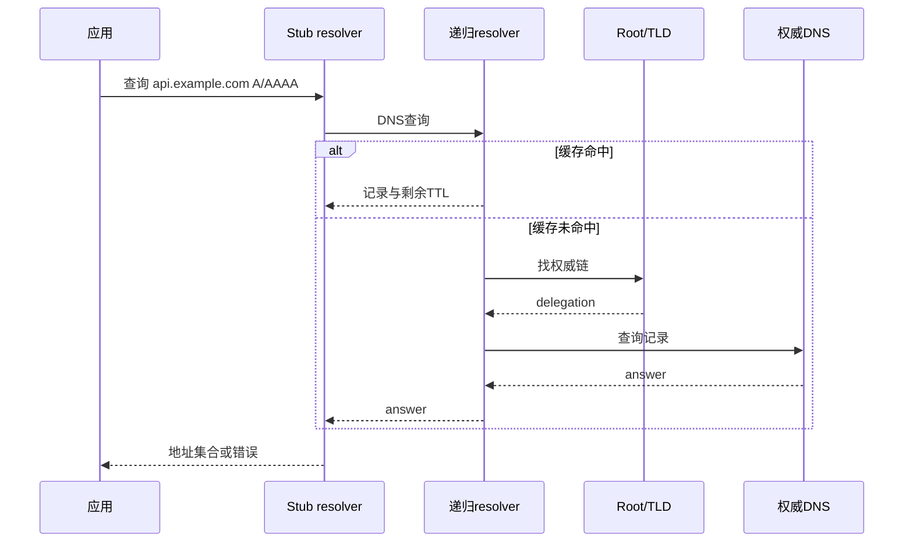
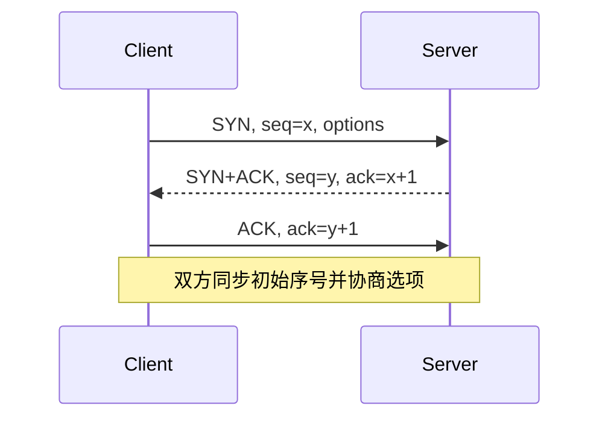

# DNS、TCP 握手、重传、滑动窗口与拥塞控制

DNS 把名称解析为记录；TCP 在两个 socket 之间提供可靠、有序、无消息边界的字节流，并同时受接收方容量与网络拥塞反馈约束。

## 1. DNS 名称与记录

域名由 label 组成，从右向左形成层级；完全限定名可用末尾根点表示。DNS 查询返回资源记录，不只返回 IP。

| 类型 | 内容 | 使用边界 |
|---|---|---|
| `A` | IPv4 地址 | 一个名称可有多个地址，顺序不等于固定主备 |
| `AAAA` | IPv6 地址 | 客户端需有可用 IPv6 路径 |
| `CNAME` | 别名指向规范名称 | 解析需继续；zone apex 使用受标准约束 |
| `MX` | 邮件交换及 preference | 不是普通 HTTP 服务发现 |
| `TXT` | 文本片段 | 常用于验证/策略，应用需按协议解析 |
| `NS` | zone 的权威服务器 | delegation 与缓存有独立行为 |
| `SOA` | zone 元数据 | 包含负缓存相关 TTL 字段 |
| `SRV` | 服务、协议、端口、priority/weight | 客户端必须明确实现 SRV 发现 |

TTL 是记录可缓存的秒数，不是“变更会在 TTL 后全球同时完成”。递归 resolver、客户端、应用、连接池和 CDN 各有缓存/连接状态；已有 TCP 连接不会因 DNS 记录改变自动迁移。

NXDOMAIN 表示查询名称不存在；NOERROR 且无所求类型记录是 NODATA 语义。负结果也可缓存。SERVFAIL 表示解析失败，不应当长期当不存在缓存。

## 2. 解析链路与验证

stub resolver 通常把查询交给递归 resolver；递归 resolver 从缓存回答，或沿 root、TLD、权威服务器查询。实际系统还受 `/etc/hosts`、NSS、systemd-resolved、VPN、split-horizon DNS 和容器配置影响。



```sh
getent ahosts api.example.com
dig api.example.com A
dig api.example.com AAAA
dig +trace api.example.com
resolvectl query api.example.com
```

`getent` 更接近 Linux 应用使用的 NSS 结果；`dig` 直接查询 DNS，不读取 `/etc/hosts` 的完整合并行为。`+trace` 从根迭代查询，可能绕开本地 split DNS，不等于应用实际路径。macOS 用 `dscacheutil -q host -a name NAME`、`scutil --dns`，`dig` 也不代表系统缓存全集。

## 3. TCP 连接标识与三次握手

TCP 连接由本地 IP/端口与远端 IP/端口以及协议上下文标识。服务器监听 socket 接收新连接；内核为已建立连接创建独立 socket 状态。



握手不是“验证应用可用”：它证明两端 TCP 栈能交换段并分配状态。TLS 和 HTTP 仍可能随后失败。SYN 可重传；监听 backlog、SYN cookies、防火墙和路径丢包会影响行为。

TCP Fast Open 等扩展可改变数据发送时机，不应把示意图当所有实现每个包的固定轨迹。

## 4. 字节流、序号与确认

TCP 给应用连续字节流，没有消息边界。一次 `write(100)` 可被分段，一次 `read` 可返回 1–100 或拼接多次 write 的数据。应用协议必须用长度、分隔符或自描述格式 framing，并限制最大消息。

序号标识字节位置；ACK 通常是累计确认，表示下一个期望字节。接收端可暂存乱序段，但具体缓存与 SACK 行为依实现/协商。重复数据由序号识别，不直接交付应用两次。

TCP 可靠表示尽力在连接存续时按序交付或报告连接失败，不表示业务操作 exactly-once。客户端超时前请求可能已被服务端执行；写操作重试需要幂等键或查询状态。

## 5. RTT、RTO 与重传

发送端根据 RTT 样本估算 retransmission timeout；RFC 6298 规定平滑 RTT、变化量与指数退避的基础算法。RTO 到期会重传未确认数据，并对连续超时退避。

SACK 允许接收端告知已收到的非连续块，帮助发送端只补缺口。快速重传可根据重复 ACK 等反馈在 RTO 前推断丢失，但具体算法和阈值有扩展演进。RACK 等现代实现机制不是 TCP 基础语义的固定唯一算法。

重传可能来自真实丢包、乱序、接收端延迟 ACK、路径 MTU 问题或抓包观察点遗漏。看到重传计数必须结合 RTT、吞吐、方向、接口 drop 和两端抓包。

## 6. 滑动窗口与接收流量控制

接收端通过 advertised receive window 告诉发送端从 ACK 起还能接收多少字节，防止发送快于接收缓冲。Window Scale 选项在握手中协商，使 16 位 window 字段可表示更大窗口；建立后缩放因子不随每包改变。

接收窗口为零时，发送端停止普通新数据，并用 persist 机制探测窗口重新开放，避免窗口更新丢失造成永久停滞。zero-window 常说明接收应用读取不及时、CPU/GC/锁停顿或缓冲策略，不等于网络拥塞。

带宽时延积 `BDP = bandwidth × RTT` 表示路径中维持满吞吐所需在途数据量。例如 100 Mbit/s、RTT 80 ms：

```text
100,000,000 bit/s × 0.08 s ÷ 8 = 1,000,000 byte，约 1 MB
```

窗口和缓冲显著小于 BDP 可能限制单连接吞吐，但扩大缓冲会增加内存与排队延迟；Linux autotuning 会动态调整，先测量再改 sysctl。

## 7. 拥塞窗口与拥塞控制

接收窗口保护接收方；congestion window（cwnd）限制发送端向网络注入的未确认数据。实际可发送量受 `min(rwnd, cwnd)` 以及当前在途数据约束。

基本算法包含 slow start、congestion avoidance 和对丢失/ECN 的响应。slow start 让 cwnd 较快增长以探测容量；congestion avoidance 更保守；检测拥塞后降低发送速率。名称“slow”不表示线性慢速。

Linux 可支持 CUBIC、BBR 等不同拥塞控制算法；IETF TCP 规范要求拥塞控制但不规定所有系统只能使用同一算法。算法选择影响公平、队列、吞吐与路径适应，不能只按峰值吞吐决定。

```sh
sysctl net.ipv4.tcp_available_congestion_control
sysctl net.ipv4.tcp_congestion_control
ss -tin dst 192.0.2.10
```

只读 `sysctl` 安全；不要在生产直接 `sysctl -w`。`ss -i` 常见 `cubic`、`rtt`、`cwnd`、`retrans` 等，但字段单位和可用性应以当前 iproute2 文档/输出为准。

## 8. 连接关闭、RST 与 half-close

FIN 表示发送方不再发送数据，但仍可接收，形成 half-close。双方分别关闭发送方向后连接有序结束。RST 表示连接被中止或不存在匹配状态，未交付数据可能丢失。

应用读到 EOF 表示对端发送方向关闭，不等于本地待发送响应已完成。协议必须定义谁先关闭、是否读完响应、超时如何处理。进程崩溃、对未监听端口连接或向已关闭 socket 发送都可能产生 RST，需结合抓包和应用事件判断。

## 9. PMTU、MSS 与分段

MSS 是 TCP 选项，表示接收方愿意接受的 TCP payload 单段上限，通常基于接口 MTU 减去 IP/TCP header；它不是应用消息最大值。Path MTU Discovery 避免生成路径无法转发的 IP 包。

ICMP 过滤或隧道开销变化可能造成 PMTU black hole：握手和小包成功，大响应停滞。诊断应比较小/大传输、MSS、路径和 ICMP/PLPMTUD 行为，不要把应用 body size 等同 MTU。

## 10. 安全抓包与观察

```sh
ss -tin '( dport = :443 or sport = :443 )'
sudo tcpdump -ni any -c 200 -s 128 'host 192.0.2.10 and tcp port 443' -w /tmp/lili-tcp.pcap
```

抓包需管理员授权；`-c` 限包数，`-s 128` 限制 snaplen，但 header、地址和部分 payload 仍可能敏感。文件设 `0600`，分析后按保留策略删除。容器 `any` 观察点、offload 和命名空间会影响看到的分段/校验和。

## 11. 完整案例：小响应正常，大响应超时

### 输入

- DNS 稳定，TCP/TLS 握手成功。
- 1 KiB 响应正常，500 KiB 响应经 VPN 超时。
- 服务端应用已快速生成全部响应，CPU 和接收窗口正常。

### 步骤

1. 用相同主机、协议和连接条件只改变响应大小，稳定复现阈值。
2. curl 分段计时显示 connect/TLS 快，下载阶段停滞。
3. 两端受控抓包发现服务端发送较大段后重复重传，客户端未确认；小段可达。
4. 比较 VPN 前后 MTU 与 TCP MSS；发现隧道降低路径 MTU，中间设备又丢弃必要 ICMP。
5. 在网络边界修复 MTU/MSS/ICMP 策略，并保留标准 PMTUD 能力；不修改应用重试次数掩盖。

### 输出与验证

500 KiB 与更大边界样本稳定完成，重传恢复基线。分别测试 IPv4/IPv6、直连/VPN、小/大 body，并持续观察下载时长与 retrans。

### 失败分支

若抓包显示接收窗口归零，应查客户端读取、GC、锁和 buffer，而非 MTU。若 cwnd 降低且多流都有丢包，检查拥塞/队列和链路质量。若只有名称失败，回到应用实际 resolver，区分 NXDOMAIN、SERVFAIL、超时和地址族。

## 12. 常见错误

- 把 `dig +trace` 成功当应用 DNS 一定成功。
- 把 TTL 当所有缓存和已有连接的强制失效时刻。
- 认为一次 write 对应一个 TCP 包或一次 read。
- 把可靠字节流当业务 exactly-once。
- 混淆 receive window 与 congestion window。
- 看到重传就判定物理丢包，不检查乱序、观察点和 PMTU。
- 为提升吞吐直接修改系统 TCP 参数，没有基准和回滚。

## 13. 练习与完成标准

1. 查询一个名称的 A、AAAA、CNAME 与 TTL，比较 `getent` 和 `dig` 的边界。
2. 用 socket 本地发送不同 write 分片，证明接收 read 边界不稳定，并实现长度前缀。
3. 计算三组带宽/RTT 的 BDP，说明 buffer、rwnd 与 cwnd 各自限制。
4. 完成标准：能用 DNS结果、握手、`ss -i`、分段计时和受控抓包区分解析、接收方限制、拥塞、重传和应用等待。

## 来源

- [RFC 1034：Domain Names—Concepts and Facilities](https://www.rfc-editor.org/rfc/rfc1034.html)（访问日期：2026-07-17）
- [RFC 9293：Transmission Control Protocol](https://www.rfc-editor.org/rfc/rfc9293.html)（访问日期：2026-07-17）
- [RFC 6298：Computing TCP's Retransmission Timer](https://www.rfc-editor.org/rfc/rfc6298.html)（访问日期：2026-07-17）
- [RFC 5681：TCP Congestion Control](https://www.rfc-editor.org/rfc/rfc5681.html)（访问日期：2026-07-17）
- [Linux man-pages：tcp(7)、ss(8)](https://man7.org/linux/man-pages/man7/tcp.7.html)（访问日期：2026-07-17）
