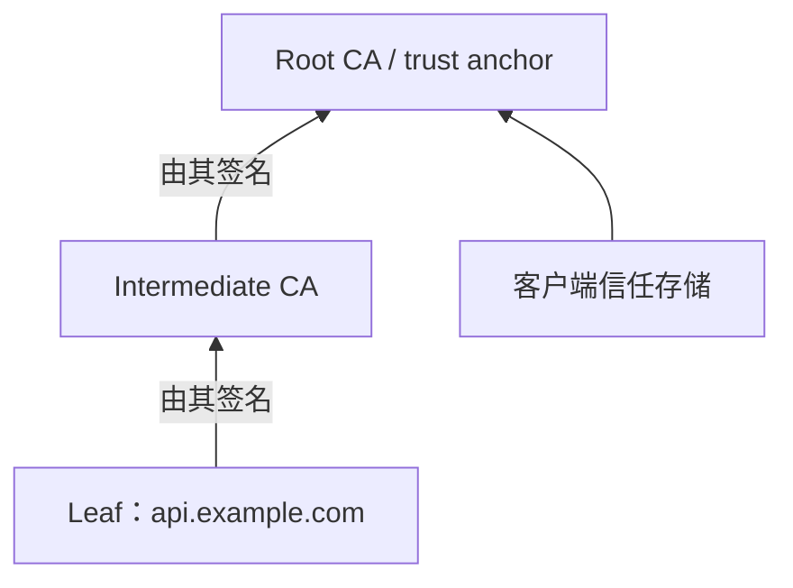
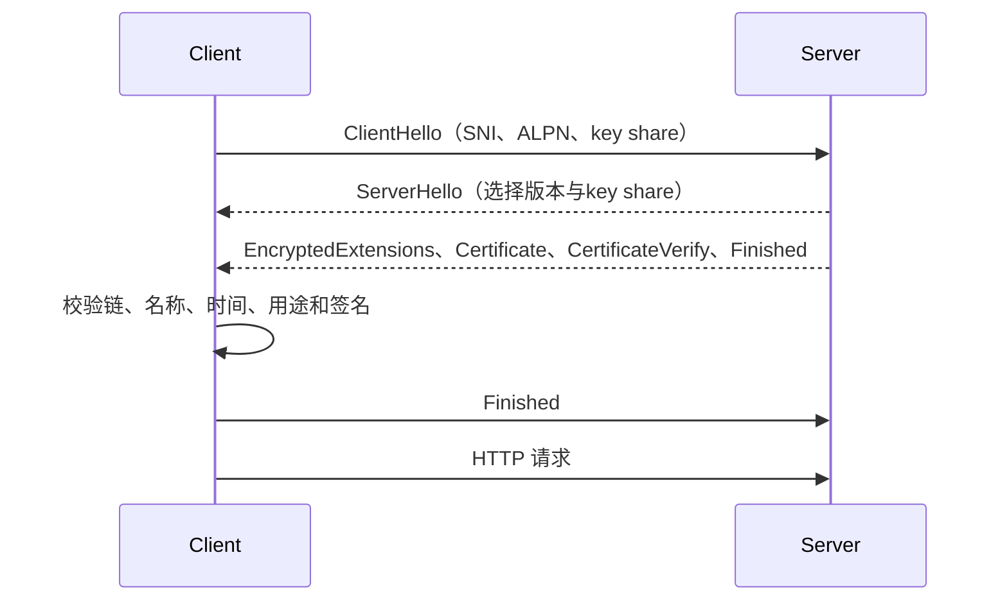

# TLS、证书与 HTTPS

TLS 为连接提供机密性、完整性和对端身份认证；X.509 证书把公钥与名称等身份声明绑定；HTTPS 是在 TLS 保护下传输 HTTP 语义。

## 1. TLS 能保证什么

- 机密性：没有会话密钥的路径观察者不能直接读取应用明文。
- 完整性：篡改受保护记录会被检测，连接失败而不是静默交付修改内容。
- 身份认证：客户端按信任链和期望主机名验证服务端；是否认证客户端取决于是否使用 mTLS。

TLS 不证明应用无漏洞、不验证响应业务正确、不隐藏所有元数据，也不阻止已获应用权限的服务读取明文。IP、端口、流量大小与时序通常仍可见；TLS 1.3 的普通 SNI 也可被路径观察，除非使用并成功协商 ECH 等独立机制。

## 2. 证书的关键字段

X.509 证书是由 issuer 签名的结构化对象。实际验证关注：

| 字段/扩展 | 作用 | 失败边界 |
|---|---|---|
| Subject | 被签发实体信息 | 现代 TLS 主机名验证以 SAN 为准，不依赖 Common Name 回退 |
| Issuer | 签发者名称 | 名称相同不等于可信，仍需验证签名和链 |
| Serial Number | issuer 范围内唯一标识 | 常用于吊销信息 |
| Validity | `notBefore` 到 `notAfter` | 本机时间错误、尚未生效、过期都会失败 |
| Subject Alternative Name | 允许的 DNS 名/IP 等身份 | URL 用 DNS 名时匹配 dNSName；用 IP literal 时需 iPAddress SAN |
| Basic Constraints | 是否 CA、path length | 终端证书不能被当 CA 签发下级 |
| Key Usage | 密钥可做数字签名、证书签名等 | 与实际用途不符会失败 |
| Extended Key Usage | serverAuth/clientAuth 等应用用途 | 服务端和客户端用途不可任意互换 |
| Authority/Subject Key Identifier | 帮助构建链 | 不是单独的信任证明 |
| Signature Algorithm | issuer 对证书的签名算法 | 禁用算法或签名不匹配会失败 |

通配符如 `*.example.com` 只匹配一个左侧 label，例如可匹配 `api.example.com`，不匹配 `a.b.example.com` 或裸 `example.com`。国际化域名按规范化后的 A-label 等规则处理，应用不要自行用字符串后缀代替证书验证库。

## 3. 信任链与 trust anchor

服务器通常发送 leaf 和必要 intermediate，不必发送 root。客户端从 leaf 校验签名、约束、用途和时间，构建到本地信任存储中的 trust anchor。客户端信任 root 是本地策略，不是因为服务器把 root 发来。



服务器漏发 intermediate 时，有些客户端因历史缓存或 AIA 获取仍成功，干净客户端会失败；部署必须用不依赖偶然缓存的客户端验证完整链。交叉签名可能形成多条可构建路径，最终选择受客户端信任库和验证实现影响。

私有 CA 只有在客户端显式安装相应 trust anchor 后才可信。把私有 root 加入系统全局信任会影响整台机器，优先使用应用专用 trust store 并限制用途。

## 4. 主机名验证

连接 `https://api.example.com` 时，客户端验证证书是否授权 `api.example.com`。DNS 解析到哪个 IP 与证书名称验证是两个步骤：DNS 成功不表示证书匹配；用 `--resolve` 改 IP 仍保留 URL 主机名、SNI 和验证名。

```sh
curl --resolve api.example.com:443:192.0.2.10 \
  --connect-timeout 3 --max-time 10 \
  https://api.example.com/health
```

不要用 `https://192.0.2.10` 测试一个只含 DNS SAN 的证书，也不要通过 `curl -k`/`--insecure` 修复。`-k` 同时放弃关键身份认证，使中间人证书也可被接受。

## 5. TLS 1.3 握手

客户端发送 ClientHello，包括支持版本、cipher suites、key share、SNI、ALPN 等；服务端选择参数并返回 ServerHello，双方导出握手密钥；服务端发送加密的证书与 CertificateVerify、Finished；客户端验证后发送 Finished。TLS 1.3 密钥交换通常提供 forward secrecy。



SNI 帮助一个 IP 上选择证书；ALPN 协商 `h2`、`http/1.1` 等应用协议。两者目的不同。TLS cipher suite 在 1.3 中主要选择 AEAD 与 hash，证书签名算法另行协商。

## 6. 会话恢复与 0-RTT

TLS 1.3 可用 PSK/session ticket 恢复，减少握手成本。0-RTT early data 可在握手完成前发送，但不具有普通握手同等级别的重放保护；网络中的攻击者可能让服务端重复接收 early data。

只有可安全重放、无副作用且服务端显式设计的操作才能接受 0-RTT。支付、创建订单、修改密码等不能仅凭 HTTP 方法名假设安全。服务端可拒绝 early data，客户端需能正常重发握手后的请求。

## 7. 证书吊销的现实边界

证书可能在到期前因私钥泄漏或误签被撤销。CRL 发布列表；OCSP 查询单证书状态；OCSP stapling 允许服务器携带 CA 签名的状态响应，减少客户端查询隐私和可用性问题。

吊销检查不是所有 TLS 客户端都严格 hard-fail：网络不可达、隐私、性能和可用性使实现策略不同。短生命周期证书能缩短暴露窗口，但不能替代私钥保护、轮换和事件响应。必须以实际客户端栈验证吊销策略，不能在正文或监控中假设“已吊销必然所有连接立刻失败”。

## 8. OpenSSL 验证

以下命令只读取公开握手信息，不发送应用凭据：

```sh
openssl s_client \
  -connect example.com:443 \
  -servername example.com \
  -verify_hostname example.com \
  -verify_return_error \
  -showcerts </dev/null
```

重点检查最后 `Verification: OK`/verify return code、协商版本、cipher、ALPN、leaf SAN、有效期和服务器发送链。只看到 `CONNECTED` 不表示验证成功。`s_client` 是诊断工具，不等于浏览器完整策略。

保存 leaf 后可检查：

```sh
openssl x509 -in leaf.pem -noout \
  -subject -issuer -serial -dates -ext subjectAltName \
  -ext basicConstraints -ext keyUsage -ext extendedKeyUsage
```

`openssl verify -CAfile roots.pem -untrusted intermediates.pem -verify_hostname api.example.com leaf.pem` 用显式文件验证。不要把从不可信连接下载的 leaf/intermediate 临时加入 root trust 来“通过”。私钥永远不应交给 `x509` 检查或贴进日志。

## 9. 时间与续期

证书验证依赖客户端当前时间。NTP 故障、休眠恢复、虚拟机时钟漂移会造成“尚未生效/已过期”。监控至少覆盖 leaf 剩余有效期、自动续期任务结果、实际入口当前提供的 serial/fingerprint、各地域握手成功。

续期成功不代表服务已加载新证书。可能更新了磁盘文件但代理未 reload，或多实例只更新部分。验证应从客户端连接每个入口/实例确认实际 leaf，而不是只查看证书文件。

私钥权限应限制到 TLS 终止进程；更好的系统使用密钥服务/HSM 或不可导出密钥。轮换必须有旧新并存窗口、回滚、权限和部署验证。

## 10. mTLS

mTLS 中服务端请求客户端证书并验证到受信 client CA，同时客户端仍验证服务端。证书身份应映射为明确授权主体；“证书有效”不自动有调用所有 API 的权限。

代理终止 mTLS 后向上游传递身份时，应用只能信任受控代理建立的、不可由外部直接注入的通道/header。若后端可被绕过直连，攻击者可伪造身份 header。需要网络隔离、header 清洗和已认证的代理—后端连接。

## 11. HTTPS 的边界

HTTPS 保护 TLS 端点之间的数据。如果 TLS 在负载均衡器终止，负载均衡器可见明文；到后端可使用受控私网明文、重新加密或 mTLS，选择取决于威胁模型与运维成本。

混合内容、Cookie `Secure`、HSTS、CSP、认证与 CSRF 属于 Web 安全的其他层。HSTS 告诉浏览器在有效期内只用 HTTPS，并不修复无效证书；首次访问和预加载另有边界。

## 12. 完整案例：部分客户端证书验证失败

### 输入

- 浏览器管理员机器正常，干净容器和部分移动客户端报 `unable to get local issuer certificate`。
- leaf 主机名与时间有效。
- 服务器只发送 leaf，管理员机器曾访问同 CA 站点。

### 步骤

1. 用干净 trust 环境的 `openssl s_client -showcerts -verify_return_error` 重现。
2. 检查服务端 Certificate 消息，确认缺少 intermediate。
3. 独立取得 CA 发布的正确 intermediate，验证其 subject/issuer、Basic Constraints 和签名链。
4. 配置服务端发送 leaf + intermediate，避免发送无关证书和把 root 当必需链。
5. reload 后从每个入口重新握手，比较实际 serial 与链。
6. 同时用 `-verify_hostname` 测正确名称和故意错误名称。

### 输出与验证

干净容器、移动客户端和浏览器都能构建到各自 trust anchor；正确主机名通过，错误主机名失败。续期监控同时检查链完整性与实际入口证书。

### 失败分支

若链完整仍失败，按顺序检查客户端是否信任 root、时间、SAN、EKU、算法策略和代理是否替换证书。若公司代理使用私有 CA，只应在受控设备安装该 CA，不能要求公共客户端信任。不可用 `-k` 作为健康检查，因为它会把身份错误报告为成功。

## 13. 常见错误

- 把加密等同身份验证，或把有效证书等同应用授权。
- 只检查过期日期，不检查 SAN、用途、链和实际部署证书。
- 服务器漏发 intermediate，却因本机缓存成功而上线。
- 用 IP 访问 DNS 证书，再通过关闭验证“修复”。
- 认为吊销在所有客户端上都会立即 hard-fail。
- 对有副作用请求启用 0-RTT，却没有重放防护。
- 私钥放入镜像、命令行、日志或宽权限共享卷。

## 14. 练习与完成标准

1. 对测试域名输出 leaf SAN、时间、EKU、链和 ALPN，解释每项失败表现。
2. 用 `--resolve` 将域名指向测试 IP，验证正确域名与错误域名分支。
3. 设计证书续期验收：文件更新、服务 reload、每入口实际 serial、链与剩余期。
4. 完成标准：不关闭验证；能区分 DNS、TCP、TLS 链、主机名、时间、应用协议与授权失败。

## 来源

- [RFC 8446：TLS 1.3](https://www.rfc-editor.org/rfc/rfc8446.html)（访问日期：2026-07-17）
- [RFC 9525：Service Identity in TLS](https://www.rfc-editor.org/rfc/rfc9525.html)（访问日期：2026-07-17）
- [RFC 5280：Internet X.509 PKI Certificate and CRL Profile](https://www.rfc-editor.org/rfc/rfc5280.html)（访问日期：2026-07-17）
- [OpenSSL s_client](https://docs.openssl.org/master/man1/openssl-s_client/)（访问日期：2026-07-17）
- [MDN：Transport Layer Security](https://developer.mozilla.org/en-US/docs/Web/Security/Transport_Layer_Security)（访问日期：2026-07-17）
