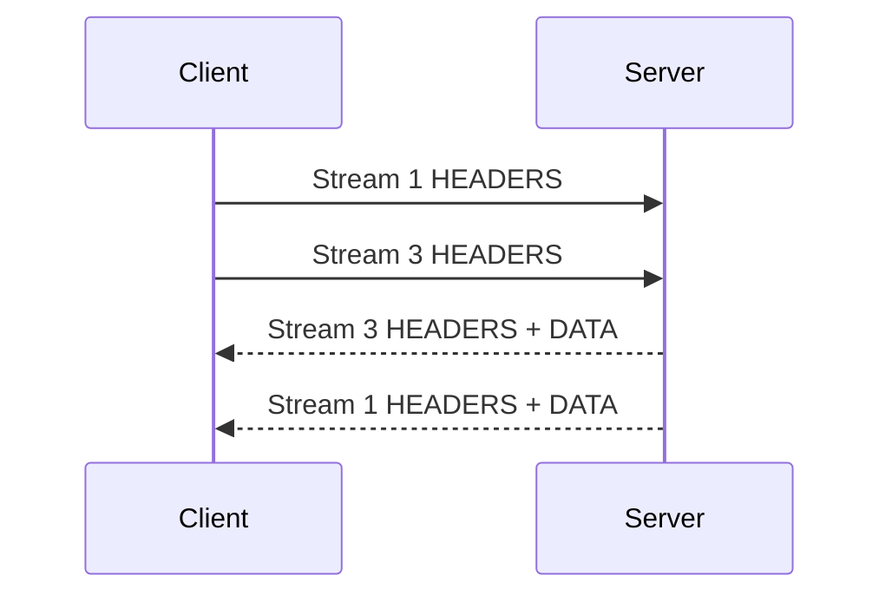

# HTTP/1.1、HTTP/2、HTTP/3、Keepalive 与 Connection Pool

HTTP 版本规定消息如何在连接上传输；持久连接与连接池决定应用如何复用传输资源。方法、状态码和字段语义与具体版本的 framing 需要分开理解。

## 1. HTTP 语义与消息 framing

HTTP 请求包含方法、目标、字段和可选内容；响应包含状态、字段和可选内容。`GET` 的安全语义、`PUT`/`DELETE` 的幂等语义、缓存条件等由 HTTP Semantics 定义，切换 HTTP/2 或 HTTP/3 不会改变业务语义。

framing 负责在连接中划分消息：HTTP/1.1 用起始行、字段和 Content-Length/chunked 等；HTTP/2 用二进制 frame 和 stream；HTTP/3 把 HTTP frame 映射到 QUIC stream。不要把 HTTP/2 二进制 framing 误称为应用 body 自动变成二进制格式；JSON 仍是 JSON 字节。

## 2. HTTP/1.1

HTTP/1.1 通常在 TCP 上按文本形式发送 start-line 和 header fields，body 是任意 octets。连接默认可持久使用；`Connection: close` 表示本消息后关闭。消息长度必须按 RFC 9112 优先级确定，错误的 Content-Length/Transfer-Encoding 处理会造成请求走私。

```http
GET /orders/42 HTTP/1.1
Host: api.example.com
Accept: application/json
Connection: keep-alive

```

`Host` 在 HTTP/1.1 请求中用于选择目标资源/虚拟主机。逐跳字段如 `Connection`、`Keep-Alive`、`Transfer-Encoding` 只适用于相邻连接，代理不得像端到端字段一样盲目转发。

HTTP/1.1 可 pipelining，但响应必须按请求顺序返回，部署支持和中间件行为复杂，现代客户端通常通过多个连接或升级 HTTP/2 避免依赖。一个慢响应会阻挡同连接后续响应的应用层队头问题。

## 3. HTTP/2

HTTP/2 在一个 TCP 连接上建立多个双向 stream。frame 包含 stream ID；HEADERS、DATA 等 frame 可交错，多请求无需按请求顺序完成。HPACK 压缩 header fields；连接和 stream 分别有 flow control。



关键对象：

- stream 有 idle、open、half-closed、closed 等状态；`RST_STREAM` 取消单流。
- connection preface 与 SETTINGS 建立参数；设置需按规范确认生效方向。
- flow-control window 只控制 DATA，不等同 TCP 窗口或业务并发限制。
- `MAX_CONCURRENT_STREAMS` 是端点建议的并发 stream 上限，客户端需排队或开新连接策略。
- `GOAWAY` 表示连接停止接受更高 stream ID 的新流，客户端只可按已处理边界和请求可重试性迁移。

HTTP/2 解决 HTTP 层同连接顺序阻塞，但所有 stream 仍共享一个 TCP 字节流；丢失 TCP 段时其后的字节都等待重传，形成传输层队头阻塞。

## 4. HTTP/3 与 QUIC

HTTP/3 在 QUIC 上运行，QUIC 使用 UDP 承载并集成 TLS 1.3。QUIC stream 有独立可靠字节序列，一个 stream 的丢包通常不阻塞其他 stream 的应用数据。QPACK 为 header compression 设计，仍需管理跨流依赖。

QUIC 连接使用 connection ID，不只依赖四元组，可支持经验证的网络迁移。它提供独立 stream flow control 与 connection flow control。UDP 不表示不可靠：可靠性、拥塞控制和重传由 QUIC 实现。

HTTP/3 通常通过 Alt-Svc 或 HTTPS DNS record 等发现/尝试。客户端必须能在 UDP 不可用或协商失败时回退；首个请求不保证已使用 H3。0-RTT 有重放风险，与 TLS 文章相同，不能对副作用请求无条件启用。

## 5. 三个版本比较

| 维度 | HTTP/1.1 | HTTP/2 | HTTP/3 |
|---|---|---|---|
| 常用传输 | TCP，HTTPS 再加 TLS | TCP + TLS（浏览器常见） | QUIC/UDP，集成 TLS 1.3 |
| 并发 | 通常多连接；同连接顺序约束 | 单连接多 stream | 单 QUIC 连接多 stream |
| header 编码 | 文本字段 | HPACK | QPACK |
| 丢包影响 | 该 TCP 连接 | 共享 TCP 的所有 stream 可能等待 | 通常限制在丢包所属 stream，但拥塞控制仍共享 |
| 运维边界 | 广泛兼容 | 代理/stream 上限/GOAWAY | UDP、QUIC 可观测与回退 |

“HTTP/3 一定更快”不成立。收益取决于 RTT、丢包、连接恢复、CPU、实现、CDN 和是否已复用连接；低延迟稳定网络上差异可能小，QPACK/QUIC 加密也有计算成本。

## 6. HTTP keep-alive 与 TCP keepalive

HTTP 持久连接是复用一个连接发送多个请求，减少 TCP/TLS 握手、慢启动和 fd 成本。HTTP/1.1 的持久连接默认行为不等于连接无限存活；客户端、服务端、代理和 NAT 都有 idle/lifetime 上限。

TCP keepalive 是内核对长时间空闲 TCP 连接发送探测以发现失效对端，时间尺度常较长。它不检查 HTTP 应用是否健康，也不能替代请求 deadline、HTTP/2 PING 或业务心跳。二者名称相似但层级和目的不同。

## 7. 连接池的状态与参数

连接池按 scheme/authority、代理、TLS 配置等 key 管理连接。典型状态包括 dialing、active、idle、closed；HTTP/2/3 一条连接还承载多个 active stream。

| 参数 | 作用 | 过小 | 过大 |
|---|---|---|---|
| max connections per origin | 限制总连接 | 排队、无法覆盖慢请求 | fd/内存/服务端连接压力 |
| max idle | 保留可复用空闲连接 | 频繁握手 | 空闲资源、NAT/代理状态 |
| idle timeout | 空闲多久淘汰 | 复用下降 | 使用已被中间设备静默回收的连接概率增加 |
| max lifetime | 限制连接总寿命 | 额外握手 | DNS/证书/负载分布长期不更新 |
| acquire timeout | 等池容量最大时间 | 过早失败 | 排队占满请求 deadline |
| per-request deadline | 整个请求时间预算 | 太短误失败 | 太长放大资源占用 |

池必须复用为长期对象，不要每请求新建 transport/client。响应 body 需按客户端库约定读取/关闭才能复用；若 body 可能巨大，设置上限，不能为了复用无界 drain。

## 8. DNS、连接池与负载变化

DNS 只在建立新连接时影响目标选择。池中的长期连接继续指向旧 IP；扩容、故障摘除或证书更新不会自动中断。max lifetime、服务发现事件、GOAWAY/draining 和主动健康策略共同决定收敛。

强制每请求新连接会损失复用和造成 TIME_WAIT。合理做法是让连接有有界寿命，在摘流时代理发送 GOAWAY/停止新请求并等待在途完成。

## 9. 超时必须分层

- DNS timeout：名称解析预算。
- connect timeout：TCP 或 QUIC 建立预算。
- TLS handshake timeout：加密协商预算。
- response-header/TTFB timeout：等待响应头。
- body idle timeout：相邻字节无进展。
- total/request deadline：包含排队、重试与完整 body 的总预算。

只有 connect timeout 会允许服务器永久不返回。只有总 timeout 又难以定位阶段。重试必须消耗同一个总 deadline，并保留退避与尝试上限。

## 10. Go 连接池示例

```go
transport := &http.Transport{
	Proxy:                 http.ProxyFromEnvironment,
	MaxIdleConns:          100,
	MaxIdleConnsPerHost:   20,
	MaxConnsPerHost:       40,
	IdleConnTimeout:       60 * time.Second,
	TLSHandshakeTimeout:   5 * time.Second,
	ResponseHeaderTimeout: 3 * time.Second,
}
client := &http.Client{Transport: transport}

ctx, cancel := context.WithTimeout(context.Background(), 5*time.Second)
defer cancel()
req, err := http.NewRequestWithContext(ctx, http.MethodGet, url, nil)
if err != nil { return err }
resp, err := client.Do(req)
if err != nil { return err }
defer resp.Body.Close()

body, err := io.ReadAll(io.LimitReader(resp.Body, 1<<20))
if err != nil { return err }
if resp.StatusCode != http.StatusOK {
	return fmt.Errorf("unexpected status %d: %q", resp.StatusCode, body)
}
```

代码片段假定已导入 `context`、`fmt`、`io`、`net/http`、`time`。`LimitReader` 返回达到限制时不会自动报“超限”；生产要读 `limit+1` 并显式判断。`http.Client`/Transport 并发安全，应复用。代理环境变量会改变路径，诊断时记录是否生效。

## 11. 协议协商与观测

```sh
curl --http1.1 -sS -o /dev/null -w 'version=%{http_version} code=%{response_code} connect=%{time_connect} total=%{time_total}\n' https://example.com/
curl --http2 -sS -o /dev/null -w 'version=%{http_version}\n' https://example.com/
curl --http3 -sS -o /dev/null -w 'version=%{http_version}\n' https://example.com/
openssl s_client -connect example.com:443 -servername example.com -alpn 'h2,http/1.1' </dev/null
```

curl 是否支持 H2/H3 取决于构建特性，先看 `curl --version`。`--http2` 对 HTTPS 通过 ALPN 请求 H2，最终仍应读 `%{http_version}`。代理/CDN 可能客户端侧 H3、回源 H2/H1，入口版本不代表端到端统一版本。

监控应同时有连接建立率、复用率、active/idle、池等待、stream 并发、GOAWAY/reset、握手错误、每阶段延迟与请求结果。

## 12. 完整案例：每请求新建客户端导致延迟与端口压力

### 输入

- 服务每次下游调用新建 Transport，QPS 800。
- connect/TLS 时间占 p99 主要部分，客户端 TIME_WAIT 大量增长。
- 下游支持 H2，单请求本身处理约 20 ms。

### 步骤

1. 用 httptrace/指标记录 DNS、connect、TLS、got-conn 及 `reused/wasIdle`。
2. 确认几乎所有请求 `reused=false`，新连接率接近请求率。
3. 改为进程级共享 client/transport，按下游 authority 配置有界总连接与 idle。
4. 读取并关闭有界响应；给请求统一 2 秒 deadline。
5. 用相同 QPS 对比连接建立率、TLS CPU、池等待、p50/p99 与错误。
6. 故意让下游关闭空闲连接，验证客户端可丢弃 stale 连接并在 deadline 内重建。

### 输出与验证

连接建立率显著低于请求率，复用率上升，p99 和 TLS CPU 降低；active/idle 不超过上限。H1 与 H2 分别压测，避免把 H2 多 stream 结果外推到 H1。

### 失败分支

若复用后 pool wait 增长，检查 max connections/streams、慢请求和下游容量，不能无限扩大池。若出现大量 reset，比较客户端 idle timeout 与代理 timeout，并验证 body 是否正确关闭。若 DNS 切换收敛慢，设计 max lifetime/drain，不回退到每请求建连。

## 13. 常见错误

- 把 HTTP 语义变化归因于 H1/H2/H3 framing。
- 认为 H2 完全没有队头阻塞，忽略共享 TCP 丢包。
- 认为 H3 使用 UDP 就不可靠或不拥塞控制。
- 混淆 HTTP keep-alive 与 TCP keepalive。
- 每请求创建 client/transport，或 response body 不关闭。
- 只设 connect timeout，没有总 deadline 和 body 限制。
- 根据支持列表宣称实际协商版本，未观察 ALPN/最终版本。

## 14. 练习与完成标准

1. 用 curl 验证同一入口的实际 H1/H2/H3 支持和回退，记录构建能力。
2. 对共享池与每请求新建连接各运行固定负载，比较复用率、建连率、延迟和 TIME_WAIT。
3. 构造慢 header、慢 body、池等待三个故障，证明分层超时能区分。
4. 完成标准：参数有容量依据；响应有上限并关闭；重试共享 deadline；版本结论来自实际协商。

## 来源

- [RFC 9110：HTTP Semantics](https://www.rfc-editor.org/rfc/rfc9110.html)（访问日期：2026-07-17）
- [RFC 9112：HTTP/1.1](https://www.rfc-editor.org/rfc/rfc9112.html)（访问日期：2026-07-17）
- [RFC 9113：HTTP/2](https://www.rfc-editor.org/rfc/rfc9113.html)（访问日期：2026-07-17）
- [RFC 9114：HTTP/3](https://www.rfc-editor.org/rfc/rfc9114.html)（访问日期：2026-07-17）
- [Go net/http Transport](https://pkg.go.dev/net/http#Transport)（访问日期：2026-07-17）
