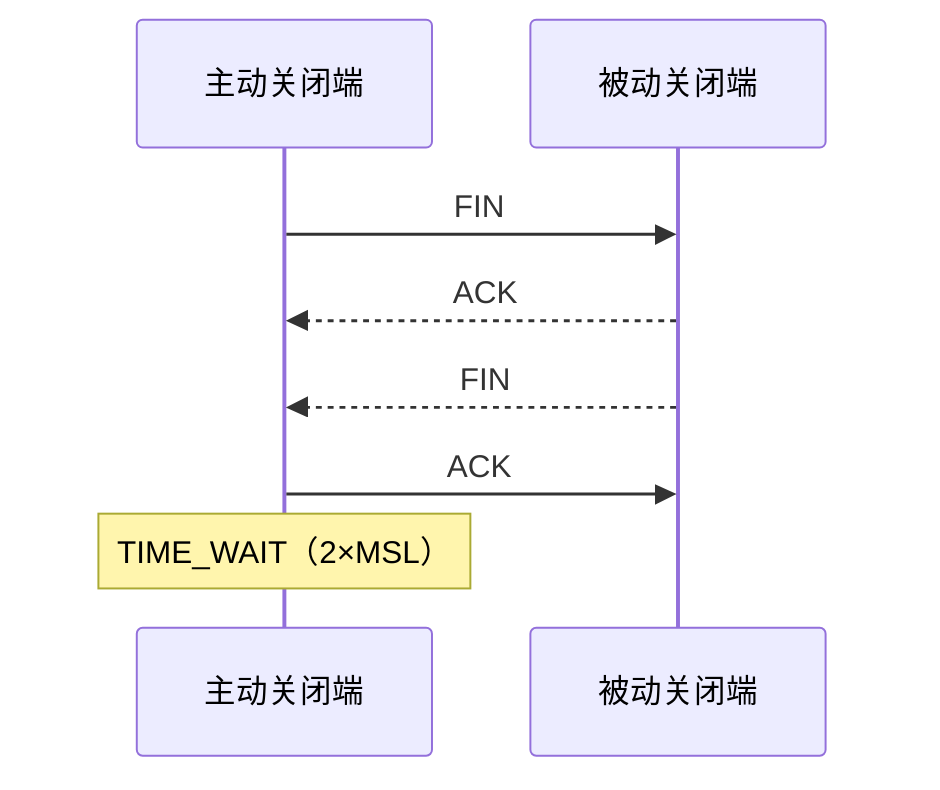

# TIME_WAIT、反向代理与 L4/L7 负载均衡

TIME_WAIT 保护 TCP 连接关闭后的可靠性；反向代理和负载均衡把客户端连接映射到后端连接，并由此承担身份、TLS、重试、健康和容量边界。

## 1. TCP 有序关闭与 TIME_WAIT

每个 TCP 方向独立用 FIN 关闭。主动执行最终 close 的一端通常在收到对端 FIN 并发送最终 ACK 后进入 TIME_WAIT，保持 2×MSL。它有两个目的：允许最终 ACK 丢失时再次响应重传 FIN；避免旧连接延迟报文污染相同四元组的新化身。



实际关闭可同时携带 ACK、双方同时关闭或由 RST 中止，状态序列会不同。TIME_WAIT 是正确协议状态，不是“socket 泄漏”的同义词。监听服务器、代理或客户端谁主动关闭，谁更可能积累 TIME_WAIT。

## 2. TIME_WAIT 的资源与端口边界

客户端新建连接需本地临时端口，四元组必须可区分。对同一目标大量短连接会消耗端口空间和 TCP 状态；多个源 IP、多个目标 IP/端口会形成不同组合。NAT/代理还可能成为共享端口瓶颈。

```sh
ss -ant state time-wait | sed -n '1,20p'
ss -ant state time-wait | wc -l
cat /proc/sys/net/ipv4/ip_local_port_range
ss -s
```

总 TIME_WAIT 数本身不能证明端口耗尽。应检查新连接错误、目标分布、建连率、端口范围、NAT 状态和连接复用。macOS 可用 `netstat -an -p tcp | grep TIME_WAIT`，sysctl 名称与 Linux 不同。

## 3. 正确处理 TIME_WAIT

优先级：

1. 修复每请求新建客户端/连接，启用正确 HTTP 持久连接和连接池。
2. 读完/关闭响应，避免连接无法复用。
3. 让代理和后端分别配置有界 keepalive，并对齐 idle timeout。
4. 计算建连率、端口和 NAT 容量；必要时扩展安全源地址/代理容量。
5. 只有理解内核版本、安全影响和回滚后才评估 sysctl。

不要依赖旧教程中的 `tcp_tw_recycle`；该机制已从 Linux 移除且会破坏 NAT 客户端。不要通过 RST/`SO_LINGER=0` 普遍跳过有序关闭，它会丢弃未交付数据并改变对端错误。

## 4. 正向与反向代理

正向代理代表客户端访问外部目标；反向代理代表服务端接收客户端流量。反向代理可终止 TLS、按主机/路径路由、限流、缓存、压缩、认证、观测和连接复用。

```mermaid
flowchart LR
    C["Client"] -->|"客户端连接"] P["Reverse proxy / Load balancer"]
    P -->|"后端连接池"] A["App A"]
    P --> B["App B"]
    P --> H["健康与容量状态"]
```

代理产生两个传输边界：客户端—代理和代理—后端。客户端 H3 不表示回源也是 H3；TLS 可在代理终止后明文回源、重新 TLS 或 mTLS。每段有独立 timeout、连接池和失败状态。

## 5. L4 与 L7 负载均衡

L4 根据 IP、端口和传输协议转发，不理解 HTTP 路径或 cookie；可做 NAT、DSR 或连接级调度。它能承载任意 TCP/UDP 协议，协议处理成本相对低，但应用级路由和状态码重试能力有限。

L7 解析 HTTP 等应用协议，可按 Host/path/header/method 路由、修改字段、终止 TLS、缓存和观测请求。代价是解析与加密成本、更大的安全边界，以及必须正确处理协议规范。

| 需求 | L4 | L7 |
|---|---|---|
| 任意 TCP 协议透传 | 适合 | 需协议支持 |
| 按 HTTP path 路由 | 不可直接 | 适合 |
| 端到端 TLS 私钥只在应用 | TLS passthrough 可行 | 若终止 TLS 则代理持有私钥 |
| HTTP 状态码重试/缓存 | 不理解 | 可实现但需语义约束 |
| 保留客户端源地址 | 取决于 NAT/DSR/PROXY protocol | 通常通过受控转发字段/协议 |

选择不是“L7 更高级”。数据库 TCP、mTLS passthrough 或极低延迟场景可能选 L4；需要路径路由和 HTTP 策略时选 L7。

## 6. 负载均衡算法

- round robin：按顺序分配，适合容量接近且请求成本较均匀。
- weighted round robin：按静态权重反映实例容量；权重错误会长期偏载。
- least connections：选择活跃连接少的实例；HTTP/2 长连接和请求成本差异会使连接数不能代表负载。
- least time/latency：基于历史响应与活跃状态；需防止抖动和冷实例误判。
- hash：按客户端、cookie 或 key 保持映射；扩缩容会重映射，consistent hash 可减少变化。

sticky session 把状态问题转移到路由：实例故障、扩缩容和热点 key 会破坏均衡。优先把必要会话放共享且有一致性设计的存储；只有明确需求才粘滞。

## 7. 健康检查、存活与就绪

Liveness 表示进程是否应重启；readiness 表示实例当前是否应接新流量。健康端点必须快速、有界，不能执行会修改业务的数据操作。

只检查 TCP connect 会把能监听但线程池/依赖不可用的实例加入流量。反过来，把所有可选依赖纳入 readiness 会因单个依赖抖动摘除全部实例，造成级联。健康信号应反映该实例提供核心请求的能力，并有失败/恢复阈值避免 flap。

摘流流程：先标记 not-ready/从负载均衡移除，停止新请求；等待传播与在途请求 drain；对 H2/H3 使用 GOAWAY 等协议机制；超过上限后取消并退出。直接杀进程会产生 reset 和重试风暴。

## 8. 代理 timeout

- connect timeout：代理建立后端连接的上限。
- request-header/body timeout：客户端发送请求的进展限制，防 slowloris。
- upstream response-header timeout：等待后端首部。
- read/write idle timeout：相邻 I/O 无进展的上限。
- total deadline：代理与应用协调的业务总预算。
- idle keepalive timeout：空闲连接保留时间。

代理超时应小于最外层客户端预算并给错误传递留空间；应用内部下游 deadline 又要小于代理预算。只增大 timeout 会增加在途资源和故障恢复时间。

## 9. 重试与副作用

代理能重试不表示应该重试。建立后端连接失败且尚未发送请求，通常比“请求已发送但响应头前连接断开”更安全；后者服务端可能已执行。

只对满足以下条件的尝试重试：操作语义安全或具可靠幂等键；错误被分类为短暂；总 deadline 尚有预算；尝试次数与全局重试预算受限；不跨越不兼容版本/身份边界。

POST 也可通过业务 idempotency key 设计为安全重试，但代理必须转发 key，服务端持久记录结果/冲突，不能仅因为方法是 POST 就一律禁止或允许。重试、负载均衡和自动扩容一起可能把一次故障放大为重试风暴。

## 10. 客户端身份与 Forwarded

代理后端看到的 TCP peer 通常是代理，不是终端客户端。标准 `Forwarded` 可传 `for`、`by`、`host`、`proto`；`X-Forwarded-For` 是广泛使用的非标准字段。

外部客户端可自行发送这些 header。可信入口必须删除或规范化不可信值，再按受控代理链追加；应用只从已知可信 hop 数或代理集合解析。不能简单取最左或最右一项作为真实 IP。

PROXY protocol 在连接开头传递源/目标信息，只有发送与接收端都启用且网络受控时使用。把普通 TLS 客户端直接接到期待 PROXY header 的端口会失败；把 PROXY 端口暴露给攻击者会伪造地址。

客户端 IP 是审计属性之一，不是可靠用户身份；NAT、VPN、移动网络会共享/变化。授权必须用认证主体。

## 11. NGINX 反代配置骨架

```nginx
upstream lili_api {
    zone lili_api 64k;
    least_conn;
    server 10.0.0.11:8080 max_fails=3 fail_timeout=10s;
    server 10.0.0.12:8080 max_fails=3 fail_timeout=10s;
    keepalive 32;
}

server {
    listen 443 ssl;
    server_name api.example.com;

    location / {
        proxy_http_version 1.1;
        proxy_set_header Host $host;
        proxy_set_header X-Request-ID $request_id;
        proxy_set_header X-Forwarded-Proto $scheme;
        proxy_set_header X-Forwarded-For $proxy_add_x_forwarded_for;
        proxy_connect_timeout 2s;
        proxy_read_timeout 10s;
        proxy_send_timeout 10s;
        proxy_pass http://lili_api;
    }
}
```

配置是骨架，不含证书路径、body/header 上限、访问控制和可信代理清洗的完整生产策略。`proxy_read_timeout` 是两次连续读取操作之间的超时，不一定是整个响应总时长。`keepalive 32` 控制 worker 可缓存的 idle upstream connections，不限制总 active 连接。

应用配置前运行 `nginx -t`，但语法成功不证明 DNS、证书、权限、路由或重试语义正确。先在 staging 和 canary 验证，保留已知可用配置和 reload 回滚。

## 12. 可观测性

至少区分：客户端连接、后端连接、active/idle、建连错误、TLS 错误、各 upstream 状态、重试次数、选中实例、queue time、connect/TTFB/total、reset、TIME_WAIT、健康变化。

日志要同时记录外部 request ID 与每次 upstream attempt ID。最终 200 可能掩盖前两次失败；只看最终状态无法发现重试放大。不要记录 Authorization/Cookie 和敏感 body。

## 13. 完整案例：代理重试导致重复订单

### 输入

- L7 代理对所有请求在 upstream reset 时自动重试一次。
- `POST /orders` 服务端写库后、返回响应前连接被重置。
- 第二实例收到重试并创建第二笔订单。

### 步骤

1. 用 request ID 串联代理 attempt 日志和两实例数据库事件，确认一次客户端请求产生两个上游尝试。
2. 明确 reset 发生在请求已完整发送后，代理无法知道首实例是否提交。
3. 暂停对无幂等保护 POST 的该类自动重试，优先止损。
4. 客户端提供 idempotency key；服务端以调用方+key 建唯一约束，在同一事务保存请求指纹与结果。
5. 同 key 同 payload 返回原结果；同 key 不同 payload 返回冲突。
6. 代理保留同一 key，并限制总尝试、deadline 与 retry budget。

### 输出与验证

故意在数据库 commit 后断开响应，第二次尝试返回原订单 ID，数据库仍只有一笔。并发发送相同 key 也只有一个成功结果；不同 payload 得到冲突而非错误复用。

### 失败分支

若操作无法设计幂等，代理不得在结果未知时自动重试，客户端应查询操作状态或走补偿。若重试量仍高，检查 timeout 是否过短、后端 drain 是否产生 reset 和健康检查 flap。不能仅靠 sticky session 防重复，因为实例崩溃和扩缩容仍会重映射。

## 14. 完整案例：TIME_WAIT 突增

输入是代理回源建连率等于请求率且 TIME_WAIT 增长。检查发现 proxy upstream 未启用 HTTP/1.1 keepalive，后端每响应主动关闭。配置有界 upstream keepalive、修复 Connection header，并让响应 body 正常完成。

输出是请求率不变但建连率下降，TIME_WAIT 随时间回落，fd/idle 保持上限内。验证还包括后端滚动更新时连接可 drain。若复用率仍低，检查后端响应、idle timeout、协议和连接 key；不要直接改 TIME_WAIT 内核参数。

## 15. 常见错误

- 把 TIME_WAIT 当泄漏，直接缩短或复用状态。
- 只数 TIME_WAIT，不看建连错误、目标分布和 NAT 容量。
- 把反向代理当透明管道，忽略两段连接与 TLS 边界。
- L7 重试有副作用请求，没有幂等协议与总预算。
- 盲信客户端提供的 Forwarded/X-Forwarded-For。
- 只做 TCP 健康检查，或把所有依赖都硬绑定 readiness。
- 认为 least connections 一定代表最小负载，忽略 H2 与请求成本。

## 16. 练习与完成标准

1. 对本地代理测请求率、建连率、复用率和 TIME_WAIT，修复每请求建连后比较。
2. 设计 liveness/readiness/drain 状态机，验证滚动更新不接受新流量且在途有上限退出。
3. 对 POST 注入 commit 后断连，使用持久幂等键证明只有一次业务效果。
4. 完成标准：可信代理链明确；所有 timeout/retry 有预算；L4/L7 选择有需求依据；内核参数未作为首选修复。

## 来源

- [RFC 9293：TCP，包括 TIME-WAIT](https://www.rfc-editor.org/rfc/rfc9293.html)（访问日期：2026-07-17）
- [RFC 7239：Forwarded HTTP Extension](https://www.rfc-editor.org/rfc/rfc7239.html)（访问日期：2026-07-17）
- [RFC 9110：HTTP Semantics](https://www.rfc-editor.org/rfc/rfc9110.html)（访问日期：2026-07-17）
- [NGINX：HTTP Load Balancing](https://docs.nginx.com/nginx/admin-guide/load-balancer/http-load-balancer/)（访问日期：2026-07-17）
- [NGINX proxy module](https://nginx.org/en/docs/http/ngx_http_proxy_module.html)（访问日期：2026-07-17）
