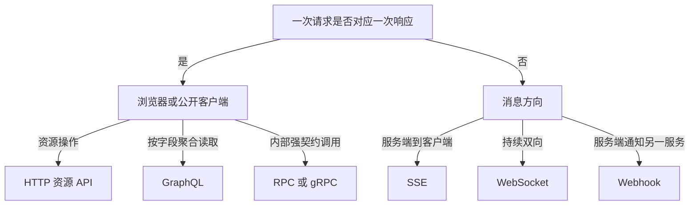

# API 通信风格：REST、RPC、gRPC、GraphQL、WebSocket、SSE 与 Webhook

API 是两个软件组件之间约定的输入、输出、错误和演进边界。通信风格决定消息由谁发起、持续多久、怎样描述操作，以及网络失败后如何恢复；它不是按流行度选择的框架标签。

## 1. 先识别通信需求

选择协议前先写清六项输入：调用方是谁、通信方向、频率、单条消息大小、可接受延迟、断线后的正确结果。下图把常见需求映射到通信形态：



一个产品可以同时使用多种风格：公开订单 API 使用 HTTP JSON，内部库存服务使用 gRPC，订单状态页面使用 SSE，支付平台通过 Webhook 回调。边界清楚比协议统一更重要。

## 2. 七种风格的机制与边界

### 2.1 HTTP 资源 API（常称 REST API）

资源 API 用 URI 标识对象，用 HTTP 方法表达通用操作，用状态码和响应头表达协议语义。例如 `GET /orders/o_123` 读取订单，`PATCH /orders/o_123` 修改部分字段。它适合浏览器、移动端和第三方集成，因为 HTTP 缓存、代理、鉴权和调试工具成熟。

严格意义上的 REST 还包含无状态、可缓存、统一接口、分层系统和超媒体等约束；工程中常说的“REST API”通常只是基于资源和 HTTP 语义的 JSON API，不能因为路径用了名词就宣称满足全部 REST 约束。

关键行为：

- 安全方法（`GET`、`HEAD`、`OPTIONS`、`TRACE`）按语义不应请求状态改变；日志写入等附带行为不改变这一语义。
- 幂等方法重复执行的预期效果与执行一次相同，包括 `PUT`、`DELETE` 和安全方法；幂等不代表响应完全相同，也不代表不会产生多条访问日志。
- 缓存由方法、状态码和 `Cache-Control`、验证器共同决定，不能只看“这是 GET”。
- HTTP 请求失败分为未到达、服务端执行后响应丢失、明确错误响应等状态；客户端不能仅凭超时判断服务端没有执行。

### 2.2 RPC

RPC 把接口组织为动作，如 `CreateInvoice`、`ApproveExpense`。传输可以是 HTTP JSON，也可以是二进制协议。它适合动作本身比资源 CRUD 更自然的领域，例如“报价”“批量结算”“编译”。

RPC 的方法名、参数、返回值和错误必须形成稳定契约。`POST /rpc` 加一个任意 `method` 字段会失去 HTTP 工具可观察的资源和状态语义；这并非不能使用，但需要自行补齐缓存、幂等、错误分类和接口发现。

### 2.3 gRPC

gRPC 通常以 Protocol Buffers 描述服务和消息，生成客户端/服务端代码，并提供一元调用、服务端流、客户端流和双向流。它常用于组织内部的强类型服务通信。

需要逐项考虑：

- 字段编号是线上身份，删除字段后应 `reserved`，不能把编号复用于新语义。
- 未知字段支持前后兼容，但“字段存在”和“字段为默认值”可能需要 `optional` 或包装结构区分。
- deadline 应由入口向下游传播；没有 deadline 的调用可能长期占用连接和 goroutine。
- gRPC 状态码不是 HTTP 状态码；网关映射需要维护明确规则。
- 浏览器通常需要 gRPC-Web 或网关，代理也必须支持相应 HTTP/2 或 HTTP/3 能力。

### 2.4 GraphQL

GraphQL 用类型系统描述查询能力，客户端在一次操作中声明所需字段。查询、变更和订阅分别用于读取、写入和持续更新。它适合多个页面需要不同字段组合、服务端能够承担字段解析与成本治理的场景。

GraphQL 的单端点不等于单权限。每个 resolver 都必须验证对象和字段权限；还需限制查询深度、复杂度、别名数量和批量规模。resolver 逐条访问数据库会产生 N+1，应使用批量加载或预取。响应可以同时含 `data` 和 `errors`，客户端不能只按 HTTP 200 判断业务完整成功。

### 2.5 WebSocket

WebSocket 先通过 HTTP 握手升级为持续的全双工消息连接，随后客户端和服务端都可主动发送帧。它适合协同编辑、双向控制、低延迟房间消息等持续双向场景。

WebSocket 只定义连接和帧，不自动提供业务消息确认、顺序号、重放、断线续传、权限刷新或背压。应用协议至少要定义消息类型、版本、ID、确认、最大尺寸、心跳、重连游标和过期策略。连接建立时认证后，长连接期间仍需处理令牌过期和权限撤销。

### 2.6 Server-Sent Events（SSE）

SSE 使用 `text/event-stream` 的长期 HTTP 响应把 UTF-8 文本事件从服务端推到浏览器。事件字段包括 `event`、`data`、`id` 和 `retry`；空行结束一个事件。浏览器 `EventSource` 会自动重连，并可通过 `Last-Event-ID` 请求续传。

SSE 是单向通道，客户端写操作仍走普通 HTTP。代理缓冲会让事件不能及时到达；服务端需定期心跳、刷新缓冲、监听请求取消，并设置连接数和空闲超时。跨域、Cookie 凭据和每源连接限制也要纳入设计。

### 2.7 Webhook

Webhook 是事件发生方主动向订阅方发送 HTTP 请求。它适合支付结果、代码仓库事件、异步任务完成通知。发送方无法控制接收方网络，因此必须把重复、乱序、延迟和暂时失败视为正常状态。

可靠 Webhook 包含事件 ID、事件类型、发生时间、版本和载荷；使用原始请求体与时间戳计算签名；接收方先验证时间窗和签名，再按事件 ID 幂等落库，快速返回 2xx，重处理交给队列。发送方对可重试失败采用退避并设置最大保留期；永久 4xx 与暂时 5xx 的策略应区分。

## 3. 选择矩阵

| 需求 | 优先候选 | 主要收益 | 必须承担的成本 |
|---|---|---|---|
| 面向公开客户端的资源操作 | HTTP 资源 API | 通用、可缓存、易调试 | 资源与状态语义设计 |
| 内部强类型低延迟调用 | gRPC | 代码生成、流式、二进制 | 网关、兼容、可观测性 |
| 页面按需组合多类数据 | GraphQL | 客户端精确选字段 | resolver 授权、查询成本、N+1 |
| 持续双向低延迟消息 | WebSocket | 双向连接 | 应用层确认、重放、背压 |
| 浏览器只接收增量事件 | SSE | 基于 HTTP、自动重连 | 单向、代理缓冲、连接管理 |
| 跨系统异步通知 | Webhook | 松耦合、接入简单 | 签名、重试、幂等、乱序 |
| 以领域命令为核心 | RPC | 动作表达直接 | 自定义错误与治理语义 |

不要以“性能最高”单项决策。消息序列化通常不是端到端延迟的唯一主因；数据库查询、跨区网络、队列等待和重试更常决定总耗时。

## 4. 最小 SSE 示例（Go 1.26）

下面端点每秒发送一个进度事件，并在客户端断开后停止工作：

```go
func progress(w http.ResponseWriter, r *http.Request) {
    flusher, ok := w.(http.Flusher)
    if !ok {
        http.Error(w, "streaming unsupported", http.StatusInternalServerError)
        return
    }
    h := w.Header()
    h.Set("Content-Type", "text/event-stream")
    h.Set("Cache-Control", "no-cache")
    h.Set("X-Content-Type-Options", "nosniff")

    ticker := time.NewTicker(time.Second)
    defer ticker.Stop()
    for percent := 10; percent <= 100; percent += 10 {
        select {
        case <-r.Context().Done():
            return
        case <-ticker.C:
            if _, err := fmt.Fprintf(w, "id: %d\nevent: progress\ndata: {\"percent\":%d}\n\n", percent, percent); err != nil {
                return
            }
            flusher.Flush()
        }
    }
}
```

响应的可观察片段：

```text
id: 10
event: progress
data: {"percent":10}

```

生产环境还需处理代理缓冲、认证、每主体连接上限、续传存储和心跳；单个 handler 不能替代事件日志。

## 5. 完整案例：订单状态更新

### 输入

- Web 页面创建订单后，要在 30 秒内看到“已支付/已发货”。
- 页面只接收更新，不通过该连接发送消息。
- 支付平台只能向公开 HTTPS 地址回调，最多重试 24 小时。
- 内部订单和库存服务使用同一组织网络，要求强类型契约和 500 ms deadline。

### 步骤

1. 浏览器通过 `POST /orders` 创建订单，并携带幂等键。
2. 订单服务用 gRPC 调库存服务预留库存，向下传播 500 ms deadline。
3. 页面订阅 `GET /orders/o_123/events` SSE；事件带单调递增 ID。
4. 支付平台调用 Webhook；服务验证签名、时间戳和事件 ID，再提交支付事件。
5. 订单服务写入事件日志，SSE 订阅者收到 `order.paid`。
6. 重连时浏览器发送 `Last-Event-ID`，服务从下一条事件继续。

### 输出

通信边界是：创建与查询用 HTTP 资源 API；内部调用用 gRPC；浏览器更新用 SSE；外部支付通知用 Webhook。每种风格只承担它擅长的方向。

### 验证

- 断开 SSE 后重连，事件 ID 不丢失也不重复改变最终状态。
- 同一支付事件发送三次，数据库只产生一次状态迁移。
- 库存服务超过 deadline，订单创建返回可重试错误且没有半完成预留。
- Webhook 签名错误返回 401/403，正文不进入业务队列。

### 失败分支

如果 SSE 代理开启响应缓冲，服务端已写入但页面迟迟不更新。通过抓取响应到达时间、检查反向代理配置和发送心跳定位；修正为禁用该路由缓冲并设置合适空闲超时。若事件无法重放，不能声称支持可靠断线续传，应让客户端重新获取订单快照。

## 6. 常见错误

- 用 WebSocket 替代所有 HTTP：一次性 CRUD 失去缓存、状态码和普通调试工具收益。
- 把 gRPC 当作“绝不丢消息”：网络失败仍产生未知执行结果，必须设计 deadline、重试和幂等。
- 只在 GraphQL 入口鉴权：能访问端点不代表能访问每个字段和对象。
- Webhook 收到后同步执行长任务：对方超时会重试，形成并发重复处理。
- 把 SSE 当消息队列：没有持久事件源时，服务重启或断线无法补发。
- 忽略背压：生产速度持续超过消费速度时，内存最终耗尽；应限制队列、合并更新或断开慢消费者。

## 7. 调试与验证清单

1. 用抓包或客户端日志记录请求 ID、开始时间、首字节时间、结束状态。
2. 对流式连接验证心跳、断线、重连、乱序、重复和慢消费者。
3. 对 Webhook 保存事件 ID和验签结果，不保存密钥或完整敏感正文。
4. 对 gRPC 检查 deadline 是否传播，状态码是否被网关错误改写。
5. 对 GraphQL 用最大允许复杂度测试，并观察数据库查询次数。
6. 对所有协议执行负载和故障注入，不用单次本地延迟代表生产表现。

## 8. 练习

为“导出报表”设计通信方案：创建任务、查看进度、下载结果、外部通知。交付通信矩阵、接口草图、超时与重试规则，并实现一个可取消的 SSE 进度端点。

完成标准：能说明每条链路为什么采用该风格；断线重连不会产生错误最终状态；所有长任务可取消；Webhook 重复三次只处理一次；客户端能区分暂时失败和永久失败。

## 来源

- [RFC 9110: HTTP Semantics](https://www.rfc-editor.org/rfc/rfc9110.html)（访问日期：2026-07-17）
- [RFC 6455: The WebSocket Protocol](https://www.rfc-editor.org/rfc/rfc6455.html)（访问日期：2026-07-17）
- [WHATWG: Server-sent events](https://html.spec.whatwg.org/multipage/server-sent-events.html)（访问日期：2026-07-17）
- [gRPC Introduction](https://grpc.io/docs/what-is-grpc/introduction/)（访问日期：2026-07-17）
- [GraphQL Specification](https://spec.graphql.org/)（访问日期：2026-07-17）
