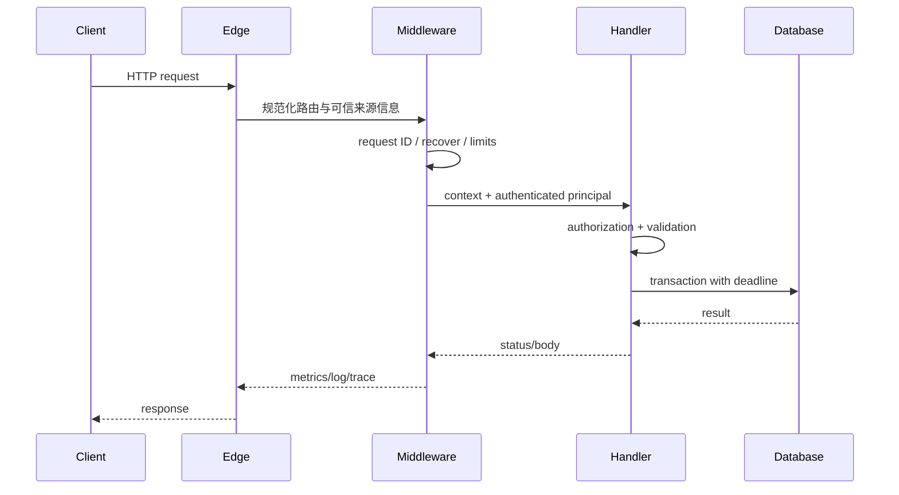

# HTTP 服务中间件、超时、CORS、限流与可观测性

中间件是在请求进入业务 handler 前后执行的横切逻辑。它适合统一请求标识、恢复、认证、限流和观测；业务授权、领域校验和事务不应因为“统一”而被移出正确边界。

## 1. 请求链与顺序



中间件包装顺序决定执行顺序。外层最先进入、最后退出。常见顺序是：可信代理处理 → 请求 ID → panic recovery → 访问日志/trace → 正文与并发限制 → CORS → 认证 → 限流 → handler。没有唯一固定顺序，但必须解释依赖，例如按用户限流需要先完成认证。

## 2. Go 中间件模型

```go
type Middleware func(http.Handler) http.Handler

func Chain(h http.Handler, m ...Middleware) http.Handler {
    for i := len(m) - 1; i >= 0; i-- {
        h = m[i](h)
    }
    return h
}
```

中间件通过 `context.Context` 传递请求范围的数据。context key 应使用私有类型，避免包间碰撞；不要把可选业务参数、全局依赖或大型可变对象塞进 context。

## 3. 服务端超时的不同阶段

`http.Server` 的超时不是一个总数字：

| 配置/机制 | 控制范围 | 风险 |
|---|---|---|
| `ReadHeaderTimeout` | 读取请求头 | 防慢速头部占连接 |
| `ReadTimeout` | 读取整个请求（含正文） | 对大上传可能过短 |
| `WriteTimeout` | 写响应的大致期限 | 流式/SSE 需单独设计 |
| `IdleTimeout` | keep-alive 等下一请求 | 释放闲置连接 |
| 请求 context deadline | 业务总预算 | 必须向 DB/RPC 传播 |
| 下游客户端 timeout | 连接、TLS、响应头、总请求 | 不应只依赖默认值 |

```go
func newServer(handler http.Handler) *http.Server {
    return &http.Server{
        Addr:              ":8080",
        Handler:           handler,
        ReadHeaderTimeout: 5 * time.Second,
        ReadTimeout:       15 * time.Second,
        WriteTimeout:      30 * time.Second,
        IdleTimeout:       60 * time.Second,
        MaxHeaderBytes:    1 << 20,
    }
}
```

总预算要逐层递减，例如入口 2 s，数据库 800 ms，外部依赖 600 ms，保留编码与网络余量。请求取消后，使用 `QueryContext`、`Do(req.WithContext(ctx))` 等可取消 API。后台任务不能继续持有已取消的请求 context；应在确认接受后创建有独立生命周期、可追踪且可关闭的任务。

超时响应不证明 handler 已停止。某些操作可能不支持取消，或者写入已经提交。对写接口仍要幂等和事务保护。

## 4. 正文、并发与资源限制

攻击者可以用巨型正文、慢连接、压缩炸弹和大量并发耗尽资源。入口至少限制：请求头、正文解压后的大小、JSON 深度/字段数量、文件类型、单用户并发和全局并发。

```go
func decodeJSON(w http.ResponseWriter, r *http.Request, dst any) error {
    r.Body = http.MaxBytesReader(w, r.Body, 1<<20)
    dec := json.NewDecoder(r.Body)
    dec.DisallowUnknownFields()
    if err := dec.Decode(dst); err != nil { return err }
    if dec.Decode(&struct{}{}) != io.EOF { return errors.New("one JSON value required") }
    return nil
}
```

严格未知字段策略能发现拼写错误，但会影响前后兼容；公开契约应明确。上传文件不能只信 `Content-Type` 和扩展名，还要检测内容、隔离存储并限制解析器资源。

## 5. CORS 的实际语义

同源策略限制浏览器脚本读取跨源资源。CORS 是服务器允许浏览器放宽读取限制的响应协议，不是认证、授权、防火墙或 CSRF 防护；curl、后端服务和恶意客户端不会被浏览器 CORS 阻挡。

简单跨源请求可直接发送，浏览器根据响应 `Access-Control-Allow-Origin` 决定是否向脚本暴露。非简单方法、头或媒体类型通常先发送预检：

```http
OPTIONS /orders HTTP/1.1
Origin: https://app.example.com
Access-Control-Request-Method: POST
Access-Control-Request-Headers: content-type,idempotency-key
```

服务端应从白名单精确回显允许源，并设置：

```http
Access-Control-Allow-Origin: https://app.example.com
Access-Control-Allow-Methods: GET,POST,OPTIONS
Access-Control-Allow-Headers: Content-Type,Idempotency-Key
Access-Control-Allow-Credentials: true
Access-Control-Max-Age: 600
Vary: Origin
```

带凭据时不能使用 `Access-Control-Allow-Origin: *`。动态回显 Origin 必须先匹配完整 scheme/host/port 白名单，不能做字符串后缀误判。预检可以在认证前处理，但实际请求仍需认证与授权。浏览器能发送的 Cookie 还受 SameSite、Secure 和第三方 Cookie 策略影响。

## 6. 限流与过载保护

令牌桶允许以速率补充 token 并容纳有限突发；漏桶偏向平滑输出；固定窗口简单但边界可双倍突发；滑动窗口更准确但状态成本更高。

限流键可按账户、API key、租户、IP、路由和代价组合。只按 IP 会误伤 NAT 后的用户，也容易被多 IP 绕过。GraphQL、导出和搜索等请求成本差异大，可用权重而非每次计 1。

```text
capacity = 20 tokens
refill = 5 tokens/second
ordinary GET costs 1
report export costs 10
```

拒绝时返回 429 和适合的恢复提示。分布式限流需明确一致性：边缘节点本地桶低延迟但会放大总配额；集中存储更一致却增加依赖。系统过载还需要并发闸门、队列上限、负载削减和优先级，不能只靠每用户速率。

## 7. 日志、指标与追踪

三类信号回答不同问题：

- 日志记录离散事件及上下文，适合定位一次失败。
- 指标是按时间聚合的数值，适合告警和趋势。
- trace 连接跨服务 span，适合分析一次请求的关键路径。

HTTP 指标至少关注请求速率、错误率和延迟分布。延迟用 histogram 分桶后计算分位数；平均值会掩盖尾延迟。label 只用低基数值，例如规范化路由 `/orders/{id}`、方法和状态类别，不能用原始 URL、user ID、trace ID、错误文案。

OpenTelemetry trace 上下文通过标准头传播。服务只接受格式正确的远程 trace context，但不能把它当成认证；外部采样决定也应受本地策略限制。span 应记录规范化操作名、状态和必要事件，不记录 token 或完整正文。

结构化日志示例：

```json
{"severity":"ERROR","message":"database timeout","route":"POST /orders","status":503,"duration_ms":812,"trace_id":"7e32f6a14c7340a7","tenant_hash":"a9c1"}
```

日志中的租户或用户标识根据用途做权限控制、哈希或最小化。采样不能丢掉所有错误；高流量成功请求可采样，计数指标仍保留总体。

## 8. Panic recovery 与响应记录

recovery 防止单个 panic 终止服务进程，但不能把内存损坏或运行时致命错误视为可安全继续。若响应已经部分写出，recovery 无法改回完整 500。日志应记录 panic 和堆栈到受控系统，外部只返回统一错误。

为了记录真实状态，包装 `ResponseWriter` 时要保存第一次状态和字节数，同时谨慎保留 `Flusher`、`Hijacker`、`Pusher`、`io.ReaderFrom` 等可选接口；错误包装会破坏 SSE 或 WebSocket。Go 的 `http.ResponseController` 可以访问部分响应控制能力。

## 9. 完整案例：订单创建入口

### 输入

- 入口总 deadline 2 s，订单数据库预算 800 ms。
- 每账户每秒 5 次、突发 20 次；全局最多 200 个并发创建。
- Web 前端源为 `https://app.example.com`，使用 Cookie；第三方客户端用 Bearer token。
- 指标不能包含订单 ID 或用户 ID。

### 步骤

1. 边缘代理校验头部并传递可信客户端地址，应用不直接相信任意 `X-Forwarded-For`。
2. request ID/recovery/trace 中间件建立观测上下文。
3. CORS 对白名单预检返回；实际请求继续执行。
4. 限制正文 1 MiB，认证中间件建立 principal。
5. 按账户令牌桶扣减；全局 semaphore 获取并发位。
6. handler 在 2 s context 内授权、校验，并用 800 ms 子 deadline 执行事务。
7. 中间件记录规范化路由、状态、duration histogram 和 trace；响应不记录敏感正文。

### 输出

成功返回 201。用户桶耗尽返回 429 和 `Retry-After`；并发闸门满时快速返回 503，而不是让请求无限排队；数据库 deadline 到期映射为暂时依赖错误。

### 验证

- 非白名单 Origin 不获得允许头，且实际 API 仍独立执行鉴权。
- 连续 21 个请求在不补充 token 时至少一个被限流。
- 客户端断开后数据库查询收到 context cancellation。
- 指标 label 集合有界，不出现订单 ID。
- trace 能连接入口和数据库 span，日志用 trace ID 定位。

### 失败分支

若把 CORS 当授权，攻击者可直接用非浏览器客户端调用接口。修正为每次实际请求都认证和资源级授权。若 middleware 超时仅向客户端写 503，而后台事务继续并提交，客户端重试可能重复订单；修正为传播 context、使用数据库超时、幂等键和唯一约束共同保证结果。

## 10. 常见错误

- 使用默认 `http.Server` 零超时直接暴露公网。
- 用 `http.Client{}` 无任何 deadline 调下游。
- 记录完整 Authorization、Cookie 或请求正文。
- 把原始路径作为指标标签导致高基数。
- `Access-Control-Allow-Origin: *` 与凭据混用。
- 只限流不限制并发，慢请求仍耗尽资源。
- recovery 后假装请求成功，或在已写响应后追加 JSON 错误。
- 在中间件做所有业务授权，忽略具体资源和字段。

## 11. 练习

为一个 Go API 组合 request ID、recovery、正文限制、CORS、认证、令牌桶和观测中间件。用表驱动测试验证顺序、预检、超时、取消和限流。

完成标准：公网服务配置四类连接超时；业务 deadline 能传到下游；白名单 CORS 不替代授权；429/503 可区分；指标无高基数标签；panic 不泄露堆栈；SSE 路由不会因 ResponseWriter 包装失去 flush 能力。

## 来源

- [Go 1.26 package net/http](https://pkg.go.dev/net/http)（访问日期：2026-07-17）
- [Fetch Standard: CORS protocol](https://fetch.spec.whatwg.org/#http-cors-protocol)（访问日期：2026-07-17）
- [OpenTelemetry Specification](https://opentelemetry.io/docs/specs/otel/)（访问日期：2026-07-17）
- [RFC 9110: HTTP Semantics](https://www.rfc-editor.org/rfc/rfc9110.html)（访问日期：2026-07-17）
- [Prometheus: Naming and labels](https://prometheus.io/docs/practices/naming/)（访问日期：2026-07-17）
