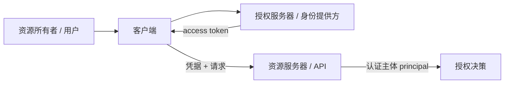

# 认证机制：Session、Cookie、JWT、OAuth 2.0、OIDC 与 API Key

认证回答“当前请求代表谁或哪个客户端”，授权回答“它能否对这个资源执行此操作”。认证凭据只是身份主张的输入；服务端仍要验证签名、有效期、受众、会话状态和撤销策略。

## 1. 身份、客户端与令牌



用户、客户端应用和访问令牌是不同对象。一个 token 可能代表用户、客户端自身，或二者的组合。API 不应仅看到 `sub` 就假定它是最终用户；要结合 issuer、audience、授权类型和声明定义。

## 2. Session 与 Cookie

### 2.1 服务端 Session

登录成功后，服务端创建随机且不可预测的 session ID，把账户、创建时间、过期时间、认证强度和撤销状态保存到数据库或缓存。浏览器只持有 session ID：

```http
Set-Cookie: __Host-session=RANDOM_256_BIT_VALUE; Path=/; Secure; HttpOnly; SameSite=Lax
```

Cookie 属性：

- `Secure`：仅通过安全传输发送；本身不加密 Cookie 内容。
- `HttpOnly`：阻止脚本通过 `document.cookie` 读取，不能阻止浏览器随请求发送。
- `SameSite=Strict|Lax|None`：限制跨站发送；`None` 必须配合 `Secure`。
- `Path`、`Domain`：控制发送范围，不是可靠的安全隔离边界；同源应用应避免互相覆盖。
- `Max-Age`/`Expires`：控制持久化；没有时通常是会话 Cookie。
- `__Host-` 前缀：要求 Secure、`Path=/` 且无 Domain，降低子域覆盖风险。

session ID 只保存随机标识，不把角色、余额等可变可信状态放进未签名 Cookie。登录、提权和密码修改后轮换 ID，防止会话固定；登出在服务端撤销并清 Cookie。闲置过期与绝对过期分别限制长期风险。

Cookie 自动随请求发送，因此状态变更接口还需防 CSRF：SameSite 是一层防护，不能覆盖所有部署；可使用同步 token、双重提交 token、校验 Origin/Referer，并禁止用 GET 改状态。

### 2.2 Cookie 内封装会话

服务端也可把少量会话数据加密并认证后存入 Cookie，但撤销、权限变化、密钥轮换和 4 KiB 左右大小限制更复杂。签名只防篡改，不隐藏内容；敏感信息需要加密且仍应最小化。

## 3. JWT 的结构与验证

JWT 是 claims 的紧凑表示，常见 JWS 形式由 `base64url(header).base64url(payload).signature` 三段组成。payload 默认只是编码，不是加密，任何持有者都能读取。

常见声明：

| claim | 意义 | 验证要求 |
|---|---|---|
| `iss` | 签发者 | 与配置的精确 issuer 匹配 |
| `sub` | 主体标识 | 结合签发者解释，不单独全局唯一 |
| `aud` | 目标受众 | API 必须是允许受众之一 |
| `exp` | 过期时间 | 当前时间不能超过，允许有限时钟偏差 |
| `nbf` | 不早于 | 未到时间拒绝 |
| `iat` | 签发时间 | 可用于异常检测，不自动保证新鲜 |
| `jti` | token 标识 | 可用于撤销/重放控制，但需服务端状态 |

验证顺序至少包括：限制 token 大小；只允许预配置算法；按受信 issuer 找密钥；验证签名；验证 `iss`、`aud`、时间；验证 token 类型和必要声明。不能接受 header 中任意 `alg`、`jku` 或 `kid` 指向攻击者密钥。`kid` 只是在受信任 JWKS 集合内选键。

JWT 的自包含不能替代撤销。短 access token 配合服务端检查高风险状态、密钥轮换和 refresh token 管理，通常比长寿命 JWT 安全。浏览器把 bearer token 放 `localStorage` 会暴露给同源 XSS；BFF 或安全 Cookie 会话可减少 token 暴露面，但仍需 XSS/CSRF 防护。

## 4. OAuth 2.0 解决什么

OAuth 是委托授权框架：客户端在不取得用户密码的情况下获得受限 access token，访问资源服务器。它本身不定义“用户登录结果”；OIDC 在其上增加身份层。

### 4.1 Authorization Code + PKCE

现代浏览器、移动端和服务端 Web 客户端通常使用授权码流程并启用 PKCE：

1. 客户端生成随机 `code_verifier`，计算 `code_challenge`。
2. 浏览器跳转授权端点，带 `state`、精确 `redirect_uri`、challenge 和所需 scope。
3. 用户在授权服务器认证和授权。
4. 授权服务器只把短寿命 code 返回已注册 redirect URI。
5. 客户端后端/应用用 code、同一 redirect URI 和 verifier 换 token。
6. 授权服务器验证 challenge，降低授权码被截获后的利用。

`state` 绑定发起请求、防 CSRF 和响应混淆；它必须随机、一次性并与浏览器会话关联，不能装入任意可跳转 URL。redirect URI 应精确匹配注册值，不使用开放重定向或宽泛通配符。

### 4.2 Client Credentials

机器到机器调用可用客户端凭据获取代表客户端自身的 token。它不代表最终用户。client secret 只能由能保密的后端客户端持有，不能嵌入浏览器 JS、移动包或公开仓库。

### 4.3 Refresh Token

refresh token 用于换取新 access token，价值通常更高，应只发送给授权服务器。对公开客户端使用轮换：每次换新 refresh token，旧 token 再次使用视为重放并撤销 token family。保存时加密/哈希、绑定客户端，设置闲置与绝对期限。

资源 API 不接受 refresh token。scope 表示授权范围，但最终资源级权限仍由 API 按主体、对象和租户判断。

## 5. OpenID Connect（OIDC）

OIDC 在 OAuth 授权请求中使用 `openid` scope，返回 ID Token 来描述认证事件和用户身份，并定义 UserInfo、发现文档等能力。

ID Token 的 `aud` 是客户端，不是普通资源 API；客户端验证 issuer、audience、签名、`exp`、`nonce`，多 audience 时还要按规范处理 `azp`。`nonce` 把 ID Token 绑定到发起的认证请求，防重放。ID Token 用于客户端确认登录，不应替代 access token 调 API。

发现文档通常位于 issuer 下的 `/.well-known/openid-configuration`，给出端点、JWKS URI、支持算法。生产配置应固定受信 issuer，并对发现/JWKS 设置缓存、轮换和故障策略，不从未验证 token 动态选择任意 issuer。

## 6. API Key

API key 常标识调用项目或机器客户端，适合服务间、开发者 API、配额和计费。它不天然证明最终用户，也不适合放 URL 查询参数，因为 URL 会进入历史、代理和日志。

推荐格式含公开前缀和高熵 secret，例如 `lili_live_<key_id>.<secret>`。服务端存 key ID 与 secret 的慢哈希/带密钥哈希、状态、scope、创建者、最后使用时间和过期时间；展示 secret 仅一次。支持双 key 轮换：先创建新 key、迁移、再撤销旧 key。

API key 通过 TLS 的请求头发送。日志只记录 key ID/前缀，绝不记录 secret。对高风险服务可使用 mTLS 或签名请求提供更强的客户端绑定和重放保护。

## 7. 机制比较

| 机制 | 服务端状态 | 撤销 | 浏览器风险 | 典型用途 |
|---|---|---|---|---|
| 随机 Session ID + Cookie | 有 | 立即 | CSRF、XSS 间接操作 | 第一方 Web 登录 |
| 自包含 JWT access token | 少 | 通常延迟到过期 | token 被盗后的 bearer 风险 | 分布式 API 授权载体 |
| OAuth access token | 由授权系统管理 | 依 token 类型 | 流程配置与 token 存储风险 | 委托第三方/多客户端 |
| OIDC ID Token | 认证事件 | 不作为 API 会话撤销工具 | 错把它当 access token | 客户端确认登录 |
| API key | 有 | 立即 | 公开客户端无法保密 | 机器/项目调用与配额 |

没有“JWT 比 Session 更可扩展”的绝对结论。JWT 减少逐请求会话读取，却把撤销、声明过期、密钥轮换和体积成本转移到其他位置。选择要基于信任边界和撤销时效。

## 8. 密码与多因素认证

密码只通过 TLS 接收，用专用密码哈希函数和每用户随机 salt 存储；参数需要可升级。不要加密后可逆保存，不使用通用快速哈希。登录接口做账户/IP/设备多维限速，错误文案避免账号枚举。

多因素提升认证强度。WebAuthn/passkey 使用公钥凭据并绑定 RP，能抵抗传统钓鱼；短信受 SIM 换卡和转发风险影响。高风险操作可要求最近认证时间或更强认证方法，提权后轮换 session。

## 9. 完整案例：Web 与 CLI 共用订单 API

### 输入

- 第一方 Web 使用同域 BFF；CLI 是公开客户端；合作方服务是机密客户端。
- API 要知道用户/客户端、租户和 scope，并可在员工离职后尽快撤销。
- access token 有效期 10 分钟，CLI 需要长期登录。

### 步骤

1. Web 通过 OIDC authorization code + PKCE 登录，BFF 验证 ID Token 后创建服务端 session，并向浏览器设置 `__Host-session` Cookie。
2. BFF 在服务端持有 OAuth token，浏览器不接触 refresh token；写请求校验 CSRF token 与 Origin。
3. CLI 走适合设备/原生应用的标准授权流程，安全存储 refresh token，并使用轮换。
4. 合作方使用 client credentials，token 主体是客户端而非员工。
5. API 验证 access token 的签名、issuer、audience、时间和 scope，再加载当前主体/租户状态进行授权。
6. 离职时撤销 session 和 refresh token；短 access token 最迟在 10 分钟后失效，高风险接口额外检查账户状态。

### 输出

每个请求生成 principal：`subject`、`client_id`、`tenant_id`、`scopes`、`auth_time`。它只是授权输入，不直接把 token 内 `role=admin` 当永久真相。

### 验证

- 修改 JWT payload 后签名失败；错误 audience 和 issuer 均被拒绝。
- access token 不能用于 OIDC 客户端会话，ID Token 不能调用订单 API。
- Cookie 具备 Secure、HttpOnly、SameSite，登录后 session ID 轮换。
- 同一 refresh token 第二次使用触发 family 撤销。
- 日志和 URL 不含 token、Cookie 或 API secret。

### 失败分支

若 API 只验证 JWT 签名而不验证 audience，签给另一个服务的 token 可能被错误接受。修正为每个资源服务器固定 issuer、audience、允许算法和 token 类型。若把管理员角色写入一年有效 JWT，降权无法及时生效；缩短令牌寿命，并对敏感权限查询受控授权状态。

## 10. 常见错误

- 用 Base64 当加密，认为 JWT payload 不可见。
- 接受 token 声明的任意算法或远程密钥 URL。
- 把 ID Token 发给资源 API。
- 在浏览器、移动应用或 Git 仓库嵌入 client secret/API key。
- 只清浏览器 Cookie、不撤销服务端 session。
- Cookie 登录没有 CSRF 防护。
- 日志记录 Authorization 或 refresh token。
- 把 scope 当资源级授权，未验证对象所属租户。

## 11. 练习

为 Web、CLI 和定时任务设计认证方案，画出授权码 + PKCE 流程，列出每种凭据的存储位置、寿命、轮换、撤销和日志规则。

完成标准：能区分 access/refresh/ID token；JWT 验证包含 issuer/audience/time/algorithm；Cookie 会话防固定与 CSRF；API key 可双 key 轮换；离职与密钥泄露有可执行撤销路径；所有授权仍在 API 资源边界执行。

## 来源

- [RFC 9700: Best Current Practice for OAuth 2.0 Security](https://www.rfc-editor.org/rfc/rfc9700.html)（访问日期：2026-07-17）
- [RFC 7636: Proof Key for Code Exchange](https://www.rfc-editor.org/rfc/rfc7636.html)（访问日期：2026-07-17）
- [OpenID Connect Core 1.0](https://openid.net/specs/openid-connect-core-1_0.html)（访问日期：2026-07-17）
- [RFC 7519: JSON Web Token](https://www.rfc-editor.org/rfc/rfc7519.html)（访问日期：2026-07-17）
- [RFC 6265bis: Cookies](https://httpwg.org/http-extensions/draft-ietf-httpbis-rfc6265bis.html)（访问日期：2026-07-17）
