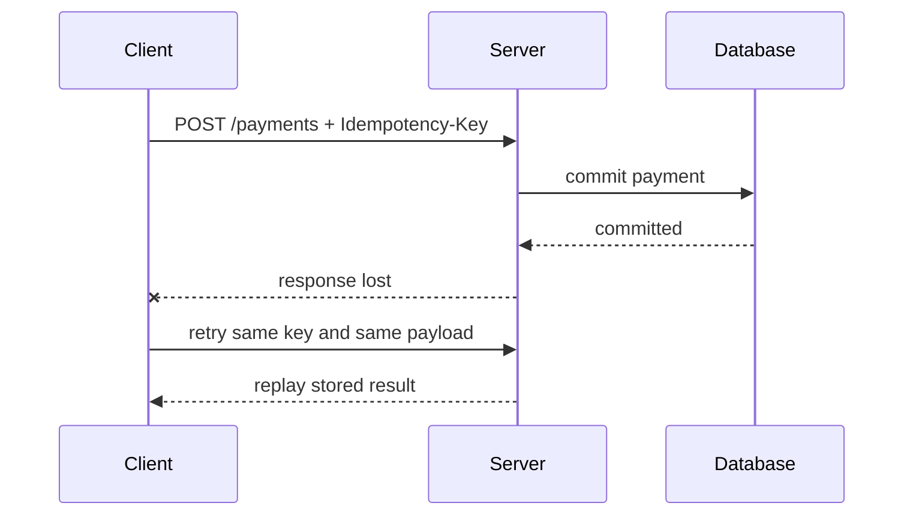
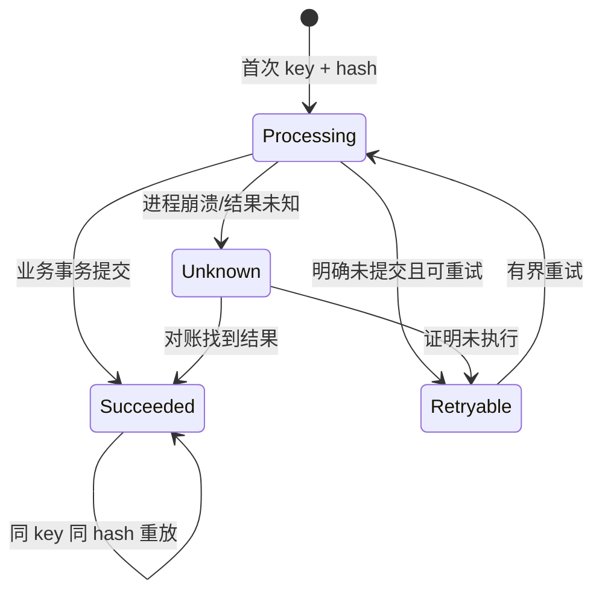

# 幂等请求、异步任务与 OpenAPI 契约

网络超时无法告诉客户端服务端是否已完成写入。幂等键让同一业务意图的重复提交收敛到同一结果；异步任务把长操作变成可查询状态资源；OpenAPI 把请求、响应和错误边界转成可校验契约。

## 1. 为什么会重复执行



超时、代理重试、移动网络切换、用户双击和消息重复投递都会造成重复。仅禁用按钮只能改善体验，不能保证系统正确。唯一约束、事务与幂等记录必须位于受控后端。

## 2. 幂等的精确定义

HTTP 规范定义某些方法语义幂等，但业务接口还需处理重复请求的身份与结果。对 `POST /payments`，客户端为一次“创建付款”的业务意图生成高熵 key；相同 key 与相同规范化输入必须返回同一业务结果。新业务意图使用新 key。

幂等记录至少包含：

```text
scope           租户/账户/客户端，防跨主体碰撞
key             客户端生成的随机标识
request_hash    方法 + 路由 + 规范化业务正文摘要
status          processing | succeeded | failed-replayable
resource_id     已创建资源
response_status 可重放的状态码
response_body   受限响应或可重新构造引用
created_at / expires_at
```

数据库唯一约束放在 `(scope, key)`。只在 Redis 做“先查再写”若锁过期或缓存丢失仍可能双写；最终业务不变量应由数据库唯一约束/事务保证。

## 3. 幂等处理状态机



同 key 不同 hash 应返回 409/422，不能静默返回旧结果。并发相同 key 时可让一个请求执行，其他等待短时间或返回“处理中”及查询地址。不要无限持有数据库锁。

是否缓存 4xx/5xx 要按原因决定：确定性验证失败可重放，但用户修正输入应使用新 key；未知 500 不应永久缓存为最终结果；事务已提交但编码响应失败则必须能从资源重构成功结果。

key 有保留期。过期后重放是否可能再次执行必须写进契约；支付等高风险业务可能还需业务唯一号长期防重。

## 4. 事务中的实现

PostgreSQL 可用唯一记录竞争首次执行者：

```sql
CREATE TABLE idempotency_keys (
    tenant_id uuid NOT NULL,
    key text NOT NULL,
    request_hash bytea NOT NULL,
    state text NOT NULL CHECK (state IN ('processing','succeeded','retryable')),
    resource_id uuid,
    response_status integer,
    response_body jsonb,
    expires_at timestamptz NOT NULL,
    PRIMARY KEY (tenant_id, key)
);
```

正确性关键是“幂等记录、业务写入、最终状态”在一个数据库事务内提交，或使用能证明原子边界的设计：

1. `INSERT ... ON CONFLICT` 竞争 key。
2. 已存在则比较 request hash 和状态。
3. 首次执行者验证并写业务数据。
4. 同一事务更新记录为 succeeded，保存资源 ID/响应摘要。
5. 提交后返回。

如果外部支付调用不能与本地数据库同事务，采用本地 intent + outbox：先原子记录意图和待发送事件，worker 用供应商幂等键调用，对账未知结果。不能用数据库事务包住慢外部网络调用并期待跨系统原子性。

## 5. 异步任务是资源

超过普通请求 deadline 的导出、视频处理、批量导入应返回 202 和任务资源：

```http
HTTP/1.1 202 Accepted
Location: /v1/jobs/job_123
Retry-After: 3
Content-Type: application/json

{"id":"job_123","status":"queued","progress":{"completed":0,"total":100}}
```

任务状态至少区分：

| 状态 | 含义 | 允许转移 |
|---|---|---|
| `queued` | 已持久接受、尚未执行 | running/cancelled/failed |
| `running` | worker 获租约并执行 | succeeded/failed/cancelling |
| `cancelling` | 已请求取消、等待安全点 | cancelled/failed |
| `succeeded` | 输出已提交 | 终态 |
| `failed` | 已确定失败 | 终态或显式 retrying |
| `cancelled` | 未再执行且资源已清理 | 终态 |

202 只表示接受，不能返回“success=true”表示任务完成。任务资源包含创建者、租户、类型、状态、进度、结果链接、稳定错误、创建/开始/结束时间和版本。权限按任务对象检查，下载链接短期、受限并可撤销。

## 6. Worker、租约、重试与取消

队列可能至少一次投递，因此 worker 自身也要幂等。领取任务使用租约：`locked_by`、`lease_until`、attempt；worker 定期续租，崩溃后其他 worker 可在过期后接管。输出写入采用唯一标识或临时文件 + 原子发布，避免重复生成多个外部副作用。

重试仅用于暂时错误，并使用最大次数、总 deadline、指数退避与抖动。确定性输入错误直接 failed；死信队列需要告警和人工恢复流程，不能成为无人查看的垃圾箱。

取消是请求，不是瞬时事实。API 将状态置 cancelling，worker 在安全点观察并停止；如果不可中断步骤已提交，应准确报告最终结果。删除任务记录与取消执行是两个不同操作。

进度必须有定义：单位、总数是否可变、何时更新。虚假的 99% 比只有阶段状态更误导。大批任务可用 `processed/estimated_total` 并声明总数可能调整。

## 7. 轮询、SSE 与 Webhook 通知

客户端可轮询 `GET /jobs/{id}`，服务用 `Retry-After` 或文档指导间隔；ETag/`If-None-Match` 可减少正文。第一方浏览器可使用 SSE 接收状态变更，但断线后仍以任务资源为事实源。跨系统完成通知可用签名 Webhook，并允许订阅方再次 GET 任务确认。

通知不是任务事实本身：Webhook 丢失或 SSE 断线不能改变任务状态。客户端始终能通过资源查询恢复。

## 8. OpenAPI 3.1 契约组成

OpenAPI 描述 HTTP API 的路径、操作、参数、请求体、响应、安全方案和复用组件。3.1 与 JSON Schema 2020-12 对齐程度更高，但具体工具支持仍需验证。

核心对象：

- `openapi`：规范版本，如 `3.1.1`。
- `info`：标题和 API 文档版本；不是 URL 版本的自动替代。
- `servers`：服务地址和变量，不放 secret。
- `paths`：路径模板与 HTTP 操作。
- `parameters`：path/query/header/cookie 参数；path 参数必须 required。
- `requestBody`：按媒体类型描述正文和 schema。
- `responses`：按状态码描述头、正文和链接。
- `components`：schemas、responses、parameters、securitySchemes 等复用定义。
- `security`：安全要求；对象内多方案是 AND，数组中多个对象是 OR。

最小任务接口片段：

```yaml
openapi: 3.1.1
info:
  title: Export API
  version: 1.0.0
paths:
  /v1/exports:
    post:
      operationId: createExport
      parameters:
        - in: header
          name: Idempotency-Key
          required: true
          schema: {type: string, minLength: 16, maxLength: 128}
      responses:
        '202':
          description: Export accepted
          headers:
            Location:
              schema: {type: string, format: uri-reference}
          content:
            application/json:
              schema: {$ref: '#/components/schemas/Job'}
        '409':
          $ref: '#/components/responses/Conflict'
components:
  schemas:
    Job:
      type: object
      required: [id, status]
      properties:
        id: {type: string}
        status: {type: string, enum: [queued, running, cancelling, succeeded, failed, cancelled]}
  responses:
    Conflict:
      description: Idempotency key conflict
      content:
        application/problem+json:
          schema: {type: object, required: [type, title, status]}
```

Schema 中 `nullable` 的旧写法在 3.1 可用 JSON Schema 类型并集表达，例如 `type: [string, 'null']`。`format` 常是注解而非所有工具都强制验证；服务端仍需真正校验。

## 9. 契约驱动工作流

1. 设计 operationId、状态码、字段和错误类型。
2. lint 规范，解析 `$ref`，检查重复 operationId 和未定义响应。
3. 生成文档/客户端或只生成类型，明确生成物版本。
4. 服务端按契约执行请求验证，但授权与业务不变量仍由领域代码/数据库保证。
5. 契约测试比较实际响应的状态、媒体类型和 schema。
6. CI 对新旧规范做 breaking-change diff。

OpenAPI 不能完整表达所有语义，例如跨字段约束、幂等保留期、权限、事务效果和分页稳定性。这些要在 description、问题类型文档、测试和实现中补充。代码注解自动生成规范易与真实行为漂移，手写规范也会漂移；关键是 CI 让实现与契约互相校验。

## 10. 完整案例：导出十万条订单

### 输入

- 生成 CSV 预计 2–10 分钟；同一用户双击不能产生两份任务。
- 用户只能导出当前租户，下载结果保留 24 小时。
- worker 可崩溃、队列会重复投递；客户端可能断线。

### 步骤

1. 客户端生成 key，对规范化筛选计算稳定业务请求；`POST /v1/exports`。
2. 事务内插入幂等记录、job 和 outbox。唯一键为 tenant/user/key。
3. 返回 202、Location 和 queued job；相同 key/hash 返回同一 job。
4. worker 取得租约，以 job ID 作为输出唯一键分批读取，记录进度和 checkpoint。
5. 成功时原子发布对象并把 job 置 succeeded；生成短期受限下载链接。
6. 客户端轮询或 SSE 获知状态；断线后 GET job 恢复。

### 输出

任务终态：

```json
{"id":"job_123","status":"succeeded","progress":{"completed":100000,"total":100000},"result":{"download_url":"https://download.example/...","expires_at":"2026-07-18T04:00:00Z"}}
```

### 验证

- 同 key/hash 并发 20 次只产生一个 job。
- 同 key 不同筛选返回 409 problem。
- worker 在 50% 崩溃，租约过期后接管，不发布两份最终对象。
- 取消后任务进入 cancelling，再到 cancelled 或准确报告已完成。
- OpenAPI lint、schema 响应测试和 breaking diff 在 CI 通过。

### 失败分支

若创建 job 后才写幂等缓存，进程在两者之间崩溃会让重试创建第二个 job。修正为在同一数据库事务创建幂等记录、任务和 outbox。若 worker 用 offset 扫描同时变化的订单，会漏项/重复；应固定快照边界或用稳定 keyset/checkpoint，并把导出一致性写进契约。

## 11. 常见错误

- 每次重试生成新幂等键。
- 同 key 不比较请求摘要，错误复用旧结果。
- 只在进程内存保存 key，重启后失效。
- 202 没有任务查询地址或持久接受保证。
- 任务状态只有 running/done，无法表达失败和取消。
- worker 假设队列只投递一次。
- OpenAPI 只写 200，不描述错误、头和安全要求。
- 认为 schema 校验能代替授权、唯一约束或事务。

## 12. 练习

实现“批量邀请成员”异步 API：相同名单和 key 只建一个任务；逐项结果可查询；支持取消；重复队列消息不重复发送邀请。

完成标准：状态机无非法跳转；幂等记录与任务原子创建；同 key 异参冲突；worker 有租约和重试上限；任务资源按 tenant 授权；OpenAPI 3.1 描述 202/409/422/429/500 及问题正文；CI 能解析 YAML 并做契约测试。

## 来源

- [RFC 9110: HTTP Semantics](https://www.rfc-editor.org/rfc/rfc9110.html)（访问日期：2026-07-17）
- [OpenAPI Specification 3.1.1](https://spec.openapis.org/oas/v3.1.1.html)（访问日期：2026-07-17）
- [JSON Schema Draft 2020-12](https://json-schema.org/draft/2020-12)（访问日期：2026-07-17）
- [RFC 9457: Problem Details for HTTP APIs](https://www.rfc-editor.org/rfc/rfc9457.html)（访问日期：2026-07-17）
- [PostgreSQL 18: Constraints](https://www.postgresql.org/docs/18/ddl-constraints.html)（访问日期：2026-07-17）
