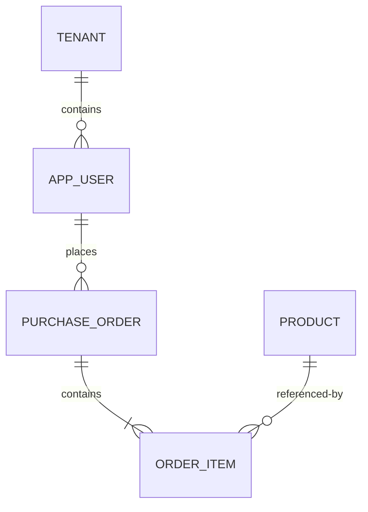

# 实体、关系与数据库约束

关系模型把业务事实表示为关系（表），把同一类事实表示为元组（行），把事实的组成部分表示为属性（列）。数据库约束负责拒绝不满足数据不变量的写入，即使写入来自不同服务、脚本或并发事务。

SQL 示例使用 PostgreSQL 18.4 支持的 identity、`NULLS NOT DISTINCT`、可延迟约束和 `NOT VALID` 外键语法。

## 从业务对象到关系模型

### 实体、属性和关系

- **实体**：需要独立标识和持续管理的对象，例如租户、用户、订单、商品。
- **属性**：描述实体或关系的值，例如用户邮箱、订单金额、下单时间。
- **关系**：实体之间的关联。一个用户可以有多个订单；一张订单可包含多个商品。
- **关系表**：多对多关系本身有数量、成交价等属性时，应单独建表，而不是在一列里保存 ID 数组。



关系的基数必须来自业务规则：`||` 表示恰好一个，`o{` 表示零个或多个。图只表达模型，数据库仍要用 `NOT NULL`、外键和唯一约束落实规则。

### 键的类别

| 名称 | 含义 | 示例 | 设计要求 |
|---|---|---|---|
| 超键 | 能唯一标识一行的任意属性集合 | `{id, email}` | 可能包含多余列，不直接作为设计目标 |
| 候选键 | 不含多余列的最小超键 | `id`、`(tenant_id, email)` | 每个候选键都应有唯一性约束 |
| 主键 | 被选为主要行标识的候选键 | `id` | 唯一、非空、尽量稳定 |
| 外键 | 引用另一关系的候选键 | `orders.user_id -> users.id` | 保证引用完整性，不自动保证授权 |
| 代理键 | 无业务含义的生成标识 | identity bigint、UUID | 避免自然键变更传播 |
| 自然键 | 来自业务领域的候选键 | 国家代码、租户内订单号 | 只有稳定且真正唯一时才适合作主键 |

代理主键不能取代业务唯一性。若 `users.id` 是主键，系统仍需要 `UNIQUE (tenant_id, email)`，否则同一租户可出现多个相同邮箱。

## 六类常用约束

### `NOT NULL`

`NOT NULL` 禁止列保存 SQL `NULL`。`NULL` 表示未知或不适用，不等于空字符串、`0` 或 `false`。

```text
display_name text NOT NULL
```

只有业务允许“尚不知道”或“不适用”时才允许空值。可选字段也要定义 `NULL` 的具体语义。例如 `paid_at IS NULL` 可以表示尚未付款，但不能同时又表示付款时间丢失。

### `CHECK`

`CHECK` 要求表达式结果为 `TRUE` 或 `NULL`；结果为 `FALSE` 才拒绝写入。因此需要同时禁止空值时必须加 `NOT NULL`。

```text
quantity integer NOT NULL CONSTRAINT order_items_quantity_positive CHECK (quantity > 0),
unit_price numeric(12, 2) NOT NULL CONSTRAINT order_items_price_nonnegative CHECK (unit_price >= 0)
```

`CHECK` 适合当前行内、对同一输入保持不变的条件，例如数值范围、两列顺序、状态组合：

```text
CONSTRAINT orders_paid_state_consistent CHECK (
  (status = 'paid' AND paid_at IS NOT NULL)
  OR (status <> 'paid' AND paid_at IS NULL)
)
```

不要在 `CHECK` 中查询别的行或依赖会改变语义的函数。PostgreSQL 不会在被引用行改变时重新检查当前行，这种表达式也可能使备份恢复失败。跨行唯一性使用 `UNIQUE` 或排他约束；跨表存在性使用外键；复杂状态转移放在事务和受控写接口中。

### `UNIQUE`

唯一约束要求指定列组合不重复，并自动创建唯一 B-tree 索引：

```text
CONSTRAINT users_tenant_email_uq UNIQUE (tenant_id, email)
```

多列唯一比较的是组合，而不是要求每列分别唯一。`(tenant_id, email)` 允许不同租户使用相同邮箱。

默认情况下，PostgreSQL 把唯一约束中的多个 `NULL` 视为互不相同，因此允许多行空值。需要“最多一个空值”时使用：

```text
external_id text UNIQUE NULLS NOT DISTINCT
```

只对部分行保证唯一不能写成普通 `UNIQUE` 约束，要使用唯一部分索引。例如只约束未删除用户的邮箱会在下一篇展开。

### `PRIMARY KEY`

主键等价于 `UNIQUE NOT NULL` 加上“这是表的主要标识”这一模型语义。每张表最多一个主键，但主键可以包含多列。

```text
id bigint GENERATED ALWAYS AS IDENTITY PRIMARY KEY
```

`GENERATED ALWAYS AS IDENTITY` 由数据库生成值；普通插入不能任意覆盖，数据导入确需保留旧 ID 时可显式使用 `OVERRIDING SYSTEM VALUE`。生成值保证生成机制中的唯一候选，不保证事务回滚后无间隙，因此不能把 identity 当连续业务编号。

### `FOREIGN KEY`

外键要求非空引用值在目标主键、唯一约束或非部分唯一索引中存在。外键列可以为 `NULL`，除非另加 `NOT NULL`。

```text
CONSTRAINT orders_user_fk
  FOREIGN KEY (tenant_id, user_id)
  REFERENCES app_users (tenant_id, id)
  ON UPDATE RESTRICT
  ON DELETE RESTRICT
```

多租户共享表应把 `tenant_id` 纳入外键。若只引用 `user_id`，即使 ID 全局唯一，也无法由约束直接证明订单和用户属于同一租户。

外键动作：

| 动作 | 删除或更新目标行时的行为 | 适用边界 |
|---|---|---|
| `NO ACTION` | 默认动作；通常在语句末检查，可声明为可延迟 | 事务后续可能修复引用时 |
| `RESTRICT` | 立即阻止目标键被删除或更新，不能延迟 | 父对象仍被引用时绝不允许改动 |
| `CASCADE` | 自动删除引用行或更新其键 | 子行生命周期严格从属于父行 |
| `SET NULL` | 把引用列设为 `NULL` | 关系断开后子行仍有意义，且列允许空 |
| `SET DEFAULT` | 把引用列设为默认值；默认值仍须满足外键 | 存在有效的“默认父对象”时，较少使用 |

`CASCADE` 不是清理便利开关。若删除租户会级联数百万行，必须评估锁、WAL、复制延迟、审计与恢复要求。

PostgreSQL 会在被引用列上已有唯一索引，但不会自动为引用列创建索引。若经常删除或更新父行，通常要给子表外键列建索引，避免扫描整张子表：

```sql
CREATE INDEX orders_tenant_user_idx ON purchase_orders (tenant_id, user_id);
```

### 可延迟约束

`UNIQUE`、主键、外键和排他约束可声明 `DEFERRABLE`；`CHECK` 和 `NOT NULL` 不受 `SET CONSTRAINTS` 控制。

```text
CONSTRAINT teams_rank_uq UNIQUE (tenant_id, rank)
  DEFERRABLE INITIALLY IMMEDIATE
```

交换两个唯一排名时，可在事务中把检查推迟到提交：

```sql
BEGIN;
SET CONSTRAINTS teams_rank_uq DEFERRED;
UPDATE teams SET rank = CASE rank WHEN 1 THEN 2 WHEN 2 THEN 1 END
WHERE tenant_id = 7 AND rank IN (1, 2);
COMMIT;
```

延迟检查只改变检查时机，不会放宽提交后的不变量。

## 完整建模案例：租户内订单

### 输入规则

系统接收以下业务规则：

1. 租户代码全局唯一。
2. 用户邮箱在租户内唯一，邮箱不能为空。
3. 订单必须属于一个租户和该租户内的一个用户。
4. 订单号只需在租户内唯一。
5. 明细数量必须大于零，成交单价不得为负。
6. 同一商品在一张订单中最多出现一次。
7. 已有订单的用户不能被直接删除。

### 第一步：建立父表和候选键

```sql
CREATE TABLE tenants (
  id bigint GENERATED ALWAYS AS IDENTITY,
  code text NOT NULL,
  CONSTRAINT tenants_pk PRIMARY KEY (id),
  CONSTRAINT tenants_code_uq UNIQUE (code),
  CONSTRAINT tenants_code_format CHECK (code ~ '^[a-z][a-z0-9-]{2,31}$')
);

CREATE TABLE app_users (
  id bigint GENERATED ALWAYS AS IDENTITY,
  tenant_id bigint NOT NULL,
  email text NOT NULL,
  display_name text NOT NULL,
  CONSTRAINT app_users_pk PRIMARY KEY (id),
  CONSTRAINT app_users_tenant_id_uq UNIQUE (tenant_id, id),
  CONSTRAINT app_users_tenant_email_uq UNIQUE (tenant_id, email),
  CONSTRAINT app_users_tenant_fk FOREIGN KEY (tenant_id)
    REFERENCES tenants (id) ON DELETE CASCADE
);
```

`UNIQUE (tenant_id, id)` 看似与全局主键重复，但它提供复合外键可引用的候选键，从而把租户一致性落实到数据库。

### 第二步：建立订单和明细

```sql
CREATE TABLE products (
  id bigint GENERATED ALWAYS AS IDENTITY PRIMARY KEY,
  sku text NOT NULL UNIQUE,
  name text NOT NULL
);

CREATE TABLE purchase_orders (
  id bigint GENERATED ALWAYS AS IDENTITY,
  tenant_id bigint NOT NULL,
  user_id bigint NOT NULL,
  order_no text NOT NULL,
  status text NOT NULL DEFAULT 'draft',
  created_at timestamptz NOT NULL DEFAULT now(),
  paid_at timestamptz,
  CONSTRAINT purchase_orders_pk PRIMARY KEY (id),
  CONSTRAINT purchase_orders_tenant_id_uq UNIQUE (tenant_id, id),
  CONSTRAINT purchase_orders_no_uq UNIQUE (tenant_id, order_no),
  CONSTRAINT purchase_orders_status_ck
    CHECK (status IN ('draft', 'submitted', 'paid', 'canceled')),
  CONSTRAINT purchase_orders_paid_ck CHECK (
    (status = 'paid' AND paid_at IS NOT NULL)
    OR (status <> 'paid' AND paid_at IS NULL)
  ),
  CONSTRAINT purchase_orders_user_fk
    FOREIGN KEY (tenant_id, user_id)
    REFERENCES app_users (tenant_id, id)
    ON DELETE RESTRICT
);

CREATE TABLE order_items (
  order_id bigint NOT NULL,
  product_id bigint NOT NULL,
  quantity integer NOT NULL,
  unit_price numeric(12, 2) NOT NULL,
  CONSTRAINT order_items_pk PRIMARY KEY (order_id, product_id),
  CONSTRAINT order_items_order_fk FOREIGN KEY (order_id)
    REFERENCES purchase_orders (id) ON DELETE CASCADE,
  CONSTRAINT order_items_product_fk FOREIGN KEY (product_id)
    REFERENCES products (id) ON DELETE RESTRICT,
  CONSTRAINT order_items_quantity_ck CHECK (quantity > 0),
  CONSTRAINT order_items_price_ck CHECK (unit_price >= 0)
);

CREATE INDEX purchase_orders_tenant_user_idx
  ON purchase_orders (tenant_id, user_id);
CREATE INDEX order_items_product_idx ON order_items (product_id);
```

### 第三步：写入并观察输出

```sql
INSERT INTO tenants (code) VALUES ('acme') RETURNING id;
-- 假设返回 1

INSERT INTO app_users (tenant_id, email, display_name)
VALUES (1, 'dev@example.com', 'Dev') RETURNING id;
-- 假设返回 1

INSERT INTO products (sku, name) VALUES ('KB-01', 'Keyboard') RETURNING id;
-- 假设返回 1

INSERT INTO purchase_orders (tenant_id, user_id, order_no)
VALUES (1, 1, 'PO-2026-0001') RETURNING id, status;
-- 返回的 id 由当前数据库生成；status 应为 draft

INSERT INTO order_items (order_id, product_id, quantity, unit_price)
VALUES (1, 1, 2, 399.00);
```

### 第四步：验证约束

```sql
-- 验证租户内订单号唯一；第二次写入应报 unique_violation（SQLSTATE 23505）
INSERT INTO purchase_orders (tenant_id, user_id, order_no)
VALUES (1, 1, 'PO-2026-0001');

-- 验证数量必须为正；应报 check_violation（SQLSTATE 23514）
INSERT INTO order_items (order_id, product_id, quantity, unit_price)
VALUES (1, 1, 0, 399.00);

-- 验证引用存在；应报 foreign_key_violation（SQLSTATE 23503）
INSERT INTO purchase_orders (tenant_id, user_id, order_no)
VALUES (1, 9999, 'PO-2026-0002');
```

应用层应按约束名映射稳定错误，而不是解析易变化的英文错误文本。例如 `purchase_orders_no_uq` 映射为“订单号已存在”。

### 失败分支：跨租户引用

假设租户 2 有用户 `id = 2`，攻击者以租户 1 的身份提交 `user_id = 2`。复合外键查找 `(tenant_id, user_id) = (1, 2)`；该组合不存在，因此数据库拒绝写入。若模型只有 `FOREIGN KEY (user_id) REFERENCES app_users(id)`，数据库只能证明用户存在，无法证明租户匹配。

## 迁移与生产边界

### 给已有数据增加约束

添加约束前先检查脏数据。大表外键可先创建为 `NOT VALID`，让新写入立即受约束，再验证历史行：

```sql
ALTER TABLE purchase_orders
  ADD CONSTRAINT purchase_orders_user_fk
  FOREIGN KEY (tenant_id, user_id)
  REFERENCES app_users (tenant_id, id)
  NOT VALID;

ALTER TABLE purchase_orders
  VALIDATE CONSTRAINT purchase_orders_user_fk;
```

`VALIDATE CONSTRAINT` 仍消耗 I/O，需要在真实数据量和负载下安排窗口。唯一约束通常需要先处理重复值，并评估创建唯一索引时的锁和磁盘空间。

### 约束与应用校验的分工

- 应用校验负责即时、友好的反馈，例如字段格式提示。
- 数据库约束负责最终不变量，例如唯一、引用存在和金额范围。
- 授权不能由外键代替；“订单引用了用户”不代表当前操作者可读取订单。
- 跨服务数据库无法直接使用本地外键时，需要明确事实所有者、幂等同步、补偿和一致性监控。

## 调试与检查

查看表上的约束定义：

```sql
SELECT
  conname,
  contype,
  convalidated,
  pg_get_constraintdef(oid) AS definition
FROM pg_constraint
WHERE conrelid = 'purchase_orders'::regclass
ORDER BY conname;
```

检查引用列是否有合适索引时，不只比较单个列名，还要核对索引前导列、部分索引谓词和查询模式。验证清单：

1. 每张表的行粒度能否用一句话说清。
2. 所有候选键是否都有唯一约束。
3. 必填列是否为 `NOT NULL`。
4. 外键是否包含租户或其他所属范围。
5. 删除、更新动作是否与生命周期一致。
6. 约束名是否能映射成稳定业务错误。
7. 是否用真实并发写入测试过“先查后写”的竞态，并确认约束承担最终裁决。

## 练习：设计项目成员关系

设计 `projects`、`members`、`project_members` 三张表，满足：项目和成员都属于租户；同一成员在同一项目只有一个角色；角色只能是 `owner`、`maintainer`、`viewer`；项目至少保留一名 owner 的规则不能错误地写成跨行 `CHECK`。

完成标准：

- 写出完整 DDL 和命名约束。
- 用复合外键阻止跨租户成员加入项目。
- 用主键或唯一约束阻止重复成员关系。
- 解释“至少一名 owner”为何需要事务化写接口、锁或延迟约束触发器，而不是普通 `CHECK`。
- 提供一条成功写入和三条分别触发唯一、外键、检查约束的失败写入。

## 来源

- [PostgreSQL 18：Constraints](https://www.postgresql.org/docs/18/ddl-constraints.html)（访问日期：2026-07-17）
- [PostgreSQL 18：Identity Columns](https://www.postgresql.org/docs/18/ddl-identity-columns.html)（访问日期：2026-07-17）
- [PostgreSQL 18：SET CONSTRAINTS](https://www.postgresql.org/docs/18/sql-set-constraints.html)（访问日期：2026-07-17）
- [PostgreSQL 18：Error Codes](https://www.postgresql.org/docs/18/errcodes-appendix.html)（访问日期：2026-07-17）
